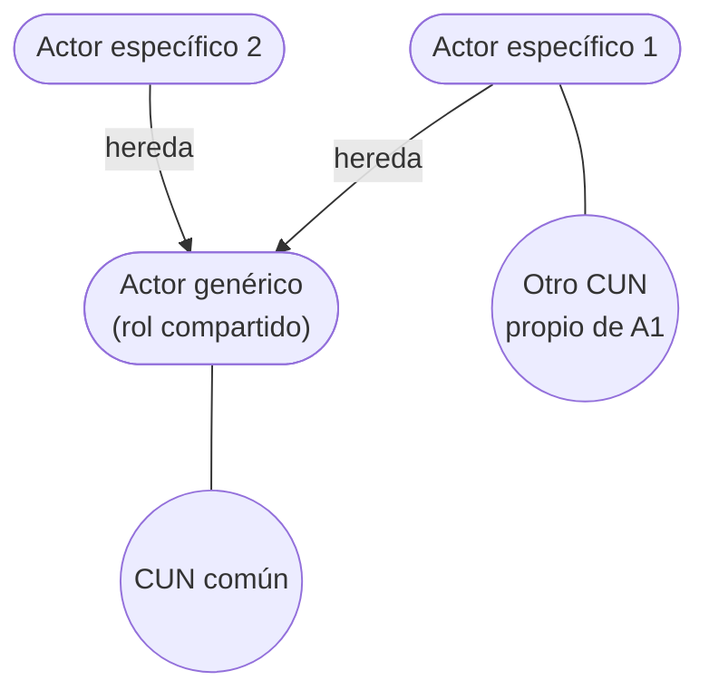

# Actor del negocio

**Rol** que alguien o algo juega cuando interactúa con el negocio **para beneficiarse de sus
resultados**.

La igualdad que marca la presentación en rojo: **Rol = Actor**. No es una persona: es un papel.
La misma persona puede ser dos actores distintos, y dos personas distintas pueden ser el mismo
actor.

## Candidatos a actor del negocio

- Clientes o potenciales clientes
- Socios
- Proveedores
- Autoridades
- Propietarios
- **Sistemas de información externos al negocio**
- Otras partes de la organización, si ésta es grande

Los dos últimos son los que se olvidan y suelen ser pregunta de examen. Un actor **no tiene
que ser humano** (un sistema externo también lo es), y **una parte de la propia organización
puede ser actor** si el negocio es grande —lo que importa es que quede **fuera del alcance** del
proceso que estás modelando.

![[adjuntos/cdu-negocio-modelado-drivers-rf/cdu-p09.png]]

## Las cinco consideraciones

1. **Todo lo que interacciona con el ambiente del negocio se modela con actores.**
2. Cada actor humano expresa un **rol**, no una persona específica.
3. Cada actor modela algo **fuera** del negocio.
4. Cada actor se involucra con **al menos un caso de uso**.
5. Cada actor tiene una **descripción** y un **nombre** que explica su rol en relación al
   negocio.

La 3 es la regla de oro: **si está adentro del negocio, no es actor**. Lo que está adentro son
los trabajadores y entidades del negocio, que aparecen en las
[[Realizaciones de casos de uso del negocio]], no en el diagrama de CUN.

![[adjuntos/cdu-negocio-modelado-drivers-rf/cdu-p15.png]]

## Generalización entre actores

Varios actores del negocio pueden jugar **el mismo rol** en un caso de uso particular del
negocio.

> El rol compartido se modela como el **actor del cual heredan** los actores con roles
> compartidos (solo se representan si interactúan como actor con otro CUN).

La aclaración del paréntesis es importante y fácil de pasar por alto: los actores hijos **solo
se representan** en el diagrama **si interactúan como actor con otro CUN**. Si un actor
específico no aporta nada más allá del rol heredado, no se dibuja — no llenes el diagrama de
monigotes que no agregan información.

![[adjuntos/cdu-negocio-modelado-drivers-rf/cdu-p24.png]]

## Notas relacionadas

- [[Modelo de casos de uso del negocio]]
- [[Caso de uso del negocio]]
- [[Generalización y especialización en casos de uso]]
- [[Realizaciones de casos de uso del negocio]]
- [[Arquitecto de software]] — ahí también "rol ≠ persona"

## Preguntas de repaso

1. Definí actor del negocio. ¿Por qué "Rol = Actor"?
2. Nombrá al menos cinco candidatos a actor del negocio.
3. ¿Puede un actor del negocio no ser una persona? Dá un ejemplo.
4. ¿Cuál es la regla que decide si algo es actor o no?
5. En la generalización entre actores, ¿cuándo se representan los actores hijos en el diagrama?
