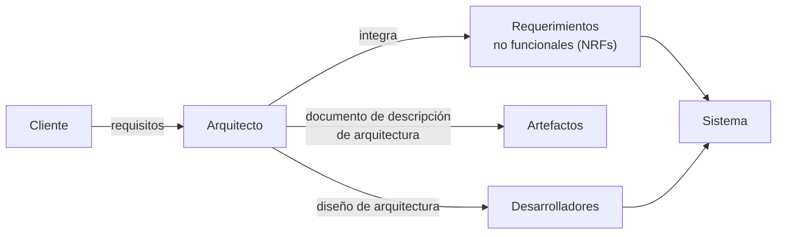

# Arquitecto de software

En corto: **el arquitecto es el puente entre el cliente y los desarrolladores.** Obtiene los
requisitos del cliente, produce un diseño de arquitectura y les da soluciones a los
desarrolladores.

La presentación contrasta dos definiciones de rol.

## Según Rational Unified Process (RUP)

El arquitecto es un **rol** en un proyecto de desarrollo de software, responsable de:

- Liderar el proceso de arquitectura.
- Producir los artefactos necesarios: el **documento de descripción de arquitectura**.
- Producir modelos y prototipos de arquitectura.

Ojo con esto: en RUP arquitecto es un **rol**, no un puesto. La misma persona puede jugar
varios roles. Es la misma idea que en [[Actor del negocio]] — rol ≠ persona.

## Según SUN SL-425

El arquitecto:

- **Visualiza** el comportamiento del sistema.
- **Crea los planos** del sistema.
- **Define la forma** en la cual los elementos del sistema trabajan en conjunto.
- Es **responsable de integrar los requerimientos no-funcionales (NRFs)** en el sistema.

El cuarto punto es el que más se olvida y el que más se pregunta: los **requisitos no
funcionales** (rendimiento, seguridad, disponibilidad, modificabilidad) son responsabilidad
del arquitecto, no del programador.

![[adjuntos/arquitectura-de-software/arq-p07.png]]
![[adjuntos/arquitectura-de-software/arq-p06.png]]

## Qué se espera de un buen arquitecto

> Un buen arquitecto debe estar en capacidad de entender todas las **condiciones** a las que
> se verá sometido un sistema y proponer una **solución** acorde a cada **escenario** en
> particular.

Es decir: no existe "la" arquitectura correcta en abstracto. La solución depende del
escenario, y por eso el arquitecto vive equilibrando fuerzas que se contradicen
(→ [[Equilibrio de restricciones del proyecto]]).

![[adjuntos/arquitectura-de-software/arq-p09.png]]

## Quién lo hace

Ingenieros de software / especialistas. La presentación separa dos figuras:

- El **diseñador de una base de datos** crea la *arquitectura de los datos* para un sistema.
- El **arquitecto del sistema** selecciona un *estilo arquitectónico* apropiado a partir de
  los requerimientos obtenidos durante el análisis de los datos.

Esto encaja con el primer paso del [[Proceso de diseño arquitectónico]]: el diseño de la
arquitectura comienza con el diseño de los datos.

## Notas relacionadas

- [[Arquitectura de software]]
- [[Ciclo de influencias en la arquitectura]]
- [[Proceso de diseño arquitectónico]]
- [[Equilibrio de restricciones del proyecto]]

## Preguntas de repaso

1. ¿Qué artefacto principal produce el arquitecto según RUP?
2. Según SUN SL-425, ¿de qué tipo de requerimientos es responsable el arquitecto?
3. ¿Por qué se dice que "arquitecto" es un rol y no un puesto?
4. ¿Qué diferencia hay entre el diseñador de base de datos y el arquitecto del sistema?
