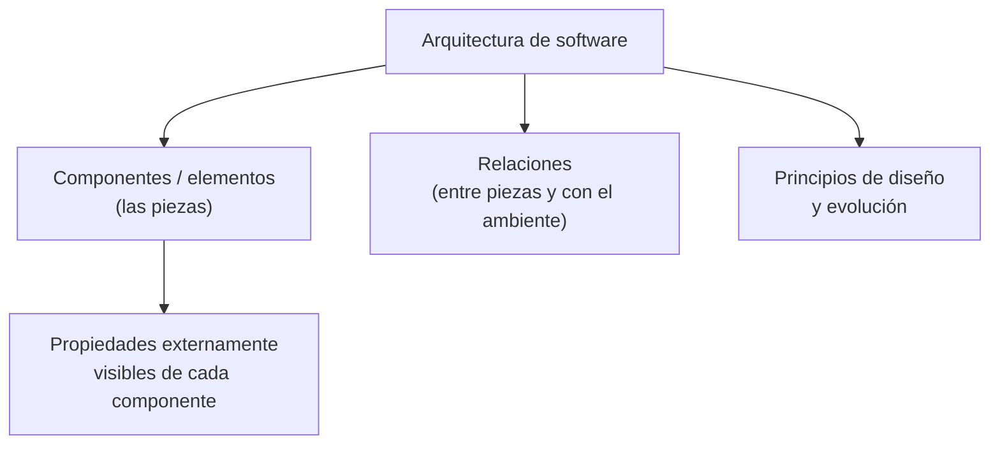
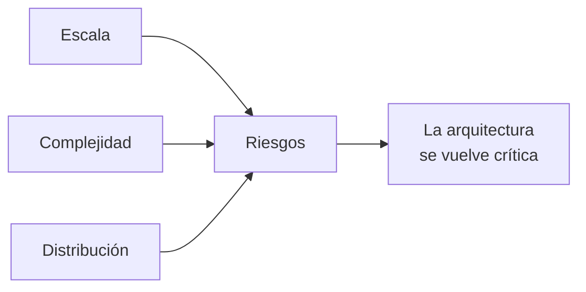

# Arquitectura de software

La idea central: **la arquitectura es el nivel de abstracción más alto del sistema**. No dice
cómo se programa cada cosa, dice de qué piezas está hecho el sistema, cómo se relacionan
esas piezas entre sí y con su entorno, y qué principios guían su diseño y su evolución.

La analogía que usa la profesora es la de los **planos de una casa**: definen las bases, la
distribución y los pasillos de interacción. Sin planos, construir la casa es casi imposible.
La arquitectura de software hace lo mismo con las aplicaciones y canales digitales: idea y
construye los planos para que soporten las necesidades para las que fueron diseñados, y
garantiza que funcionen bien — calidad, disponibilidad, seguridad, entre otros atributos.

## Definiciones formales

Vale la pena tener las **cinco** a mano, porque en el examen pueden pedir cualquiera:

| Fuente | Definición |
|---|---|
| **IEEE 1471** | El nivel conceptual más alto de un sistema en su ambiente. La arquitectura es la organización fundamental de un sistema descrita en: sus componentes, la relación entre ellos y con el ambiente, y los principios que guían su diseño y evolución. |
| **Kazman** — *Software Architecture in Practice* | "La estructura de estructuras de un sistema, la cual abarca componentes de software, propiedades externas visibles de estos componentes y sus relaciones." |
| **Arlow & Neustadt (2005)** | La arquitectura de software de un programa o sistema de computación es la estructura o estructuras del sistema, las cuales comprometen elementos de software, las propiedades externamente visibles de esos elementos y las relaciones entre ellos. |
| **Grady Booch** | "Toda la arquitectura es diseño, pero no todo el diseño es arquitectura. La arquitectura representa las decisiones de diseño significativas que le dan forma a un sistema. Donde lo significativo puede ser medido por el costo del cambio." |
| **La diapositiva "Resumen"** *(la que usó en clase)* | "La arquitectura de software de un sistema es el **conjunto de estructuras necesarias para razonar sobre el sistema**, que comprende **elementos de software**, **relaciones entre ellos** y **propiedades de ambos**." |

La de Booch es la más útil como criterio práctico: **si cambiarlo sale caro, es arquitectura.**

> [!important] La diapositiva "Resumen" define tres cosas, no una
> Es la definición del **SAIP 4ª edición** — el libro n° 8 de la bibliografía oficial — y la clase la
> usó textual, junto con las otras dos que la completan:
>
> | Término | Definición de la diapositiva |
> |---|---|
> | **Arquitectura** | el **conjunto de estructuras** necesarias para **razonar** sobre el sistema: elementos de software, relaciones entre ellos y propiedades de ambos |
> | **Estructura** | un **conjunto de elementos y las relaciones entre ellos** |
> | **Vista** | una representación de un conjunto **coherente** de elementos arquitectónicos, según lo **escrito y leído por los interesados**. Una vista es una representación de **una o más estructuras** |
>
> ![[adjuntos/capturas-clase/arq-resumen-definicion.png]]
>
> Tres cosas que cambian respecto de las definiciones más viejas de la tabla:
>
> 1. **"para razonar sobre el sistema"** — la arquitectura tiene una *finalidad*: permitir razonar.
>    No es un dibujo, es un instrumento de análisis.
> 2. **"estructuras" en plural, no "la estructura"** — son varias, y por eso hay
>    [[Categorías de estructuras|tres categorías]].
> 3. **"propiedades de ambos"** — no solo las propiedades de los elementos, también las de las
>    **relaciones**. La relación tiene propiedades propias (sincronía, protocolo, latencia).
>
> Y la cadena queda cerrada: **elementos → estructura → vista → arquitectura documentada**
> (→ [[Estructuras y vistas arquitectónicas]]).

Los tres elementos que aparecen en todas las definiciones:

![[adjuntos/arquitectura-de-software/arq-p02.png]]
![[adjuntos/arquitectura-de-software/arq-p04.png]]
![[adjuntos/arquitectura-de-software/arq-p17.png]]

## Terminología

Cuatro términos que se confunden fácil:

- **Sistema**: conjunto de componentes que cumplen una función o un conjunto de funciones específicas.
- **Descripción de la arquitectura**: es un conjunto de productos que documentan la arquitectura.
- **Perspectiva de la arquitectura**: es una representación desde una perspectiva específica de un determinado sistema o de una parte del mismo.
- **Punto de vista arquitectónico**: es una plantilla que describe la forma de crear y utilizar una perspectiva de la arquitectura. Un punto de vista incluye un nombre, socios, problemas más abordados por el punto de vista, y el modelado y las convenciones analíticas.

Y los tres que dan el vocabulario del tema:

- **Arquitectura**: la organización fundamental de un sistema encarnado en sus componentes, su relación entre sí y con el medio ambiente, y los principios que guían su diseño y evolución.
- **Arquitecto**: el que obtiene los requisitos de los clientes, da soluciones a los desarrolladores y genera un diseño de la arquitectura. → [[Arquitecto de software]]
- **Arquitecting**: el proceso de la arquitectura del software. → [[Proceso de diseño arquitectónico]]

![[adjuntos/arquitectura-de-software/arq-p15.png]]
![[adjuntos/arquitectura-de-software/arq-p14.png]]

## Atributos de un buen diseño

Vienen de la arquitectura de edificaciones: **durabilidad, utilidad y encanto**. Trasladados
al software se leen así:

| Atributo clásico | En software |
|---|---|
| Durabilidad | de confianza y fácil de evolucionar |
| Utilidad | fácil de implementar |
| Encanto | entendible |

La diapositiva lo cierra con la idea de que todas las consideraciones que se nos ocurran
para definir la arquitectura de edificaciones deben tenerse en cuenta también al definir la
arquitectura de software.

![[adjuntos/arquitectura-de-software/arq-p03.png]]

## ¿Por qué es importante?

Tres razones, en el orden en que las da la presentación:

1. **Permite que se comuniquen los stakeholders.** → [[Beneficios de la arquitectura de software]]
2. **Manifiesta el primer conjunto de necesidades de diseño.**
3. **Es una abstracción del sistema.**

Con la analogía de la casa otra vez: uno no intentaría construir su casa sin un plano, ni
comenzaría los planos con el dibujo de la plomería. Antes de los **detalles** hay que tener
el **panorama general**: la casa en sí. Eso es lo que hace el diseño arquitectónico — da el
panorama y asegura que sea el correcto.

![[adjuntos/arquitectura-de-software/arq-p08.png]]
![[adjuntos/arquitectura-de-software/arq-p13.png]]

## Por qué la arquitectura pesa cada vez más

Dos factores de la ingeniería de software incrementaron su importancia:

La fórmula que aparece en la diapositiva es **Escala + Complejidad + Distribución = Riesgos**.

![[adjuntos/arquitectura-de-software/arq-p05.png]]

## Notas relacionadas

- [[Arquitecto de software]]
- [[Beneficios de la arquitectura de software]]
- [[Ciclo de influencias en la arquitectura]]
- [[Estructuras y vistas arquitectónicas]]
- [[Modelo 4+1 vistas]]
- [[Proceso de diseño arquitectónico]]
- [[Arquitectura en el ciclo de vida del software]]

## Preguntas de repaso

1. Según Booch, ¿cuál es el criterio para decidir si una decisión de diseño es arquitectura o no?
2. ¿Qué tres elementos aparecen en la definición de IEEE 1471?
3. Diferenciá **perspectiva de la arquitectura** de **punto de vista arquitectónico**.
4. ¿Por qué escala, complejidad y distribución aumentan la importancia de la arquitectura?
5. Traducí los tres atributos del buen diseño (durabilidad, utilidad, encanto) a términos de software.
