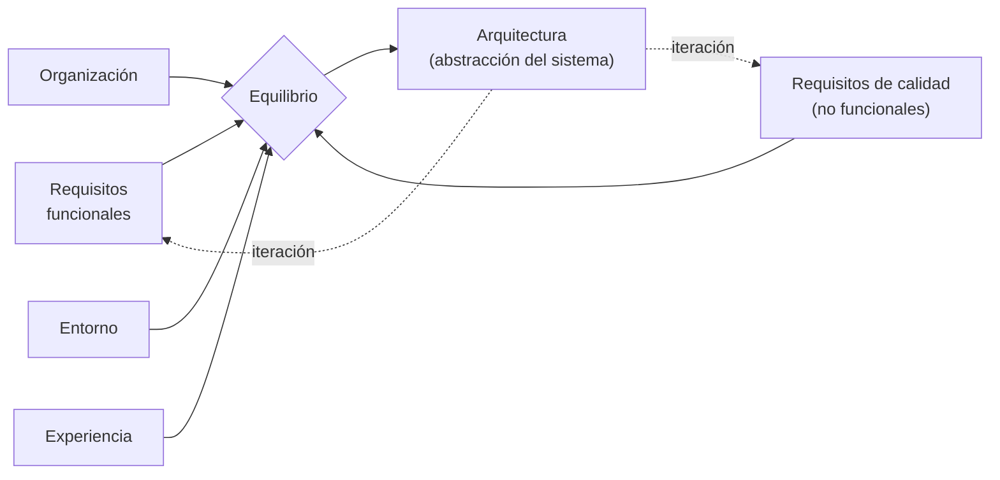

# Arquitectura en el ciclo de vida del software

La pregunta de la diapositiva es: **¿dónde debe colocarse la arquitectura en el ciclo de vida
del software?** La respuesta implícita es que **no se coloca en un solo lugar**: atraviesa el
ciclo, porque es iterativa y depende de cosas que van cambiando.

## Las ocho afirmaciones

1. Involucra requisitos **funcionales y no funcionales**.
2. Es un **proceso iterativo** a través de requisitos y calidad.
3. Involucra una **gran variedad de stakeholders**.
4. Nos permite conocer el primer conjunto de **decisiones de diseño**, la **estructura
   organizativa**, **restricciones en la implementación** y **atributos de calidad**.
5. Es la **abstracción** de un sistema.
6. La arquitectura del software es el resultado de **equilibrar requisitos funcionales y
   calidad**.
7. Se ve afectada por la **organización**, el **entorno** y la **experiencia**.

(La presentación las lista así; el punto 4 junta cuatro cosas en una sola línea, vale
desglosarlo al estudiar.)

![[adjuntos/arquitectura-de-software/arq-p20.png]]

## Lo que hay que sacar de acá

Tres ideas que se repiten en todo el deck y que acá aparecen juntas:

**Es iterativa, no una fase.** El punto 2 lo dice directo: es un proceso iterativo *a través de
requisitos y calidad*. No es "primero requisitos, después arquitectura, después construcción".
Se va y se vuelve.

**Es un equilibrio, no una derivación.** El punto 6 es clave: la arquitectura **no se deduce**
de los requisitos funcionales. Es el **resultado de equilibrar** requisitos funcionales contra
calidad. Si fuera una deducción mecánica no haría falta un arquitecto
(→ [[Equilibrio de restricciones del proyecto]]).

**Depende del contexto, no solo del problema.** El punto 7 —organización, entorno y
experiencia— es exactamente el [[Ciclo de influencias en la arquitectura]] resumido en una
línea.

## Qué nos da la arquitectura en esta etapa

Del punto 4, el "primer conjunto" de cosas que quedan definidas:

| Qué se conoce | Por qué importa temprano |
|---|---|
| Decisiones de diseño | Son las caras de cambiar después (criterio de Booch) |
| Estructura organizativa | Define cómo se reparte el trabajo entre equipos |
| Restricciones en la implementación | Acota lo que los desarrolladores pueden y no pueden hacer |
| Atributos de calidad | Se habilitan o se pierden acá, no en la codificación |

Es el mismo contenido del segundo beneficio: *manifiesta las decisiones de diseño
tempranamente* (→ [[Beneficios de la arquitectura de software]]).

## Notas relacionadas

- [[Arquitectura de software]]
- [[Ciclo de influencias en la arquitectura]]
- [[Beneficios de la arquitectura de software]]
- [[Proceso de diseño arquitectónico]]
- [[Equilibrio de restricciones del proyecto]]

## Preguntas de repaso

1. ¿Por qué se dice que la arquitectura es un proceso iterativo y no una fase del ciclo de vida?
2. Completá: la arquitectura del software es el resultado de equilibrar ______ y ______.
3. ¿Qué cuatro cosas nos permite conocer la arquitectura como "primer conjunto"?
4. ¿Qué tres factores de contexto afectan a la arquitectura según esta diapositiva?
