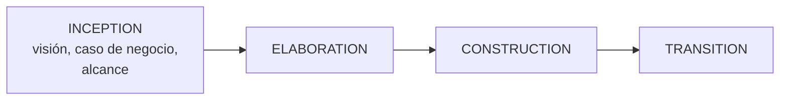

# Arquitectura y proceso de desarrollo

Cómo encaja el trabajo arquitectónico en un proceso predictivo y en uno ágil, y qué hace el
arquitecto en cada etapa.

> [!warning] Nota de COMPLEMENTO
> Cubre dos puntos de la **unidad 3** (segundo parcial: **19 de septiembre**) y todavía no hay
> presentación. Viene de **Garland & Anthony**, cap. 3, más Reynoso. **Si la clase dice algo
> distinto, manda la clase.**

---

## 1. La iteración no se elige: se controla

El punto de partida del capítulo, y conviene poder citarlo:

> Aunque algunos gerentes prefieran mirar el desarrollo como una **cascada** para planificar el
> proyecto, los proyectos grandes de software **siempre van a ser un proceso iterativo**.

Las tres razones que da el libro:

1. La **imposibilidad de especificar completamente** los requisitos.
2. Las **modificaciones** a los requisitos.
3. La necesidad de **mantener el sistema a lo largo de un ciclo de vida largo**.

Y la conclusión, que es la frase del tema:

> **La única decisión, entonces, es tomar el control de las iteraciones o no.**

Eso reencuadra el debate: no es "cascada vs. iterativo", porque iterativo va a ser igual. Es
**iteración gestionada vs. iteración accidental.**

Conecta con lo que enseña la clase: *"es un proceso iterativo a través de requisitos y calidad"*
(→ [[Arquitectura en el ciclo de vida del software]]).

## 2. El enfoque predictivo: las fases de RUP

En un proceso tipo RUP las fases se organizan en el tiempo así:

**Inception** es la que el libro desarrolla, y es la que importa para el arquitecto:

> Es la fase donde se define la **visión** del producto final. Además se especifican el **caso de
> negocio** y el **alcance** del trabajo. Para hacerlo, hay que analizar y entender los requisitos de
> más alto nivel — que **a menudo están incompletos** cuando se hace el análisis preliminar. **Hay
> que asumir supuestos** para los requisitos faltantes, y esos supuestos se refinan en fases
> posteriores.

> [!important] Esto describe exactamente lo que estás haciendo en el Caso 1
> *Caso de negocio*, *alcance*, *requisitos incompletos*, *hay que asumir supuestos y refinarlos*.
> El criterio 1 de la rúbrica **es la fase de inception**.
>
> Y da la justificación teórica de algo que el
> [[_Método para resolver una tarea|método]] insiste: si el enunciado no dice algo, se **declara el
> supuesto** — no se ignora ni se inventa en silencio. El libro dice que asumir es parte del proceso;
> lo que no es parte del proceso es asumir sin decirlo.

Y un detalle de RUP que el libro anota: *"en un proceso basado en RUP, los **viewpoints** son
artefactos asociados a un hito particular del proceso"*. O sea que cada vista se entrega en un
momento definido, no cuando sale.

## 3. El rol del arquitecto en cada flujo de trabajo

Esto cubre el punto **"implementación y pruebas"** del programa. El libro recorre los flujos de RUP y
dice qué hace el arquitecto en cada uno:

| Flujo | Qué hace el arquitecto |
|---|---|
| **Modelado del negocio** | Participa en la **selección y definición de casos de uso** y en el modelo de dominio del negocio. Suele actuar de **facilitador**: quien conoce el negocio normalmente no tiene experiencia en modelado |
| **Requisitos** | Es el **cliente** de esos requisitos y debe revisarlos con cuidado, porque **van a ser la base de la definición de la arquitectura** |
| **Análisis y diseño** | Ocurre en **dos niveles**: el equipo de arquitectura produce la arquitectura de alto nivel; cada equipo de desarrollo diseña su parte **bajo revisión y aprobación** del equipo de arquitectura |
| **Implementación** | La arquitectura de alto nivel y las de subsistema son **entrada** del flujo. El arquitecto debe asegurar que la implementación **coincida** con ellas en cada iteración |
| **Pruebas** | Participa **activamente**: aporta la descripción de arquitectura para que el equipo de test entienda el software, e **identifica implementaciones que se desviaron** de los lineamientos |
| **Despliegue** | **Comunica la arquitectura a los usuarios finales**, y potencialmente al área de ventas, para que se vean sus beneficios frente a otras |

> [!important] El patrón que se repite en tres flujos
> *"El análisis y diseño a nivel de subsistema **sin duda va a descubrir problemas o incluso errores**
> en la arquitectura de alto nivel."*
> *"La implementación también va a descubrir áreas de la arquitectura que necesitan modificarse."*
> *"El flujo de pruebas también va a sacar a la luz problemas con la arquitectura que resultarán en
> modificaciones a la arquitectura original."*
>
> Los tres flujos de abajo **retroalimentan** la arquitectura. Eso es la prueba práctica de que no
> puede ser una fase: si diseño, implementación y pruebas la modifican, la arquitectura sigue viva
> durante todo el proyecto.

Ver [[El ciclo del architecting]] paso 6, *realizar y sostener*.

## 4. El enfoque ágil

### Las cuatro características

El libro caracteriza los procesos ágiles —XP y **Scrum**— así:

1. Entrega **rápida y frecuente** de software útil y funcionando.
2. **Capacidad de respuesta** a cambios rápidos de requisitos.
3. Arquitecturas que **emergen de equipos autoorganizados**.
4. Los equipos **se autoexaminan** regularmente para hacer el proceso más eficiente.

La tercera es la que genera la tensión con la arquitectura: si la arquitectura *emerge*, ¿hace falta
un arquitecto?

### El veredicto del libro

> **Vemos poco conflicto** entre los procesos ágiles y las técnicas y viewpoints que recomendamos.

Con un matiz cuantitativo:

> Los equipos ágiles pueden tender a mantener y crear **menos vistas** que los equipos con un proceso
> más tradicional. Sin embargo, los proyectos más grandes tienen inherentemente **más
> desarrolladores** y una necesidad mayor de capacitación y comunicación de la arquitectura. **Incluso
> los equipos que usan procesos ágiles van a necesitar un número razonable de vistas** para comunicar
> un entendimiento común y coordinar el desarrollo eficazmente.

Y el argumento que cierra: *"que todos los miembros del equipo lean el código para entender la
arquitectura **no es factible ni efectivo** como medio de comunicar el diseño general."*

La postura del libro tiene nombre propio: **moderación cautelosa**.

### El criterio para decidir qué documentar

Acá el libro concede algo importante y da una regla operativa:

> Estamos **completamente de acuerdo** con la filosofía que prefiere la producción de código sobre
> los artefactos secundarios. Así que por cada artefacto o documento que se produce, el equipo y el
> arquitecto necesitan preguntarse: **"¿quién va a mirar esto?"** Si se produce un documento grande
> que **no tiene stakeholders**, hay que descartarlo.

Es la mejor regla del tema, y encaja con [[Stakeholders]]: un artefacto sin stakeholder no tiene
razón de existir. El libro aclara que recomienda varias vistas **pero no sugiere usarlas todas en
todo proyecto**: elegir las importantes es responsabilidad del arquitecto y del equipo.

### El riesgo de que no haya punto focal

> En nuestra experiencia con proyectos grandes, **una buena arquitectura no va a emerger sin un punto
> focal para la comunicación**. La tendencia es que los equipos individuales **reinventen código de
> infraestructura**, usen **estándares de desarrollo distintos**, y se enfoquen en objetivos limitados
> en vez de en las metas generales.

O sea: el problema de "la arquitectura emerge" no es filosófico, es observable — se ve en
infraestructura duplicada y estándares divergentes.

### Una práctica de XP que sí choca

> Algunas prácticas de XP pueden crear problemas en el despliegue. Específicamente, el **refactoring
> implacable del esquema de datos** no suele ser práctico por los costos de **testing y transición**.
> Intentarlo puede resultar en **pesadillas de despliegue**.

Coherente con lo que ya sabés del estilo centrado en datos: **el esquema es el contrato que une a
todos los accesores**, y cambiarlo los impacta a todos (→ [[Estilos arquitectónicos]]).

## 5. La experiencia real: 250 desarrolladores con Scrum

El libro relata un caso, y es la mejor evidencia del tema:

Un equipo grande usó un proceso iterativo **tipo Scrum** para lidiar con un entorno de requisitos muy
dinámico. El dominio era novedoso: **incluso los expertos tenían dificultad para escribir buenos
requisitos**. El equipo del subsistema llegó a ~40 desarrolladores; el del proyecto, a ~250.

> El proyecto estuvo lejos de ser perfecto, pero **sin un punto focal para las decisiones
> arquitectónicas el resultado habría sido caos absoluto** y potencialmente el fracaso del proyecto.

Y el detalle que más enseña:

- El proyecto **arrancó sin arquitecto**.
- El nombramiento de un arquitecto full-time **surgió de la necesidad** de coordinar temas
  entre equipos.
- Hubo desarrolladores experimentados y motivados que **intentaron** abordar los *concerns*
  arquitectónicos y **no lo lograron** — en parte porque **les faltaba la autoridad** para decidir, y
  en parte porque **no había acuerdo total**.
- Nombrar un arquitecto y un equipo de arquitectura para mediar y llevar los temas a resolución
  **resolvió el problema**… pero tarde: el arquitecto tuvo que **jugar a ponerse al día**.

> [!important] La lección
> Lo que faltaba no era conocimiento técnico —había desarrolladores capaces— sino **autoridad para
> decidir** y un **mecanismo para resolver desacuerdos**. Eso es lo que aporta el rol, y ninguna
> cantidad de talento individual lo reemplaza.

Ver [[Arquitecto de software]]: *"liderar el proceso de arquitectura"* es, literalmente, esto.

## 6. Empezar temprano, refinar constantemente

La sección 3.1.4 del libro, y tiene dos ideas usables.

### La infraestructura va primero

Hay una actividad que **debe empezar lo antes posible**: el desarrollo de la **infraestructura de
software** — frameworks y clases utilitarias que van a usar varios equipos:

- capacidades de *debug* y *logging*
- *wrappers* alrededor de productos COTS
- frameworks de componentes
- utilidades de arranque y apagado de procesos
- interfaces de gestión de red

Tiene que estar disponible **cuando los desarrolladores empiezan**, así que su diseño arranca **antes**
del análisis y diseño a nivel de subsistema.

> **La trampa (*the catch*):** los requisitos de esa infraestructura **salen de las propias
> actividades de desarrollo**.

La salida del libro: diseñar y construir un conjunto **preliminar** basado en la experiencia, y
modificarlo o ampliarlo **rápido** a medida que aparecen requisitos nuevos.

### El diseño *straw man*

> Otro enfoque efectivo es **empezar el diseño en cuanto haya cualquier descripción del sistema**.
> Ese diseño va a ser preliminar y **debe marcarse claramente como tal**.

Es el enfoque del **"hombre de paja"**: sacar un diseño temprano para tener algo concreto que
criticar, en vez de esperar a tener información completa.

Encaja con el primer rasgo del architecting: es **toma de decisiones bajo incertidumbre**
(→ [[El ciclo del architecting]]).

## 7. El "gran debate metodológico" *(Reynoso)*

Para ubicar el tema, Reynoso registra que la comunidad metodológica está dividida:

| Bando | Métodos |
|---|---|
| **Pesados / rigurosos**, tipo SEI/CMM | De Marco, Yourdon, Lister |
| **Ágiles** | XP, **SCRUM**, Crystal, FDD, DSDM, Lean, Adaptive, Agile Modeling — Orr, Highsmith, Fowler, Jackson |

Con **Kruchten y RUP** intentando establecerse **en ambos terrenos** — lo cual explica por qué RUP
aparece tanto en un curso de arquitectura: es el puente.

Y el dato irónico que anota Reynoso: *"ambos bandos operan en el contexto de la 'crisis del software',
**acusándose mutuamente de haberla ocasionado**."*

Métodos específicos de arquitectura que menciona: **ABD** (Architecture Based Design), **SAAM**,
**QAW**, **QASAR**, **ADD**, **ATAM**, ARID, **CBAM**, FAAM, ALMA, SACAM.

---

## Hueco honesto: "arquitectura de la información"

El programa lista *"Integrando con la arquitectura de la información"* como punto de la unidad 3, y
**no aparece en ninguna de las fuentes que tenés**: lo busqué en la guía de estudio, en Reynoso y en
Garland & Anthony — **cero menciones**.

No voy a inventar el contenido. Es un punto que hay que **pedir en clase**, y quedó anotado como hueco
en [[Programa oficial del curso]].

---

## Notas relacionadas

- [[El ciclo del architecting]] — los seis pasos, donde este proceso se inserta
- [[Arquitectura en el ciclo de vida del software]] — el núcleo de clase
- [[Arquitecto de software]] — el rol y su autoridad
- [[Stakeholders]] — la regla de "¿quién va a mirar esto?"
- [[Evaluación de la arquitectura]] — la evaluación dentro del proceso
- [[Estilos arquitectónicos]] — por qué refactorizar el esquema de datos es caro
- [[_Método para resolver una tarea]] — declarar los supuestos, como en inception
- [[Programa oficial del curso]] — el estado de la unidad 3

## Preguntas de repaso

1. ¿Por qué los proyectos grandes "siempre van a ser iterativos"? Dá las tres razones.
2. ¿Cuál es "la única decisión" que queda, según el libro?
3. ¿Qué se define en la fase de **inception** y qué hay que hacer con los requisitos incompletos?
4. ¿Qué hace el arquitecto en el flujo de **pruebas**?
5. ¿Qué tienen en común los flujos de diseño de subsistema, implementación y pruebas respecto de la arquitectura?
6. Nombrá las cuatro características de los procesos ágiles según el libro. ¿Cuál genera tensión con la arquitectura?
7. ¿Cuál es el veredicto del libro sobre ágil y arquitectura, y qué matiz agrega para proyectos grandes?
8. ¿Cuál es la regla para decidir si un documento vale la pena producirlo?
9. ¿Qué pasa cuando no hay un "punto focal" para la comunicación arquitectónica?
10. En la anécdota de los 250 desarrolladores, ¿qué les faltaba a los desarrolladores experimentados?
11. ¿Cuál es "la trampa" de empezar la infraestructura temprano, y cómo se resuelve?
12. ¿Qué es un diseño *straw man* y para qué sirve?
