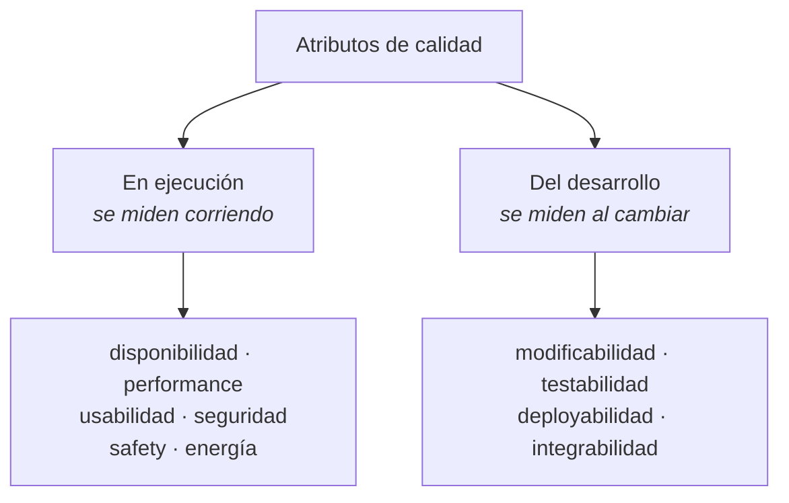

# Atributos de calidad

> [!warning] Nota de COMPLEMENTO
> La **unidad 2** del programa se da del **25 de agosto al 7 de septiembre** y todavía no hay
> presentación. Lo que sigue viene del **SAIP** (Bass, Clements y Kazman — bibliografía oficial) vía
> la guía de estudio, más el contenido temático del programa. Cuando llegue la presentación hay que
> revisar esta nota contra ella: **si la clase dice algo distinto, manda la clase.**
>
> Lo que **sí** es del programa: la lista de seis atributos de la sección 3, que es la que hay que
> usar para clasificar.

---

## 1. Qué es un atributo de calidad

> Un **atributo de calidad (QA)** es una propiedad **medible o testeable** de un sistema, que indica
> cuán bien satisface las necesidades de sus stakeholders más allá de la función básica — la
> "utilidad" del producto en alguna dimensión de interés.

Las dos palabras que hacen el trabajo: **medible o testeable**. Si no se puede medir, no es un
atributo de calidad: es un deseo.

## 2. La funcionalidad no determina la arquitectura

Esta es la idea que justifica toda la unidad, y conviene poder decirla:

> Dado un conjunto de funciones requeridas, hay **infinitas arquitecturas** que las satisfacen — de
> hecho, si solo importara la funcionalidad, un **blob monolítico** sin estructura interna bastaría.

Entonces, ¿por qué estructuramos los sistemas en módulos, capas, servicios e hilos? Para hacerlos
comprensibles y para servir *otros propósitos*: **los atributos de calidad**.

La prueba está en la práctica: los sistemas se rediseñan **no por deficiencia funcional** —los
reemplazos suelen ser funcionalmente idénticos— sino porque son difíciles de mantener, portar o
escalar, o son lentos, o fueron vulnerados.

Conecta directo con [[Arquitectura en el ciclo de vida del software]]: *"la arquitectura del software
es el resultado de equilibrar requisitos funcionales y calidad"*.

## 3. Los seis atributos del programa

El contenido temático de la unidad 2 lista estos seis, que son las características de **ISO 9126**:

| Atributo | De qué se trata |
|---|---|
| **Funcionalidad** | Que haga lo que debe. En ISO 9126 incluye la **seguridad** como subcaracterística |
| **Fiabilidad** | Que siga funcionando: madurez, tolerancia a fallas, recuperabilidad. Incluye la **disponibilidad** |
| **Usabilidad** | Que se pueda entender, aprender y operar |
| **Eficiencia** | Comportamiento temporal y uso de recursos. Es lo que el SAIP llama **performance** |
| **Mantenibilidad** | Que se pueda analizar, cambiar y probar. Incluye **modificabilidad** y **testabilidad** |
| **Portabilidad** | Que se pueda llevar a otro entorno: adaptabilidad, instalabilidad, reemplazabilidad |

Y el programa agrega una línea que conviene no pasar por alto: **"otros atributos de calidad no
observables vía ejecución"**. Son los del desarrollo — modificabilidad, testabilidad,
deployabilidad, integrabilidad —: no se pueden medir corriendo el sistema, se miden al **cambiarlo**.

> [!note] Cómo se llama eso en el libro oficial
> El SAIP les dice ***developmental qualities*** o ***development-time qualities***, y la distinción
> la ancla en el **estímulo** y la **respuesta** del escenario:
>
> > *"El estímulo puede ser un evento para la comunidad de performance, una operación de usuario para
> > la de usabilidad, o un ataque para la de seguridad. Usamos el mismo término para describir una
> > **acción motivadora de las calidades del desarrollo**: así, un estímulo para modificabilidad es
> > **una solicitud de modificación**; un estímulo para testabilidad es **la finalización de una
> > unidad de desarrollo**."*
>
> Y la respuesta cambia de sujeto: *"consiste en las responsabilidades que **el sistema** (para las
> calidades en ejecución) o **los desarrolladores** (para las calidades del desarrollo) deben
> ejecutar"*.
>
> Regla práctica para escribir el escenario: si el que responde es **el sistema**, es de ejecución;
> si el que responde es **el equipo**, es del desarrollo. Ver §7.
>
> El libro también explica **por qué** el programa las separa: *"muchos concerns que conducen una
> arquitectura no se manifiestan en absoluto como observables en el sistema... las calidades del
> desarrollo también quedan fuera de alcance: rara vez verás un documento de requisitos que describa
> supuestos de organización de equipos"*. O sea: **no están en el documento de requisitos, y por eso
> hay que salir a buscarlas.**

> [!important] Dónde cae la seguridad
> En la lista del programa **no aparece "seguridad" como atributo propio**, y eso no es un olvido: en
> **ISO 9126** la seguridad es una **subcaracterística de funcionalidad**.
>
> Su sucesora **ISO/IEC 25010** la asciende a característica de primer nivel, y llega a **ocho**:
> functional suitability, performance efficiency, compatibility, usability, reliability, **security**,
> maintainability, portability.
>
> Para clasificar en esta materia, usá **los seis del programa** — y si un requisito es de seguridad,
> decí bajo qué característica lo estás poniendo y por qué. Eso demuestra que entendiste la
> taxonomía en vez de improvisar una.

## 3 bis. Una segunda taxonomía que también es de clase: FURPS

`NT1. Trazabilidad de Requerimientos.pdf` trae, en su **Tabla 1 — "Clasificación de los requisitos
de software"**, una taxonomía **distinta** de la del programa. Es **FURPS**:

| Factor de calidad | Atributos que lista |
|---|---|
| **Funcionalidad** | característica y capacidades del programa · generalidad de las funciones · **seguridad del sistema** |
| **Facilidad de uso** | factores humanos · factores estéticos · consistencia de la interfaz · documentación |
| **Confiabilidad** | frecuencia y severidad de las fallas · exactitud de las salidas · tiempo medio de fallos · capacidad de recuperación · capacidad de predicción |
| **Rendimiento** | velocidad de procesamiento · tiempo de respuesta · consumo de recursos · rendimiento · eficacia |
| **Capacidad de soporte** | extensibilidad · adaptabilidad · capacidad de prueba · capacidad de configuración · compatibilidad · requisitos de instalación |

> [!warning] Hay DOS taxonomías de clase y no coinciden — elegí una y declarala
> | | Programa (unidad 2) | NT1, Tabla 1 |
> |---|---|---|
> | Modelo | **ISO 9126** | **FURPS** |
> | Cuántos factores | 6 | 5 |
> | Mantenibilidad | sí | **no** — se reparte en *capacidad de soporte* |
> | Portabilidad | sí | **no** — cae en *adaptabilidad* / *requisitos de instalación* |
> | Seguridad | subcaracterística de funcionalidad | igual: dentro de **funcionalidad** |
>
> Las dos coinciden en lo importante para esta materia: **la seguridad va dentro de funcionalidad**,
> no como factor aparte.
>
> **Qué hacer en la entrega:** usá **los seis del programa** — es el contenido temático evaluable — y
> si un atributo te queda incómodo, mencioná que FURPS lo pone en otro lado. Lo que **no** se puede
> es mezclar las dos listas sin decir cuál usás: ahí la clasificación queda indefendible.

![[adjuntos/nt1-trazabilidad/nt1-p03-tabla-clasificacion-y-matriz-dependencias.png]]

## 4. Las dos categorías

El SAIP los parte en dos, y la distinción es útil porque cambia **cómo se miden**:

| Categoría | Atributos | Cómo se miden |
|---|---|---|
| **En ejecución** | disponibilidad, performance, usabilidad, seguridad, safety, energía | corriendo el sistema |
| **Del desarrollo** | modificabilidad, testabilidad, deployabilidad, integrabilidad | al **modificar** el sistema, no al ejecutarlo |

## 5. Ningún atributo se logra en aislamiento

> Lograr uno **afecta** —a veces positiva, a veces negativamente— a los otros. Casi todos afectan
> **negativamente a la performance**.

El ejemplo del libro: **portabilidad** → aislar dependencias → *overhead* → menos performance.

> Diseñar es, en parte, hacer los **tradeoffs** apropiados.

Esto es la contracara de [[Equilibrio de restricciones del proyecto]] y de la tabla de canjes de
[[Estilos arquitectónicos]]: **elegir un estilo es elegir qué atributo sacrificar.**

## 6. Los tres problemas clásicos, y su solución

El SAIP identifica por qué las discusiones sobre calidad suelen no llevar a nada:

| Problema | Ejemplo del libro |
|---|---|
| **1. Definiciones no testeables** | *"el sistema será modificable"* no significa nada: todo sistema es modificable frente a un conjunto de cambios y no frente a otro |
| **2. Disputas de pertenencia** | ¿un ataque **DoS** es disponibilidad, performance, seguridad o usabilidad? Las cuatro comunidades lo reclaman, y el debate no ayuda a diseñar |
| **3. Vocabularios propios** | a la performance le *"llegan eventos"*; a la seguridad, *"ataques"*; a la disponibilidad, *"fallas"*; a la usabilidad, *"input del usuario"* — pueden ser **la misma ocurrencia** |

**La solución a los problemas 1 y 2 son los escenarios.** Al 3, presentar los conceptos de cada
comunidad en una forma común.

Y de ahí la frase que hay que llevarse:

> Los nombres de los atributos de calidad, **por sí solos, son casi inútiles**: son invitaciones a
> empezar una conversación. La especificación real son los **escenarios**.

## 7. El escenario de atributo de calidad: seis partes

Es la forma común de especificar **todos** los requerimientos de calidad: testeable, sin ambigüedad,
e insensible a los caprichos de la categorización.

| # | Parte | Qué se responde |
|---|---|---|
| 1 | **Fuente del estímulo** | ¿quién o qué lo origina? Un humano, un sistema, un actor |
| 2 | **Estímulo** | ¿qué llega? Un evento, un ataque, un pedido de cambio |
| 3 | **Artefacto** | ¿a qué le llega? Al sistema completo o a una parte |
| 4 | **Entorno** | ¿en qué condiciones? Normal, sobrecarga, arranque, modo degradado |
| 5 | **Respuesta** | ¿qué hace el sistema? |
| 6 | **Medida de la respuesta** | ¿**cómo se comprueba**? Latencia, horas-persona, % de disponibilidad |

La parte **6 es la que separa un requisito de un deseo.** Sin medida, el escenario no es testeable y
no sirve como driver.

### Generales vs concretos

| | Qué es | Para qué |
|---|---|---|
| **General** | independiente del sistema; sirve a cualquiera | facilitar el *brainstorming* |
| **Concreto** | específico del sistema en consideración | especificar el requisito real |

El motivo de tener los generales es práctico: **es mucho más fácil que un stakeholder adapte un
escenario general a su sistema que lo genere de la nada.**

Es común omitir partes al principio, pero **saber que las seis existen obliga a considerar si cada
una es relevante**.

## 8. Cómo sacarle un número a un stakeholder

Técnica de Kazman, para el clásico *"no sé qué valor poner"* — el libro la llama **hacerse el tonto**:

> — ¿Cuán rápido debe responder el sistema a la transacción? — No sé.
> — ¿24 horas está bien? — ¡¡No!!
> — ¿Una hora? — No.
> — ¿Cinco minutos? — No.
> — ¿Diez segundos? — Mmm… supongo que podría vivir con eso.

**Un rango de valores aceptables basta para elegir mecanismos**, porque 24 horas, 10 minutos, 10
segundos o 100 milisegundos implican para el arquitecto **enfoques arquitectónicos completamente
distintos**.

## 9. Sobre las taxonomías ISO

El veredicto del SAIP sobre las listas de atributos, que conviene conocer para no idolatrarlas:

**Sirven** como *checklist* para no olvidar necesidades, y como base de un checklist propio.

**Pero:**

1. **Ninguna lista es completa.** Siempre va a aparecer un *concern* imprevisto. El ejemplo del libro
   es la *"Iowability"*: una arquitectura diseñada para **retener talento** en el Midwest ofreciendo
   tecnología de punta y libertad creativa.
2. **Generan más controversia que comprensión.** Discutir si la portabilidad es un tipo de
   modificabilidad es esfuerzo mal gastado.
3. **Pretenden ser taxonomías, pero los atributos son escurridizos.** El DoS pertenece a cuatro.

Dato útil de ISO/IEC 25010: divide en *"quality in use"* y *"product quality"*, tiene casi **cinco
docenas de subcaracterísticas**… y la **escalabilidad ni aparece**.

---

## Notas relacionadas

- [[Guía - Drivers de calidad y restricción]] — cómo se convierte todo esto en un entregable
- [[Arquitectura en el ciclo de vida del software]] — "equilibrar requisitos funcionales y calidad"
- [[Estilos arquitectónicos]] — la tabla de qué atributo favorece y sacrifica cada estilo
- [[Equilibrio de restricciones del proyecto]] — los tradeoffs a nivel proyecto
- [[Matriz de trazabilidad de requisitos]] — cómo se enlaza un atributo con una decisión
- [[Diagrama de despliegue]] — la estructura clave para rendimiento, integridad, seguridad y disponibilidad
- [[Programa oficial del curso]] — la unidad 2 y su cronograma

## Preguntas de repaso

1. Dá la definición de atributo de calidad. ¿Qué dos palabras la hacen operativa?
2. ¿Por qué la funcionalidad **no** determina la arquitectura? ¿Qué bastaría si solo importara?
3. Nombrá los seis atributos del programa. ¿Dónde cae la **seguridad** y por qué?
4. ¿Qué diferencia hay entre atributos **en ejecución** y **del desarrollo**?
5. ¿A qué atributo afectan negativamente casi todos los demás?
6. ¿Cuáles son los tres problemas clásicos de las discusiones de calidad, y qué los resuelve?
7. Enumerá las **seis partes** de un escenario. ¿Cuál separa un requisito de un deseo?
8. ¿Para qué sirven los escenarios **generales** si el requisito real es el concreto?
9. Explicá la técnica de "hacerse el tonto" y por qué un rango de valores ya es útil.
10. ¿Por qué el SAIP desconfía de las taxonomías ISO, si igual las recomienda como checklist?
