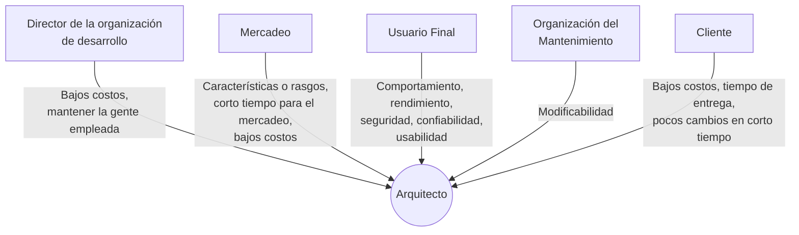

# Beneficios de la arquitectura de software

Son **tres**, y conviene memorizarlos con este orden porque la presentación los numera:

1. Proporciona la comunicación entre stakeholders.
2. Manifiesta las decisiones de diseño tempranamente.
3. Las arquitecturas como un modelo reusable y transferible.

## 1. Proporciona la comunicación entre stakeholders

*Stakeholders* = participantes del proyecto. El punto del beneficio es que **cada
stakeholder le pide al sistema una cosa distinta, y muchas veces esas cosas se contradicen**.
La arquitectura es el lenguaje común donde esas peticiones se ponen sobre la mesa.

La diapositiva lo dibuja como cinco stakeholders hablándole al arquitecto, que termina
diciendo "Ohhhh...":

Fijate en el detalle: casi todos piden **bajos costos**, pero el usuario final pide
rendimiento y seguridad, y mantenimiento pide modificabilidad — y esas cosas cuestan. De ahí
sale la tensión que se explica en [[Equilibrio de restricciones del proyecto]].

![[adjuntos/arquitectura-de-software/arq-p18.png]]

## 2. Manifiesta las decisiones de diseño tempranamente

Este es el beneficio de "decidir temprano lo que es caro cambiar después". Lo que logra:

- Define **restricciones de implementación**.
- Soporta la **estructura organizacional**.
- **Inhibe o activa** los atributos de calidad del sistema.
- **Exhibe** los atributos de calidad requeridos.
- Facilita el razonar acerca del **manejo del cambio**.
- Ayuda en la evolución del **prototipado**.
- Alcanza más **exactitud en estimación de costos y agenda** del proyecto.

Los dos puntos sobre atributos de calidad no son lo mismo y suele preguntarse: *inhibir o
activar* es que la arquitectura **habilita o impide** que un atributo sea alcanzable;
*exhibir* es que la arquitectura **muestra** los atributos que se pidieron.

![[adjuntos/arquitectura-de-software-v1/arqv1-p13.png]]

## 3. Las arquitecturas como un modelo reusable y transferible

La arquitectura no se usa una sola vez:

- Las **líneas de productos de software** comparten una arquitectura en común.
- Los sistemas se pueden construir usando **grandes y extensos elementos de desarrollo**.
- **Menos es más**: vocabulario restringido de alternativas de diseño.
- Permite **desarrollo basado en plantillas** (*templates*).
- Puede ser la **base para el entrenamiento** de nuevos miembros del equipo de desarrollo.

"Menos es más" es contraintuitivo pero clave: **restringir** el vocabulario de alternativas
de diseño es un beneficio, porque un equipo con pocas formas acordadas de hacer las cosas es
más consistente y más rápido que uno donde cada quien inventa.

![[adjuntos/arquitectura-de-software-v1/arqv1-p14.png]]

## ¿Qué permite la arquitectura?

Cierre del tema, tres cosas:

1. **Analizar la efectividad** del diseño para cumplir los requerimientos establecidos.
2. **Considerar alternativas arquitectónicas** en una etapa en la que hacer cambios al diseño
   todavía es relativamente fácil.
3. **Reducir los riesgos** asociados con la construcción del software.

![[adjuntos/arquitectura-de-software-v1/arqv1-p20.png]]

## Notas relacionadas

- [[Arquitectura de software]]
- [[Arquitecto de software]]
- [[Ciclo de influencias en la arquitectura]]
- [[Equilibrio de restricciones del proyecto]]
- [[Proceso de diseño arquitectónico]]

## Preguntas de repaso

1. Nombrá los tres beneficios de una arquitectura de software.
2. ¿Qué le pide el **usuario final** al sistema y qué le pide la **organización del mantenimiento**? ¿Por qué chocan?
3. ¿Qué diferencia hay entre *inhibir o activar* atributos de calidad y *exhibir* atributos de calidad?
4. Explicá por qué "menos es más" (vocabulario restringido) cuenta como beneficio.
5. ¿En qué etapa conviene considerar alternativas arquitectónicas y por qué?
