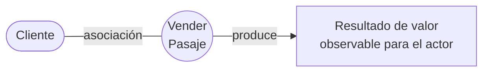

# Caso de uso del negocio

Un **Caso de Uso del Negocio (CUN)** es una **secuencia de acciones, realizadas en el negocio,
que producen un resultado de valor observable para ciertos actores del negocio**.

Y desde la perspectiva de un actor individual, **define un flujo de trabajo completo que
produce resultados deseados**.

Tres palabras hacen todo el trabajo en esa definición:

- **valor observable** → si el actor no percibe un resultado, no es un CUN.
- **completo** → no es un pedacito de trámite, es el flujo de punta a punta.
- **actores del negocio** → siempre hay alguien para quien el resultado vale
  (→ [[Actor del negocio]]).

## La equivalencia central

> **Un CUN representa a un proceso de negocio.**

Uno a uno con el [[Proceso de negocio]]. Por eso identificar los procesos es identificar los
CUN → [[Identificación de procesos del negocio]].

![[adjuntos/cdu-negocio-modelado-drivers-rf/cdu-p11.png]]
![[adjuntos/cdu-negocio-modelado-drivers-rf/cdu-p10.png]]

## Las cuatro consideraciones

1. Su **nombre y descripción breve** son claras y fáciles de comprender.
2. Cada caso de uso del negocio es **completo** desde la perspectiva de un actor externo.
3. Cada caso de uso del negocio **normalmente** se involucra con, al menos, un actor.
4. **Es posible que un caso de uso de apoyo no interactúe con ningún actor.**

Fijate en el contraste entre 3 y 4: la regla general es que un CUN tenga al menos un actor,
pero hay una **excepción** — los casos de uso de **apoyo** (soporte) pueden no tener ninguno.
Esto es distinto de lo que pasa con los actores, donde la regla no admite excepción: *cada actor
se involucra con al menos un caso de uso*.

| | ¿Puede quedar sin pareja? |
|---|---|
| Un **actor** sin ningún CUN | **No** |
| Un **CUN** sin ningún actor | **Sí**, si es de apoyo |

Tiene sentido: un proceso de soporte (por ejemplo, mantenimiento interno) produce valor para el
negocio pero puede no tener contacto con nadie de afuera. Ver la clasificación
núcleo / soporte / gerenciales en [[Identificación de procesos del negocio]].

![[adjuntos/cdu-negocio-modelado-drivers-rf/cdu-p16.png]]

## Cómo se expande un CUN

Cuando el CUN simple no alcanza, se usan las relaciones de los **CUN expandidos**:

- [[Relación de inclusión include]]
- [[Relación de extensión extend]]
- [[Generalización y especialización en casos de uso]]

![[adjuntos/cdu-negocio-modelado-drivers-rf/cdu-p17.png]]

## Notas relacionadas

- [[Modelo de casos de uso del negocio]]
- [[Actor del negocio]]
- [[Proceso de negocio]]
- [[Identificación de procesos del negocio]]
- [[Descripción textual de casos de uso]]
- [[Realizaciones de casos de uso del negocio]]

## Preguntas de repaso

1. Dá la definición completa de CUN. ¿Qué significa "resultado de valor observable"?
2. ¿Qué relación hay entre un CUN y un proceso de negocio?
3. ¿Puede existir un CUN sin actores? ¿Y un actor sin CUN? Justificá ambas.
4. ¿Qué quiere decir que un CUN es "completo desde la perspectiva de un actor externo"?
5. ¿Cuáles son las tres relaciones de los CUN expandidos?
