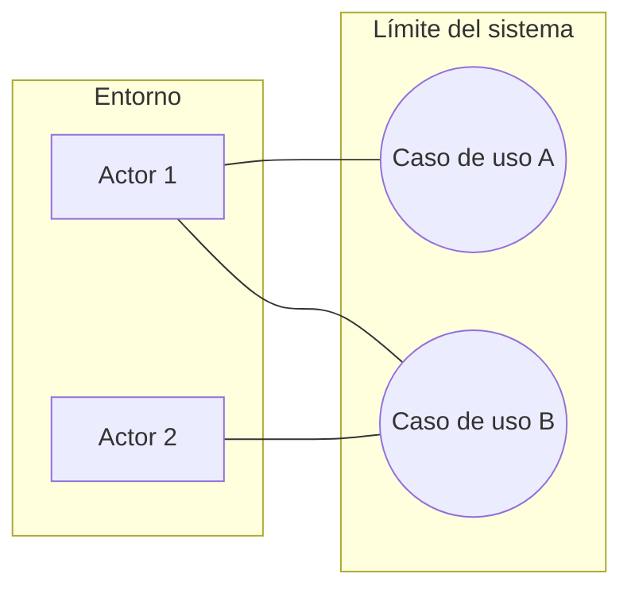
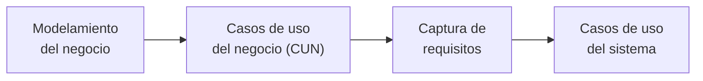

# Caso de uso

Los **casos de uso** (CU) son de **Ivar Jacobson**. Describen, bajo la forma de **acciones y
reacciones**, el comportamiento de un sistema **desde el punto de vista del usuario**.

Esa última parte es la que define todo lo demás: un caso de uso se para **afuera** del sistema
y mira para adentro. Nunca cuenta cómo el sistema hace las cosas por dentro.

## Qué logran

- Permiten definir los **límites del sistema** y las relaciones entre el sistema y el entorno.
- Son descripciones de la funcionalidad del negocio/sistema **independientes de la
  implementación**.
- Cubren la carencia existente en **métodos previos (OMT, Booch)** en cuanto a la
  **determinación de requisitos**.
- **Particionan** el conjunto de necesidades atendiendo a la **categoría de usuarios** que
  participan en el mismo.
- Están basados en el **lenguaje natural**, es decir, son **accesibles por los usuarios**.

Los dos últimos puntos van juntos y son la razón de su éxito: si el modelo está en lenguaje
natural, el usuario lo puede leer y corregir. Un diagrama de clases no se lo podés poner
enfrente a un cliente; un caso de uso sí.

![[adjuntos/cdu-negocio-modelado-drivers-rf/cdu-p03.png]]
![[adjuntos/cdu-negocio-modelado-drivers-rf/cdu-p04.png]]

## ¿En qué momento se usan?

En **dos** momentos del ciclo de vida, según el diagrama de flujos de trabajo de RUP:

1. **Modelamiento del negocio** (*business modeling*) → de acá salen los
   [[Caso de uso del negocio|casos de uso del negocio]].
2. **Captura de requisitos** (*requirements*) → de acá salen los casos de uso del sistema.

Los dos flujos de trabajo son los primeros del ciclo y ambos son más intensos en las fases de
*inception* y *elaboration*. Que los CU aparezcan en los dos explica por qué existen **dos
tipos** de casos de uso y por qué se confunden tanto.

![[adjuntos/cdu-negocio-modelado-drivers-rf/cdu-p06.png]]

## Los dos tipos

| | Caso de uso del negocio (CUN) | Caso de uso del sistema |
|---|---|---|
| Momento | Modelamiento del negocio | Captura de requisitos |
| Qué modela | Un **proceso de negocio** | Una funcionalidad del **software** |
| Actores | [[Actor del negocio]] (cliente, proveedor, socio…) | Usuarios y sistemas que interactúan con el software |
| Alcance | Toda la organización | El sistema informático |

Este deck desarrolla a fondo el lado del negocio → [[Modelo de casos de uso del negocio]].

> [!note] Hueco en el material
> El título de la presentación dice "Diagramas de Casos de Uso **del Negocio y del Sistema**",
> pero las diapositivas solo desarrollan los **del negocio**. Los casos de uso del **sistema**
> quedan mencionados y no explicados. Falta una nota sobre ellos cuando aparezca el material.

## Notas relacionadas

- [[Casos de uso vs DFD]]
- [[Modelo de casos de uso del negocio]]
- [[Caso de uso del negocio]]
- [[Actor del negocio]]
- [[Descripción textual de casos de uso]]
- [[Modelo 4+1 vistas]] — los casos de uso son la vista "+1" que amarra las otras cuatro

## Preguntas de repaso

1. ¿Quién propuso los casos de uso y bajo qué forma describen el comportamiento del sistema?
2. ¿Desde qué punto de vista se describe un caso de uso, y qué consecuencia tiene eso?
3. ¿En qué dos momentos del ciclo de vida se usan los casos de uso?
4. ¿Por qué se dice que los CU son "accesibles por los usuarios"?
5. ¿Qué carencia de OMT y Booch vinieron a cubrir?
