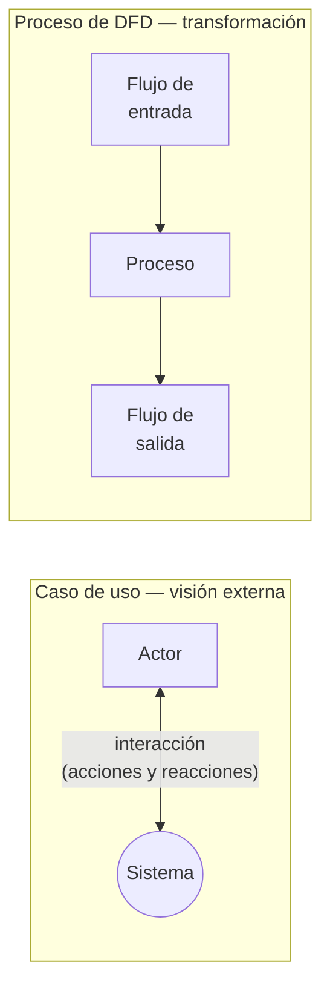

# Casos de uso vs DFD

Un caso de uso y un proceso de un DFD **modelan lo mismo** —una pieza de funcionalidad del
sistema— pero **su especificación es diferente**. Esta comparación es material clásico de
examen, así que conviene tenerla afilada.

## Las dos diferencias

**1. Cómo expresan la funcionalidad**

| | Caso de uso | Proceso (DFD) |
|---|---|---|
| Expresa la funcionalidad mediante… | la **interacción actores – sistema** | la **transformación** que se hace de los flujos de **entrada** para producir flujos de **salida** |

**2. Qué tanto muestran del interior del sistema**

| | Caso de uso | DFD |
|---|---|---|
| Perspectiva | **Externa**: se concibe desde la perspectiva de los actores | Puede ser **interna** |
| Particionamiento funcional interno | En general **no** lo modela | Según el nivel de detalle, **puede mostrar** descomposición funcional interna |

![[adjuntos/cdu-negocio-modelado-drivers-rf/cdu-p05.png]]

## La forma corta de recordarlo

- **Caso de uso** → *¿quién interactúa con el sistema y para qué?* Mira desde **afuera**.
- **DFD** → *¿en qué se transforma el dato al pasar por acá?* Puede mirar hacia **adentro**.

Un CU no te dice cómo se descompone el sistema por dentro; para eso está el DFD (o, en el
mundo de la arquitectura, la vista de desarrollo del [[Modelo 4+1 vistas]]). Y un DFD no te
dice quién usa el sistema ni con qué intención; para eso está el CU.

No son rivales: son **complementarios**, porque responden preguntas distintas sobre la misma
funcionalidad.

## Notas relacionadas

- [[Caso de uso]]
- [[Modelo de casos de uso del negocio]]
- [[Proceso de negocio]]

## Preguntas de repaso

1. ¿Qué tienen en común un caso de uso y un proceso de DFD?
2. ¿Cómo expresa la funcionalidad cada uno?
3. ¿Cuál de los dos puede mostrar la descomposición funcional interna del sistema y por qué?
4. Si te piden documentar quién usa el sistema y para qué, ¿cuál elegís? ¿Y si te piden cómo se transforman los datos?
