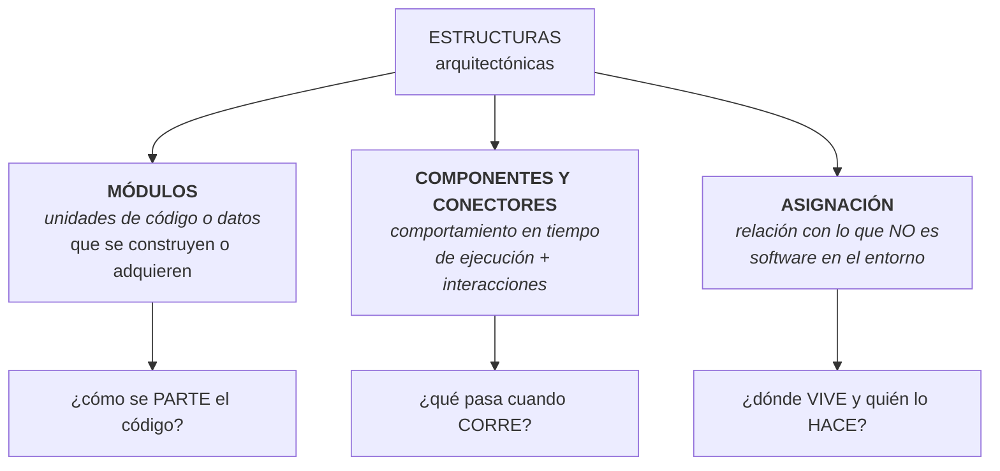

# Categorías de estructuras

Las **tres** categorías en que se agrupan todas las estructuras arquitectónicas. Es el subpunto
explícito del **1.8** del programa.

> [!important] Esta nota es NÚCLEO
> Sale de la diapositiva **"Categorías de Estructuras"**. Antes este punto estaba cubierto solo como
> complemento del SAIP dentro de [[Diagrama de despliegue]]; ahora tiene fuente de clase y nota propia.

---

## 1. Lo que dice la diapositiva

> Hay **tres categorías** de estructuras:
>
> - Las estructuras de los **módulos** muestran cómo se debe estructurar un sistema como un conjunto
>   de **unidades de código o de datos** que se deben **construir o adquirir**.
> - Las estructuras de **componentes y conectores** muestran cómo se debe estructurar el sistema como
>   un conjunto de elementos que tienen un **comportamiento en tiempo de ejecución** (componentes) e
>   **interacciones** (conectores).
> - Las estructuras de **asignación** muestran cómo se relacionará el sistema con las estructuras que
>   **no son de software** en su entorno (como CPU, sistemas de archivos, redes, equipos de
>   desarrollo, etc.).

![[adjuntos/capturas-clase/categorias-de-estructuras.png]]

## 2. La tabla que hay que memorizar

| Categoría | Elementos | La pregunta que responde | Momento |
|---|---|---|---|
| **Módulos** | unidades de **código o datos** — construidas o **adquiridas** | *¿cómo se parte el código?* | **estático**, antes de correr |
| **Componentes y conectores** | **componentes** (comportamiento) + **conectores** (interacciones) | *¿qué pasa cuando el sistema corre?* | **tiempo de ejecución** |
| **Asignación** | software ↔ **entorno no-software**: CPU, sistemas de archivos, redes, **equipos de desarrollo** | *¿dónde vive y quién lo construye?* | **despliegue y organización** |

> [!important] Tres detalles de la redacción que valen puntos
> **1. "construir o adquirir".** Un módulo no es solo código propio: una librería o un producto COTS
> que se **compra** también es un módulo de la arquitectura. Decidir *build vs. buy* es una decisión
> arquitectónica.
>
> **2. Componentes y conectores son DOS cosas.** El componente tiene comportamiento; el conector es la
> **interacción**. La interacción es un elemento de primera clase, no una línea decorativa.
>
> **3. "equipos de desarrollo" está en la categoría de asignación.** Junto a CPU y redes. O sea que
> **quién construye qué** es parte de la arquitectura — es la estructura de **asignación de trabajo**.
> Es la base de la ley de Conway: la estructura del equipo y la del software se reflejan.

## 3. Por qué son exactamente tres

Porque cada una responde a un tipo distinto de pregunta, y las tres juntas cubren el sistema:

| Si querés saber… | Mirás la estructura de… |
|---|---|
| qué archivo tocar para cambiar algo | **módulos** |
| por qué el sistema se cae bajo carga | **componentes y conectores** |
| en qué servidor corre cada cosa | **asignación** |
| a qué equipo asignar una tarea | **asignación** |
| si un cambio rompe otra cosa | **módulos** (dependencias) |
| cuántos procesos hay en vivo | **componentes y conectores** |

Y de ahí sale una regla práctica: **una vista sola nunca alcanza.** Un diagrama de módulos no dice
nada sobre el rendimiento; un diagrama de despliegue no dice nada sobre qué tocar para modificar algo.

> Conecta con la definición de la clase: *"una **vista** es una representación de **una o más
> estructuras**"* (→ [[Estructuras y vistas arquitectónicas]]). Las categorías clasifican las
> estructuras; las vistas son cómo se muestran.

## 4. Cómo se corresponden con lo que ya tenés

| Categoría | Vista del modelo 4+1 | Diagrama UML típico | Nota |
|---|---|---|---|
| **Módulos** | vista **lógica** / de desarrollo | clases, paquetes, componentes | [[Modelo 4+1 vistas]] |
| **Componentes y conectores** | vista de **procesos** | secuencia, actividad, comunicación | [[Modelo 4+1 vistas]] |
| **Asignación** | vista **física / de despliegue** | **despliegue** (nodos y artefactos) | [[Diagrama de despliegue]] |

El [[Diagrama de despliegue]] es, entonces, **la representación de una estructura de asignación** —
que es justo lo que enseña el punto 1.7 del programa. Los dos puntos están encadenados: 1.7 te da
*un* diagrama, 1.8 te da la **clasificación** que explica de qué es ese diagrama.

---

## Notas relacionadas

- [[Estructuras y vistas arquitectónicas]] — estructura vs. vista vs. viewpoint
- [[Arquitectura de software]] — la definición: "el conjunto de estructuras necesarias para razonar"
- [[Diagrama de despliegue]] — una estructura de asignación, dibujada
- [[Modelo 4+1 vistas]] — cómo se reparten las categorías en vistas
- [[Estilos arquitectónicos]] — cada estilo organiza sobre todo una categoría
- [[Evaluación de la arquitectura]] — el paso 3 del ATAM pide vistas de las tres

## Preguntas de repaso

1. Nombrá las tres categorías de estructuras y la pregunta que responde cada una.
2. ¿De qué están hechas las estructuras de módulos? ¿Y qué significa "construir o **adquirir**"?
3. ¿Cuál es la diferencia entre un **componente** y un **conector**?
4. ¿Con qué se relaciona una estructura de asignación? Dá cuatro ejemplos de la diapositiva.
5. ¿Por qué "equipos de desarrollo" cae en la categoría de asignación?
6. ¿Qué categoría mirás para saber por qué el sistema se cae bajo carga? ¿Y para saber qué archivo tocar?
7. ¿A qué categoría pertenece un diagrama de despliegue?
8. ¿Por qué una sola vista nunca alcanza?
