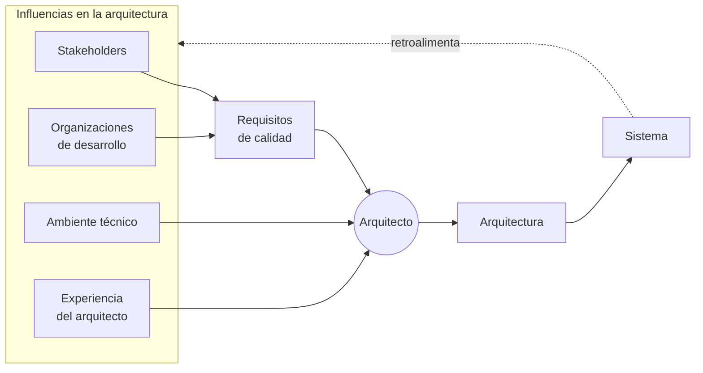

# Ciclo de influencias en la arquitectura

La arquitectura **no sale de la nada ni sale solo de los requisitos funcionales**. Hay cuatro
influencias que la moldean, y el resultado vuelve a influir sobre ellas. Por eso es un
**ciclo**, no una flecha.

## Las cuatro influencias

| Influencia | Qué aporta |
|---|---|
| **Stakeholders** | Lo que cada participante espera del sistema (→ [[Beneficios de la arquitectura de software]]) |
| **Organizaciones de desarrollo** | La estructura, los recursos y los intereses de la empresa que construye |
| **Ambiente técnico** | Tecnologías, estándares y prácticas disponibles en el momento |
| **Experiencia del arquitecto** | Lo que el arquitecto ya vivió: sus aciertos y sus cicatrices |

Las dos primeras son las que se combinan explícitamente para producir los **requisitos de
calidad**; las otras dos entran directamente al arquitecto.

## El ciclo

La flecha punteada es la parte importante: **el sistema construido modifica a sus propias
influencias**. Cuando el sistema sale a producción cambia lo que los stakeholders esperan,
cambia la estructura de la organización que ahora tiene que mantenerlo, aporta al ambiente
técnico y suma experiencia al arquitecto. La siguiente arquitectura ya arranca desde otro
lugar.

![[adjuntos/arquitectura-de-software-v1/arqv1-p12.png]]

## Por qué importa

Explica dos cosas que si no se ven raras:

- **Por qué dos equipos con los mismos requisitos funcionales producen arquitecturas
  distintas.** Los requisitos funcionales son solo una entrada; el ambiente técnico y la
  experiencia del arquitecto también pesan.
- **Por qué la arquitectura es un proceso iterativo.** Si el resultado retroalimenta las
  influencias, entonces no hay un "diseño arquitectónico" único y final
  (→ [[Arquitectura en el ciclo de vida del software]]).

## Notas relacionadas

- [[Arquitectura de software]]
- [[Arquitecto de software]]
- [[Beneficios de la arquitectura de software]]
- [[Arquitectura en el ciclo de vida del software]]
- [[Equilibrio de restricciones del proyecto]]

## Preguntas de repaso

1. Nombrá las cuatro influencias en la arquitectura.
2. ¿Cuáles dos influencias se combinan para producir los requisitos de calidad?
3. ¿Por qué el diagrama es un ciclo y no una secuencia lineal?
4. Usando este ciclo, explicá por qué dos arquitectos pueden llegar a arquitecturas distintas partiendo de los mismos requisitos funcionales.
