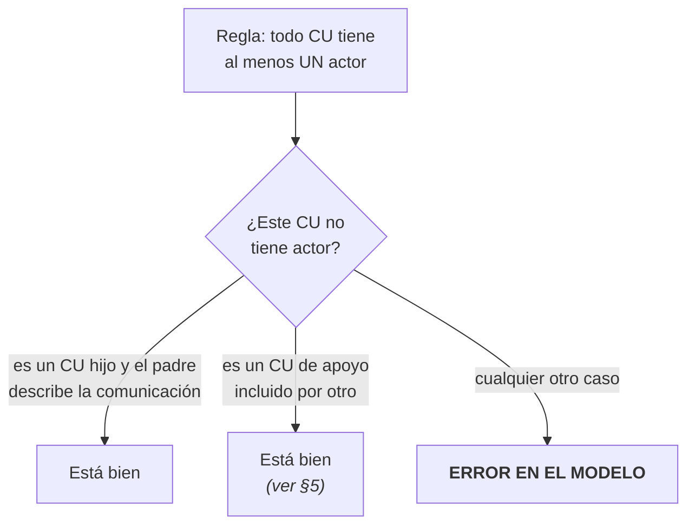
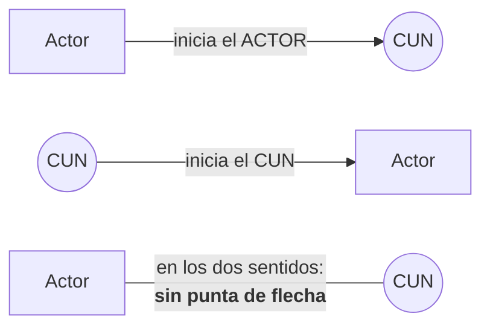
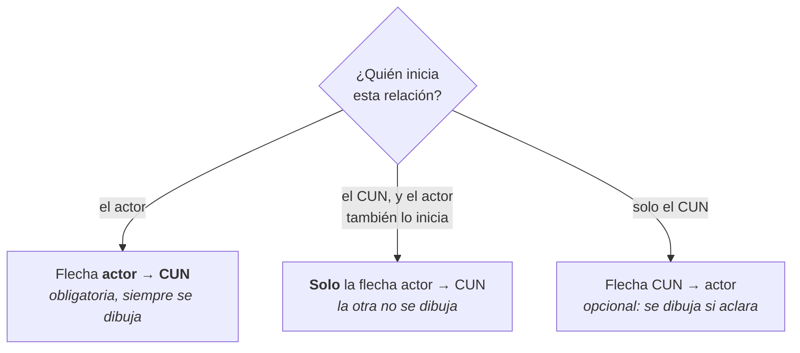
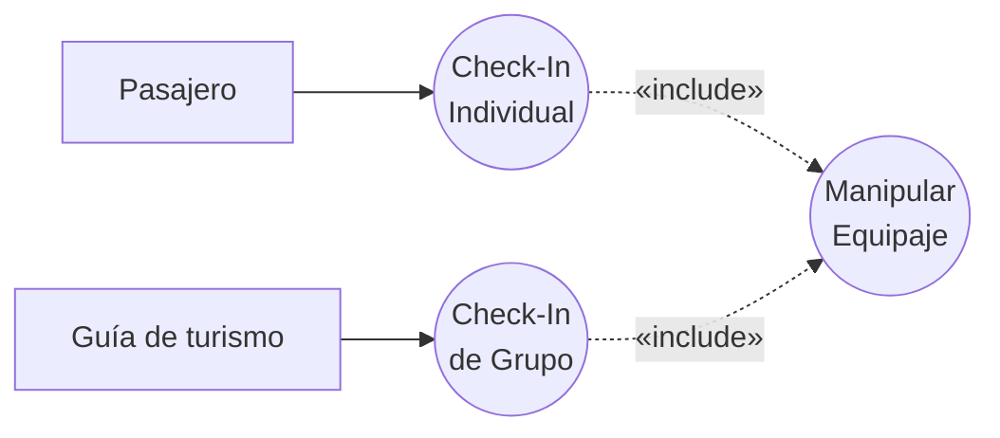
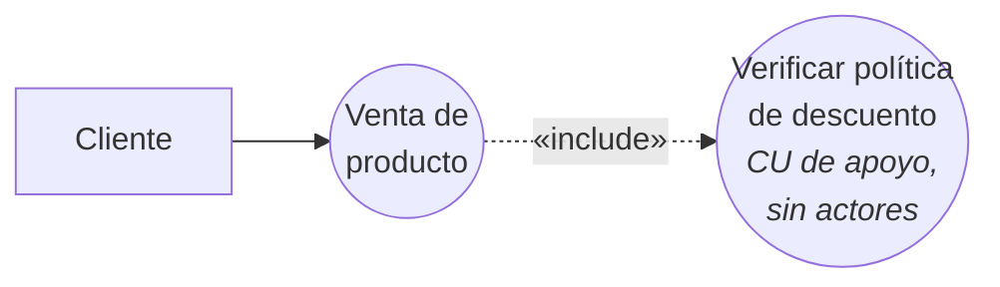

# Convenios del diagrama de CUN

Las reglas de **cómo se dibuja**: cuántos actores, cuándo va flecha y para qué lado.

> [!important] Esta nota es NÚCLEO
> Son tres diapositivas tituladas *"Convenios en la representación del Diagrama de CUN"*. Dice
> literalmente **"los convenios que usaremos serán"** — o sea que es **la norma de la clase**, no una
> recomendación general. Se califica con esto.

---

## 1. La notación: el estereotipo de negocio

Antes de las reglas, el símbolo. En sus ejemplos (Tienda Electrónica, Restaurante) los elementos
**no** son los de un caso de uso de sistema:

| Elemento | Cómo se dibuja | Qué lo distingue |
|---|---|---|
| **Actor del negocio** | monigote con una **barra diagonal cruzando la cabeza** | la diagonal es el estereotipo de *negocio* |
| **Caso de uso del negocio** | elipse con una **barra diagonal en el borde derecho** | ídem |
| **Asociación** | línea llena, opcionalmente con **punta de flecha** | ver §3 |

![[adjuntos/capturas-clase/cun-ejemplo-core-tienda-electronica.png]]

> [!tip] Por qué importa el detalle
> Si dibujás monigotes y elipses lisos, estás dibujando un **caso de uso del sistema**. La diagonal es
> lo que dice "esto es del **negocio**". En StarUML son los elementos *Business Actor* y *Business Use
> Case*; en Excalidraw hay que agregarla a mano. Ver [[StarUML]] y [[Excalidraw]].

## 2. Cuántos actores por caso de uso

> - Un caso de uso puede asociarse con **uno o más actores**.
> - Un caso de uso **se comunica con al menos un actor**, sino **hay error en el modelo**, excepto
>   cuando: **CU hijo en una relación de generalización/especialización si en el padre se describe
>   toda la comunicación**.

Y hay una segunda excepción, de otra diapositiva: *"es posible que un **caso de uso de apoyo** no
interactúe con ningún actor"* — el caso típico es el CU incluido por particionamiento (§5).

![[adjuntos/capturas-clase/convenios-cun-1.png]]

> [!warning] Esta es la regla que más se rompe
> Un CUN suelto, sin ninguna línea a un actor, **es un error**, no una omisión estética. Y no alcanza
> con que "se entienda": si no cae en una de las dos excepciones, hay que conectarlo o eliminarlo.
>
> En FarmaHosp, revisá **cada** CUN de tu primera descomposición contra esta regla antes de entregar.

### Y la regla espejo: tampoco puede haber un actor sin CU

La otra mitad, de la diapositiva de consideraciones sobre actores:

> Cada actor **se involucra con al menos un caso de uso**.

Así que hay que revisar el diagrama en **las dos direcciones**:

| Qué se busca | Veredicto |
|---|---|
| Un **CU sin actor** | error, salvo CU hijo con el padre describiendo la comunicación, o CU de apoyo |
| Un **actor sin CU** | error, **sin excepción** |

> [!important] La asimetría es real y conviene notarla
> Del lado del CU hay **dos excepciones**; del lado del actor, **ninguna**. Y su propio ejemplo lo
> confirma: en la generalización de actores del hospital, el actor padre *Cliente* **sí** tiene su
> CU propio (*Despachar medicamentos en farmacia*) — no queda suelto por ser padre.
>
> Un actor que dibujaste y no conectaste a nada es señal de una de dos cosas: o le falta un CU que
> sí existe en el caso, o **no es actor de este campo de acción** (→ [[Actor del negocio]]).

Ver también la checklist de [[Guía - Diagrama de casos de uso del negocio]], que ya verifica las dos
direcciones.

## 3. Navegabilidad: quién inicia

Esta es la parte fina, y es lo que la mayoría dibuja mal.

> - **Indica quién inicia la comunicación** en la interacción y se muestra con una flecha.
> - Si la **flecha apunta al CUN**, inicia el **actor**.
> - Si la **flecha apunta al actor**, entonces inicia el **CUN**.
> - La relación **en los dos sentidos** se muestra **sin saetas**.
> - Por cada flecha de comunicación **se asume un mensaje de retorno**.

![[adjuntos/capturas-clase/convenios-cun-2-navegabilidad.png]]

> [!warning] Las dos diapositivas de navegabilidad **no dicen lo mismo** — y hay que saber cuál manda
> Para el caso *"los dos inician"*, la diapositiva de arriba manda **sin saetas**; la de §4 —la que
> dice **"los convenios que usaremos serán"**— manda **solo una flecha del actor al CUN**. Es una
> colisión real del material, no un error de transcripción.
>
> | | Notación general *(esta diapositiva)* | **Convenio de la clase** *(§4)* |
> |---|---|---|
> | Ambos inician | línea **sin puntas** | **flecha actor → CUN**, y nada más |
> | Flechas CUN → actor | se dibujan si el CUN inicia | **pueden omitirse** |
>
> **Cuál usar:**
> - **Para dibujar** el Caso 1 y cualquier entregable → **el convenio de §4**. Ella lo titula "los
>   convenios que *usaremos*": es la norma operativa.
> - **En un examen** → contestá según la diapositiva que te citen. Si la pregunta es *"¿cómo se
>   muestra una relación en los dos sentidos?"*, la respuesta es **sin saetas**.
>
> **Y la consecuencia que importa al leer un diagrama:** como el convenio permite **omitir** flechas,
> una línea sin puntas **no es señal fiable de bidireccionalidad** — puede ser una flecha omitida. No
> se puede inferir la dirección de lo que no está dibujado.

> [!important] Lo que sí es inequívoco
> **No hace falta dibujar la respuesta.** *"Por cada flecha de comunicación se asume un mensaje de
> retorno"*: si el Cliente inicia *Procesamiento de Pedidos*, la respuesta al cliente **ya está
> implícita**. No se dibuja una segunda flecha de vuelta.
>
> Esto no choca con nada: las dos diapositivas lo sostienen.

### El error conceptual que advierte explícitamente

> **NO confundir navegabilidad con flujos de datos**: la navegabilidad **solo indica relación de
> iniciación.**

Esa es la diferencia con el [[Diagrama de contexto]], donde las flechas **sí** son flujos y **sí**
llevan nombre (*streamlines*). En el diagrama de CUN la flecha dice **quién arranca**, y nada más.

| | Diagrama de contexto | Diagrama de CUN |
|---|---|---|
| Qué significa la flecha | un **flujo de información** | **quién inicia** |
| Lleva nombre | **sí, siempre** | **no** |
| Bidireccional | dos flechas, una por flujo | por el convenio de §4: **una flecha actor → CUN** |

## 4. Los convenios que se van a usar

Y acá está la regla operativa, textual:

> - La **flecha de iniciación del actor al CUN siempre se muestra**, aún si más tarde el CU inicia
>   comunicación con el actor que lo mostró. En este último caso **solo se pone una flecha del actor
>   al CUN**.
> - **El resto de las flechas puede ser omitida** e incluirla solo para **esclarecer el diagrama**.

![[adjuntos/capturas-clase/convenios-cun-3-navegabilidad.png]]

Traducido a algo que puedas aplicar:

> [!tip] La regla en una frase
> **Dibujá siempre las flechas actor → CUN. Las demás, solo si aclaran.**
>
> Es una regla de economía: el diagrama de CUN no busca ser exhaustivo, busca ser **legible**. Y te
> quita de encima la duda de "¿le pongo flecha a todo?". No: solo a lo que arranca desde el actor.

## 5. Los dos usos de `«include»`, con sus ejemplos

La clase distingue dos motivos para incluir, y les pone nombre en rojo:

### REUTILIZAR

![[adjuntos/capturas-clase/include-reutilizar-aduana.png]]

Ejemplo de aduana: **Pasajero** → *Check-In Individual*, **Guía de turismo** → *Check-In de Grupo*, y
**los dos** `«include»` *Manipular Equipaje*.

**La señal:** el CU incluido lo usan **dos o más** casos base. Se saca aparte para no repetirlo.

### PARTICIONAR

![[adjuntos/capturas-clase/include-particionar-empresa-servicios.png]]

Ejemplo de empresa de servicios: **Cliente** → *Venta de producto* `«include»` *Verificar política de
descuento*, con la anotación **"es un CU de apoyo que no se relaciona con actores"**.

**La señal:** el CU incluido lo usa **uno solo**, y se saca aparte para **partir** un flujo largo en
piezas manejables. Es el caso donde el CU **no tiene actor** — la excepción de §2.

| | Reutilizar | Particionar |
|---|---|---|
| ¿Cuántos base lo incluyen? | **dos o más** | **uno** |
| ¿Por qué se saca aparte? | para no repetir | para simplificar |
| ¿Tiene actor propio? | puede | **normalmente no** |

Ver [[Relación de inclusión include]] — coincide con la distinción *inclusión por reuso* vs *inclusión
por partición* del artículo fuente del deck.

### Y `«extend»`, para contraste

![[adjuntos/capturas-clase/extend-aduana.png]]

Mismo ejemplo de aduana: *Check-In Individual* ←`«extend»`— **Manejo Especial de Equipaje**, con la
justificación en rojo: **"SOLO PARA ALGUNOS PASAJEROS HAY QUE IR AL COUNTER DE EQUIPAJE ESPECIAL"**.

> [!important] La prueba de una palabra para elegir entre las dos
> - **`«include»`** → *"**siempre** pasa"*. Todo check-in manipula equipaje.
> - **`«extend»`** → *"**solo a veces** pasa"*. Solo algunos pasajeros van al counter especial.
>
> Y ojo con la **dirección**, que es contraintuitiva: en `«include»` la flecha va **del base al
> incluido**; en `«extend»` va **del extensor al base**. Ver [[Relación de extensión extend]].

---

## Notas relacionadas

- [[Modelo de casos de uso del negocio]] — qué es el modelo que estos convenios dibujan
- [[Guía - Diagrama de casos de uso del negocio]] — el "cómo se hace" paso a paso
- [[Diagrama de contexto]] — donde las flechas **sí** son flujos con nombre
- [[Relación de inclusión include]] — reutilizar vs. particionar
- [[Relación de extensión extend]] — la del "solo a veces"
- [[Generalización y especialización en casos de uso]] — la excepción del CU hijo sin actor
- [[Actor del negocio]] — quién puede ser actor
- [[Relaciones y dependencias en UML]] — la tabla resumen de las cuatro relaciones
- [[StarUML]] y [[Excalidraw]] — con qué dibujarlo

## Preguntas de repaso

1. ¿Cómo se distingue gráficamente un actor del negocio de un actor de sistema? ¿Y un CUN de un CU?
2. ¿Con cuántos actores puede asociarse un caso de uso?
3. ¿Qué pasa si un CU no se comunica con ningún actor? ¿Cuáles son las dos excepciones?
4. ¿Qué indica la navegabilidad? ¿Qué **no** indica?
5. Si la flecha apunta al CUN, ¿quién inicia? ¿Y si apunta al actor?
6. ¿Cómo se dibuja una relación en los dos sentidos?
7. ¿Hay que dibujar el mensaje de respuesta? ¿Por qué?
8. ¿Qué flecha "siempre se muestra" y qué flechas pueden omitirse?
9. Diferenciá `«include»` de **reutilizar** de `«include»` de **particionar**. Dá la señal de cada uno.
10. ¿En qué caso un CU incluido normalmente no tiene actor?
11. Dá la prueba de una palabra para elegir entre `«include»` y `«extend»`.
