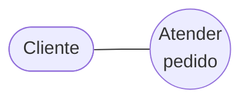

# Descripción textual de casos de uso

El diagrama de CUN muestra qué procesos hay y quién participa, pero **no cuenta qué pasa
adentro**. Eso lo hace la descripción textual: es uno de los artefactos de las
[[Realizaciones de casos de uso del negocio]].

## La plantilla

Las secciones que pide la presentación, en orden:

| Sección | Qué va |
|---|---|
| **Nombre** del caso de uso del negocio | El nombre del CUN |
| **Actores** | Quiénes participan desde afuera |
| **Propósito** | Para qué existe este proceso |
| **Resumen** | El proceso en un párrafo: cuándo inicia, qué hace, cuándo termina |
| **Flujo de trabajo** | El paso a paso, en dos variantes: **Básico (normal)** y **Curso alterno** |
| **Otras secciones** | Lo que haga falta según el caso |
| **Prioridad** | Qué tan importante es este CUN |
| **Mejoras** | Oportunidades de mejora detectadas |

Las dos variantes del flujo:

- **Básico (normal)**: lo que pasa cuando todo sale bien.
- **Curso alterno**: las variantes, excepciones y desvíos.

> [!tip] No confundir curso alterno con `<extend>`
> El curso alterno es la variante **contada en el texto del mismo caso de uso**. Cuando esa
> variante es compleja o rara y merece un caso de uso propio, se saca con una
> [[Relación de extensión extend]]. Misma idea, distinto nivel de formalidad.

![[adjuntos/cdu-negocio-modelado-drivers-rf/cdu-p26.png]]

![[adjuntos/capturas-clase/descripcion-textual-campos.png]]

## La estructura real: el ejemplo lleno de *Atender pedido*

Además de la lista de campos, ella muestra la ficha **completa y llena**. Y trae detalles de
estructura que la lista no dice.

![[adjuntos/capturas-clase/descripcion-textual-atender-pedido-1.png]]

### El encabezado

| Campo | Contenido del ejemplo |
|---|---|
| **Nombre** | Atender pedido |
| **Actores** | CLIENTE *(en mayúsculas)* |
| **Propósito** | Analizar viabilidad del Pedido del Cliente y ordenar su producción |
| **Resumen** | *"El caso de uso **se inicia cuando** el Cliente envía una orden de pedido de productos. El proceso da curso al pedido, analizando la posibilidad de satisfacerlo. El caso de uso **finaliza cuando** se le comunica al cliente el resultado final del análisis de su pedido."* |

> [!tip] El resumen tiene una fórmula
> **"se inicia cuando … / \[qué hace\] / finaliza cuando …"**. Tres piezas, un párrafo. Copá esa
> estructura y el resumen sale solo.

### El curso normal va en DOS columnas

Esto es lo que la lista de campos no dice y es lo más importante:

| **Acción del actor** | **Respuesta del proceso de negocio** |
|---|---|
| 1. El Cliente envía una orden de pedido que incluye fecha de solicitud, datos del cliente y productos solicitados. | 2. El Comercial recibe el pedido del cliente por teléfono o correo ordinario de la empresa. 3. El Comercial revisa el pedido, comienza su procesamiento, y lo envía al Jefe Técnico. 4. El Jefe Técnico analiza la viabilidad de cada producto pedido por separado:  *Si el producto pedido está en Catálogo, se acepta su fabricación.* 5. El Jefe Técnico informa al Comercial la aceptación o rechazo de cada producto.  *Si el pedido o parte de éste es aceptado pasar a 6*  *Si el pedido es rechazado pasar a 8* 6. El Jefe Técnico crea una orden de trabajo para cada producto… 7. El Jefe de Producción planifica la producción de las órdenes de trabajo recibidas. 8. El Comercial informa al cliente. |
| 9. El Cliente recibe la comunicación del resultado final del análisis del pedido. | |

> [!important] Tres reglas que se leen de esa tabla
> **1. La numeración es única y se intercala entre las dos columnas.** El paso 1 está a la izquierda,
> los pasos 2 a 8 a la derecha, y el 9 vuelve a la izquierda. **No** son dos secuencias paralelas: es
> **una sola secuencia** repartida según quién actúa.
>
> **2. Los saltos se escriben dentro del paso**: *"Si el pedido es rechazado **pasar a 8**"*. Así la
> bifurcación queda en el texto, sin necesidad de dibujar nada.
>
> **3. La columna derecha se llama "Respuesta del **proceso de negocio**"**, no "del sistema" — y ahí
> aparecen los **trabajadores del negocio**: el Comercial, el Jefe Técnico, el Jefe de Producción.
> Ninguno de ellos es actor; todos están **adentro**. Es la distinción de
> [[Realizaciones de casos de uso del negocio]] puesta en práctica.

### El cierre: cursos alternos, prioridad, mejoras y secciones

![[adjuntos/capturas-clase/descripcion-textual-atender-pedido-2.png]]

| Bloque | Cómo lo llena |
|---|---|
| **CURSOS ALTERNOS** | se indexa por **"En la línea N"** — en el ejemplo, *"En la línea 4"*, y describe la variante con sus dos salidas, cada una remitiendo a una sección |
| **Prioridad** | un valor simple: **"Alta"** |
| **Mejoras** | viñetas con oportunidades detectadas (*"establecer la comunicación con el usuario por correo e Internet"*) |
| **Otras secciones** | cada una es una **Sección** con nombre (*Aceptar Producto Especial*, *Rechazar Producto Especial*) y sus propios pasos numerados desde 1 |

> [!important] El curso alterno se ancla a un número de línea
> No se escribe suelto: dice **"En la línea 4"** y engancha con el paso 4 del curso normal. Eso hace
> que la ficha sea **navegable** — y es gratis de hacer bien.
>
> Y cuando la variante es larga, no se cuenta ahí: se manda a una **sección aparte**
> (*"Ver Sección Aceptar Producto Especial"*). Es el mismo principio que
> [[Relación de extensión extend]] pero dentro del texto.

> [!warning] Hay DOS plantillas en el material de clase — usá esta
> | Plantilla | Campos | ¿Cuándo la mostró? |
> |---|---|---|
> | **Esta** (*Atender pedido*) | Nombre, Actores, Propósito, Resumen, Curso normal **en dos columnas**, Cursos alternos, Prioridad, Mejoras, Otras secciones | **con ejemplo lleno**, y coincide con la lista de campos del deck |
> | La otra (§siguiente) | Identificador, Descripción, Secuencia Normal, Excepciones, Rendimiento, Frecuencia, Importancia, Urgencia, Comentarios | solo la **plantilla vacía** |
>
> **Usá la de *Atender pedido***: es la que coincide con la lista de campos que dictó y la única que
> mostró resuelta. La otra sirve para **sacarle campos extra** si te piden más rigor — sobre todo
> *Rendimiento*, *Frecuencia*, *Importancia* y *Urgencia*, que son los que enganchan con los drivers
> de calidad.

## La plantilla alternativa, campo por campo

Además del formato de arriba, la clase da una **plantilla completa** con los campos y el texto que va
en cada uno. Esta es la que conviene usar cuando se pide rigor:

![[adjuntos/capturas-clase/plantilla-descripcion-textual-cu.png]]

| Campo | Qué va, según la plantilla |
|---|---|
| **`<Identificador>`** · **`<nombre descriptivo>`** | el ID y el nombre, en la fila de encabezado |
| **Descripción** | *"El sistema deberá permitir a [lista actores] en [instante en el que se puede realizar el caso de uso] [funcionalidad que define el caso de uso] según se describe en el siguiente caso de uso"* |
| **Secuencia Normal** | tabla de **Paso / Acción**. Cada paso: *"{<acción a realizar>, realizar el caso de uso [caso de uso]}"* |
| — *sub-pasos* | un paso puede abrirse en **2a, 2b, …**: *"Si [situación que produce una alternativa] el sistema deberá {…}"* |
| **Excepciones** | tabla de **Paso / Acción**: *"En el caso de que [situación que provoca la excepción] el sistema deberá {…}"* |
| **Rendimiento** | *"El sistema deberá realizar la/s acción/es descrita/s en {los pasos [primero] al [último], el paso [número]} en un máximo de [cota de tiempo]"* |
| **Frecuencia** | *"Este caso de uso se espera que se lleve a cabo una media de [número de veces] al [unidad temporal]"* |
| **Importancia** | uno de: **{vital, importante, quedaría bien}** |
| **Urgencia** | uno de: **{inmediatamente, hay presión, puede esperar}** |
| **Comentarios** | *"otras consideraciones en formato libre"* |

> [!important] Los cuatro campos del final son los que enganchan con la arquitectura
> **Rendimiento**, **Frecuencia**, **Importancia** y **Urgencia** no describen *qué* hace el caso de
> uso: describen **cómo de bien** y **cuánto pesa**.
>
> - **Rendimiento** con su *cota de tiempo* es, literalmente, un **driver de calidad** metido en la
>   ficha del caso de uso.
> - **Frecuencia** es el dato de volumen que después sostiene los escenarios de carga.
> - **Importancia** y **Urgencia** son los ejes con que se **prioriza**.
>
> O sea: esta plantilla es el puente entre el criterio 3 (drivers) y la priorización de los cinco más
> críticos. Ver [[Drivers arquitectónicos]] y [[Guía - Drivers de calidad y restricción]].

> [!tip] Y las dos escalas son cerradas
> No se inventa el valor: **Importancia** es *vital / importante / quedaría bien* y **Urgencia** es
> *inmediatamente / hay presión / puede esperar*. Usar esas palabras exactas es gratis y demuestra
> que seguías la plantilla.
>
> Ojo con no confundirlas: **importancia** es cuánto vale, **urgencia** es cuándo se necesita. Algo
> puede ser *vital* y *puede esperar*.

## El ejemplo completo: Atender pedido

Es el CUN que salió de identificar procesos por objetivos en
[[Identificación de procesos del negocio]] (empresa de servicio, objetivo *"Satisfacer pedidos
de los clientes"*).

| Campo | Contenido |
|---|---|
| **Nombre** | Atender pedido |
| **Actores** | CLIENTE |
| **Propósito** | Analizar viabilidad del Pedido del Cliente y ordenar su producción. |
| **Resumen** | El caso de uso se inicia cuando el Cliente envía una orden de pedido de productos. El proceso da curso al pedido, analizando la posibilidad de satisfacerlo. El caso de uso finaliza cuando se le comunica al cliente el resultado final del análisis de su pedido. |

### Curso normal de eventos

Se escribe en **dos columnas**: lo que hace el actor y lo que responde el proceso de negocio.
La numeración es **continua entre las dos columnas** — así se ve el orden real de los hechos.

| Acción del actor | Respuesta del proceso de negocio |
|---|---|
| **1.** El Cliente envía una orden de pedido que incluye fecha de solicitud, datos del cliente y productos solicitados. | |
| | **2.** El Comercial recibe el pedido del cliente por teléfono o correo ordinario de la empresa. |
| | **3.** El Comercial revisa el pedido, comienza su procesamiento, y lo envía al Jefe Técnico. |
| | **4.** El Jefe Técnico analiza la viabilidad de cada producto pedido por separado: *si el producto pedido está en Catálogo, se acepta su fabricación.* |
| | **5.** El Jefe Técnico informa al Comercial la aceptación o rechazo de cada producto. → *Si el pedido o parte de éste es aceptado, pasar a 6. Si el pedido es rechazado, pasar a 8.* |
| | **6.** El Jefe Técnico crea una orden de trabajo para cada producto del pedido, a partir de la plantilla de fabricación, y las envía al Jefe de Producción, quedando pendiente su lanzamiento. |
| | **7.** El Jefe de Producción planifica la producción de las órdenes de trabajo recibidas. |
| | **8.** El Comercial informa al cliente. |
| **9.** El Cliente recibe la comunicación del resultado final del análisis del pedido. | |

![[adjuntos/cdu-negocio-modelado-drivers-rf/cdu-p27.png]]

## Qué observar en este ejemplo

Tres cosas que resumen buena parte del tema:

**El único actor es el Cliente.** El Comercial, el Jefe Técnico y el Jefe de Producción son
**trabajadores del negocio**, no actores: están **adentro**. Es la regla de
[[Actor del negocio]] — cada actor modela algo fuera del negocio.

**El flujo es completo de punta a punta.** Arranca cuando el Cliente envía el pedido y termina
cuando el Cliente recibe la respuesta. Eso es lo que pide la definición de
[[Caso de uso del negocio]]: un flujo de trabajo **completo** que produce un resultado de valor
**observable** para el actor.

**Los saltos condicionales del paso 5 son el germen del curso alterno.** "Si es aceptado pasar a
6, si es rechazado pasar a 8" es una bifurcación escrita dentro del flujo básico. Si esa rama se
volviera compleja, se sacaría a un CUN aparte con `<extend>`.

## Notas relacionadas

- [[Caso de uso del negocio]]
- [[Realizaciones de casos de uso del negocio]]
- [[Actor del negocio]]
- [[Identificación de procesos del negocio]]
- [[Relación de extensión extend]]

## Preguntas de repaso

1. Enumerá las secciones de la plantilla de descripción textual.
2. ¿Cuáles son las dos variantes del flujo de trabajo y qué va en cada una?
3. En el ejemplo *Atender pedido*, ¿quién es el actor y por qué el Jefe Técnico no lo es?
4. ¿Por qué la numeración de los pasos es continua entre las dos columnas?
5. ¿Cuándo un curso alterno se convierte en un `<extend>`?
