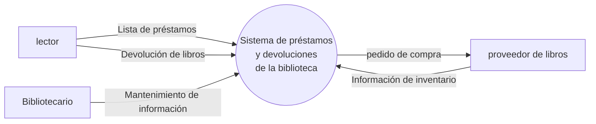
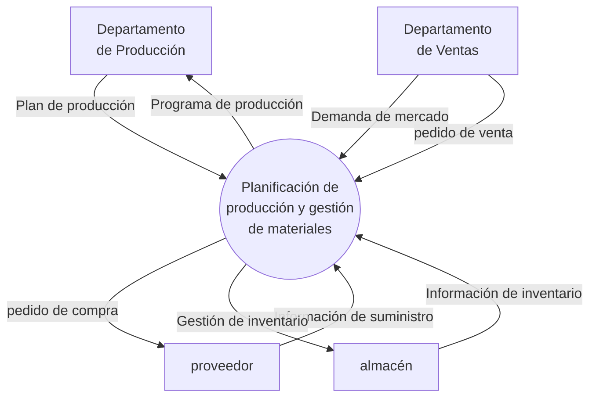
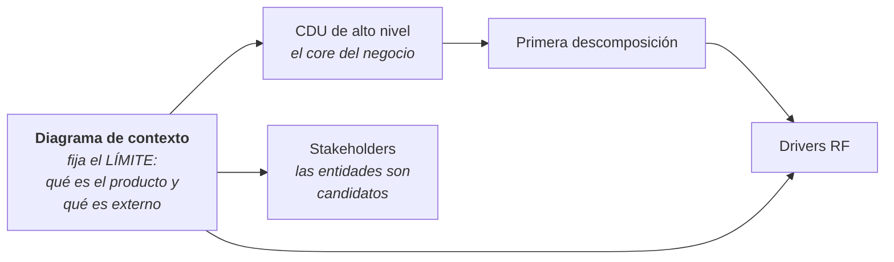

# Diagrama de contexto

La notación exacta que pide la clase, y dos ejemplos resueltos por ella.

> [!important] Esta nota es NÚCLEO — y resuelve una duda que estaba abierta
> Sale de las **diapositivas de clase**. El [[Plan - Caso 1 FarmaHosp|plan del Caso 1]] tenía como
> duda si *"Diagrama de Contexto"* significaba el contexto **del sistema** o **del negocio**.
> **Ya está resuelto: es del sistema (el "producto"), y con esta notación.**

---

## 1. La notación: tres símbolos y nada más

![[adjuntos/capturas-clase/contexto-notacion.png]]

| Símbolo | Qué representa |
|---|---|
| **Elipse / óvalo** | **El Producto** — el sistema que se está construyendo |
| **Rectángulo** | **Entidades o agentes** — lo externo con lo que el producto interactúa |
| **Flecha** | ***Streamlines*** — los flujos de información entre el producto y cada entidad |

> [!important] Las tres reglas que se leen de la notación
> 1. **Hay UN solo producto**, y va en el centro. El diagrama tiene un único óvalo.
> 2. **Todo lo demás es externo.** Si algo está adentro del producto, no se dibuja: el contexto
>    muestra el **límite**, no las partes.
> 3. **Toda flecha lleva nombre.** Una flecha sin etiqueta no dice nada; el nombre del *streamline*
>    es lo que hace útil el diagrama.

## 2. Ejemplo resuelto en clase — la biblioteca

![[adjuntos/capturas-clase/contexto-ejemplo-biblioteca.png]]

Lo que hay que copiar de ese ejemplo:

| Detalle | Cómo lo hace ella |
|---|---|
| El nombre del producto | **"Sistema de préstamos y devoluciones de la biblioteca"** — nombra un **sistema**, no un negocio ni un proceso |
| Las entidades | *lector*, *proveedor de libros*, *Bibliotecario* — mezcla **personas** y **organizaciones** |
| Los flujos bidireccionales | **dos flechas separadas**, cada una con su propio nombre — no una flecha de doble punta |
| Nombres de flujo | sustantivos: *Lista de préstamos*, *pedido de compra*, *Información de inventario* — **no verbos** |
| Herramienta | **ProcessOn** (aparece la marca de agua) |

> [!tip] El *Bibliotecario* aparece como entidad externa
> Y eso es importante: el bibliotecario **trabaja en la biblioteca**, pero respecto del **sistema** es
> un agente externo — porque el producto es el *software*, no la biblioteca.
>
> Es exactamente la distinción que hay que resolver en FarmaHosp con el médico, el farmacéutico y el
> enfermero: frente al **sistema** son agentes externos; frente al **negocio** son trabajadores. El
> diagrama de contexto es del **sistema**, así que ahí van como entidades. Ver
> [[Actor del negocio]] y [[Realizaciones de casos de uso del negocio]].

## 3. Segundo ejemplo — gestión de materiales

![[adjuntos/capturas-clase/contexto-ejemplo-materiales.png]]

Confirma el patrón: **un óvalo al centro, rectángulos alrededor, todas las flechas nombradas**. Y acá
las entidades son **departamentos internos de la empresa** — otra vez: externos *al sistema*, no a la
organización.

## 4. Por qué este diagrama va primero

No es un trámite. Es la **precondición** para todo lo que sigue:

Dos razones concretas:

1. **Define el límite.** Sin decidir qué es el producto y qué es externo, no se puede decidir si el
   médico es actor o trabajador, ni qué casos de uso pertenecen al sistema.
2. **Las entidades son candidatos a stakeholder.** Cada rectángulo del contexto es alguien que
   interactúa con el sistema, y por lo tanto tiene intereses. Es un barrido gratis para el criterio 2
   (→ [[Guía - Identificación de stakeholders]]).

Y coincide con lo que exige el método de diseño: *establecer el alcance del sistema — qué queda
dentro y fuera, con qué entidades externas interactúa* (→ [[El ciclo del architecting]]).

## 5. Checklist antes de entregarlo

- [ ] ¿Hay **un solo óvalo** y nombra un **sistema**? (*"Sistema de gestión de MAC de FarmaHosp"*, no *"Hospital"*)
- [ ] ¿Todas las entidades están en **rectángulos**?
- [ ] ¿**Todas** las flechas tienen nombre?
- [ ] ¿Los nombres de flujo son **sustantivos**, no verbos? (*"Lista de préstamos"*, no *"Prestar libro"*)
- [ ] ¿Los flujos bidireccionales están como **dos flechas**, cada una con su nombre?
- [ ] ¿No hay ninguna entidad que en realidad sea **parte del producto**?
- [ ] ¿Están los **sistemas externos** como entidades? (en FarmaHosp: legacy de admisiones, sistema nacional de farmacovigilancia, LDAP)

> [!warning] Los tres errores que arruinan este diagrama
> 1. **Poner el negocio en el óvalo** en vez del sistema. El óvalo dice "El Producto".
> 2. **Descomponer el producto.** Si dibujás módulos adentro del óvalo, ya no es un diagrama de
>    contexto: es otra cosa.
> 3. **Flechas sin nombre.** Es el error más común y el más fácil de evitar.

---

## Notas relacionadas

- [[Guía - Caso de negocio]] — el contexto es el diagrama 1 de los tres
- [[Drivers arquitectónicos]] — el contexto es la precondición para identificarlos
- [[Actor del negocio]] — la diferencia entre agente del sistema y actor del negocio
- [[Guía - Identificación de stakeholders]] — cada entidad es candidato a stakeholder
- [[Casos de uso vs DFD]] — por qué esto no es un DFD, aunque se parezca
- [[El ciclo del architecting]] — "establecer el alcance" es el paso previo a todo
- [[Excalidraw]] y [[StarUML]] — con qué dibujarlo
- [[Plan - Caso 1 FarmaHosp]] — vale 5 puntos del criterio 1

## Preguntas de repaso

1. ¿Qué representa cada uno de los tres símbolos de la notación?
2. ¿Qué es un *streamline*?
3. ¿Qué va en el óvalo: el sistema, el negocio o el proceso?
4. ¿Cuántos óvalos tiene un diagrama de contexto y por qué?
5. En el ejemplo de la biblioteca, ¿por qué el *Bibliotecario* es una entidad externa si trabaja en la biblioteca?
6. ¿Cómo se dibuja un flujo bidireccional?
7. ¿Los nombres de los flujos son verbos o sustantivos? Dá dos ejemplos de la clase.
8. Dá dos razones por las que este diagrama va antes que los demás.
9. Nombrá los tres errores que arruinan el diagrama.
