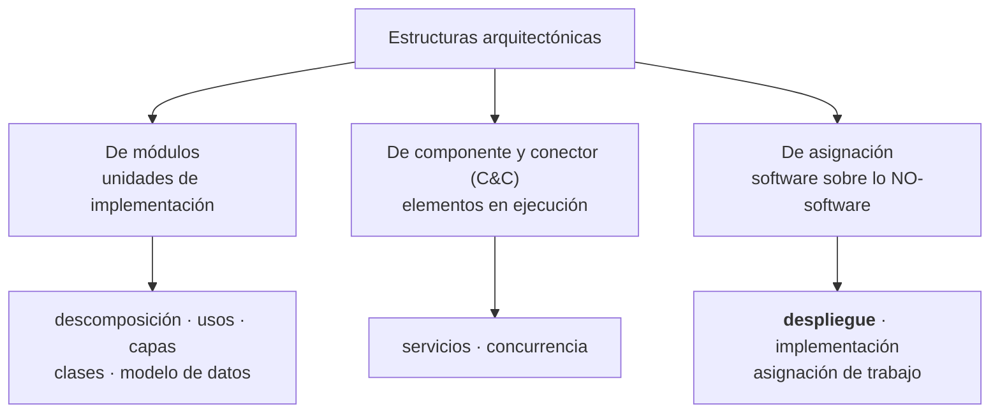
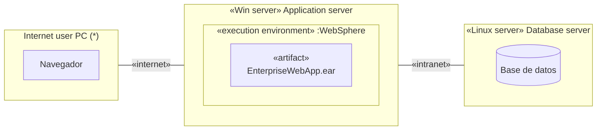

# Diagrama de despliegue

> [!important] Qué es de clase y qué es complemento
> **El núcleo es la presentación.** Lo que las diapositivas dicen sobre despliegue está en la
> sección 1 y es lo que se evalúa.
>
> El problema: el programa oficial le dedica un punto entero —**1.7 "¿Cómo se modela? Diagramas
> de Despliegue"**, y entra en el primer parcial— pero en las tres presentaciones que tengo el
> tema aparece **solo** de refilón, dentro de las diapositivas del modelo 4+1. Falta la
> presentación de ese punto, o se dio en pizarra.
>
> Así que las secciones 2 en adelante son **complemento** para poder entender y dibujar el
> diagrama, sacado de la **bibliografía oficial del curso** (*Software Architecture in Practice*,
> 4ª ed., de Bass, Clements y Kazman) y de Reynoso. Está marcado en cada sección de dónde sale.
> Si la clase dice algo distinto, **manda la clase**.

---

## 1. Lo que dice la clase (núcleo)

En la presentación, el despliegue aparece dentro del [[Modelo 4+1 vistas]], y hay que tener
cuidado porque **el nombre está cruzado**:

| Vista según la presentación | Qué muestra | Diagrama UML |
|---|---|---|
| **Vista de Despliegue** (o Vista de Desarrollo) | Cómo está dividido el software **en componentes** y las dependencias entre ellos | Diagrama de **componentes**, diagrama de paquetes |
| **Vista Física** | Cómo están distribuidos los componentes **entre los distintos equipos** que conforman la solución, incluyendo los servicios | Diagrama de **Deployment** |

Textual de la diapositiva de la Vista Física:

> Representa cómo están distribuidos los componentes entre los distintos equipos que conforman la
> solución incluyendo los servicios. **Los elementos definidos en la vista lógica se mapean a
> componentes de software o de hardware.**

![[adjuntos/arquitectura-de-software/arq-p29.png]]

> [!warning] El cruce de nombres, otra vez
> El **diagrama de deployment** pertenece a la **Vista Física**, no a la que la presentación llama
> "Vista de Despliegue". Si en el examen te piden "el diagrama de la vista física", es el de
> deployment; si te piden "el de la vista de despliegue" tal como la nombra la presentación, es el
> de componentes.
>
> Está explicado en [[Modelo 4+1 vistas]]: en Kruchten esa vista se llama **de desarrollo**
> (*development view*), y por eso se produce la confusión.

La frase clave del núcleo, la que hay que poder repetir: **los elementos de la vista lógica se
mapean a componentes de software o de hardware**. Todo lo que sigue es el desarrollo de esa idea.

---

## 2. Qué es la estructura de despliegue *(complemento — SAIP cap. 1)*

Definición del libro de la bibliografía oficial:

> La **estructura de despliegue** muestra cómo el software se **asigna** a los elementos de
> procesamiento y de comunicación del hardware.

Tres tipos de elemento y dos relaciones:

| | Qué es |
|---|---|
| **Elementos de software** | Normalmente un **proceso** (de la estructura de componente-y-conector) |
| **Entidades de hardware** | Los **procesadores** |
| **Vías de comunicación** | Por dónde se hablan (*communication pathways*) |

| Relación | Cuándo |
|---|---|
| ***allocated-to*** ("asignado a") | Sobre qué unidad física **reside** el elemento de software |
| ***migrates-to*** ("migra a") | Si la asignación es **dinámica**: el software se puede mover en tiempo de ejecución |

Y para qué sirve razonar con ella:

- **Rendimiento** (*performance*)
- **Integridad de datos**
- **Seguridad**
- **Disponibilidad**

Es de interés particular en **sistemas distribuidos**, y es **la estructura clave** para lograr el
atributo de calidad de ***deployability*** (capacidad de despliegue).

Ese último punto conecta con la **unidad 2 del programa** (Calidad del Software): el despliegue no
es un dibujo decorativo, es la estructura donde se ganan o se pierden cuatro atributos de calidad.
Ver [[Matriz de trazabilidad de requisitos]] para cómo se documenta ese enlace requerimiento →
atributo → decisión.

---

## 3. Dónde encaja: las tres categorías de estructuras *(complemento — SAIP cap. 1)*

Esto también cubre el punto **1.8 "Categorías de Estructuras"** del programa, y ubica al despliegue
en su lugar:

| Categoría | Mapea sobre | Relación típica |
|---|---|---|
| **Módulos** | Unidades de implementación (código) | usa, es-un, es-parte-de |
| **Componente y conector** | Elementos en **ejecución** | *attachment* |
| **Asignación** | Cosas que **no son software**: hardware, equipos de trabajo, sistemas de archivos | *allocated-to* / *migrates-to* |

Las tres estructuras de asignación:

1. **Despliegue** — software sobre procesadores y vías de comunicación. ← esta nota
2. **Implementación** — elementos sobre la estructura de archivos de desarrollo, integración y
   configuración. Crítica para la gestión y los *builds*.
3. **Asignación de trabajo** — qué equipo implementa e integra qué módulo. Tiene implicaciones
   arquitectónicas además de gerenciales: el arquitecto sabe qué pericia necesita cada equipo.

Dato que suele preguntarse: los mapeos entre estructuras son **muchos a muchos**. Un solo módulo
puede compilarse en un servicio replicado mil veces en ejecución, y mil módulos pueden enlazarse en
un único ejecutable.

---

## 4. La notación UML *(complemento — figura 1.10 del SAIP)*

Cinco elementos y nada más:

| Elemento | Cómo se dibuja | Qué representa |
|---|---|---|
| **Nodo** | Caja **3D** (cubo) | Un equipo, un servidor, un dispositivo |
| **Estereotipo del nodo** | `«Win server»`, `«Linux server»`, `«Win desktop»` | Qué tipo de nodo es |
| **Nodo anidado** | Una caja 3D **dentro** de otra | Un entorno de ejecución: `«execution environment» :WebSphere` |
| **Artefacto** | Rectángulo con esquina doblada | Lo que se despliega: `«artifact» app-client.jar`, `EnterpriseWebApp.ear` |
| **Vía de comunicación** | **Línea simple** entre nodos, con estereotipo y multiplicidad | `«internet»`, `«intranet»`, con `1` y `*` en los extremos |
| **`«deploy»`** | Flecha **punteada** del artefacto al nodo | Ese artefacto se despliega en ese nodo |

La figura del libro, que es el ejemplo canónico:

![[adjuntos/saip-libro/saip-fig-1-10-estructura-de-despliegue.png]]

Leída en palabras: muchos (`*`) *Internet user PC* se conectan por `«internet»` a un
`«Win server»` **Application server**, que contiene un `«execution environment» :WebSphere`; ese
servidor se conecta por `«intranet»` a un `«Linux server»` **Database server**; el artefacto
`EnterpriseWebApp.ear` se **despliega** en el WebSphere, y `app-client.jar` en el
`«Win desktop»` **Admin user PC**.

### Aproximación en Mermaid

Mermaid **no tiene diagrama de despliegue nativo** — hay que aproximarlo con un `flowchart`, usando
`subgraph` por nodo físico:

Dos advertencias sobre esta aproximación, y por eso conviene el diagrama formal:

- Las cajas de Mermaid **no son nodos 3D**: se pierde la distinción visual entre nodo y artefacto.
- Los `subgraph` **se pierden** al importar a StarUML, así que la estructura de anidamiento —que en
  un diagrama de despliegue es justamente lo importante— no sobrevive el viaje. Ver [[StarUML]].

Y el dato que decide el flujo de trabajo: **el diagrama de despliegue no se puede importar por
Mermaid a StarUML**. Si necesitás el formal, se dibuja a mano en StarUML con su diagrama nativo de
*Deployment*. Está en [[De la teoría al diagrama]].

---

## 5. La tabla de vistas y diagramas *(complemento — Reynoso)*

Reynoso trae la tabla que mapea cada vista UML a su diagrama y a sus conceptos. La fila que nos
interesa:

| Área | Vista | Diagrama | Conceptos principales |
|---|---|---|---|
| Gestión del modelo | **Vista de despliegue** | **Diagrama de despliegue** | **Nodo, componente, dependencia, localización** |
| Gestión del modelo | Vista de implementación | Diagrama de componentes | Componente, interfaz, dependencia, realización |

Los cuatro conceptos de la fila de despliegue son la lista mínima que hay que poder nombrar:
**nodo, componente, dependencia y localización**.

Reynoso también aclara de dónde viene el lío de nombres que marcamos arriba. En el esquema de cinco
vistas de **Booch, Rumbaugh y Jacobson** (la introducción a UML 1.3), la **vista de despliegue**
comprende *"los nodos que forman la topología de hardware sobre la que se ejecuta el sistema"*. Y
en el **4+1 de Kruchten**, la **vista física** es *"un mapeado del software sobre el hardware"*.

O sea: **son lo mismo con dos nombres**, y la presentación de clase usa el nombre de Kruchten para
esa idea ("Vista Física") pero reserva "Vista de Despliegue" para la de desarrollo. De ahí la
confusión.

| Marco | El nombre que usa para "software sobre hardware" |
|---|---|
| Kruchten 4+1 | Vista **física** |
| Booch/Rumbaugh/Jacobson (UML) | Vista de **despliegue** |
| SAIP (Bass/Clements/Kazman) | Estructura de **despliegue** (de asignación) |
| **La presentación de clase** | Vista **Física** |

---

## 6. Cómo se dibuja, en orden

1. **Listar los nodos físicos**: qué equipos, servidores o dispositivos hay. Uno por caja 3D.
2. **Ponerles estereotipo**: `«Win server»`, `«Linux server»`, `«device»`, `«execution environment»`.
3. **Anidar los entornos de ejecución** dentro de su nodo (el servidor de aplicaciones dentro del
   servidor físico).
4. **Conectar con vías de comunicación** y ponerles el protocolo o la red como estereotipo, más la
   multiplicidad si hay muchos de un lado.
5. **Agregar los artefactos** que se despliegan, y unirlos a su nodo con `«deploy»` punteado.
6. **Verificar el mapeo**: cada elemento de la vista lógica tiene que aterrizar en algún nodo. Es
   la frase del núcleo — los elementos de la vista lógica se mapean a software o hardware.

### Ejemplo aplicado

El ecosistema del proyecto MCP tiene un diagrama de despliegue en
[[De la teoría al diagrama]]: el MacBook M5 como nodo, con Claude Desktop, el proceso de
`tutor-ayds` y StarUML como elementos que residen en él, y la bóveda como el sistema de archivos.
Es un caso chico pero completo: hay nodos, hay relación *allocated-to* y hay una vía de
comunicación (stdio) entre procesos del mismo nodo.

---

## 7. Errores típicos

| Error | Por qué está mal |
|---|---|
| Poner **clases** en el diagrama de despliegue | El diagrama es de nodos y artefactos. Las clases van en la vista lógica |
| Confundir **artefacto** con **componente** | El artefacto es el archivo físico que se despliega (`.jar`, `.ear`, `.dll`); el componente es un elemento en ejecución |
| Dibujar la **vía de comunicación como flecha** | Es una línea simple: la comunicación es bidireccional. La flecha punteada es solo para `«deploy»` |
| Olvidar la **multiplicidad** | "Muchos clientes contra un servidor" es información arquitectónica que cambia el análisis de rendimiento |
| Usar el diagrama de **componentes** creyendo que es el de despliegue | Componentes = cómo se divide el software; despliegue = dónde corre |
| Dibujarlo **sin requerimientos detrás** | El despliegue existe para razonar sobre rendimiento, integridad, seguridad y disponibilidad. Sin esos requerimientos, es un dibujo |

---

## Notas relacionadas

- [[Modelo 4+1 vistas]] — la vista física y el cruce de nombres
- [[Estructuras y vistas arquitectónicas]] — estructura vs vista, y el punto 1.8 del programa
- [[Arquitectura de software]] — el vocabulario base
- [[Matriz de trazabilidad de requisitos]] — cómo se enlaza un atributo de calidad con esta estructura
- [[De la teoría al diagrama]] — el patrón Mermaid y sus límites
- [[StarUML]] — por qué este diagrama se dibuja a mano y no se importa
- [[Programa oficial del curso]] — el punto 1.7 y qué falta

## Preguntas de repaso

1. Según la presentación, ¿qué vista usa el diagrama de deployment y qué diagrama usa la que la presentación llama "Vista de Despliegue"?
2. Completá la frase del núcleo: los elementos definidos en la vista lógica se ______ a ______.
3. ¿Cuáles son los tres tipos de elemento de una estructura de despliegue y sus dos relaciones?
4. ¿Sobre qué cuatro atributos de calidad permite razonar la estructura de despliegue?
5. ¿Cuál es la diferencia entre un **nodo** y un **artefacto**? ¿Cómo se dibuja cada uno?
6. ¿Cuándo se usa *migrates-to* en lugar de *allocated-to*?
7. ¿Por qué el diagrama de despliegue no se puede llevar a StarUML con Mermaid?
8. Nombrá las tres categorías de estructuras arquitectónicas y decí a cuál pertenece el despliegue.
