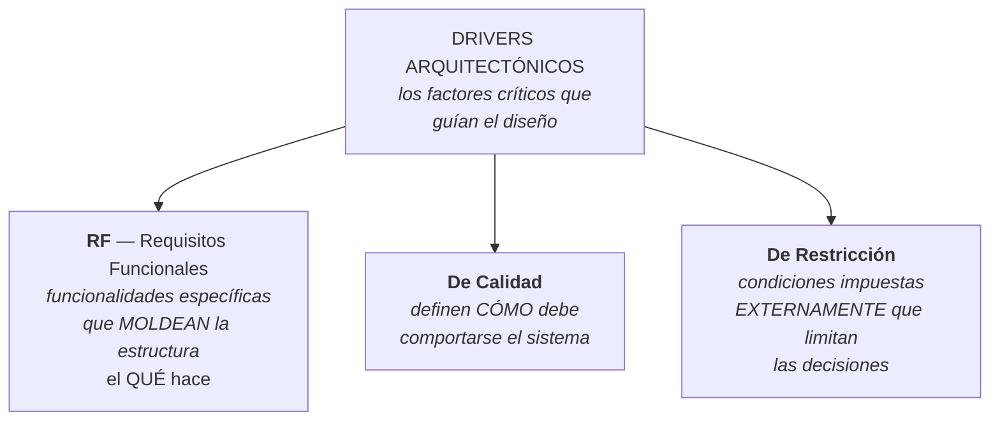
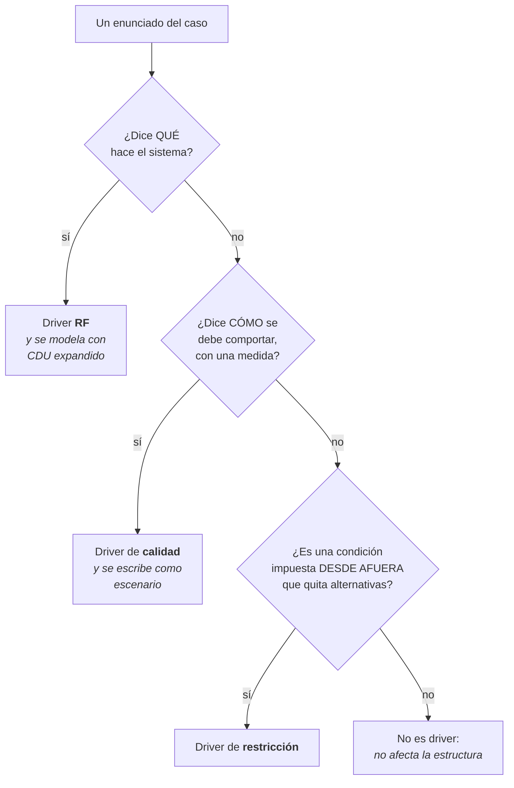

# Drivers arquitectónicos

Los tres tipos de driver, **como los define la clase**. Es el criterio 3 del Caso 1 — 30 puntos.

> [!important] Esta nota es NÚCLEO
> Sale de las **diapositivas de clase**. Reemplaza lo que antes estaba anclado solo al SAIP: ahora
> hay definición propia de la catedrática, con su propia taxonomía y sus propios ejemplos. **Si algo
> del complemento contradice esto, manda esto.**

---

## 1. La definición

> Los **drivers arquitectónicos** son los **factores críticos que guían el diseño** de un sistema de
> software. **Determinan su estructura fundamental** y definen si será un **éxito o un fracaso**.
> Actúan como el **puente entre los requerimientos del negocio y la implementación técnica**.

![[adjuntos/capturas-clase/drivers-definicion.png]]

Tres cosas que hay que sacar de esa definición:

| Frase | Qué implica |
|---|---|
| *"factores críticos"* | **no todo requisito es driver** — solo los críticos |
| *"determinan su estructura fundamental"* | el filtro es **estructural**: si cambia, cambia la estructura |
| *"puente entre el negocio y la implementación técnica"* | por eso el tema vive en **1.6 Arquitectura y Requerimientos** |

## 2. Los tres tipos

> [!important] La respuesta a "¿un driver es un RF?"
> **Un RF es *uno de los tres* tipos de driver.** La clase lo titula *"Drivers Arquitectónicos: **RF**
> – Requisitos Funcionales"* — con el calificativo puesto, igual que la rúbrica. Si "driver"
> significara "RF", las otras dos diapositivas no existirían.
>
> Ver el detalle en [[Guía - Drivers de calidad y restricción]].

## 3. Drivers RF — Requisitos Funcionales

> **Son funcionalidades específicas que moldean la estructura del sistema.**

La palabra que importa es **"moldean"**: no es cualquier funcionalidad, es la que le da forma a la
estructura.

Los ejemplos de la clase, con su formato de redacción:

| ID | Nombre | Enunciado |
|---|---|---|
| **RF1** | Procesamiento de pagos | El sistema debe integrar pasarelas de pago (PayPal, Stripe) y manejar la confirmación/fallo de transacciones |
| **RF2** | Autenticación multifactor | Soporte para login con contraseña + código SMS o biometría |
| **RF3** | Generación de reportes dinámicos | El usuario debe poder generar informes personalizados con filtros y gráficos |
| **RF4** | Sincronización en tiempo real | Los datos de inventario se actualizan automáticamente en todos los clientes conectados |
| **RF5** | Exportación de datos | Capacidad de exportar a CSV, Excel y PDF con formatos específicos |
| **RF6** | Notificaciones push | Enviar alertas al móvil del usuario ante ciertos eventos (ej. vencimiento de licencia) |

![[adjuntos/capturas-clase/drivers-rf.png]]

> [!tip] El formato de redacción que usa ella
> **`RFn - Nombre corto: enunciado`**. El nombre corto es un sustantivo o frase nominal
> (*"Procesamiento de pagos"*), y el enunciado dice **qué debe hacer el sistema**.
>
> Fijate que **cada uno de esos seis tiene consecuencia estructural**: pasarelas externas, un
> proveedor de identidad, un motor de reportes, un canal de push, un formateador de exportación. Eso
> es lo que los vuelve *drivers* y no requisitos cualquiera.

## 4. Drivers de calidad

> **Definen *cómo* debe comportarse el sistema.**

Y acá está el dato más importante de todo: **la taxonomía que usa la clase para los drivers de
calidad no es la de ISO 9126** de la unidad 2.

| Atributo | Ejemplos de la clase |
|---|---|
| **Rendimiento** (*performance*) | Las consultas de búsqueda deben responder en menos de **300 ms (percentil 95)** · El sistema debe soportar **10,000 peticiones simultáneas** |
| **Escalabilidad** | Debe crecer **horizontalmente** (añadir nodos) al aumentar la carga **sin rediseño** |
| **Disponibilidad** | Garantizar **99.99 % de uptime anual** (tolerancia a fallos en servidores y bases de datos) |
| **Seguridad** | Los datos sensibles deben estar **cifrados en reposo (AES-256) y en tránsito (TLS 1.3)** · Protección contra **inyección SQL y XSS** |
| **Mantenibilidad** | Cobertura de **pruebas unitarias > 80 %** · Añadir un nuevo tipo de reporte en **menos de 2 días-persona** |
| **Usabilidad** | Interfaz accesible según **WCAG 2.1 nivel AA** · Completar la acción principal en **menos de 3 clics** |
| **Fiabilidad** | No perder transacciones ni datos ante caída de red (**persistencia local + sincronización**) |

![[adjuntos/capturas-clase/drivers-de-calidad.png]]

> [!warning] Son SIETE, no los seis del programa
> | | Programa (unidad 2) | Drivers de calidad (esta clase) |
> |---|---|---|
> | Modelo | ISO 9126 | lista propia, estilo SAIP |
> | Funcionalidad | ✅ | ❌ — la funcionalidad se fue a los **drivers RF** |
> | Fiabilidad | ✅ | ✅ |
> | Usabilidad | ✅ | ✅ |
> | Eficiencia | ✅ | → se llama **Rendimiento** |
> | Mantenibilidad | ✅ | ✅ |
> | Portabilidad | ✅ | ❌ |
> | **Escalabilidad** | ❌ | ✅ |
> | **Disponibilidad** | subcaracterística de fiabilidad | ✅ **de primer nivel** |
> | **Seguridad** | subcaracterística de funcionalidad | ✅ **de primer nivel** |
>
> La diferencia tiene lógica: **la funcionalidad sale de la lista** porque en el modelo de drivers ya
> tiene su propia categoría (los RF). Y **seguridad y disponibilidad suben a primer nivel**, igual que
> en ISO 25010 y en el SAIP.
>
> **Para el Caso 1 usá estas siete**, no las seis de ISO 9126: son las de la diapositiva que define
> los *drivers de calidad*, que es literalmente lo que pide el criterio 3. Ver [[Atributos de calidad]]
> para la comparación completa de las taxonomías.

> [!important] Todos los ejemplos llevan número
> Ninguno dice "debe ser rápido". Todos dicen **300 ms**, **10,000 peticiones**, **99.99 %**,
> **80 %**, **2 días-persona**, **3 clics**, **AES-256**, **TLS 1.3**, **WCAG 2.1 AA**.
>
> Ese es el estándar de la entrega: **un driver de calidad sin número no es un driver, es un deseo.**

## 5. Drivers de restricción

> **Condiciones impuestas externamente que limitan las decisiones arquitectónicas.**

Dos palabras clave: **externamente** (no las elegís vos) y **limitan** (te quitan alternativas).

Y la clase da **seis categorías**, que sirven de checklist para no dejar ninguna afuera:

| Categoría | Ejemplos de la clase |
|---|---|
| **Tecnológicas** | Obligatorio usar Java 17 o superior en el backend · La base de datos debe ser Oracle (licencia existente) · El frontend debe desarrollarse con React (decisión corporativa) |
| **Regulatorias / legales** | Cumplir GDPR para usuarios europeos (derecho al olvido, portabilidad) · Almacenar logs de auditoría por 7 años por ley bancaria · No transmitir datos de salud fuera de la región |
| **De negocio / presupuesto** | Presupuesto máximo de 50,000 USD en infraestructura cloud anual · Tiempo de desarrollo máximo 6 meses para el MVP |
| **Organizacionales** | El equipo de operaciones solo conoce Kubernetes · Toda la comunicación entre servicios debe usar REST/HTTP (no se permite gRPC por falta de expertise) |
| **Ambientales / físicas** | Dispositivo IoT con batería limitada (consumo máximo 100 mW en modo activo) · Tamaño de pantalla mínimo 7 pulgadas |
| **De integración** | El sistema debe autenticarse obligatoriamente contra el LDAP corporativo · Debe enviar facturación al ERP SAP existente mediante archivos EDI plano |

![[adjuntos/capturas-clase/drivers-de-restriccion.png]]

> [!tip] Esta tabla es una checklist, usala como tal
> En el Caso 1, recorré las seis categorías contra el enunciado de FarmaHosp y vas a encontrar
> restricciones en **todas**:
>
> | Categoría | Qué hay en FarmaHosp |
> |---|---|
> | Tecnológicas | ACID obligatorio para inventario · no monolito · open-source preferido |
> | Regulatorias / legales | Norma de Farmacovigilancia del MSPAS (24 h, XML con DTD) · Ley de Acceso a la Información · INCAP para controlados |
> | De negocio / presupuesto | mantenimiento por el equipo interno tras 12 meses · presupuesto de infraestructura fijo |
> | Organizacionales | 3 devs internos Java/Oracle vs. 5 externos Python/Mongo · conflicto de stack |
> | Ambientales / físicas | Toughpads Android 9 con 3 GB RAM · Wi-Fi inestable en el sótano · escáneres con 5 % de fallo |
> | De integración | legacy COBOL/SOAP de admisiones (3–5 s, solo 7–17 h) · HL7 FHIR · sistema nacional batch 8–16 h |
>
> Si tu entrega tiene restricciones en las seis categorías y lo dice explícitamente, la completitud
> queda demostrada sin que el evaluador tenga que buscarla.

## 6. Cómo se diferencian, en la práctica

La prueba rápida para clasificar un enunciado del caso:

| Señal en el texto | Tipo probable |
|---|---|
| "el sistema debe **permitir / generar / registrar / enviar**" | **RF** |
| "en menos de N ms", "N % de uptime", "N peticiones", "menos de N clics" | **calidad** |
| "**no se puede**", "obligatorio", "debe ser Oracle", "por ley", "el equipo solo conoce" | **restricción** |

> [!warning] El caso frontera que hay que saber resolver
> *"El sistema debe permitir dispensaciones offline por al menos 4 horas."*
>
> Tiene forma de RF (*"debe permitir"*) **y** tiene medida (*4 horas*). ¿Cuál es?
>
> Es **driver de calidad** — de **disponibilidad**. La prueba: la funcionalidad *"dispensar"* ya existe
> como RF; lo que este enunciado agrega es **cómo debe comportarse cuando falla la red**. La regla:
> si el enunciado **califica** una funcionalidad que ya existe, es de calidad; si **agrega**
> funcionalidad nueva, es RF.

---

## Notas relacionadas

- [[Guía - Drivers de calidad y restricción]] — el "cómo se hace" del criterio 3
- [[Atributos de calidad]] — las tres taxonomías en juego y cuál usar
- [[Matriz de trazabilidad de requisitos]] — los drivers son las columnas de las matrices
- [[Guía - Matrices de trazabilidad]] — la matriz *Drivers RF vs. Drivers RF*
- [[Diagrama de contexto]] — la precondición para identificar drivers
- [[Caso de uso del negocio]] — los drivers RF se modelan como CDU expandidos
- [[Tácticas y patrones arquitectónicos]] — qué se hace con un driver una vez identificado
- [[Plan - Caso 1 FarmaHosp]] — el criterio 3, 30 puntos

## Preguntas de repaso

1. Dá la definición de driver arquitectónico de la clase, con las tres partes.
2. ¿Por qué "no todo requisito es driver"? ¿Cuál es el filtro?
3. ¿Cuáles son los tres tipos de driver? ¿Un RF es un driver?
4. ¿Qué significa que los drivers RF "moldean la estructura"?
5. Nombrá los **siete** atributos de la diapositiva de drivers de calidad.
6. ¿Por qué la funcionalidad no aparece en la lista de drivers de calidad?
7. ¿Qué dos atributos suben a primer nivel respecto de ISO 9126, y por qué tiene sentido?
8. ¿Qué tienen en común **todos** los ejemplos de drivers de calidad de la clase?
9. Definí driver de restricción. ¿Qué significan "externamente" y "limitan"?
10. Nombrá las **seis** categorías de restricción y dá un ejemplo de cada una.
11. *"El sistema debe permitir dispensaciones offline por 4 horas"*: ¿RF o calidad? Justificá.
