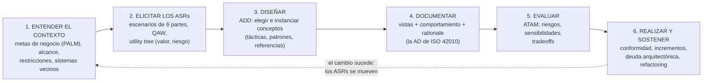

# El ciclo del architecting

Los seis pasos del trabajo arquitectónico, y por qué es un **ciclo** y no una fase.

> [!warning] Nota de COMPLEMENTO
> La **unidad 3** se da del **8 de septiembre al 12 de octubre** (segundo parcial: 19 de septiembre) y
> todavía no hay presentación. Esto viene del **SAIP** vía la guía de estudio. Cuando llegue la
> presentación hay que revisar la nota contra ella: **si la clase dice algo distinto, manda la clase.**
>
> Lo que **sí** es de clase está en [[Arquitectura en el ciclo de vida del software]] — la diapositiva
> *"¿Dónde debe colocarse la arquitectura en el ciclo de vida?"*. Esta nota la extiende.

---

## 1. Los seis pasos

| # | Paso | Qué produce | Método |
|---|---|---|---|
| 1 | **Entender el contexto** | alcance, restricciones, sistemas vecinos, metas de negocio | **PALM** |
| 2 | **Elicitar los ASRs** | escenarios de calidad priorizados | **QAW**, *utility tree* |
| 3 | **Diseñar** | estructuras: elegir e instanciar tácticas, patrones y arquitecturas de referencia | **ADD** |
| 4 | **Documentar** | vistas + comportamiento + *rationale* | la **AD** de ISO 42010 |
| 5 | **Evaluar** | riesgos, no-riesgos, sensibilidades, tradeoffs | **ATAM**, evaluaciones livianas |
| 6 | **Realizar y sostener** | conformidad, incrementos, control de la deuda | refactoring |

> No es una cascada: cada vuelta es una **ronda** (en el vocabulario de ADD) y las evaluaciones
> alimentan nuevas decisiones. **"El cambio sucede"**: los ASRs se mueven y el ciclo vuelve a empezar.

Eso es exactamente lo que la clase dice con otras palabras: *"es un proceso iterativo a través de
requisitos y calidad"*.

## 2. Cómo se corresponde con lo que ya tenés

Cada paso ya tiene su nota o su guía. El ciclo es el mapa que los ordena:

| Paso | Dónde está en la bóveda |
|---|---|
| 1. Contexto | [[Guía - Caso de negocio]] (diagrama de contexto), [[Stakeholders]] (PALM) |
| 2. ASRs | [[Atributos de calidad]], [[Guía - Drivers de calidad y restricción]] |
| 3. Diseñar | [[Tácticas y patrones arquitectónicos]], [[Estilos arquitectónicos]], [[Proceso de diseño arquitectónico]] |
| 4. Documentar | [[Estructuras y vistas arquitectónicas]], [[Modelo 4+1 vistas]], [[Diagrama de despliegue]] |
| 5. Evaluar | [[Evaluación de la arquitectura]] |
| 6. Sostener | la deuda, en [[Tácticas y patrones arquitectónicos]] §7 |

> [!important] El paso 1 es la precondición de todo
> ADD lo exige antes de empezar: *"establecer el alcance del sistema — qué queda dentro/fuera, con qué
> entidades externas interactúa: **diagrama de contexto**"*.
>
> Y eso explica el orden de la rúbrica del Caso 1: el criterio 1 (caso de negocio, con el contexto) y
> el criterio 2 (stakeholders) **son el paso 1**; el criterio 3 (drivers) es el **paso 2**. La rúbrica
> está siguiendo el ciclo.

## 3. Los cinco rasgos del architecting

El SAIP caracteriza la actividad con cinco rasgos, y cada uno tiene una consecuencia práctica:

**1. Es toma de decisiones bajo incertidumbre.**

> *"A menudo las decisiones arquitectónicas deben tomarse con conocimiento imperfecto."*

De ahí los prototipos descartables, la técnica **VoI** (*value of information*) para decidir cuánto
conviene gastar en experimentar, y el principio de que **el riesgo es la guía** para saber cuándo
parar de diseñar.

**2. Es cualitativa, a diferencia de la ingeniería.** El contraste que subraya Reynoso comparando
IEEE 1471 con IEEE 610.12:

> *"La noción clave de la arquitectura es la **organización** — un concepto cualitativo o estructural
> —, mientras que la ingeniería tiene fundamentalmente que ver con una **sistematicidad susceptible
> de cuantificarse**."*

**3. Es continua e incremental.** Se libera en incrementos, al ritmo de test y release del proyecto.
No termina en el primer release: **~80 % del costo del sistema ocurre después**.

**4. Es repetible y enseñable — o no es ingeniería.**

> *"Repetibilidad y enseñabilidad son las marcas de una disciplina de ingeniería."*

Un método sistemático permite que la actividad *"pueda ser aprendida y ejecutada competentemente por
simples mortales"*, y no solo por gurús con décadas de experiencia. Es la razón de existir de ADD.

**5. Produce artefactos, no solo dibujos.** Cada vuelta del ciclo deja: escenarios priorizados,
decisiones **con su rationale**, vistas, riesgos identificados con sus temas, y un *backlog*.

> *"Registrá las decisiones en el momento en que las tomás: si lo dejás para después, no vas a
> recordar por qué hiciste las cosas."*

## 4. Documentar: qué es la AD *(paso 4)*

El estándar **ISO/IEC/IEEE 42010** (heredero de IEEE 1471) distingue dos cosas que se confunden:

> La **arquitectura** son los conceptos o propiedades fundamentales de una entidad. La **descripción
> arquitectónica (AD)** es el producto de trabajo que se usa para expresarla: *"una colección de
> artefactos que documentan una arquitectura"*.

El SAIP lo dice con otras palabras: **todo sistema tiene una arquitectura** —porque todo sistema tiene
elementos y relaciones— pero eso no implica que **alguien la conozca**. Quizá los diseñadores ya no
están, la documentación se perdió o nunca existió, y solo queda el binario ejecutándose.

> *"Esto revela la diferencia entre la arquitectura de un sistema y la representación de esa
> arquitectura."*

De ahí sale la **"arqueología arquitectónica"** de Clements: recuperar la arquitectura de un sistema
legacy sin documentación confiable.

Y la regla mnemotécnica de IEEE 1471, que es la mejor del tema:

> **"Un viewpoint es a una vista lo que una clase es a un objeto."**

El *viewpoint* es la plantilla reutilizable (*"vista de despliegue": qué elementos, qué relaciones, qué
notación, para qué concerns*); la **vista** es su instancia concreta para este sistema. Ver
[[Estructuras y vistas arquitectónicas]].

## 5. Una moraleja del paso 5

La guía trae un caso que vale más que la teoría. En evaluaciones ATAM que relata Clements hubo veces
en que **el equipo llegó y no había arquitectura que evaluar**: solo pilas de diagramas de clases y
descripciones vagas.

Y aun así el ejercicio produjo valor: el conjunto de atributos de calidad quedó **articulado por
primera vez**, se dibujó una arquitectura "de pizarra" durante la sesión, y el proyecto salió con
obligaciones de documentación concretas.

En otro caso, un equipo de diseñadores junior —a los que el arquitecto consideraba incapaces de
responder preguntas— reconstruyó entre todos, en media jornada, una vista C&C, una de procesos y una
del subsistema offline: *"ninguno sabía todo, pero cada uno sabía algo"*.

> **La moraleja:** el architecting no es solo el documento que produce, sino el **entendimiento
> compartido** que construye.

Que es, exactamente, el primer beneficio que enseña la clase: la arquitectura *"permite que se
comuniquen los stakeholders"* (→ [[Beneficios de la arquitectura de software]]).

---

## Notas relacionadas

- [[Arquitectura en el ciclo de vida del software]] — el núcleo de clase que esta nota extiende
- [[Evaluación de la arquitectura]] — el paso 5 en detalle
- [[Tácticas y patrones arquitectónicos]] — el paso 3
- [[Atributos de calidad]] — el paso 2
- [[Stakeholders]] — PALM, del paso 1
- [[Estructuras y vistas arquitectónicas]] — el paso 4, y viewpoint vs vista
- [[Proceso de diseño arquitectónico]] — los cuatro pasos que enseña la clase
- [[Programa oficial del curso]] — la unidad 3 y su cronograma

## Preguntas de repaso

1. Nombrá los seis pasos del ciclo del architecting y el método de cada uno.
2. ¿Por qué es un ciclo y no una cascada? ¿Qué frase del SAIP lo justifica?
3. ¿Por qué el paso 1 es precondición de todo, y cómo se refleja en la rúbrica del Caso 1?
4. ¿Qué porcentaje del costo del sistema ocurre después del primer release?
5. ¿Qué significa que el architecting sea "repetible y enseñable", y qué método lo persigue?
6. ¿Cuál es la diferencia entre la **arquitectura** y la **descripción arquitectónica**?
7. ¿Puede un sistema tener arquitectura y que nadie la conozca? ¿Cómo se recupera?
8. Explicá la analogía "un viewpoint es a una vista lo que una clase es a un objeto".
9. ¿Qué valor produce una evaluación cuando no hay arquitectura que evaluar?
