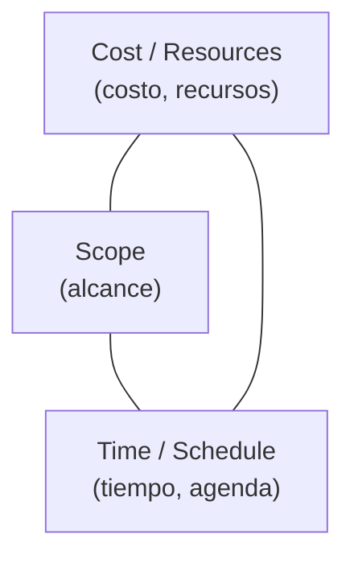

# Equilibrio de restricciones del proyecto

Todo el trabajo del arquitecto es **equilibrar fuerzas que se contradicen**. No se puede tener
todo: subir una dimensión obliga a bajar otra. La presentación lo muestra con tres
representaciones distintas de la misma idea.

## 1. El triángulo del proyecto

Las tres restricciones clásicas en los vértices:

La frase que lo resume, tomada del *project management triangle*:

> "I can make it for you **fast**, **cheap**, or **good**. Pick any two."
> (Te lo puedo hacer rápido, barato o bueno. Elegí dos.)

Ese "elegí dos" es el punto: **son tres y solo se pueden fijar dos**; la tercera queda como
consecuencia.

![[adjuntos/arquitectura-de-software/arq-p19.png]]

## 2. El diagrama de Kiviat — "diagrama de flexibilidad"

Un **diagrama de Kiviat** (radar) con cinco ejes graduados de 0 a 10, donde se marca qué tan
flexible es el proyecto en cada dimensión:

| Eje | Dimensión |
|---|---|
| **Features** | Funcionalidad / características |
| **Quality** | Calidad |
| **Cost** | Costo |
| **Schedule** | Agenda / tiempo |
| **Staff** | Personal |

La utilidad es que hace **visible y negociable** la prioridad: el polígono que se dibuja al
unir los valores muestra de un vistazo en qué somos rígidos y en qué podemos ceder. En el
ejemplo de la diapositiva, *Features* está cerca de 8 y *Staff* casi en 0 — o sea, hay mucha
funcionalidad exigida y ninguna flexibilidad para sumar gente.

Por eso se llama diagrama de **flexibilidad**: no mide cuánto hay de cada cosa, mide **cuánto
se puede mover** cada cosa.

![[adjuntos/arquitectura-de-software-v1/arqv1-p10.png]]

## 3. El cubo de las dimensiones clave

La tercera representación va más allá de tres o cinco ejes: un cubo cuyas aristas y vértices
son las dimensiones clave del proyecto — **functionality, people, value, time, tools, money,
process, quality**. El título de la diapositiva es el mensaje:

> Puede ser difícil equilibrar todas las dimensiones clave...

![[adjuntos/arquitectura-de-software-v1/arqv1-p11.png]]

## Cómo se conecta con el resto

Esta nota es el "por qué" del [[Arquitecto de software]]: si las restricciones no chocaran, no
haría falta alguien que decida. Y es la contracara del primer beneficio de la arquitectura
(→ [[Beneficios de la arquitectura de software]]): los stakeholders piden cosas incompatibles
—bajos costos *y* rendimiento *y* seguridad *y* modificabilidad— y el arquitecto tiene que
proponer una solución acorde a cada escenario en particular.

## Notas relacionadas

- [[Arquitecto de software]]
- [[Beneficios de la arquitectura de software]]
- [[Ciclo de influencias en la arquitectura]]
- [[Proceso de diseño arquitectónico]]

## Preguntas de repaso

1. ¿Cuáles son los tres vértices del triángulo del proyecto y qué significa "pick any two"?
2. ¿Cuáles son los cinco ejes del diagrama de Kiviat de la presentación?
3. ¿Por qué se le llama "diagrama de flexibilidad" y no "diagrama de calidad"?
4. Relacioná este tema con el primer beneficio de la arquitectura de software.
