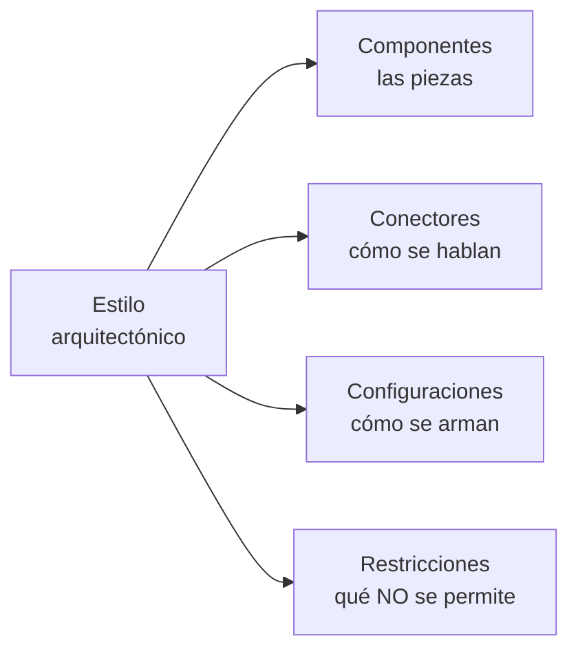
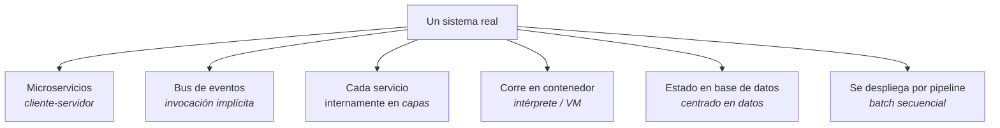
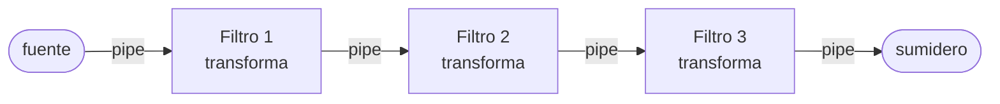
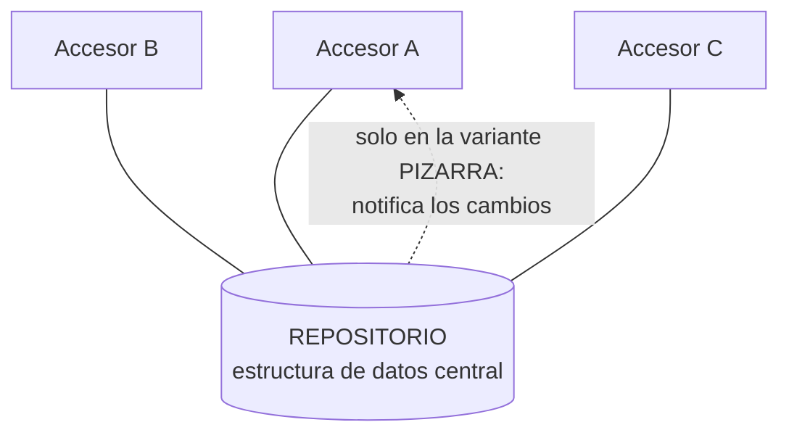
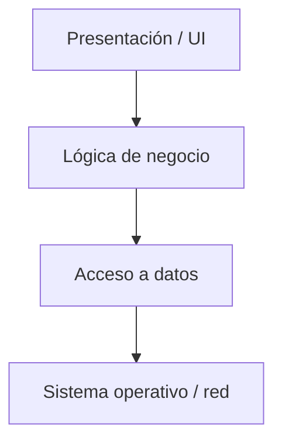
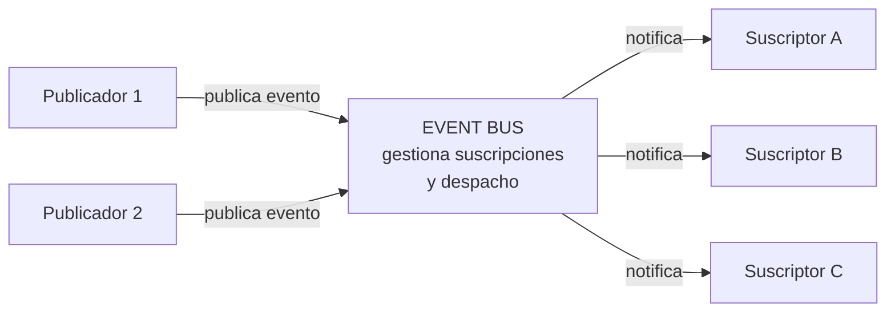
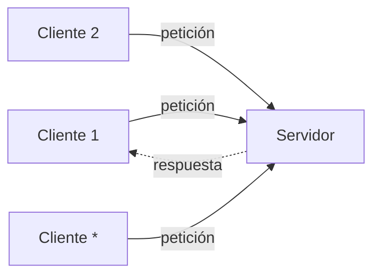

# Estilos arquitectónicos

> [!warning] Esta nota es COMPLEMENTO ENTERO — todavía no hay núcleo de clase
> A diferencia de [[Diagrama de despliegue]], donde la presentación al menos daba una base, acá
> **las tres presentaciones no dicen nada sobre estilos**. Verificado: el tema no aparece.
>
> Todo lo que sigue viene de:
> - **Reynoso**, *Introducción a la Arquitectura de Software* (en `00-Fuentes/lecturas/`) — la
>   definición de estilo y la lista de los seis típicos.
> - **SAIP 4ª ed.** (Bass, Clements, Kazman) — bibliografía oficial del curso; desarrolla capas,
>   microkernel, publish-subscribe y cliente-servidor como patrones.
> - **Guía de estudio** (`Unidad_1/Guia_Arquitectura_Software.pdf`, Parte IX) — el catálogo con
>   una ficha por estilo.
>
> Es el punto **1.9** del programa y se está dando **ahora** (17–24 de agosto). Cuando llegue la
> presentación hay que revisar esta nota contra ella: **si la clase dice algo distinto, manda la
> clase**. Ver [[Programa oficial del curso]].

---

## 1. Qué es un estilo

Reynoso, textual, apoyándose en el texto fundacional de Perry y Wolf:

> Un estilo es un **concepto descriptivo** que define una forma de articulación u organización
> arquitectónica. El conjunto de los estilos **cataloga las formas básicas posibles** de estructuras
> de software, mientras que las formas complejas se articulan mediante **composición** de los
> estilos fundamentales.

Y los cuatro ingredientes con que se describe un estilo:

> Los estilos conjugan **elementos** (o "componentes", como se los llama aquí), **conectores**,
> **configuraciones** y **restricciones**.

El detalle que Reynoso subraya: al poner los **conectores** como elemento de primera clase, el
concepto de estilo se sitúa en un orden de discurso que **el modelado orientado a objetos y UML no
cubren satisfactoriamente**. Esa es la razón de fondo por la que existen los ADLs (lenguajes de
descripción arquitectónica) y por la que un diagrama de clases no alcanza para describir una
arquitectura.

## 2. Estilo ≠ patrón de diseño

La diferencia más preguntable, y es de escala:

| | Cantidad | Nivel |
|---|---|---|
| **Patrones de diseño** | **Centenares** (las 23 fichas de GoF son solo un catálogo) | Estructura interna de un grupo de clases |
| **Estilos arquitectónicos** | **Seis o siete clases** fundamentales y unos **veinte ejemplares** como máximo | Organización del sistema completo |

Reynoso lo remarca: *"es digno de señalarse el empeño por subsumir todas las formas existentes de
aplicaciones en un conjunto de dimensiones tan modestas"*.

Esa modestia es deliberada y es la misma idea del "menos es más" que ya aparece en
[[Beneficios de la arquitectura de software]]: restringir el vocabulario de alternativas es una
ventaja, no una limitación.

## 3. Los estilos se componen — el rasgo más importante del catálogo

Reynoso lo dice dos veces, y es lo que más se equivoca en un examen:

> Las arquitecturas complejas o compuestas resultan del **agregado o la composición** de estilos
> más básicos.

**Ningún sistema real "es de un estilo".** Los sistemas reales son mezclas. Ejemplo del material:

Cinco o seis estilos en un solo sistema, y eso es **lo normal, no la excepción**.

---

## 4. El catálogo: los seis del programa

El programa lista seis estilos. Así se corresponden con el catálogo del material:

| Estilo del programa | En el catálogo | ¿Material disponible? |
|---|---|---|
| **Cliente-Servidor** | Cliente-servidor (+ peer-to-peer) | ✅ SAIP como patrón |
| **Centrada en Datos** | Repositorio y pizarra | ✅ ficha completa |
| **En o por capas** | Jerárquicos: capas y microkernel | ✅ SAIP, el más desarrollado |
| **Centrada en el flujo de datos** | Tubería y filtro, batch secuencial | ✅ ficha completa |
| **Basada en eventos** | Invocación implícita: publish-subscribe y broker | ✅ SAIP como patrón |
| **Llamada y retorno** | — | ⚠️ **no está con ese nombre** (ver abajo) |

> [!note] Sobre "llamada y retorno"
> Ese nombre **no aparece** ni en Reynoso ni en el SAIP ni en la guía. Es el nombre de familia de
> la taxonomía clásica (estilo Pressman), que agrupa los estilos donde el control se transfiere por
> **invocación y vuelve**: programa principal y subrutina, orientado a objetos, y llamada a
> procedimiento remoto (RPC).
>
> Bajo esa taxonomía, **capas y cliente-servidor suelen clasificarse dentro de "llamada y
> retorno"**, porque en los dos el que llama espera la respuesta. Se contrapone a la **invocación
> implícita** (basada en eventos), donde el emisor no espera a nadie.
>
> Es exactamente el tipo de detalle donde la nomenclatura de la catedrática puede diferir.
> **Preguntalo.**

Además, el material trae dos estilos que el programa no lista pero que Reynoso sí incluye entre los
seis típicos: **peer-to-peer** e **intérprete / máquina virtual**.

---

## 5. Las fichas

### Centrada en el flujo de datos: tubería y filtro

| | |
|---|---|
| **Componentes** | **Filtros**: transforman un flujo de entrada en uno de salida, **de forma incremental** (empiezan a producir antes de terminar de consumir). Casos especiales: *fuente* (solo produce) y *sumidero* (solo consume) |
| **Conectores** | **Tuberías** (*pipes*): flujos unidireccionales que **preservan el orden** y no transforman nada |
| **Restricciones** | Los filtros **no comparten estado ni conocen la identidad de sus vecinos**; todo pasa por las tuberías. La corrección no debe depender del orden en que los filtros procesan |
| **Cuándo** | El problema es una serie de transformaciones sucesivas sobre datos que fluyen, sin interacción del usuario en el medio |
| **Favorece** | Modificabilidad y reutilización (se reordenan y recombinan), performance por **paralelismo**, testabilidad (cada filtro aislado), comprensibilidad |
| **Sacrifica** | **Interactividad**, estado compartido, latencia por etapa (cada frontera serializa), manejo de errores pobre |
| **Ejemplos** | Los shells de UNIX (`ps \| grep java \| wc -l`), las fases de un compilador, procesamiento de imágenes |

**Batch secuencial** es el caso degenerado: cada etapa espera a que la anterior **termine del todo** y pasa archivos completos. Sin concurrencia. Es el estilo de los procesos nocturnos de mainframe — y también, señala la guía, el de un *pipeline* de despliegue con *quality gates*.

### Centrada en datos: repositorio y pizarra

| | |
|---|---|
| **Componentes** | Un **almacén central** (base de datos, repositorio, pizarra) más **accesores o agentes** independientes |
| **Conectores** | Consultas y actualizaciones, típicamente **transacciones**. En la pizarra se suma la **notificación** del almacén hacia los agentes |
| **Restricciones** | Los accesores solo interactúan **a través del almacén**, nunca entre sí. El **esquema de datos es el contrato** compartido |
| **Cuándo** | Datos de larga vida que muchos componentes leen y modifican, con requisitos de integridad; o cuando el orden de las contribuciones no se puede predeterminar (pizarra) |
| **Favorece** | Integrabilidad y modificabilidad (agregar un accesor no toca los existentes), integridad centralizada, escalabilidad de lectura con réplicas |
| **Sacrifica** | Performance y disponibilidad (el almacén es **cuello de botella y punto único de falla**), **acoplamiento oculto** por el esquema, dificultad de distribución |
| **Ejemplos** | Sistemas de gestión con base central, IDEs con modelo compartido, el *object store* de Git; y HEARSAY-II (reconocimiento del habla) como caso canónico de pizarra |

La diferencia entre las dos variantes es **quién tiene la iniciativa**: en el repositorio, los accesores; en la pizarra, el propio almacén al notificar. La pizarra es, de hecho, repositorio **+** invocación implícita: un ejemplo de composición de estilos.

### En o por capas

| | |
|---|---|
| **Componentes** | **Capas**: agrupaciones cohesivas de módulos que ofrecen servicios por una **interfaz pública** |
| **Relación** | "Tiene permitido usar", **unidireccional y estrictamente ordenada** |
| **Restricciones** | Partición **completa** del software; **nunca** usos hacia arriba; normalmente solo la capa inmediata inferior. Usar una no adyacente es ***layer bridging*** |
| **Favorece** | Modificabilidad (cambiar una capa sin afectar las de arriba si la interfaz no cambia), **portabilidad** (la capa baja aísla el SO), testabilidad de abajo hacia arriba |
| **Sacrifica** | **Performance** (una llamada del tope puede atravesar muchas capas); si la estratificación está mal diseñada, estorba; mucho *bridging* destruye la portabilidad que justificaba el estilo |
| **Ejemplos** | El modelo **OSI**, UNIX System V, las arquitecturas de 3 capas |

Origen: el **THE de Dijkstra (1968)** — capas que se comunican solo con las adyacentes y se superponen "como capas de cebolla". Cada capa es una *máquina virtual* con interfaz gestionada, y de ahí sale la portabilidad.

> [!important] Capa ≠ tier — el error clásico
> Una **capa** es una partición del **código**: vive en la estructura de **módulos** (visión estática).
> Un **tier** es una partición del **despliegue**: vive en la estructura de **asignación**.
>
> Se pueden tener tres capas en un solo tier (un monolito bien estratificado) o una capa repartida
> en varios tiers. Confundirlos es el error clásico al leer un diagrama de "arquitectura en capas".
> Ver [[Diagrama de despliegue]] §3 para las tres categorías de estructuras.

**Microkernel / plug-in** es la otra forma del estilo jerárquico: un **núcleo** con mecanismos mínimos y **plug-ins** que aportan la funcionalidad por interfaces fijas. Favorece extensibilidad controlada y evolución independiente, y habilita **dos mercados** (el del núcleo y el de los plug-ins). Sacrifica **seguridad**: los plug-ins pueden venir de terceros. Ejemplos: micro-kernels de SO, VS Code, los navegadores, R.

La diferencia con capas: en **capas** la jerarquía es de **abstracción** (cada nivel oculta el de abajo); en **microkernel** es de **extensión** (el centro es mínimo y la funcionalidad se enchufa).

### Basada en eventos: publish-subscribe

| | |
|---|---|
| **Componentes** | **Publicadores** (emiten), **suscriptores** (se registran y reciben) y el **bus de eventos**, parte de la infraestructura de runtime |
| **Conectores** | Mensajes **asíncronos** sobre eventos o *topics*. Un conector de pub-sub puede tener un número **arbitrario** de publicadores y suscriptores |
| **Restricción clave** | El publicador **no conoce a los suscriptores**; los suscriptores solo conocen **tipos de mensaje** |
| **Favorece** | Modificabilidad máxima e integrabilidad: agregar un suscriptor = registrarse en un evento, **cero cambios en el publicador** |
| **Sacrifica** | **Determinismo y trazabilidad del control**: nadie sabe cuánto tarda en llegar el mensaje ni en qué orden se invocan los suscriptores. Latencia y cifrado extremo a extremo |

El rasgo definitorio y el origen del nombre: el emisor **no invoca a nadie directamente** — anuncia un evento y la infraestructura decide a quién le llega. La invocación de los suscriptores es **implícita**.

### Cliente-servidor

| | |
|---|---|
| **Componentes** | **Servidores** que proveen servicios y **clientes** que los consumen. Puede haber **múltiples instancias** del servidor |
| **Conectores** | **Petición-respuesta** por protocolo acordado, **iniciada siempre por el cliente**, precedida por un **descubrimiento** para ubicar al servidor |
| **Restricciones** | La comunicación la inicia el cliente; **los clientes no se comunican entre sí**. Si el servidor guarda estado del cliente, cada petición debe identificarlo y hace falta un fin de sesión o *timeout* |
| **Favorece** | Bajo acoplamiento servidor-clientes y **nulo entre clientes**; escalabilidad; evolución independiente; la interacción con el usuario queda aislada en el cliente |
| **Sacrifica** | Performance impredecible (va por red); el servidor es **cuello de botella** y foco de disponibilidad; seguridad (hay que proveer confidencialidad e integridad explícitamente) |
| **Descendientes** | **n-tiers**, **SOA** y **microservicios** |

> [!warning] Microservicios NO es "cliente-servidor moderno"
> El SAIP los distingue: **SOA** supone servicios **heterogéneos y de organizaciones distintas**,
> reutilizables y con SLA. **Microservicios** componen **un solo sistema de una sola organización**,
> con equipos pequeños ("regla de las dos pizzas"), dependencias acíclicas y la **prohibición
> estricta** de cualquier comunicación que no sea por mensajes: sin enlace directo, sin leer el
> almacén de datos de otro equipo, sin memoria compartida, sin puertas traseras.

Esto conecta con la **unidad 5 del laboratorio** (arquitecturas orientadas al servicio).

**Peer-to-peer** es el simétrico: **pares** que actúan como cliente y servidor a la vez, sin coordinador central, con *churn* (cualquiera entra y sale). Favorece escalabilidad sin centro y resiliencia (no hay punto único de falla). Sacrifica consistencia, seguridad y administrabilidad. Ejemplos: BitTorrent, blockchain, Gnutella.

### Intérprete / máquina virtual

En vez de ejecutar directamente sobre el hardware, se construye una **máquina abstracta en software** que ejecuta un programa expresado en un lenguaje propio. Es el estilo que hace posible "escribí una vez, corré en cualquier parte".

**Cuatro elementos**: el motor de interpretación, la representación del programa (bytecode o AST), el estado del programa y el estado del propio intérprete.

Favorece portabilidad y modificabilidad **en runtime**. Sacrifica performance y depurabilidad.

---

## 6. Tabla comparativa

Reconstruida a partir de las fichas de arriba:

| Estilo | Favorece | Sacrifica |
|---|---|---|
| Tubería y filtro | Modificabilidad · reutilización · paralelismo | Interactividad · latencia por etapa · estado compartido |
| Batch secuencial | Simplicidad · repetibilidad | Latencia total · uso de recursos |
| Repositorio | Integrabilidad · integridad de datos | Performance (cuello de botella) · acoplamiento por el esquema |
| Pizarra | Extensibilidad con orden de contribución impredecible | Determinismo · trazabilidad del control |
| Capas | Modificabilidad · **portabilidad** · testabilidad | Performance (atravesar niveles) |
| Microkernel | Extensibilidad · evolución independiente | **Seguridad** (código de terceros) |
| Publish-subscribe | Modificabilidad máxima · integrabilidad | Latencia · determinismo · cifrado E2E |
| Cliente-servidor | Escalabilidad · servicios compartidos · evolución independiente | Performance por red · disponibilidad del servidor |
| Peer-to-peer | Escalabilidad sin centro · resiliencia | Consistencia · seguridad · administrabilidad |
| Intérprete / VM | Portabilidad · modificabilidad en runtime | Performance · depurabilidad |

**La lectura correcta de esta tabla:** un estilo no es bueno ni malo — **cambia un atributo de calidad por otro**. Elegir estilo es elegir qué sacrificar, y eso solo se puede decidir contra requerimientos concretos. Es exactamente lo que documenta la matriz de la sección de arquitectura en [[Matriz de trazabilidad de requisitos]].

---

## 7. Arquitectura candidata y arquitectura de referencia

> [!warning] Lo más flojo de esta nota
> El programa lista **"Arquitectura Candidata"**, **"La Arquitectura de Referencia"** y
> **"Diseño Arquitectónico: on premise, cloud"** dentro de 1.9, y de los tres **el material local
> casi no dice nada**. Lo que sigue es lo poco que hay más la definición estándar. **Confirmalo en
> clase.**

**Arquitectura de referencia.** Es lo mejor documentado de los tres. El SAIP la trata como una de
las *categorías de concepto de diseño* que se pueden elegir, junto con tácticas y patrones. Lo que
dice sobre cómo usarla:

> En el caso de las arquitecturas de referencia, **instanciar** típicamente significa que se realiza
> algún tipo de **customización**: agregar o quitar elementos que son parte de la estructura definida
> por la arquitectura de referencia.

Su ejemplo: si diseñás una aplicación web que necesita comunicarse con una aplicación externa para
manejar pagos, probablemente tengas que **agregar un componente de integración** al lado de los
*tiers* tradicionales de presentación, negocio y datos.

O sea: una arquitectura de referencia es una **estructura preestablecida para un dominio** (una app
web, un sistema de comercio electrónico) que se toma como punto de partida y se adapta. No es un
estilo: es más concreta que un estilo y menos que un diseño.

**Arquitectura candidata.** No aparece en el material local. En el uso corriente (RUP) es la
**primera versión de la arquitectura** producida en la fase de elaboración: una propuesta todavía no
validada, que se somete a evaluación y de la que puede haber varias en competencia. Conecta con el
paso 3 del [[Proceso de diseño arquitectónico]] —"se analizan alternativas de estilos o patrones
arquitectónicos"— y con la *evaluación de la arquitectura* de la unidad 3.

**On premise vs cloud.** Tampoco está desarrollado en el material local. Es la decisión de dónde
reside la infraestructura, y por lo tanto es una decisión de la **estructura de despliegue** (ver
[[Diagrama de despliegue]]), no de estilo: el mismo estilo en capas puede desplegarse en un
servidor propio o en la nube, y lo que cambia son los atributos de calidad alcanzables.

---

## 8. Trampas típicas

| Trampa | Lo correcto |
|---|---|
| "Este sistema es de estilo X" | Los sistemas reales **combinan** estilos. Nombrar uno solo casi siempre es incompleto |
| Confundir **estilo** con **patrón de diseño** | Estilos: 6-7 clases, sistema completo. Patrones: centenares, grupos de clases |
| Confundir **capa** con **tier** | Capa = partición del código (módulos). Tier = partición del despliegue (asignación) |
| Decir que un estilo "es mejor" | Cada estilo **canjea** un atributo de calidad por otro. Sin requerimientos no hay mejor |
| Llamar "microservicios" a cualquier cliente-servidor | Microservicios: un sistema, una organización, solo mensajes, dependencias acíclicas |
| Creer que **pizarra** = repositorio | La pizarra **notifica**: es repositorio + invocación implícita |
| Olvidar que **capas prohíbe usar hacia arriba** | Es la restricción que define el estilo; saltear capas es *layer bridging* |

---

## Notas relacionadas

- [[Programa oficial del curso]] — el punto 1.9 y qué falta pedir
- [[Proceso de diseño arquitectónico]] — el paso 3 es "analizar alternativas de estilos o patrones"
- [[Estructuras y vistas arquitectónicas]] — punto 1.8
- [[Diagrama de despliegue]] — las tres categorías de estructuras, y capa vs tier
- [[Matriz de trazabilidad de requisitos]] — cómo se justifica la elección de un estilo
- [[Beneficios de la arquitectura de software]] — el "menos es más" del vocabulario restringido
- [[Equilibrio de restricciones del proyecto]] — elegir estilo es elegir qué sacrificar

## Preguntas de repaso

1. Dá la definición de estilo de Reynoso. ¿Cuáles son sus cuatro ingredientes?
2. ¿Cuántos estilos hay y cuántos patrones de diseño? ¿Por qué esa diferencia de escala importa?
3. ¿Por qué "ningún sistema real es de un solo estilo"? Dá un ejemplo con cinco estilos.
4. ¿Cuál es la restricción que **define** el estilo en capas, y cómo se llama violarla?
5. Diferencia entre **capa** y **tier**. ¿En qué categoría de estructura vive cada una?
6. ¿Qué diferencia a la **pizarra** del **repositorio**?
7. En publish-subscribe, ¿qué se gana y qué se pierde exactamente?
8. ¿Qué distingue **microservicios** de **SOA** según el SAIP?
9. ¿Qué significa "instanciar" una arquitectura de referencia?
10. ¿Por qué no se puede decir que un estilo es mejor que otro?
