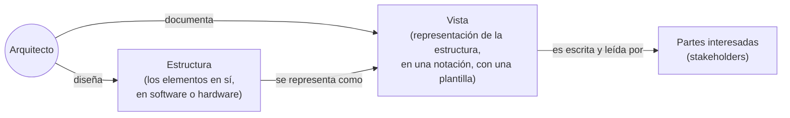

# Estructuras y vistas arquitectónicas

Dos términos que se usan juntos al discutir cómo se **representa** la arquitectura, y que la
presentación se toma el trabajo de separar porque no son sinónimos.

## La distinción

| Término | Definición |
|---|---|
| **Estructura** | El conjunto de elementos **en sí**, tal como existen en el software o el hardware. |
| **Vista** | La **representación** de un conjunto coherente de elementos arquitectónicos, según lo escrito y leído por las partes interesadas del sistema. Consiste en una representación de un conjunto de elementos y las relaciones entre ellos. |

La frase que lo resume: **una vista es una representación de una estructura.**

El ejemplo de la presentación:

- Una **estructura de módulo** es el conjunto de módulos del sistema y su organización → eso
  *existe*.
- Una **vista de módulo** es la representación de esa estructura, documentada según una
  plantilla en una notación elegida, y utilizada por algunas partes interesadas del sistema.

Y el cierre, que es la conclusión que hay que llevarse:

> Los arquitectos **diseñan estructuras**. **Documentan vistas** de esas estructuras.

![[adjuntos/arquitectura-de-software/arq-p24.png]]

## Cómo se conecta con el resto del tema

Esta distinción es la base conceptual del [[Modelo 4+1 vistas]]: si una vista es la
representación de una estructura para cierta audiencia, entonces **hace falta más de una
vista** porque hay más de una audiencia y más de una estructura. De ahí que Kruchten proponga
cinco.

También se conecta con la terminología de [[Arquitectura de software]]:

- **Perspectiva de la arquitectura** ≈ la representación desde una perspectiva específica.
- **Punto de vista arquitectónico** ≈ la **plantilla** que dice cómo crear y usar esa
  perspectiva.
- **Descripción de la arquitectura** = el conjunto de productos que documentan la arquitectura,
  o sea el conjunto de vistas documentadas.

## Notas relacionadas

- [[Arquitectura de software]]
- [[Modelo 4+1 vistas]]
- [[Arquitecto de software]]

## Preguntas de repaso

1. Explicá con tus palabras la diferencia entre **estructura** y **vista**.
2. Completá: los arquitectos diseñan ______ y documentan ______.
3. ¿Por qué hace falta más de una vista para documentar una arquitectura?
4. Relacioná **vista** con **punto de vista arquitectónico**: ¿cuál es la plantilla y cuál el producto?
