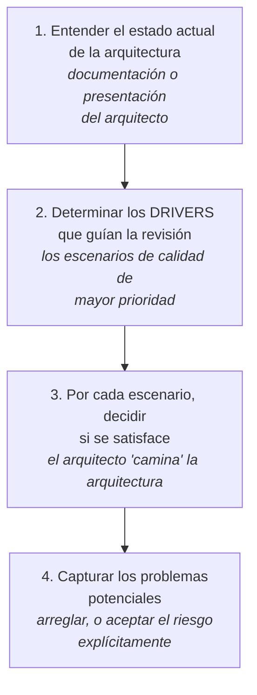
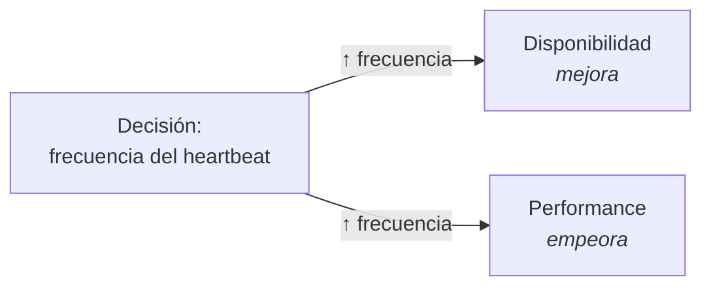

# Evaluación de la arquitectura

Cómo se determina si una arquitectura sirve, antes de construirla.

> [!warning] Nota de COMPLEMENTO
> Es un punto explícito de la **unidad 3** del programa (segundo parcial: **19 de septiembre**) y
> todavía no hay presentación. Todo esto viene del **SAIP** vía la guía de estudio. **Si la clase dice
> algo distinto, manda la clase.**

Abre con una cita que resume por qué el tema existe:

> *"Un médico puede enterrar sus errores, pero un arquitecto solo puede aconsejar a sus clientes que
> planten enredaderas."* — Frank Lloyd Wright

---

## 1. Qué es evaluar

> **Evaluación** = determinar el **grado en que la arquitectura es apta para el propósito** al que se
> destina.

Y su naturaleza es económica: **es una actividad de reducción de riesgo.**

Un riesgo tiene **probabilidad** e **impacto**, y su costo esperado es `probabilidad × costo del
impacto`. Entonces la evaluación funciona **como un seguro**: cuánto necesitás depende de dos cosas.

| Factor | Preguntas |
|---|---|
| Tu **exposición** | ¿Es misión crítica multimillonaria o un jueguito de consola? ¿Es un dominio conocido o la primera vez? |
| Tu **tolerancia** al riesgo | ¿Cuánto podés absorber si falla? |

Y de ahí la **regla de oro**:

> El **costo de evaluar** debe ser **menor que el valor** que aporta.

**Su salida principal son los riesgos identificados.** Arreglarlos es una decisión de costo/beneficio
posterior, no parte de la evaluación.

## 2. Las cuatro actividades esenciales

Toda evaluación, sea formal o liviana, hace estas cuatro cosas:

> [!important] El detalle del paso 2 que se pasa por alto
> Los drivers que guían la revisión son **los escenarios de calidad de mayor prioridad** — *"no los
> casos de uso puramente funcionales"*.
>
> Es coherente con todo lo demás: la funcionalidad no determina la arquitectura
> (→ [[Atributos de calidad]]), así que evaluar contra casos de uso funcionales no dice nada sobre si
> la arquitectura es buena.

Y en el paso 4, la alternativa importa: si el problema es real, se **arregla** o se **acepta el riesgo
explícitamente**. Aceptarlo documentado es una decisión; ignorarlo no.

La profundidad del análisis se decide por la **importancia de la decisión**, el **número de
alternativas**, y un principio: ***good enough* antes que perfecto**.

## 3. Quién evalúa

| Quién | Cuándo | Qué aporta |
|---|---|---|
| **El arquitecto** | en cada decisión clave | es **parte integral del diseño**, no una etapa aparte |
| **Los pares** | revisión acotada en tiempo, p. ej. al final del paso 7 de ADD | costo bajo, contexto compartido |
| **Externos** | arquitecturas completas | más objetividad, conocimiento especializado, y —justo o no— **los gerentes les creen más** |

## 4. El ATAM

**Architecture Tradeoff Analysis Method.** Dos décadas evaluando arquitecturas grandes: automotriz,
financiera, defensa.

Dos propiedades de diseño que lo hacen aplicable en la práctica:

- Los evaluadores **no necesitan familiaridad previa** con la arquitectura.
- **El sistema no necesita estar construido.**

### Los tres grupos

| Grupo | Quiénes | Detalle |
|---|---|---|
| **Equipo evaluador** | externo al proyecto, 3–5 personas | roles: líder, líder de evaluación, escriba de escenarios, escriba de actas, interrogadores. Competentes, imparciales, **sin agendas** |
| **Decisores del proyecto** | PM, cliente, y **el arquitecto, siempre** | **regla cardinal: el arquitecto participa de buena gana** |
| **Stakeholders de la arquitectura** | 10–25 en sistemas grandes | desarrolladores, testers, integradores, mantenedores, ingenieros de performance, usuarios, constructores de sistemas vecinos |

### Las cuatro fases

| Fase | Nombre | Qué pasa |
|---|---|---|
| **0** | Asociación y preparación | logística, lista de stakeholders, acuerdos; el equipo estudia la documentación |
| **1** | Evaluación, con los **decisores** | pasos 1–6 |
| — | *hiato de ~una semana* | |
| **2** | Evaluación, con los **stakeholders** | recapitulación + pasos 7–9 |
| **3** | Seguimiento | informe final circulado para corregir malentendidos |

La analogía del libro para entender la partición: **la fase 1 es probar tu programa con tus propios
criterios; la fase 2 es dárselo al equipo de QA independiente.**

### Los nueve pasos

1. **Presentar el ATAM** — el líder explica el proceso y las salidas.
2. **Presentar las metas de negocio** — un decisor: funciones más importantes, restricciones técnicas,
   gerenciales, económicas y políticas, contexto, stakeholders mayores, drivers.
3. **Presentar la arquitectura** — el arquitecto, al nivel apropiado: restricciones técnicas (SO,
   plataformas, sistemas vecinos) y sobre todo **los enfoques, patrones y tácticas usados** para
   cumplir los requerimientos. Con vistas: **contexto, C&C, descomposición o capas, despliegue**.
4. **Identificar los enfoques arquitectónicos** — catalogar patrones y tácticas por sus efectos sobre
   los atributos: *capas → portabilidad; pub-sub → escalabilidad; redundancia activa → disponibilidad*.
5. **Generar el *utility tree*** — arquitecto y decisores: escenarios con **importancia de negocio** y
   **riesgo técnico**. Es donde se aterrizan las vaguedades: *"modificable ¿en qué?", "¿throughput
   cuán alto?"*.
6. **Analizar los enfoques** — el equipo interroga los escenarios de mayor rango uno a uno; el
   arquitecto explica cómo la arquitectura los soporta. Se documentan **decisiones, riesgos,
   no-riesgos, sensibilidades y tradeoffs**. Análisis *"de servilleta"*: la meta es convencerse de que
   la instanciación del enfoque es apropiada, **no ser exhaustivos**.
7. **Brainstorming y priorización de escenarios** — ahora con los stakeholders, que proponen escenarios
   según su rol: el mantenedor propondrá modificabilidad, el usuario facilidad de operación, QA
   testabilidad. Se fusionan los similares y se vota con **30 % del total de escenarios en votos por
   persona** (la misma regla del QAW → [[Guía - Drivers de calidad y restricción]]).
8. y 9. — analizar los enfoques con los escenarios nuevos y presentar los resultados.

> [!important] El paso 7 esconde el hallazgo más valioso del ATAM
> El resultado de la votación **se compara con el *utility tree* del paso 5**.
>
> - Si **concuerdan**, eso **valida al arquitecto**: entendió las prioridades.
> - Si hay una **discrepancia grande**, *"es en sí un riesgo"*: significa que hay **desacuerdo sobre
>   las metas** entre los stakeholders y el arquitecto.
>
> O sea: el ATAM no solo evalúa la arquitectura, evalúa si todos están construyendo **el mismo
> sistema**.

## 5. Las cuatro salidas del análisis

Del paso 6 salen cuatro cosas distintas, y las últimas dos son las que dan nombre al método:

| Salida | Qué es |
|---|---|
| **Riesgo** | una decisión que puede no cumplir un escenario |
| **No-riesgo** | una decisión que **sí** lo cumple — vale documentarla, es evidencia |
| **Punto de sensibilidad** | una decisión con **efecto marcado** sobre una respuesta de un atributo |
| **Punto de tradeoff** | una decisión a la que **dos o más** respuestas son sensibles, **una mejorando y otra empeorando** |

El ejemplo canónico de punto de tradeoff:

> **La frecuencia del *heartbeat*.** Más frecuencia = mejor **disponibilidad** (se detecta antes la
> falla), peor **performance** (más tráfico y más procesamiento).

Un **punto de tradeoff es un punto de sensibilidad doble**, con las flechas en direcciones opuestas.
Y encontrarlos es literalmente el objetivo del método: es la *T* de ATAM.

Conecta con [[Atributos de calidad]] §5 —*ningún atributo se logra en aislamiento*— y con la tabla de
canjes de [[Estilos arquitectónicos]]: los tradeoffs no son un accidente del diseño, son su materia.

---

## Notas relacionadas

- [[El ciclo del architecting]] — la evaluación es el paso 5
- [[Atributos de calidad]] — los escenarios contra los que se evalúa, y los tradeoffs
- [[Tácticas y patrones arquitectónicos]] — los enfoques que se catalogan en el paso 4
- [[Estilos arquitectónicos]] — la tabla de qué favorece y sacrifica cada estilo
- [[Guía - Drivers de calidad y restricción]] — el QAW y la regla del 30 % de votos
- [[Stakeholders]] — los 10–25 que participan en la fase 2
- [[Proceso de diseño arquitectónico]] — las "comprobaciones" que enseña la clase

## Preguntas de repaso

1. ¿Qué es evaluar una arquitectura, y por qué es una actividad de reducción de riesgo?
2. ¿Cómo se calcula el costo esperado de un riesgo? ¿Cuál es la regla de oro de la evaluación?
3. ¿Cuál es la salida principal de una evaluación?
4. Nombrá las cuatro actividades esenciales de toda evaluación.
5. ¿Contra qué se evalúa: casos de uso funcionales o escenarios de calidad? ¿Por qué?
6. ¿Quiénes son los tres grupos del ATAM y cuál es su regla cardinal?
7. ¿Por qué el ATAM se parte en dos fases con un hiato de una semana?
8. Diferenciá **punto de sensibilidad** de **punto de tradeoff**. Dá el ejemplo del heartbeat.
9. ¿Qué se descubre al comparar la votación del paso 7 con el utility tree del paso 5?
10. ¿Por qué documentar los **no-riesgos** también sirve?
