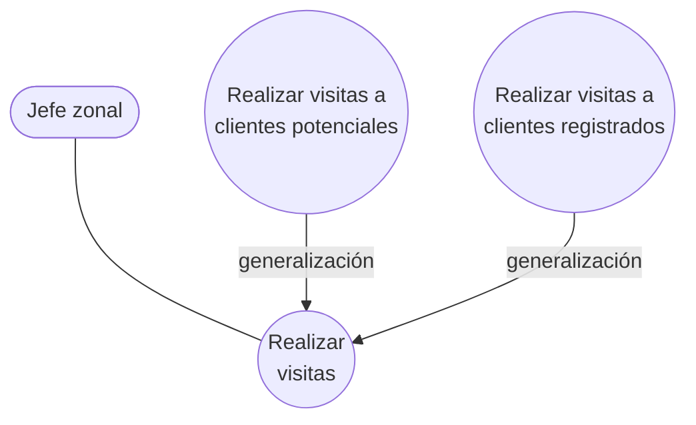

# Generalización y especialización en casos de uso

La tercera relación de los **CUN expandidos**, junto con
[[Relación de inclusión include]] y [[Relación de extensión extend]].

## Para qué se usa

> Se usa para mostrar **workflows que comparten estructuras, propósito y comportamiento**.

Tres cosas compartidas, no una. Si dos procesos solo se parecen en el nombre, no van acá.

> Un caso de uso **padre** se puede especificar en uno o más casos de uso **hijos** que
> representan formularios más específicos del padre.

Y el para qué concreto:

> Para no tener que describir el mismo flujo varias veces, se puede colocar el comportamiento
> común en un CUN.

## Cuándo se recomienda usarla

> Se puede afirmar que constituyen **tipos de procesos**. Generalmente tienen un comportamiento
> similar pero con **diferencias sustanciales** que provocan que sean considerados CUN
> diferentes.

Ese es el criterio fino y es el que suelen preguntar. Hacen falta **las dos cosas a la vez**:

- comportamiento **similar** (si no, no hay padre que los generalice), **y**
- diferencias **sustanciales** (si no, sería un solo CUN, no dos hijos).

![[adjuntos/cdu-negocio-modelado-drivers-rf/cdu-p21.png]]
![[adjuntos/cdu-negocio-modelado-drivers-rf/cdu-p22.png]]

## El ejemplo: vendedores ambulantes

El padre *Realizar visitas* tiene el flujo común (preparar la ruta, salir, registrar el
resultado). Los hijos se especializan: visitar un **cliente potencial** implica presentar la
empresa y calificarlo; visitar un **cliente registrado** implica revisar su historial y tomar
un nuevo pedido. Comportamiento similar, diferencias sustanciales.

Notá que en el diagrama UML el **triángulo vacío** apunta al padre, y el actor se asocia al
**padre**, no a cada hijo.

![[adjuntos/cdu-negocio-modelado-drivers-rf/cdu-p23.png]]

La misma figura en la captura de clase:

![[adjuntos/capturas-clase/generalizacion-especializacion-ejemplo.png]]

Y habilita la excepción de [[Convenios del diagrama de CUN]] §2: **los hijos pueden no tener actor
propio**, porque el padre ya describe toda la comunicación.

## También aplica entre actores

La misma relación se usa entre actores: varios actores del negocio pueden jugar el mismo rol en
un CUN particular, y ese rol compartido se modela como el actor del cual heredan los demás. Está
desarrollado en [[Actor del negocio]].

## Las tres relaciones, comparadas

| | `<include>` | `<extend>` | Generalización |
|---|---|---|---|
| Qué comparte | un **subpaso** | nada — agrega conducta opcional | **estructura, propósito y comportamiento** |
| ¿Los CU son del mismo tipo? | No necesariamente | No | **Sí** — son tipos de un mismo proceso |
| El actor se asocia a… | el base | el base | el **padre** |
| Motivo | reutilizar / simplificar | conducta opcional o elección del actor | evitar describir el mismo flujo varias veces |

## La definición formal, en tres líneas

La diapositiva del deck de relaciones la enuncia así:

> - El **caso hijo hereda** el comportamiento y significado del caso de uso **padre**.
> - El hijo puede **añadir o redefinir** el comportamiento del padre.
> - El **Caso de Uso Especializado hereda la especificación** del Caso de Uso Base o General.

> [!important] "Añadir **o redefinir**" es lo que la distingue de `«extend»`
> `«extend»` solo **agrega** comportamiento en puntos marcados, y el base **no se entera**.
> La generalización permite **redefinir** — el hijo puede cambiar lo que hace el padre, no solo
> sumarle.
>
> Por eso la generalización es la relación **más fuerte** de las tres: hereda la especificación
> completa y puede sobrescribirla. Ver [[Relación de extensión extend]].

## Notas relacionadas

- [[Caso de uso del negocio]]
- [[Relación de inclusión include]]
- [[Relación de extensión extend]]
- [[Actor del negocio]]
- [[Modelo de casos de uso del negocio]]

## Preguntas de repaso

1. ¿Qué tres cosas deben compartir los workflows para justificar una generalización?
2. ¿Cuál es el criterio doble que se recomienda para usarla?
3. En el ejemplo de los vendedores ambulantes, ¿cuál es el padre y cuáles los hijos? ¿A quién se asocia el actor?
4. ¿En qué se diferencia la generalización de un `<include>`?
5. ¿Cómo se aplica esta relación entre actores?
