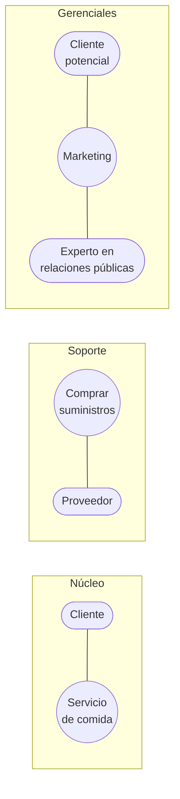
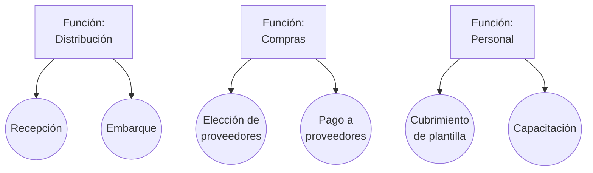
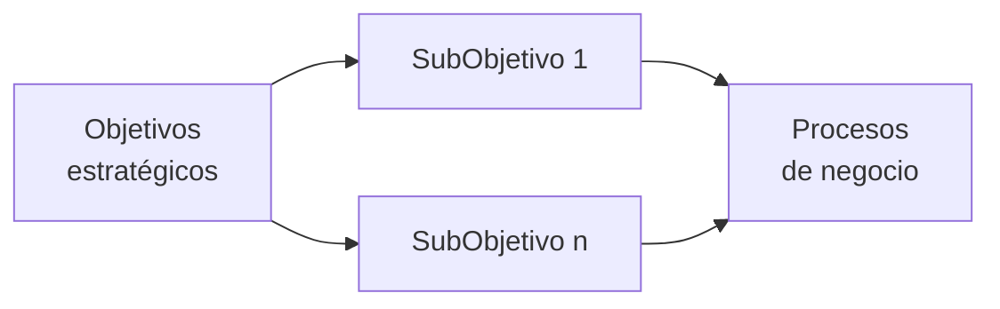
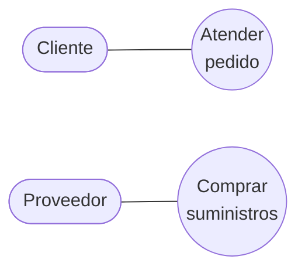

# Identificación de procesos del negocio

Como **un CUN representa a un proceso de negocio**, encontrar los procesos es encontrar los
casos de uso. La presentación da **tres técnicas** para hacerlo, cada una con su ejemplo.

| Técnica | Pregunta que se hace | Ejemplo del deck |
|---|---|---|
| **Clasificación** | ¿Qué tipo de proceso es? | Restaurante |
| **Agrupamiento de actividades** | ¿A qué función pertenece? | Empresa productora |
| **Objetivos** | ¿A qué objetivo estratégico sirve? | Empresa de servicio |

## 1. Clasificación

Se clasifican los procesos en **tres tipos**:

| Tipo | Qué es | Ejemplo (restaurante) |
|---|---|---|
| **Núcleo** | El proceso que *es* el negocio | Cliente → **Servicio de comida** |
| **Soporte** | Los procesos que sostienen al núcleo | **Comprar suministros** → Proveedor |
| **Gerenciales** | Los procesos de dirección y posicionamiento | Cliente potencial → **Marketing** ← Experto en relaciones públicas |

En un restaurante el núcleo es servir comida; comprar suministros no es el negocio, pero sin
eso no hay comida; y marketing no atiende a nadie hoy, posiciona al negocio para mañana.

Esta clasificación se conecta con una excepción que ya vimos: los CUN de **apoyo** pueden no
tener ningún actor asociado (→ [[Caso de uso del negocio]]).

![[adjuntos/cdu-negocio-modelado-drivers-rf/cdu-p12.png]]

## 2. Agrupamiento de actividades

Se parte de la **función**:

> Un grupo funcional que responde a un objetivo de la organización y que puede involucrar a
> varias áreas.

Y dentro de cada función se listan sus procesos de negocio. Ejemplo de una empresa productora:

| Función | Procesos de negocio |
|---|---|
| **Distribución** | Recepción · Embarque |
| **Compras** | Elección de proveedores · Pago a proveedores |
| **Personal** | Cubrimiento de plantilla · Capacitación |

**La función no es el CUN.** Los CUN son los procesos que están a la derecha de la tabla. La
función es el paraguas que ayuda a encontrarlos y a no dejar ninguno afuera
(→ [[Proceso de negocio]]).

![[adjuntos/cdu-negocio-modelado-drivers-rf/cdu-p13.png]]

## 3. Objetivos

Se baja desde arriba: de los **objetivos estratégicos** se derivan **subobjetivos**, y de cada
subobjetivo salen los **procesos de negocio**.

Ejemplo de una empresa de servicio. Objetivo estratégico: **"Satisfacer pedidos de los
clientes"**. De ahí salen dos subobjetivos y sus CUN correspondientes:

| Subobjetivo | CUN resultante |
|---|---|
| Atender pedido de los clientes | Cliente — **Atender pedido** |
| Solicitar insumo a los proveedores | Proveedor — **Comprar suministros** |

Este ejemplo se continúa en [[Descripción textual de casos de uso]], donde se desarrolla el
flujo completo del CUN *Atender pedido*.

![[adjuntos/cdu-negocio-modelado-drivers-rf/cdu-p14.png]]

## Cuál usar

No son excluyentes: se pueden combinar. En la práctica, **objetivos** sirve para no perder de
vista para qué existe el negocio, **agrupamiento** para barrer por áreas y no dejar procesos
sin identificar, y **clasificación** para validar que no te quedaste solo con los procesos
núcleo y te olvidaste de los de soporte y los gerenciales.

## Notas relacionadas

- [[Proceso de negocio]]
- [[Caso de uso del negocio]]
- [[Modelo de casos de uso del negocio]]
- [[Actor del negocio]]
- [[Descripción textual de casos de uso]]

## Preguntas de repaso

1. Nombrá las tres técnicas de identificación de procesos del negocio.
2. ¿Cuáles son los tres tipos de la clasificación? Dá un ejemplo de cada uno en un restaurante.
3. ¿Por qué una **función** no es un CUN?
4. En la técnica de objetivos, ¿cuál es el camino desde el objetivo estratégico hasta el CUN?
5. ¿Para qué sirve validar con la clasificación si ya identificaste procesos por agrupamiento?
