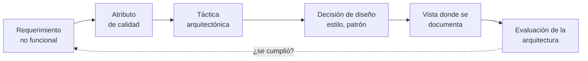
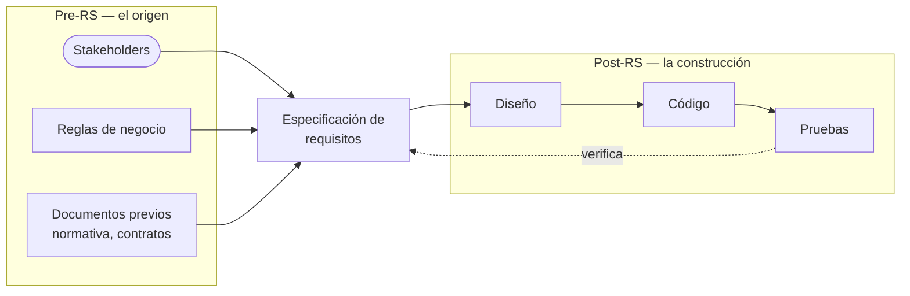

# Matriz de trazabilidad de requisitos

> [!warning] De dónde sale esta nota, y de dónde no
> Verifiqué el **programa oficial** de tu curso (AYD2, código **785**, Escuela de Ciencias y
> Sistemas, sección A, 2do semestre 2026, MBA. MSc. Ing. Claudia Rojas de Morán) y la palabra
> **"trazabilidad" no aparece en ningún punto del contenido temático**. Tampoco está en los tres
> PDF que me diste.
>
> Entonces: todo el contenido de esta nota es de **fuentes externas** (listadas al final). Lo digo
> explícito porque la terminología de tu catedrática puede diferir en algún matiz, y porque los
> quizzes que salgan de acá no se apoyan en material de clase.
>
> **Dónde encaja igual:** es el contenido natural del punto **1.6 "Arquitectura y Requerimientos
> (CDU de negocio)"** del programa. Ese punto es literalmente el puente entre requerimientos y
> arquitectura, y la matriz de trazabilidad es la herramienta con la que ese puente se documenta.

La idea en una línea: **la trazabilidad es la capacidad de seguirle la vida a un requisito** —de
dónde salió y en qué terminó—. La **matriz** es la tabla donde eso queda registrado.

---

## 1. Definición

La definición canónica es de **Gotel y Finkelstein (1994)**, y es la que usa más del 80 % de la
literatura del tema:

> La trazabilidad de requisitos es la capacidad de **describir y seguir la vida de un requisito**,
> en ambas direcciones —hacia adelante y hacia atrás—: desde sus orígenes, pasando por su
> desarrollo y especificación, hasta su despliegue y uso, y a través de los períodos de
> refinamiento e iteración en cualquiera de esas fases.

Tres cosas para subrayar:

- **"en ambas direcciones"** — no alcanza saber en qué terminó un requisito; hay que poder volver
  a su origen.
- **"desde sus orígenes"** — el origen es *anterior* al documento de requisitos: es el
  stakeholder, la regla de negocio, la ley.
- **"refinamiento e iteración"** — no es una foto que se saca una vez. Se mantiene, o muere.

La **matriz de trazabilidad de requisitos (RTM, *Requirements Traceability Matrix*)** es el
artefacto concreto: una tabla que cruza cada requisito con los demás artefactos del proyecto y
hace visible qué está conectado con qué.

---

## 2. Por qué es "de vital importancia" en un curso de arquitectura

Esto es lo que distingue el enfoque de **AYD2** del de AYD1, y es la razón de fondo por la que el
tema importa acá.

En AYD1 la trazabilidad se ve del lado del **análisis**: requisito → caso de uso → prueba. Sirve
para no olvidarse de implementar nada.

En **AYD2 el curso es de arquitectura**, y su propia descripción oficial lo dice: se trata de
*"técnicas para definir una arquitectura que satisfaga los requerimientos funcionales y no
funcionales"*. O sea, la pregunta del curso es:

> ¿Cómo demuestro que **esta** arquitectura satisface **estos** requerimientos?

Y la respuesta es una matriz de trazabilidad, con una cadena distinta a la de AYD1:

Esa cadena **atraviesa las tres primeras unidades** de tu programa:

| Eslabón | Unidad del programa |
|---|---|
| Requerimiento no funcional, CDU de negocio | **1.6** Arquitectura y Requerimientos |
| Estructuras y vistas donde se documenta | **1.8** Estructuras y Vistas |
| Estilo o patrón elegido | **1.9** Géneros y Estilos Arquitectónicos |
| Atributo de calidad y su medición | **2** Calidad del Software |
| Documentar y **evaluar** la arquitectura | **3** Arquitectura en el Ciclo de Vida |

Por eso la trazabilidad no es un tema suelto: es el **hilo que cose el curso completo**. Un
requerimiento no funcional que no se puede rastrear hasta una decisión arquitectónica concreta es
un requerimiento que la arquitectura **no** está satisfaciendo, aunque el documento diga que sí.

---

## 3. Los dos grandes tramos: pre-RS y post-RS

Otra contribución de Gotel y Finkelstein, y la distinción más útil del tema. "RS" es
*Requirements Specification*, el documento de especificación de requisitos.

| Tramo | Qué conecta | Pregunta que responde |
|---|---|---|
| **Pre-RS** | El requisito con su **origen**: stakeholders, reglas de negocio, documentos previos; y con **otros requisitos** | ¿De dónde salió esto y quién lo pidió? |
| **Post-RS** | El requisito con lo que se **construyó**: diseño, código, pruebas | ¿Se cumplió, y dónde? |

**Por qué importa la distinción:** el tramo **post-RS** es el que casi todos los proyectos hacen,
porque lo exigen las pruebas. El **pre-RS** es el que casi nadie hace y el que más duele cuando
falta: sin él nadie sabe *por qué* existe un requisito, y entonces nadie se anima a eliminarlo
aunque ya no sirva.

En términos de tu curso, el pre-RS es exactamente lo que producen los
[[Caso de uso del negocio|casos de uso del negocio]]: el CUN documenta qué actor pidió qué y para
qué. Es la razón por la que el punto 1.6 del programa dice "Arquitectura y Requerimientos
**(CDU de negocio)**" y no solo "Requerimientos".

---

## 4. Direcciones de la trazabilidad

### Las tres que se usan en la práctica

| Dirección | De qué a qué | Para qué sirve |
|---|---|---|
| **Hacia adelante** (*forward*) | Requisito → diseño → código → prueba | Verificar que **todo requisito** fue implementado y probado. Detecta requisitos **huérfanos** |
| **Hacia atrás** (*backward*) | Prueba / código → requisito | Verificar que **todo lo construido** responde a un requisito documentado. Detecta ***gold plating*** |
| **Bidireccional** | Las dos a la vez | La única completa, y la que exigen los estándares |

**La hacia atrás es la que la gente olvida**, y detecta un problema carísimo: funcionalidad que
alguien programó porque le pareció buena idea, que nadie pidió, que nadie va a mantener, y que
igual hay que probar. Eso es *gold plating*, una forma de *scope creep*.

### La discrepancia entre fuentes (para que no te sorprenda)

> [!note] ¿Tres tipos o cuatro?
> Las fuentes **no coinciden**:
>
> - La literatura práctica y de *testing* habla de **tres**: forward, backward, bidireccional.
> - El análisis de Gotel y Finkelstein distingue **cuatro**, combinando dos ejes —dirección
>   (*forward*/*backward*) y sentido del enlace (*from*/*to*)—: *backward-from*, *forward-from*,
>   *backward-to*, *forward-to*.
>
> No es una contradicción real: los cuatro son la versión fina de los dos primeros, según si
> mirás el enlace desde el artefacto de origen o desde el de destino. Si te preguntan "los tipos",
> andá con los **tres** y mencioná que existe una clasificación más fina.

---

## 5. Estructura de la matriz

Lo habitual: **una fila por requisito**, y las columnas son los artefactos con los que se
relaciona.

| Columna | Qué lleva |
|---|---|
| **ID** | Identificador único y **estable**: `RF-01`, `RNF-03` |
| **Descripción** | El requisito en una línea |
| **Origen** | Quién lo pidió: stakeholder, regla de negocio, documento (tramo **pre-RS**) |
| **Caso de uso** | El CU o CUN que lo realiza |
| **Elemento de diseño** | La clase, componente, estilo o táctica que lo implementa |
| **Vista** | Dónde queda documentado (vista lógica, de procesos, física…) |
| **Caso de prueba** | `CP-nn`, el que lo verifica |
| **Estado** | Pendiente / implementado / probado / aprobado |

### Ejemplo con material de tu bóveda

Tomando el CUN **Atender pedido** de [[Descripción textual de casos de uso]]:

| ID | Requisito | Origen (pre-RS) | Caso de uso | Diseño | Prueba | Estado |
|---|---|---|---|---|---|---|
| RF-01 | Registrar la orden con fecha, datos del cliente y productos | Cliente (actor del negocio) | Atender pedido, paso 1 | `Pedido`, `LineaPedido` | CP-01, CP-02 | Probado |
| RF-02 | Analizar la viabilidad de cada producto por separado | Jefe Técnico (trabajador) | Atender pedido, paso 4 | `AnalizadorViabilidad` | CP-03 | Implementado |
| RF-03 | Crear una orden de trabajo por producto aceptado | Regla de negocio | Atender pedido, paso 6 | `OrdenTrabajo` | — | **sin prueba** |
| RF-04 | Comunicar al cliente el resultado del análisis | Cliente (actor del negocio) | Atender pedido, pasos 8-9 | `NotificadorCliente` | CP-04 | Probado |

La fila **RF-03 grita sola**: tiene diseño y no tiene prueba. Ese es exactamente el hueco que la
matriz existe para hacer visible. Sin la tabla, ese requisito se va a producción sin que nadie lo
note.

### La versión que le interesa a este curso: requerimientos no funcionales

Esta es la matriz que conviene saber armar para AYD2, porque conecta 1.6 con las unidades 2 y 3:

| ID | Requerimiento no funcional | Atributo de calidad | Táctica / decisión | Vista donde se documenta | Cómo se verifica |
|---|---|---|---|---|---|
| RNF-01 | El análisis de viabilidad responde en menos de 2 s | Eficiencia | Caché del catálogo | Vista de procesos | Prueba de rendimiento |
| RNF-02 | El sistema opera si el módulo de notificación cae | Fiabilidad | Cola de mensajes, reintentos | Vista física | Prueba de tolerancia a fallas |
| RNF-03 | Agregar un tipo de producto no obliga a recompilar | Mantenibilidad | Patrón *Strategy* | Vista lógica | Revisión de diseño |
| RNF-04 | Solo el Jefe Técnico aprueba fabricación | Funcionalidad (seguridad) | Control de acceso por rol | Vista lógica | Prueba de seguridad |

Fijate lo que hace esta tabla: **obliga a justificar cada decisión arquitectónica con un
requerimiento**. Una columna "táctica" sin requerimiento a la izquierda es una decisión que nadie
pidió. Y un requerimiento sin táctica a la derecha es una promesa que la arquitectura no cumple.

### Matriz de doble entrada

Cuando interesa cruzar solo **dos** tipos de artefacto, se usa requisitos en filas y pruebas en
columnas, con una marca en la celda donde se cruzan:

| | CP-01 | CP-02 | CP-03 | CP-04 |
|---|---|---|---|---|
| **RF-01** | X | X | | |
| **RF-02** | | | X | |
| **RF-03** | | | | |
| **RF-04** | | | | X |

Leída **por filas** detecta requisitos sin cobertura (RF-03: fila vacía).
Leída **por columnas** detecta pruebas que no responden a ningún requisito (columna vacía).

Esa lectura en dos sentidos **es** la trazabilidad bidireccional, hecha visible en una sola tabla.

---

## 6. Qué problemas detecta

| Problema | Cómo se ve en la matriz | Qué significa |
|---|---|---|
| **Requisito huérfano** | Fila sin prueba o sin diseño | Se pidió y no se construyó, o no se verificó |
| **Hueco de cobertura** | Faltan enlaces requisito ↔ verificación | No se puede demostrar que se cumple |
| ***Gold plating* / *scope creep*** | Columna sin requisito de origen | Se construyó algo que nadie pidió |
| **Requisito duplicado** | Dos filas con el mismo diseño y prueba | El mismo requisito escrito dos veces |
| **Requisito obsoleto** | Origen que ya no existe | Se puede eliminar — y sin pre-RS nadie se atreve |
| **Decisión injustificada** | Táctica sin requerimiento a la izquierda | Arquitectura por gusto, no por necesidad |

---

## 7. Cómo se construye

1. **Definir alcance y objetivo.** ¿Para qué la quiero: cobertura de pruebas, análisis de impacto,
   auditoría, justificar la arquitectura? Eso decide qué columnas van.
2. **Listar y categorizar los requisitos**, asignando un **ID único** a cada uno.
3. **Identificar los artefactos relacionados**: casos de uso, diseño, código, pruebas.
4. **Armar la plantilla.** Excel alcanza para empezar; hay herramientas ALM para proyectos grandes.
5. **Poblarla y asignar responsables.** Cada fila tiene un dueño que la mantiene.
6. **Verificar y validar.** El chequeo mínimo: **que todo requisito tenga al menos un caso de
   prueba**.

### Buenas prácticas

- **IDs estables.** Un ID nunca se reutiliza ni se renumera. Si un requisito se elimina, su ID
  queda muerto. Renumerar rompe todas las referencias de golpe.
- **Granularidad uniforme.** Si un requisito dice "el sistema gestionará pedidos" y otro dice "el
  botón será azul", la matriz no sirve para nada.
- **Mantenerla o no hacerla.** Una matriz desactualizada es **peor que ninguna**: da falsa
  seguridad. Si no hay quien la mantenga, es más honesto no empezarla.
- **Automatizar el enlace.** Referenciar el ID en el commit, en el nombre del caso de prueba y en
  el comentario del código permite **regenerar** la matriz en vez de transcribirla.

---

## 8. Los estándares que la exigen

| Estándar | Qué pide |
|---|---|
| **ISO/IEC/IEEE 29148** (ingeniería de requisitos) | Que cada requisito se pueda rastrear desde su origen —la necesidad del cliente— hasta su implementación y verificación, **e incluso hasta su baja** si deja de ser necesario |
| **CMMI** | Trazabilidad **bidireccional** como práctica del área de gestión de requisitos |
| **IEEE 830** (antecesor de 29148) | La trazabilidad como atributo de una buena especificación |

El detalle de 29148 sobre *"su descarte si ya no es necesario"* es el que suele pasarse por alto,
y conecta con el tramo pre-RS: para eliminar un requisito con confianza hay que saber de dónde
salió.

Ojo con el vínculo a la unidad 2 de tu programa, que incluye **Normas ISO** y los **atributos de
calidad** (funcionalidad, fiabilidad, usabilidad, eficiencia, mantenibilidad, portabilidad): esos
atributos son justamente la columna del medio de la matriz de requerimientos no funcionales de
arriba.

---

## 9. Un ejemplo que ya hiciste

La sección 6 de `06-Proyecto-MCP/diseño.md` es una matriz de trazabilidad, aunque no la llamamos
así: cruza **actor → caso de uso → requisito funcional → requisito no funcional** para el servidor
`tutor-ayds`.

Y su última fila hace exactamente el trabajo que describe esta nota: deja registrado que dos de
los cinco actores del ecosistema **no tienen ningún caso de uso** en el sistema — un hueco
detectado y justificado a propósito, no por olvido. Eso es análisis de cobertura.

Si querés completarla como ejercicio, le faltan dos columnas: **caso de prueba** y **estado**. Las
pruebas ya existen (las 33 de `pruebas/verificaciones.ts`), así que sería enlazar cada RNF con las
que lo verifican.

---

## 10. Fuentes

Todas externas al material del curso:

- **Gotel, O. y Finkelstein, A. (1994).** *An analysis of the requirements traceability problem* —
  la definición canónica y la distinción pre-RS / post-RS.
- **ISO/IEC/IEEE 29148** — ingeniería de requisitos; requisitos de trazabilidad.
- **Visure Solutions**, *How to create a traceability matrix* — estructura práctica y los seis pasos.
- Documentación práctica de RTM (Perforce, Parasoft, Justinmind) — tipos de trazabilidad y
  problemas que detecta.
- **Programa oficial del curso** AYD2 785, sección A, 2do semestre 2026 (ECYS-USAC, vía DTT-ECYS) —
  usado para ubicar el tema en la unidad 1.6 y para confirmar que no figura explícitamente.

---

## Notas relacionadas

- [[Caso de uso del negocio]] — el primer eslabón trazable, y el tramo pre-RS
- [[Identificación de procesos del negocio]] — la técnica de objetivos arranca la cadena
- [[Descripción textual de casos de uso]] — de acá salen los requisitos del ejemplo
- [[Arquitecto de software]] — responsable de integrar los requerimientos no funcionales
- [[Modelo 4+1 vistas]] — la columna "vista donde se documenta"
- [[Estructuras y vistas arquitectónicas]] — unidad 1.8 del programa
- [[Proceso de diseño arquitectónico]] — las comprobaciones de "completos y consistentes" son trazabilidad aplicada
- [[Equilibrio de restricciones del proyecto]] — por qué no todo requerimiento se puede satisfacer a la vez

## Preguntas de repaso

1. Dá la definición de trazabilidad de Gotel y Finkelstein. ¿Qué significa "en ambas direcciones"?
2. ¿Qué diferencia hay entre trazabilidad **pre-RS** y **post-RS**? ¿Cuál se hace menos y por qué duele?
3. ¿Qué problema detecta la trazabilidad **hacia atrás** que la hacia adelante no puede ver?
4. En una matriz de doble entrada, ¿qué significa una **fila vacía**? ¿Y una **columna vacía**?
5. ¿Por qué una matriz desactualizada es peor que no tener matriz?
6. En un curso de arquitectura, ¿cuál es la cadena de trazabilidad que interesa, y por qué no es la misma que en análisis?
7. ¿Qué significa una táctica arquitectónica que no tiene ningún requerimiento a su izquierda en la matriz?
