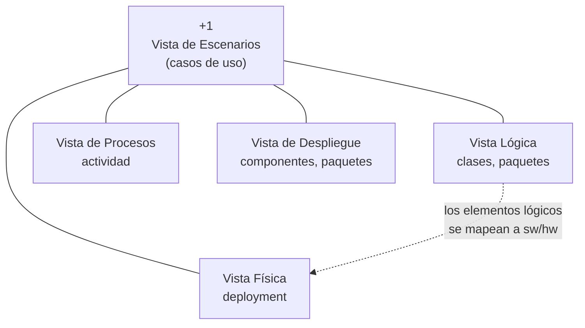

# Modelo 4+1 vistas

La forma de documentar una arquitectura con **cuatro vistas** más una quinta que las amarra.
La lógica de fondo viene de [[Estructuras y vistas arquitectónicas]]: como cada parte
interesada necesita ver el sistema de una manera distinta, se documenta el mismo sistema
cuatro veces desde ángulos diferentes, y la quinta vista (los escenarios) sirve de hilo que
conecta las otras cuatro.

## Las cinco vistas de un golpe

| Vista | Qué representa | Diagrama(s) UML |
|---|---|---|
| **Lógica** | Requisitos **funcionales**: qué debe hacer el sistema. El dominio de la aplicación, las clases y objetos que forman el *core*. | Diagrama de clases, diagrama de paquetes |
| **De procesos** | Los **flujos de trabajo** paso a paso, de negocio y operacionales, de los componentes. Y varios requisitos **no funcionales**. | Diagrama de actividad |
| **De despliegue** (o de desarrollo) | Cómo está **dividido el software en componentes** y las dependencias entre ellos. | Diagrama de componentes, diagrama de paquetes |
| **Física** | Cómo están **distribuidos los componentes entre los equipos** que conforman la solución, incluyendo los servicios. | Diagrama de *deployment* |
| **+1 — Escenarios** | Los **casos de uso**. Es la que une las otras cuatro y da trazabilidad. | Diagrama de casos de uso |

![[adjuntos/arquitectura-de-software/arq-p25.png]]

## Vista Lógica

Los **requisitos funcionales** del sistema: lo que el sistema debe hacer, las funciones y
servicios que se han definido. Está enfocada a lo definido como **dominio de la aplicación**,
o sea las clases y objetos principales que formarán el corazón o *core* de la aplicación.

Se complementa con: **diagrama de clases** y **diagrama de paquetes**.

![[adjuntos/arquitectura-de-software/arq-p27.png]]

## Vista de Procesos

Representa los **flujos de trabajo paso a paso** de negocio y operacionales de los
componentes que conforman el sistema. Además muestra algunos de los **requisitos no
funcionales**, como ejecución, disponibilidad, tolerancia a fallas, integridad, seguridad y
confiabilidad, entre otros.

Se complementa con: **diagrama de actividad**.

Detalle que vale marcar: es la **única vista donde la presentación menciona explícitamente los
requisitos no funcionales**, y eso conecta con la responsabilidad del arquitecto de integrar
los NRFs (→ [[Arquitecto de software]]).

![[adjuntos/arquitectura-de-software/arq-p25.png]]

## Vista de Despliegue (o Vista de Desarrollo)

Muestra básicamente **cómo está dividido nuestro sistema de software en componentes**, y las
**dependencias** entre estos componentes.

Los componentes físicos incluyen archivos, cabeceras, bibliotecas compartidas, módulos,
ejecutables o paquetes. Muestra la organización y las dependencias entre el conjunto de
componentes, y cómo se comunican entre ellos.

Se complementa con: **diagrama de componentes** y **diagrama de paquetes**.

> [!warning] Cuidado con el nombre
> La presentación la llama **"Vista de Despliegue o Vista de Desarrollo"**, pero el diagrama de
> *deployment* (despliegue) pertenece a la **Vista Física**, no a esta. En la literatura
> original de Kruchten esta vista se llama **Vista de Desarrollo** (*development view*) y las
> cuatro son: Lógica, Procesos, Desarrollo y Física. Si en el examen te piden "la vista que usa
> el diagrama de componentes", es esta; si te piden "la que usa el diagrama de deployment", es
> la Física.

![[adjuntos/arquitectura-de-software/arq-p28.png]]

## Vista Física

Representa **cómo están distribuidos los componentes entre los distintos equipos** que
conforman la solución, incluyendo los servicios. Los elementos definidos en la **vista lógica
se mapean** a componentes de software o de hardware.

Se complementa con: **diagrama de deployment**.

![[adjuntos/arquitectura-de-software/arq-p29.png]]

## Vista +1 o Vista de Escenarios

Está representada por los **casos de uso**, que ayudarán a unir las otras cuatro vistas.

Desde un caso de uso podemos ver cómo se van ligando las otras cuatro vistas; con esto
tenemos una **trazabilidad** de componentes, clases, equipo, paquetes, etc., para la
realización de cada caso de uso.

Se complementa con: **diagrama de casos de uso**.

Acá el tema se cruza con el otro deck del curso: los casos de uso que amarran las vistas son
los mismos que se modelan en [[Caso de uso]] y [[Modelo de casos de uso del negocio]]. Es por
eso que el "+1" no es una vista más al mismo nivel: es el **pegamento**.

![[adjuntos/arquitectura-de-software/arq-p26.png]]

## Truco para memorizarlo

Pensá qué pregunta responde cada vista:

| Vista | Pregunta que responde |
|---|---|
| Lógica | **¿Qué** hace el sistema? |
| De procesos | **¿Cómo** fluye paso a paso, y con qué calidad? |
| De despliegue / desarrollo | **¿De qué piezas** de software está hecho? |
| Física | **¿Dónde** corre cada pieza? |
| +1 Escenarios | **¿Para qué?** (y amarra las otras cuatro) |

## Notas relacionadas

- [[Estructuras y vistas arquitectónicas]]
- [[Arquitectura de software]]
- [[Arquitecto de software]]
- [[Caso de uso]]

## Preguntas de repaso

1. Nombrá las cinco vistas del modelo 4+1 y el diagrama UML de cada una.
2. ¿Por qué la quinta vista se llama "+1" y no simplemente "quinta vista"?
3. ¿En qué vista aparecen los requisitos no funcionales según la presentación?
4. ¿Qué vista usa el diagrama de componentes y cuál el diagrama de deployment?
5. ¿Qué significa que "los elementos definidos en la vista lógica se mapean" en la vista física?
