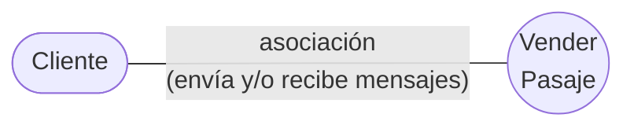
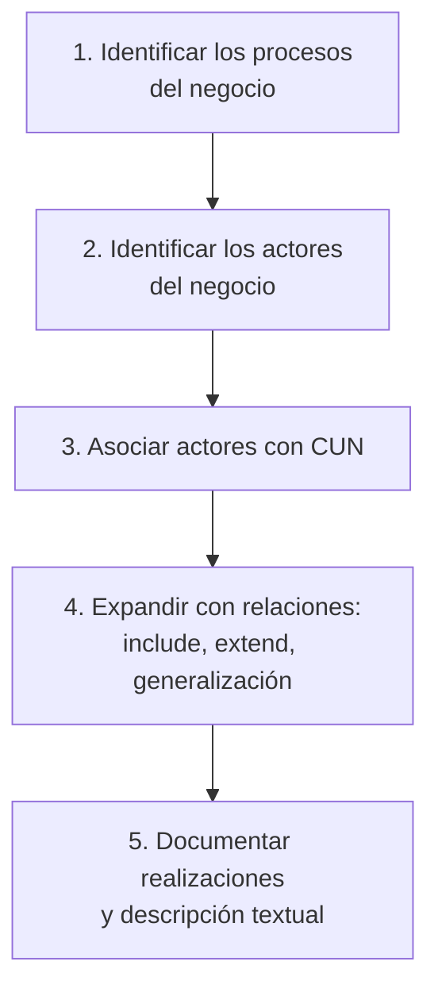

# Modelo de casos de uso del negocio

El **Modelo de Casos de Uso del Negocio** describe los **procesos de un negocio**, vinculados
al campo de acción, y **cómo se benefician e interactúan los socios y clientes** en estos
procesos.

Ojo con el foco: el modelo no describe un software. Describe **el negocio**. El sistema
informático todavía no aparece.

## Los dos estereotipos

Todo el modelo se arma con dos elementos:

| Estereotipo | Notación | Qué representa |
|---|---|---|
| **Actor del negocio** | monigote | Un **rol** que interactúa con el negocio para beneficiarse de sus resultados → [[Actor del negocio]] |
| **Caso de uso del negocio** | elipse | Un **proceso de negocio** → [[Caso de uso del negocio]] |

Y una relación: la **asociación**, que significa que el actor **envía y/o recibe mensajes**.

Ese es el diagrama mínimo posible de un modelo de CUN: un actor, un caso de uso y la línea
que los une. El ejemplo de la presentación es **Cliente — Vender Pasaje**.

![[adjuntos/cdu-negocio-modelado-drivers-rf/cdu-p08.png]]
![[adjuntos/cdu-negocio-modelado-drivers-rf/cdu-p11.png]]

## Cómo se construye

El orden de trabajo que se desprende de la presentación:

Cada paso tiene su nota:

1. → [[Identificación de procesos del negocio]] (tres técnicas: clasificación, agrupamiento y objetivos)
2. → [[Actor del negocio]]
3. → [[Caso de uso del negocio]]
4. → [[Relación de inclusión include]], [[Relación de extensión extend]], [[Generalización y especialización en casos de uso]]
5. → [[Realizaciones de casos de uso del negocio]], [[Descripción textual de casos de uso]]

## La regla que amarra todo

> **Un CUN representa a un proceso de negocio.**

Uno a uno. Si identificaste cinco procesos de negocio, tenés cinco casos de uso del negocio.
Por eso identificar bien los procesos (→ [[Proceso de negocio]]) es el paso más importante: si
te equivocás ahí, todo el modelo queda mal.

## Notas relacionadas

- [[Caso de uso]]
- [[Caso de uso del negocio]]
- [[Actor del negocio]]
- [[Proceso de negocio]]
- [[Identificación de procesos del negocio]]
- [[Casos de uso vs DFD]]

## Preguntas de repaso

1. ¿Qué describe el Modelo de Casos de Uso del Negocio?
2. ¿Cuáles son los dos estereotipos del modelo y con qué símbolo se dibuja cada uno?
3. ¿Qué significa la asociación entre un actor del negocio y un CUN?
4. Completá: un CUN representa a un ______.
5. ¿Por qué el modelo de CUN no habla del sistema informático?
