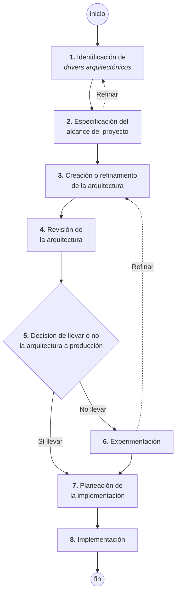

# Método de diseño centrado en la arquitectura

Las **ocho etapas** en **cuatro fases**, con el caso de negocio como **paso 0**.

> [!important] Esta nota es NÚCLEO — y ordena el Caso 1
> Es la **Figura 2-8** de la diapositiva *"Pasos para la definición de una Arquitectura de software"*.
> Lo más importante para tu tarea: ella marca en rojo, aparte de las ocho, un **paso 0**.

---

## 1. El paso 0

> **0. Creación del caso de negocio**

Está escrito en rojo, **fuera** del diagrama de las ocho etapas. Eso significa que el caso de negocio
**no es una etapa del método**: es lo que **existe antes** de que el método arranque.

> [!important] Por eso el Caso 1 pide lo que pide, en el orden que lo pide
> | Rúbrica del Caso 1 | Etapa del método |
> |---|---|
> | Criterio 1 — **caso de negocio** (contexto, core, descomposición) | **paso 0** |
> | Criterio 2 — **stakeholders** | insumo del paso 0 y del 1 |
> | Criterio 3 — **drivers** (RF, calidad, restricción) | **etapa 1** |
> | Criterio 3 — priorizar los 5 más críticos | **etapa 1**, cerrando |
> | Criterio 4 — matrices de trazabilidad | el puente hacia la **etapa 2** |
>
> La rúbrica **es el paso 0 más la etapa 1** del método. No pide diseñar la arquitectura: pide tener
> listos **los insumos** para poder diseñarla. Decir eso en el documento demuestra que entendiste
> dónde estás parado.

## 2. Las ocho etapas y sus cuatro fases

![[adjuntos/capturas-clase/metodo-diseno-centrado-arquitectura-8-etapas.png]]

| Fase | Etapas | Qué se produce |
|---|---|---|
| **De requerimientos** | 1. Identificación de **drivers arquitectónicos** · 2. Especificación del **alcance** | los insumos: drivers priorizados y límites del proyecto |
| **De diseño / refinamiento** | 3. **Creación o refinamiento** de la arquitectura · 4. **Revisión** | la arquitectura y su validación |
| **De experimentación** | 5. **Decisión** de llevarla o no a producción · 6. **Experimentación** | evidencia: prototipos, pruebas de concepto |
| **De producción** | 7. **Planeación** de la implementación · 8. **Implementación** | el sistema construido |

## 3. Los tres lazos, que son lo que hace al método un método

Un diagrama lineal no diría nada. Lo que enseña son las flechas que vuelven atrás:

| Lazo | De dónde a dónde | Qué significa |
|---|---|---|
| **Refinar** | etapa 2 → etapa 1 | al fijar el alcance aparecen drivers nuevos, o se caen algunos. **El alcance y los drivers se ajustan mutuamente** |
| **Refinar** | etapa 6 → etapa 3 | la experimentación **descubre que el diseño no sirve** y hay que rediseñar |
| **Bifurcación** | etapa 5 | *"Sí llevar"* salta directo a la **etapa 7** (planeación); *"No llevar"* baja a la **etapa 6** (experimentación) |

> [!important] La etapa 5 es la que más enseña
> Es una **decisión explícita**: ¿esta arquitectura va a producción o no?
>
> - Si **sí** → se salta la experimentación y se planea la implementación.
> - Si **no** → se experimenta, y de ahí se **vuelve a la etapa 3** a rediseñar.
>
> O sea: **la experimentación no es un paso obligatorio, es la salida del "todavía no".** Si la
> arquitectura no convence, en vez de construirla se prueba en chico y se rediseña. Es exactamente el
> principio de *"decisión bajo incertidumbre"* y de que **el riesgo es la guía**
> (→ [[El ciclo del architecting]] §3).

## 4. Cómo se relaciona con los otros dos "pasos" de clase

Hay **tres** diapositivas distintas sobre "pasos", y no se contradicen: son distintos niveles de zoom.

| Diapositiva | Cuántos | Qué describe |
|---|---|---|
| Lista de bullets | **7** actividades | el **qué se hace** (→ [[Proceso de diseño arquitectónico]]) |
| Ciclo `«precede»` | **5** etapas | el **orden** entre grandes bloques |
| **Figura 2-8** *(esta nota)* | **8** etapas en 4 fases | el **método**, con decisiones y lazos |

Puestos en correspondencia:

| Figura 2-8 | Ciclo `«precede»` | Lista de 7 |
|---|---|---|
| 0. Caso de negocio | — | 1. Creación del caso de negocio |
| 1. Drivers arquitectónicos | REQUERIMIENTOS | 2. Entendimiento de los requisitos |
| 2. Alcance del proyecto | REQUERIMIENTOS | 2. ídem |
| 3. Creación o refinamiento | DISEÑO | 3. Creación y selección |
| — | DOCUMENTACIÓN | 4. Documentación y comunicación |
| 4. Revisión de la arquitectura | EVALUACIÓN | 5. Análisis o evaluación |
| 5. Decisión · 6. Experimentación | *(no aparece)* | *(no aparece)* |
| 7. Planeación · 8. Implementación | IMPLEMENTACIÓN | 6. Implementación · 7. Aseguramiento |

> [!tip] Qué agrega cada una
> La **Figura 2-8** es la única que trae **experimentación** y una **decisión de ir/no ir**. El ciclo
> `«precede»` es el único que pone **documentación** como etapa propia. La lista de 7 es la única que
> separa el **aseguramiento** de la implementación.
>
> Si te preguntan "los pasos", la respuesta segura es **la lista de 7** (es la que está en bullets, la
> más citable). Si te preguntan por el **método**, es esta.

---

## Notas relacionadas

- [[Proceso de diseño arquitectónico]] — las otras dos versiones de los pasos
- [[Drivers arquitectónicos]] — la etapa 1, que es el criterio 3 del Caso 1
- [[Diagrama de contexto]] — parte del paso 0, y fija el alcance de la etapa 2
- [[Guía - Caso de negocio]] — cómo se construye el paso 0
- [[El ciclo del architecting]] — el ciclo del SAIP, con el que se corresponde
- [[Evaluación de la arquitectura]] — la etapa 4, revisión
- [[Plan - Caso 1 FarmaHosp]] — la rúbrica es el paso 0 más la etapa 1

## Preguntas de repaso

1. ¿Cuál es el **paso 0** y por qué está fuera del diagrama de las ocho etapas?
2. Nombrá las ocho etapas en orden.
3. ¿Cuáles son las **cuatro fases** y qué etapas caen en cada una?
4. ¿Qué significa el lazo "Refinar" de la etapa 2 a la 1?
5. ¿Qué significa el lazo "Refinar" de la etapa 6 a la 3?
6. En la etapa 5, ¿a dónde va "Sí llevar" y a dónde "No llevar"?
7. ¿Por qué la experimentación no es un paso obligatorio?
8. ¿Qué partes del método cubre la rúbrica del Caso 1?
9. ¿Qué agrega la Figura 2-8 que no tienen las otras dos diapositivas de "pasos"?
