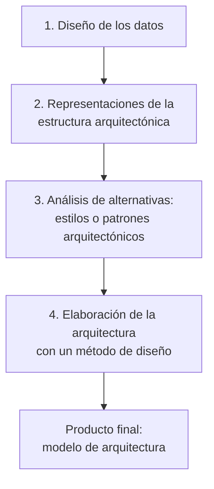

# Proceso de diseño arquitectónico

También llamado **arquitecting**: el proceso de la arquitectura del software. La presentación
lo cuenta en cuatro preguntas: *¿cuáles son los pasos?*, *¿cuál es el producto final?*,
*¿cómo me aseguro que lo hice bien?* y *¿qué permite?*

## ¿Cuáles son los pasos?

Cuatro, en este orden:

1. El diseño de la arquitectura comienza con el **diseño de los datos**.
2. Continúa con la obtención de las **representaciones de la estructura arquitectónica** del sistema.
3. Se analizan **alternativas de estilos o patrones arquitectónicos**.
4. Seleccionada la alternativa, se elabora la arquitectura con el empleo de un **método de diseño**.

El paso 1 sorprende a muchos: **se arranca por los datos**, no por las pantallas ni por los
módulos. Encaja con lo que dice [[Arquitecto de software]] sobre el diseñador de base de datos
creando la arquitectura de los datos, y con el arquitecto del sistema eligiendo el estilo
arquitectónico a partir de los requerimientos obtenidos durante el análisis de los datos.

![[adjuntos/arquitectura-de-software/arq-p21.png]]

## ¿Cuál es el producto final?

Un **modelo de arquitectura** que incluye:

- Los **datos** y la **estructura** del software.
- Las **propiedades** y **relaciones** (interacciones) que hay entre los componentes.

Fijate que es exactamente lo que piden las definiciones de [[Arquitectura de software]]:
componentes + propiedades externamente visibles + relaciones.

![[adjuntos/arquitectura-de-software/arq-p22.png]]

## ¿Cómo me aseguro que lo hice bien? — Comprobaciones

> En cada etapa se revisan los productos del trabajo del diseño del software para que sean
> **claros, correctos, completos y consistentes** con los requerimientos y entre sí.

Cuatro criterios, y ojo con el último: consistentes **con los requerimientos** *y* **entre sí**.
No basta que cada documento sea correcto por separado; tienen que no contradecirse. Esto es
verificación y validación aplicada al diseño.

![[adjuntos/arquitectura-de-software/arq-p23.png]]

## ¿Qué permite?

1. **Analizar la efectividad** del diseño para cumplir los requerimientos establecidos.
2. **Considerar alternativas arquitectónicas** en una etapa en la que hacer cambios al diseño
   todavía es relativamente fácil.
3. **Reducir los riesgos** asociados con la construcción del software.

El punto 2 es el argumento económico de todo el tema: el costo de cambiar crece con el tiempo,
así que el momento de probar alternativas es *ahora*, en el diseño, no en la construcción.
Es la misma idea del criterio de Booch — arquitectura es lo que sale caro cambiar.

![[adjuntos/arquitectura-de-software-v1/arqv1-p20.png]]

## Un ejemplo real

La presentación muestra un diagrama de una solución sobre **Amazon Web Services**, con el
modelo de datos aparte. Sirve para ver que el producto final no es un texto: es un conjunto de
diagramas de componentes y servicios con sus interacciones.

![[adjuntos/arquitectura-de-software-v1/arqv1-p18.png]]

## Notas relacionadas

- [[Arquitectura de software]]
- [[Arquitecto de software]]
- [[Beneficios de la arquitectura de software]]
- [[Modelo 4+1 vistas]]
- [[Arquitectura en el ciclo de vida del software]]
- [[Equilibrio de restricciones del proyecto]]

## Preguntas de repaso

1. Enumerá los cuatro pasos del diseño arquitectónico en orden.
2. ¿Por qué el proceso comienza con el diseño de los datos?
3. ¿Qué cuatro propiedades se revisan en las comprobaciones de cada etapa?
4. ¿Qué incluye el modelo de arquitectura que es el producto final?
5. ¿Por qué conviene considerar alternativas arquitectónicas temprano?
