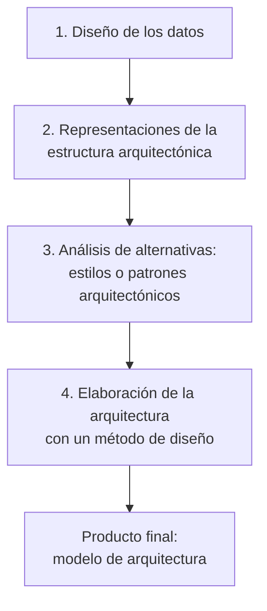
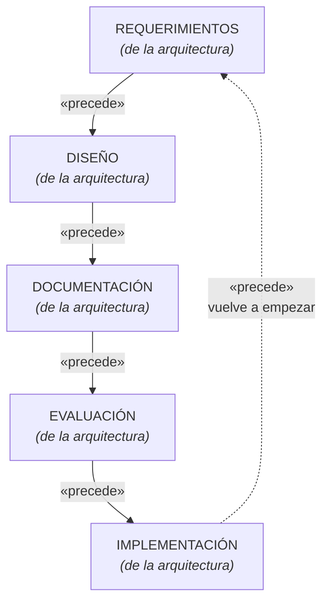
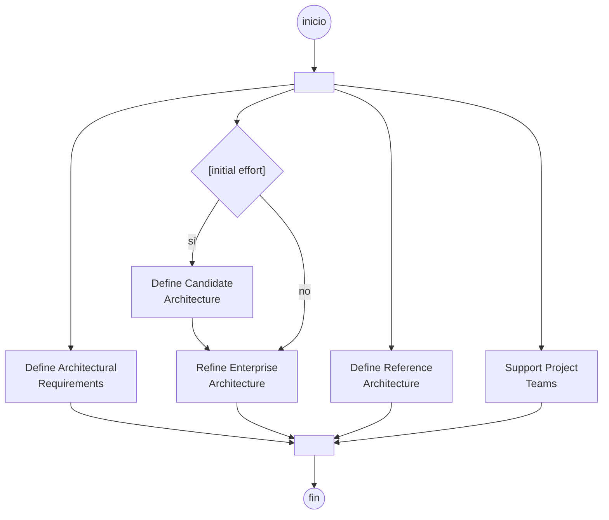

# Proceso de diseño arquitectónico

También llamado **arquitecting**: el proceso de la arquitectura del software. La presentación
lo cuenta en cuatro preguntas: *¿cuáles son los pasos?*, *¿cuál es el producto final?*,
*¿cómo me aseguro que lo hice bien?* y *¿qué permite?*

## ¿Cuáles son los pasos?

Cuatro, en este orden:

1. El diseño de la arquitectura comienza con el **diseño de los datos**.
2. Continúa con la obtención de las **representaciones de la estructura arquitectónica** del sistema.
3. Se analizan **alternativas de estilos o patrones arquitectónicos**.
4. Seleccionada la alternativa, se elabora la arquitectura con el empleo de un **método de diseño**.

El paso 1 sorprende a muchos: **se arranca por los datos**, no por las pantallas ni por los
módulos. Encaja con lo que dice [[Arquitecto de software]] sobre el diseñador de base de datos
creando la arquitectura de los datos, y con el arquitecto del sistema eligiendo el estilo
arquitectónico a partir de los requerimientos obtenidos durante el análisis de los datos.

![[adjuntos/arquitectura-de-software/arq-p21.png]]

## Los siete pasos, según la diapositiva "Pasos para la definición"

Además de los cuatro de arriba, la clase da una **lista de siete actividades** con el título
*"Pasos para la definición de una Arquitectura de software"*:

| # | Paso | Dónde está en la bóveda |
|---|---|---|
| 1 | **Creación del caso de negocio** para el sistema | [[Guía - Caso de negocio]] |
| 2 | **Entendimiento de los requisitos** | [[Drivers arquitectónicos]], [[Caso de uso del negocio]] |
| 3 | **Creación y selección** de la arquitectura | [[Estilos arquitectónicos]], [[Tácticas y patrones arquitectónicos]] |
| 4 | **Documentación y comunicación** de la arquitectura | [[Estructuras y vistas arquitectónicas]], [[Modelo 4+1 vistas]] |
| 5 | **Análisis o evaluación** de la arquitectura | [[Evaluación de la arquitectura]] |
| 6 | **Implementación** del sistema basado en la arquitectura | [[Arquitectura y proceso de desarrollo]] |
| 7 | **Aseguramiento** de que la implementación esté acorde a la arquitectura | ídem §3 |

![[adjuntos/capturas-clase/pasos-definicion-lista-7.png]]

> [!important] El paso 7 no es un adorno
> *"Aseguramiento de que la implementación esté **acorde** a la arquitectura"* es una actividad
> aparte de implementar. Es la **conformidad**: verificar que lo que se construyó sea lo que se
> diseñó. Sin ese paso, la arquitectura documentada y el sistema real se separan — y ahí empieza la
> deuda arquitectónica (→ [[Tácticas y patrones arquitectónicos]] §7).

### Y es un ciclo, no una lista

La otra diapositiva del mismo título lo dibuja como diagrama de actividad, con **`«precede»`** entre
etapas y una **flecha de retorno** desde implementación hasta requerimientos:

![[adjuntos/capturas-clase/pasos-definicion-ciclo-precede.png]]

**Cinco etapas y un lazo.** Eso confirma con fuente de clase lo que
[[Arquitectura en el ciclo de vida del software]] dice en palabras: *"es un proceso iterativo"*. Y se
corresponde casi uno a uno con el ciclo del SAIP que está en [[El ciclo del architecting]]:

| Clase (5 etapas) | SAIP (6 pasos) |
|---|---|
| **Requerimientos** | 1. entender el contexto + 2. elicitar los ASRs |
| **Diseño** | 3. diseñar (ADD) |
| **Documentación** | 4. documentar |
| **Evaluación** | 5. evaluar (ATAM) |
| **Implementación** | 6. realizar y sostener |

> [!tip] Ojo con el estereotipo
> Usó **`«precede»`**, no `«include»` ni `«extend»`. Es un estereotipo de **precedencia
> temporal**: "esto va antes que aquello". No confundirlo con las relaciones de casos de uso
> (→ [[Relaciones y dependencias en UML]]).

## El flujo de definición: las actividades son CONCURRENTES

La diapositiva *"Arquitectura del Software — Flujo de Definición"* (diagrama de actividad de
**Scott W. Ambler**, 2004-2005) muestra algo distinto y complementario: un **fork/join** — las
barras gruesas — con cuatro ramas **en paralelo**.

![[adjuntos/capturas-clase/arq-flujo-de-definicion-ambler.png]]

Tres lecturas que importan:

**1. Las actividades no son una fila.** Definir requisitos, definir la arquitectura de referencia y
**dar soporte a los equipos de proyecto** ocurren **al mismo tiempo**. El arquitecto no "termina" de
diseñar y después acompaña: hace las dos cosas en paralelo.

**2. La guarda `[initial effort]` es la clave del diagrama.** Solo en el **esfuerzo inicial** se
define una **arquitectura candidata**; en las vueltas siguientes se va directo a **refinar la
arquitectura empresarial**. O sea: la arquitectura candidata es un artefacto **de arranque**, no de
cada iteración.

**3. Aparecen dos términos del punto 1.9 del programa**, y por fin con fuente:

| Término de la diapositiva | Qué es |
|---|---|
| **Define Candidate Architecture** — *arquitectura candidata* | la primera propuesta, la que se produce en el esfuerzo inicial y todavía hay que validar |
| **Define Reference Architecture** — *arquitectura de referencia* | la que sirve de patrón para varios proyectos, más estable y transversal |
| **Refine Enterprise Architecture** | la arquitectura de **toda la organización**, que cada proyecto refina |
| **Support Project Teams** | el arquitecto **acompaña** a los equipos, en paralelo con todo lo demás |

Eso da tres niveles de alcance: **candidata** (este proyecto, primera vuelta) → **de referencia**
(reutilizable entre proyectos) → **empresarial** (la organización entera).

## ¿Cuál es el producto final?

Un **modelo de arquitectura** que incluye:

- Los **datos** y la **estructura** del software.
- Las **propiedades** y **relaciones** (interacciones) que hay entre los componentes.

Fijate que es exactamente lo que piden las definiciones de [[Arquitectura de software]]:
componentes + propiedades externamente visibles + relaciones.

![[adjuntos/arquitectura-de-software/arq-p22.png]]

## ¿Cómo me aseguro que lo hice bien? — Comprobaciones

> En cada etapa se revisan los productos del trabajo del diseño del software para que sean
> **claros, correctos, completos y consistentes** con los requerimientos y entre sí.

Cuatro criterios, y ojo con el último: consistentes **con los requerimientos** *y* **entre sí**.
No basta que cada documento sea correcto por separado; tienen que no contradecirse. Esto es
verificación y validación aplicada al diseño.

![[adjuntos/arquitectura-de-software/arq-p23.png]]

## ¿Qué permite?

1. **Analizar la efectividad** del diseño para cumplir los requerimientos establecidos.
2. **Considerar alternativas arquitectónicas** en una etapa en la que hacer cambios al diseño
   todavía es relativamente fácil.
3. **Reducir los riesgos** asociados con la construcción del software.

El punto 2 es el argumento económico de todo el tema: el costo de cambiar crece con el tiempo,
así que el momento de probar alternativas es *ahora*, en el diseño, no en la construcción.
Es la misma idea del criterio de Booch — arquitectura es lo que sale caro cambiar.

![[adjuntos/arquitectura-de-software-v1/arqv1-p20.png]]

## Un ejemplo real

La presentación muestra un diagrama de una solución sobre **Amazon Web Services**, con el
modelo de datos aparte. Sirve para ver que el producto final no es un texto: es un conjunto de
diagramas de componentes y servicios con sus interacciones.

![[adjuntos/arquitectura-de-software-v1/arqv1-p18.png]]

## Notas relacionadas

- [[Arquitectura de software]]
- [[Arquitecto de software]]
- [[Beneficios de la arquitectura de software]]
- [[Modelo 4+1 vistas]]
- [[Arquitectura en el ciclo de vida del software]]
- [[Equilibrio de restricciones del proyecto]]

## Preguntas de repaso

1. Enumerá los cuatro pasos del diseño arquitectónico en orden.
2. ¿Por qué el proceso comienza con el diseño de los datos?
3. ¿Qué cuatro propiedades se revisan en las comprobaciones de cada etapa?
4. ¿Qué incluye el modelo de arquitectura que es el producto final?
5. ¿Por qué conviene considerar alternativas arquitectónicas temprano?
