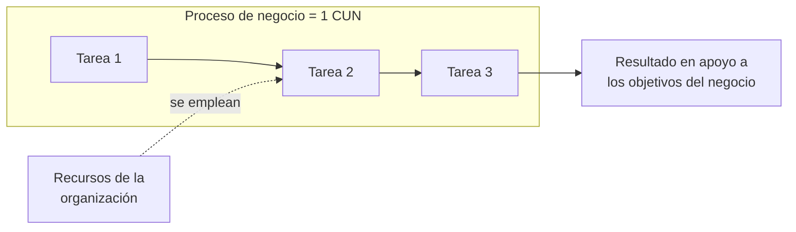

# Proceso de negocio

**Grupo de tareas lógicamente relacionadas que se llevan a cabo en una determinada secuencia y
manera y que emplean los recursos de la organización para dar resultados en apoyo a sus
objetivos.**

Vale desarmar la definición, porque cada parte descarta algo:

| Parte de la definición | Qué exige |
|---|---|
| grupo de **tareas** | más de una tarea; una tarea sola no es un proceso |
| **lógicamente relacionadas** | no es una lista arbitraria, hay una razón que las une |
| en una determinada **secuencia y manera** | hay un orden y una forma de hacerlo |
| emplean los **recursos de la organización** | consume gente, dinero, tiempo, equipos |
| resultados **en apoyo a sus objetivos** | apunta a un objetivo del negocio, no a sí mismo |

## La consecuencia para el modelado

> **Un CUN representa a un proceso de negocio.**

Es la bisagra de todo el tema: si un proceso de negocio cumple esa definición, entonces le
corresponde **un** [[Caso de uso del negocio]]. Y por lo tanto **identificar procesos = identificar
CUN** → [[Identificación de procesos del negocio]].

![[adjuntos/cdu-negocio-modelado-drivers-rf/cdu-p10.png]]

## No confundir con "función"

Al identificar procesos por agrupamiento de actividades aparece otro término:

> **Función**: un grupo funcional que responde a un objetivo de la organización y que puede
> involucrar a varias áreas.

Una **función** agrupa **varios** procesos de negocio. Por ejemplo, la función *Compras*
contiene los procesos *Elección de proveedores* y *Pago a proveedores*. La función **no** es un
CUN; los procesos que contiene, sí. Los ejemplos completos están en
[[Identificación de procesos del negocio]].

## No confundir con "proceso" de un DFD

El *proceso* del que habla un DFD es otra cosa: ahí un proceso es una **transformación de flujos
de entrada en flujos de salida**, y puede ser un pedazo interno del sistema. El proceso de
negocio es de más alto nivel y se mira desde afuera. La comparación completa está en
[[Casos de uso vs DFD]].

## Notas relacionadas

- [[Caso de uso del negocio]]
- [[Identificación de procesos del negocio]]
- [[Modelo de casos de uso del negocio]]
- [[Casos de uso vs DFD]]

## Preguntas de repaso

1. Dá la definición de proceso de negocio y explicá qué exige cada parte.
2. ¿Cuál es la relación numérica entre procesos de negocio y CUN?
3. ¿Qué diferencia hay entre una **función** y un **proceso de negocio**? Dá un ejemplo.
4. ¿Por qué el "proceso" de un DFD no es lo mismo que un proceso de negocio?
