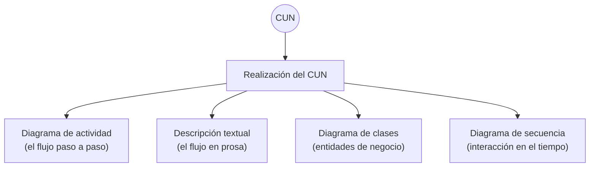

# Realizaciones de casos de uso del negocio

Las **realizaciones de CUN** muestran la manera en que **colaboran los trabajadores y entidades
de negocio** para ejecutar el proceso.

Esta es la pieza que completa el modelo. El diagrama de CUN muestra el **qué** desde afuera
(actores y procesos); la realización muestra el **cómo** desde adentro (quién hace qué, en qué
orden, con qué datos).

## La distinción clave: afuera vs adentro

| | Diagrama de CUN | Realización de CUN |
|---|---|---|
| Qué muestra | Actores y casos de uso del negocio | Trabajadores y entidades de negocio |
| Perspectiva | **Externa** al negocio | **Interna** al negocio |
| Regla | Cada [[Actor del negocio\|actor]] modela algo **fuera** del negocio | Los trabajadores están **dentro** |

Por eso los **trabajadores del negocio no son actores**: están adentro. El *Comercial*, el *Jefe
Técnico* y el *Jefe de Producción* del ejemplo de [[Descripción textual de casos de uso]] son
trabajadores, no actores — el único actor de ese CUN es el *Cliente*.

## Con qué se documentan

Cuatro artefactos:

- **Diagramas de actividad**
- **Descripción textual**
- **Diagramas de clases**
- **Diagramas de secuencia**

Cada uno mira lo mismo desde un ángulo distinto: actividad y descripción textual cuentan el
**flujo**, clases cuenta la **estructura** de las entidades de negocio, y secuencia cuenta la
**interacción en el tiempo** entre los trabajadores.

![[adjuntos/cdu-negocio-modelado-drivers-rf/cdu-p25.png]]

## Conexión con arquitectura

Esta lista de cuatro diagramas para documentar una misma cosa desde ángulos distintos es la
misma idea del [[Modelo 4+1 vistas]] y de
[[Estructuras y vistas arquitectónicas]]: **un modelo, varias vistas, cada una para una
audiencia y una pregunta**. Acá el objeto es un proceso de negocio; allá es el sistema completo.

## Notas relacionadas

- [[Caso de uso del negocio]]
- [[Modelo de casos de uso del negocio]]
- [[Descripción textual de casos de uso]]
- [[Actor del negocio]]
- [[Modelo 4+1 vistas]]

## Preguntas de repaso

1. ¿Qué muestran las realizaciones de CUN y en qué se diferencian del diagrama de CUN?
2. ¿Por qué un trabajador del negocio no es un actor del negocio?
3. Nombrá los cuatro artefactos con los que se documenta una realización.
4. ¿Cuál de esos cuatro cuenta la interacción en el tiempo y cuál la estructura de las entidades?
