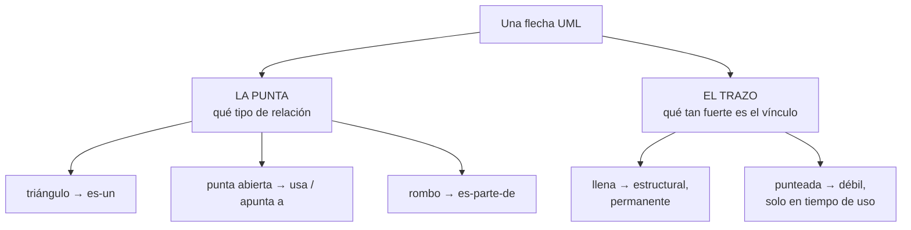

# Relaciones y dependencias en UML

Qué significa cada flecha, hacia dónde apunta y cómo se dibuja.

> [!warning] Nota de COMPLEMENTO
> Las presentaciones nombran la **dependencia** como concepto —la tabla de Reynoso lista los
> conceptos de la vista de despliegue como *"nodo, componente, **dependencia**, localización"*— pero
> no explican su notación. Todo lo que sigue viene de fuentes externas, cada una citada en su
> sección. Si la clase dice algo distinto, **manda la clase**.

---

## 1. La regla que ordena todo

No hay que memorizar seis flechas. Hay **dos ejes independientes**:

| Eje | Qué comunica |
|---|---|
| **La punta** | **Qué tipo** de relación es |
| **El trazo** | Si es **estructural** (línea llena) o **débil / de dependencia** (línea punteada) |

Combinando los dos ejes salen los seis casos, y se entiende por qué se parecen de a pares:

- **Triángulo + llena** = generalización · **triángulo + punteada** = realización
- **Punta abierta + llena** = asociación dirigida · **punta abierta + punteada** = **dependencia**
- **Rombo hueco** = agregación · **rombo macizo** = composición

## 2. Las seis relaciones, con precisión

| Relación | Trazo | Punta | Va de → a | Qué significa | Mermaid |
|---|---|---|---|---|---|
| **Generalización** | llena | triángulo **hueco** | del **específico** al **general** | "el hijo *es un* tipo de padre" | `--\|>` |
| **Realización** | **punteada** | triángulo **hueco** | del **que implementa** a la **interfaz** | "cumplo este contrato" | `..\|>` |
| **Asociación** | llena | ninguna, o punta abierta si es dirigida | según navegabilidad | vínculo estructural estable | `--` o `-->` |
| **Dependencia** | **punteada** | punta **abierta** | del **cliente** al **proveedor** | "si cambia el proveedor, puede que tenga que cambiar yo" | `..>` |
| **Agregación** | llena | rombo **hueco**, en el **todo** | de la **parte** al **todo** | el todo agrupa partes, pero pueden vivir sin él | `--o` |
| **Composición** | llena | rombo **macizo**, en el **todo** | de la **parte** al **todo** | si muere el todo, mueren las partes | `--*` |

### La dependencia, en detalle

Es la que faltaba en la bóveda y la más fácil de confundir con una asociación.

**Dirección: cliente → proveedor.** Verificado en la documentación de StarUML, que describe cómo se
dibuja: *"seleccionar la herramienta, arrastrar desde el elemento **cliente** y soltar sobre el
elemento **proveedor**"*. O sea: **la flecha sale del que depende y apunta al que se depende.**

**Qué la distingue de una asociación:** la asociación es un vínculo **estructural** —el objeto A
*tiene* una referencia a B, y eso vive en el diseño—. La dependencia es más débil: A **usa** a B en
algún momento (lo recibe por parámetro, lo instancia y lo suelta, importa su tipo) pero no lo
guarda. Por eso va punteada: no hay estructura permanente.

**El criterio práctico:** *¿si cambio B, tengo que revisar A?* Si sí y no hay estructura entre
ellos, es dependencia.

### Agregación vs composición

Las dos son "es-parte-de" y la diferencia es la **propiedad del ciclo de vida**:

| | Rombo | Ciclo de vida | Ejemplo |
|---|---|---|---|
| **Agregación** | hueco | la parte **sobrevive** al todo | un `Departamento` agrupa `Empleado`s: si se cierra el departamento, los empleados siguen existiendo |
| **Composición** | macizo | la parte **muere** con el todo | un `Pedido` compone `LineaPedido`s: si se borra el pedido, sus líneas no tienen sentido |

En StarUML las dos son **la misma cosa con una propiedad distinta**: la documentación las define como
*"una asociación cuya propiedad `aggregation` es `shared`"* (agregación) o *`composite`*
(composición). Por eso se dibujan igual salvo el relleno del rombo.

---

## 3. `«include»`, `«extend»` y `«deploy»` son dependencias

Esto es lo que conecta las flechas de casos de uso con el resto, y explica de una vez **por qué van
punteadas**.

El libro *Large-Scale Software Architecture* (cap. 5) aclara que el estereotipo de UML se aplica
tanto a clases como a **relaciones**: *"Figure 5.2 provides an illustration of a stereotyped class
and a stereotyped **relationship**"*. El nombre va entre `«»`.

Entonces:

| Estereotipo | Es, por debajo | Cliente (de dónde sale) | Proveedor (a dónde apunta) |
|---|---|---|---|
| `«include»` | una dependencia | el CU **base** | el CU **incluido** |
| `«extend»` | una dependencia | el CU de **extensión** | el CU **base** |
| `«deploy»` | una dependencia | el **artefacto** | el **nodo** |

Y todas cumplen la misma regla: **la flecha sale del que depende.**

- El CU base **depende** del incluido, porque sin él su flujo queda incompleto → `base ..> incluido`.
- La extensión **depende** del base, porque necesita saber a quién y en qué punto se engancha; el
  base no sabe que existe → `extensión ..> base`.
- El artefacto **depende** del nodo donde se despliega → `artefacto ..> nodo`.

Las direcciones ya estaban en [[Relación de inclusión include]], [[Relación de extensión extend]] y
[[Diagrama de despliegue]]. Lo que faltaba era **el por qué son punteadas**: son dependencias
estereotipadas, no relaciones estructurales.

La generalización entre casos de uso, en cambio, **es llena con triángulo**, igual que entre clases:
no es una dependencia, es un "es-un". Ver
[[Generalización y especialización en casos de uso]].

---

## 4. El puente con la matriz de dependencias

Acá está lo que hace que esto no sea trivia de notación.

**La flecha del diagrama y la marca de la matriz son la misma relación**, en dos representaciones.

En [[Guía - Matrices de trazabilidad]] la matriz *Drivers RF vs. Drivers RF* se lee **fila depende de
columna**. Y en el diagrama la flecha sale del que depende. Entonces:

| En el diagrama | En la matriz |
|---|---|
| la **cola** de la flecha (RF-02) | la **fila** |
| la **punta** de la flecha (RF-01) | la **columna** |

O sea: **cola = fila, punta = columna.** Si tenés el diagrama, la matriz se llena leyendo flechas;
si tenés la matriz, el diagrama se dibuja leyendo marcas. Son intercambiables, y por eso la matriz
detecta cosas que el diagrama esconde:

| En la matriz | Qué es en el diagrama |
|---|---|
| columna muy poblada | un nodo al que **llegan** muchas flechas → requisito **crítico** |
| fila muy poblada | un nodo del que **salen** muchas flechas → requisito **frágil** |
| un ciclo | flechas que vuelven sobre sí mismas → **problema de diseño** |

En un diagrama con veinte requisitos el ciclo es invisible; en la matriz salta.

---

## 5. Lo que Mermaid dibuja mal (verificado)

> [!warning] Esto lo comprobé, no lo asumí
> Rendericé las seis relaciones con **Mermaid 11** e inspeccioné los marcadores del SVG resultante.
> Todos los marcadores salen con `fill: rgb(0, 0, 0)` — **macizos**.

| Relación | UML manda | Mermaid dibuja | Consecuencia |
|---|---|---|---|
| Generalización | triángulo **hueco** | triángulo **macizo** | cosmético: se entiende igual |
| Realización | triángulo **hueco** + punteada | triángulo **macizo** + punteada | cosmético |
| **Agregación** | rombo **hueco** | rombo **macizo** | **grave** |
| **Composición** | rombo **macizo** | rombo **macizo** | **grave** |

**El problema serio son las dos últimas: en Mermaid la agregación y la composición se ven
idénticas.** Y en UML la única diferencia entre ellas *es* el relleno del rombo. En un diagrama de
clases hecho en Mermaid, nadie puede distinguir a simple vista si la parte sobrevive al todo o no.

Lo que Mermaid **sí** respeta correctamente: el **trazo**. Verifiqué las clases del SVG y coinciden
con UML — `edge-pattern-solid` para generalización, asociación, agregación y composición;
`edge-pattern-dashed` para realización y dependencia.

**Qué hacer con esto:**

- Para **pensar y documentar en la nota**, Mermaid alcanza: la sintaxis distingue `--o` de `--*`
  aunque el dibujo no.
- Para el **entregable formal**, el diagrama de clases va a StarUML, que respeta la notación. Y es
  uno de los 7 tipos que sí se importan por Mermaid → ver [[StarUML]].
- Si entregás un diagrama de clases hecho en Mermaid y usaste agregación y composición, **aclaralo
  por escrito**, porque el dibujo no lo va a mostrar.

---

## 6. Errores típicos

| Error | Lo correcto |
|---|---|
| Dependencia con línea **llena** | Va **punteada**. La línea llena es estructural |
| Flecha de dependencia apuntando al **cliente** | Sale del cliente, apunta al **proveedor**: del que depende al que se depende |
| `«extend»` apuntando del base a la extensión | Al revés: **extensión → base**. El base no sabe que lo extienden |
| Confundir dependencia con asociación | ¿Hay una referencia guardada? asociación. ¿Solo lo usa y lo suelta? dependencia |
| Rombo en la **parte** | El rombo va siempre en el **todo** |
| Triángulo **macizo** en un entregable formal | UML lo quiere hueco. Si lo generaste con Mermaid, redibujalo en StarUML |
| Poner punta en las dos direcciones | Si la relación es bidireccional, se dibuja **sin puntas** |

---

## Fuentes

- **docs.staruml.io**, *Class Diagram*: la dependencia se traza del **cliente** al **proveedor**; la
  generalización del **especializado** al **general**; agregación y composición son asociaciones con
  la propiedad `aggregation` en `shared` o `composite`.
- **Garland & Anthony**, *Large-Scale Software Architecture*, cap. 5: los estereotipos `«»` se aplican
  también a **relaciones**; los *tagged values* `{}` se usan sobre dependencias, nodos y asociaciones.
- **Reynoso**, *Introducción a la Arquitectura de Software*: la tabla de vistas UML lista
  **dependencia** entre los conceptos de la vista de despliegue y de la de implementación.
- **Verificación propia**: render de las seis relaciones con Mermaid 11 e inspección de los
  marcadores y patrones de trazo del SVG.

## La tabla resumen de la clase

Hay una diapositiva titulada **"Resumen de los Tipos de Relaciones en UML"** que pone las cuatro en
una sola tabla, con su función y su notación. Vale tenerla a mano porque es la respuesta directa si
la piden enumeradas:

| Relación | Función | Notación |
|---|---|---|
| **Asociación** | camino de comunicación entre un actor y un caso de uso en el que participa | línea llena |
| **Extiende** | inserción de comportamiento **adicional** en un caso de uso base, *sin que éste tenga conocimiento* | punteada con `«extiende»` |
| **Generalización** | relación entre un caso de uso **general** y otro más **específico** que hereda características y añade otras | **línea llena** con **triángulo hueco** |
| **Incluye** | inserción de comportamiento adicional dentro de un caso de uso que **explícitamente describe la inserción** | punteada con `«incluye»` |

![[adjuntos/capturas-clase/resumen-tipos-de-relaciones-uml.png]]

> [!warning] Ojo con la notación de la generalización
> Es **línea llena** con triángulo hueco — **no punteada**. Las otras dos (*extiende*, *incluye*) sí
> son punteadas, porque son **dependencias**; la generalización no es una dependencia, es herencia.
>
> Esa es la regla general de UML y sirve para no dudar: **dependencia = punteada**, **herencia =
> llena**.

### Siete grafías para dos relaciones: la tabla de reconciliación

El material de clase escribe estos estereotipos de **siete formas distintas**, según el deck. Todas
nombran **las mismas dos relaciones** — no hay diferencia semántica entre ellas:

| Forma | Dónde aparece en el material |
|---|---|
| `«extiende»` · `«incluye»` | la tabla *Resumen de los Tipos de Relaciones* (la de arriba) |
| `«extends»` · `«include»` | las diapositivas de definición (*Extensión* / *Inclusión*) |
| `«extender»` | el expandido del restaurante, con guardas `{si se pidió vino}` |
| `«includes»` · `«extends»` | el expandido *Procesamiento de Pedido* |

> [!important] Las tres reglas para no equivocarse
> **1. En una entrega: elegí UNA pareja y sé consistente.** Da igual cuál —`«include»`/`«extend»` es
> la más común en UML— pero mezclarlas en el mismo documento se lee como descuido.
>
> **2. Al citar una diapositiva: citá textual.** Si estás reproduciendo su tabla resumen, va
> `«extiende»`; si reproducís el expandido del restaurante, va `«extender»`. La cita se respeta.
>
> **3. Nunca son relaciones distintas.** Si en un examen aparecen dos grafías, no hay trampa: es la
> misma relación con otro rótulo. Lo que cambia el significado es la **dirección de la flecha** y el
> **tipo de línea**, no la palabra.

Ver [[Relación de inclusión include]] y [[Relación de extensión extend]] para el mecanismo de cada
una, y [[Ejemplos resueltos de casos de negocio]] para verlas usadas en sus cuatro casos.

> [!important] La frase que distingue extiende de incluye, en una línea
> **Extiende:** *"sin que éste tenga conocimiento"* — el base **no sabe** que lo extienden.
> **Incluye:** *"que explícitamente describe la inserción"* — el base **sí sabe** y decide dónde.
>
> Esa es la diferencia conceptual, y explica por qué la flecha va al revés en cada una.

## Notas relacionadas

- [[Relación de inclusión include]] · [[Relación de extensión extend]] — dependencias estereotipadas
- [[Generalización y especialización en casos de uso]] — la que **no** es dependencia
- [[Diagrama de despliegue]] — `«deploy»`, y la dependencia en la vista de despliegue
- [[Matriz de trazabilidad de requisitos]] — la misma relación, en tabla
- [[Guía - Matrices de trazabilidad]] — cola = fila, punta = columna
- [[De la teoría al diagrama]] — la sintaxis Mermaid de cada relación
- [[StarUML]] — dónde el diagrama formal respeta la notación

## Preguntas de repaso

1. ¿Qué comunica la **punta** de una flecha UML y qué comunica el **trazo**?
2. ¿Hacia dónde apunta una dependencia: al cliente o al proveedor?
3. ¿Cuál es el criterio práctico para distinguir dependencia de asociación?
4. ¿Por qué `«include»`, `«extend»` y `«deploy»` se dibujan punteadas?
5. Si el CU base depende del incluido, ¿de dónde sale la flecha de `«include»`?
6. ¿Cuál es la única diferencia de notación entre agregación y composición, y qué significa?
7. En la matriz de dependencias, ¿a qué corresponden la **cola** y la **punta** de la flecha?
8. ¿Qué dos relaciones dibuja Mermaid de forma indistinguible, y por qué es un problema?
