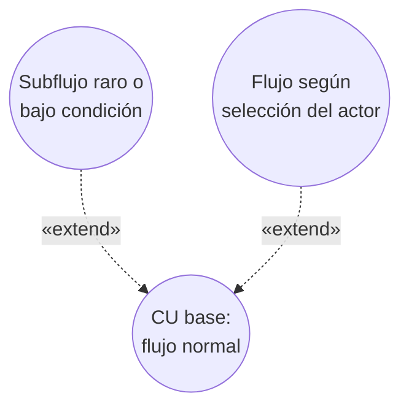

# Relación de extensión `<extend>`

La segunda relación de los **CUN expandidos**, junto con
[[Relación de inclusión include]] y [[Generalización y especialización en casos de uso]].

## De dónde sale

> Una vez definido el workflow de un caso de uso del negocio, se puede encontrar alguna
> **conducta opcional u optativa**.

Ese es el punto de partida: primero se define el flujo normal del CUN, y **después** aparecen
comportamientos que no siempre pasan. Esos se sacan a un CU aparte que **extiende** al base.

Fijate en la dirección de la flecha: apunta **desde** el CU que extiende **hacia** el base. Es
al revés que en `<include>`. Tiene lógica: el base no necesita saber que alguien lo extiende
—sigue funcionando igual sin la extensión—, pero la extensión sí necesita saber a quién y en
qué punto se engancha.

## ¿Cuándo tiene sentido definir un nuevo CU?

Dos situaciones:

1. **Modelar un workflow complejo o un subflujo separado, que raramente ocurre u ocurre bajo
   ciertas condiciones.**
2. **Flujos distintos que pueden ejecutarse en base a la selección del actor.**

El caso 1 es el excepcional: un trámite especial que se da una vez cada tanto y que, metido en
el flujo principal, lo ensuciaría. El caso 2 es el de la bifurcación: el actor elige, y cada
opción es un flujo distinto.

![[adjuntos/cdu-negocio-modelado-drivers-rf/cdu-p20.png]]

## `include` vs `extend`, en una tabla

| | `<include>` | `<extend>` |
|---|---|---|
| ¿Siempre ocurre? | **Sí** | **No** — opcional u optativa |
| Dirección de la dependencia | base → incluido | extensión → base |
| Motivo | Reutilizar comportamiento o simplificar la comprensión | Conducta opcional, subflujo raro, o elección del actor |
| Sin el otro CU, el base… | queda **incompleto** | **funciona igual** |

La última fila es la mejor prueba: **tapá el CU secundario y leé el base.** Si el proceso queda
incompleto, era `include`. Si el proceso se sigue entendiendo de punta a punta, era `extend`.

Y ojo con no confundir esto con el **curso alterno** de la
[[Descripción textual de casos de uso]]: el curso alterno es la variante contada en el texto del
mismo caso de uso; `<extend>` es cuando esa variante se saca a un caso de uso propio porque es
compleja o rara.

## Notas relacionadas

- [[Caso de uso del negocio]]
- [[Relación de inclusión include]]
- [[Generalización y especialización en casos de uso]]
- [[Descripción textual de casos de uso]]

## Preguntas de repaso

1. ¿En qué momento del modelado aparece la necesidad de un `<extend>`?
2. ¿Hacia dónde apunta la flecha de `<extend>` y por qué en esa dirección?
3. Nombrá las dos situaciones en que tiene sentido definir un nuevo CU de extensión.
4. Explicá la prueba de "tapar el CU secundario" para distinguir `include` de `extend`.
5. ¿Qué diferencia hay entre un `<extend>` y un curso alterno?
