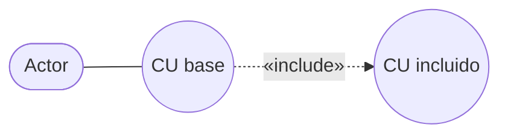
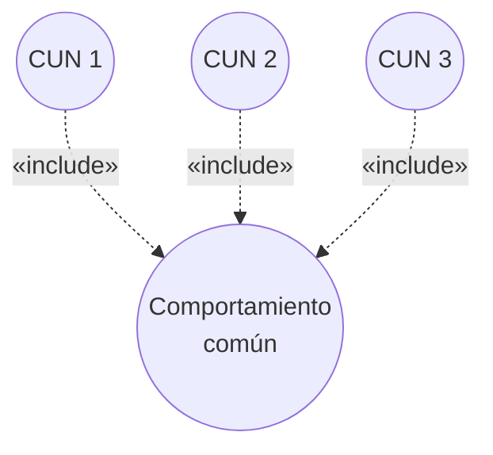

# Relación de inclusión `<include>`

Una de las tres relaciones de los **CUN expandidos**, junto con
[[Relación de extensión extend]] y [[Generalización y especialización en casos de uso]].

## Definición

> Una relación que especifica un comportamiento definido para el CU de inclusión que se
> **inserta explícitamente** dentro del comportamiento definido para el **CU base**.

La palabra clave es **explícitamente**: el CU base *sabe* que incluye al otro y lo llama en un
punto determinado de su flujo. No es opcional ni condicional — siempre pasa.

Y la consecuencia, que la presentación resalta en rojo:

> **El workflow del proceso entero está en el caso de uso base y el (los) caso(s) de uso
> incluido(s).**

O sea: para leer el proceso completo hay que leer el base **más** todos los incluidos. Ninguno
de los dos cuenta la historia solo.

![[adjuntos/cdu-negocio-modelado-drivers-rf/cdu-p18.png]]

## ¿Cuándo se justifica?

Dos criterios, y basta con **uno** de los dos (la presentación los une con "o"):

1. **Reutilización** — se puede reusar en otros CUN el comportamiento incluido en el caso de
   uso base.
2. **Comprensión** — simplifica la comprensión del caso de uso base.

El criterio 1 es el caso clásico: tres procesos distintos hacen todos el mismo subpaso, así que
ese subpaso se extrae una vez y los tres lo incluyen. El criterio 2 es más blando pero igual de
válido: aunque nadie más lo reuse, si el CU base quedó ilegible por su largo, partirlo con un
`<include>` ayuda a entenderlo.

![[adjuntos/cdu-negocio-modelado-drivers-rf/cdu-p19.png]]

## Cómo no confundirla con `<extend>`

| | `<include>` | `<extend>` |
|---|---|---|
| ¿Siempre ocurre? | **Sí**, se inserta explícitamente | **No**, es opcional u optativa |
| ¿Quién conoce a quién? | El **base** conoce al incluido | El **extendido** conoce al base |
| Motivo típico | Reutilizar o simplificar | Conducta opcional, subflujo raro, elección del actor |

La prueba práctica: preguntate **"¿esto pasa siempre?"**. Si la respuesta es sí, es `include`;
si es "solo a veces / bajo ciertas condiciones", es `extend`.

## La definición formal del deck

> - Un caso de uso base **incorpora explícitamente** el comportamiento de otro caso de uso **en el
>   lugar especificado en el caso base**.
> - Se usa para **evitar describir el mismo flujo de eventos repetidas veces**, poniendo el
>   comportamiento común en un caso de uso aparte.
> - Se representa como una **dependencia estereotipada** con `«include»`.

> [!important] "En el lugar especificado en el caso base" es la clave
> La inclusión **no es en cualquier momento**: el base dice **dónde** se inserta. Y lo dice
> *explícitamente* — a diferencia de `«extend»`, donde el base solo marca puntos disponibles y no sabe
> quién los usa.
>
> | | `«include»` | `«extend»` |
> |---|---|---|
> | ¿El base sabe? | **sí**, describe la inserción | **no**, solo declara puntos |
> | ¿Cuándo ocurre? | **siempre** | **a veces** |
> | Dirección de la flecha | base → incluido | extendido → base |
>
> Ver [[Relación de extensión extend]] para el otro lado de la tabla.

## Un ejemplo con las tres relaciones a la vez

La clase cierra el tema con un diagrama completo donde conviven `«extends»` e `«Include»`:

![[adjuntos/capturas-clase/ejemplo-completo-expandido-maquina.png]]

*Depositar Botella*, *Depositar Tarro* y *Depositar Jaba* **extienden** a *Depositar Item*; y
*Depositar Item* **incluye** *Imprimir* y *Generar Alarma*. Del otro lado el **Operador** tiene
*Generar Reporte* y *Cambiar Item*.

> [!important] Lo que enseña el ejemplo
> Las tres variantes de depósito son **`«extends»`** porque cada una es un **caso particular** del
> depósito genérico — no todas ocurren siempre. En cambio *Imprimir* y *Generar Alarma* son
> **`«include»`** porque **todo** depósito imprime y puede alarmar.
>
> Es la prueba de una palabra otra vez: *extends* = "solo a veces"; *include* = "siempre".

## Notas relacionadas

- [[Caso de uso del negocio]]
- [[Relación de extensión extend]]
- [[Generalización y especialización en casos de uso]]
- [[Modelo de casos de uso del negocio]]

## Preguntas de repaso

1. Definí la relación de inclusión. ¿Qué significa que se inserta "explícitamente"?
2. ¿Dónde está el workflow del proceso entero cuando hay un `<include>`?
3. ¿Cuáles son los dos criterios que justifican usar `<include>`? ¿Hacen falta los dos?
4. Dá la pregunta rápida que te permite distinguir `<include>` de `<extend>`.
