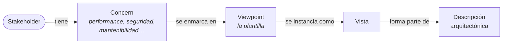
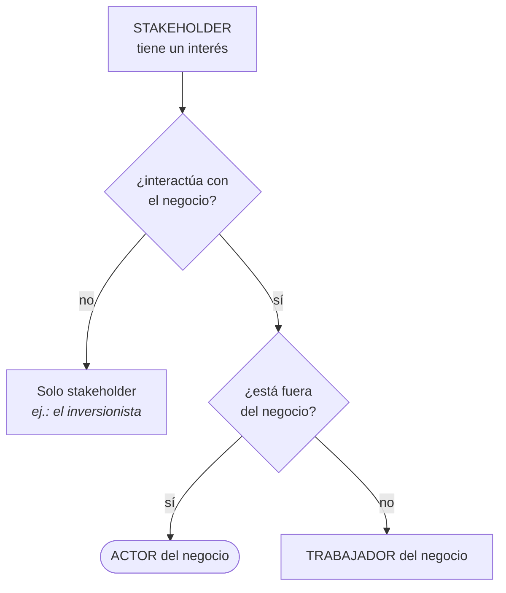

# Stakeholders

Los **participantes del proyecto**: quienes tienen algo en juego en el sistema. Identificarlos bien es
la mitad del trabajo de obtener requisitos, porque **cada requisito de calidad viene de alguien**.

> [!info] Esta nota sí tiene núcleo de clase
> La presentación dedica una diapositiva entera al tema, dentro del primer beneficio de la
> arquitectura. Lo que sigue arranca con eso (sección 1) y después complementa con ISO 42010, el SAIP
> y Garland & Anthony, marcado en cada sección.

---

## 1. Lo que dice la clase (núcleo)

El **primer beneficio** de una arquitectura de software es que *"proporciona la comunicación entre
stakeholders (participantes del proyecto)"*. Y la diapositiva muestra **por qué eso hace falta**:
cinco stakeholders le piden al sistema cosas distintas, y el arquitecto en el medio dice *"Ohhhh…"*.

| Stakeholder | Lo que le pide al sistema |
|---|---|
| **Director de la organización de desarrollo** | Bajos costos, mantener la gente empleada |
| **Mercadeo** | Características o rasgos, corto tiempo para el mercadeo, bajos costos |
| **Usuario final** | Comportamiento, rendimiento, seguridad, confiabilidad, usabilidad |
| **Organización del mantenimiento** | Modificabilidad |
| **Cliente** | Bajos costos, tiempo de entrega, pocos cambios en corto tiempo |

![[adjuntos/arquitectura-de-software/arq-p18.png]]

**La lección de esa diapositiva no es la lista, es el conflicto.** Casi todos piden *bajos costos*,
pero el usuario final pide rendimiento y seguridad, y mantenimiento pide modificabilidad — y esas
cosas cuestan. El arquitecto no puede satisfacer a todos: tiene que **equilibrar**
(→ [[Equilibrio de restricciones del proyecto]]).

Y hay una segunda aparición en la clase: los stakeholders son **una de las cuatro influencias** que
moldean la arquitectura, y junto con las organizaciones de desarrollo son las dos que producen los
**requisitos de calidad** (→ [[Ciclo de influencias en la arquitectura]]).

Detalle que la presentación repite en dos lugares y conviene registrar: la arquitectura *"involucra
una gran variedad de stakeholders"*, y es importante *"porque permite que se comuniquen"*
(→ [[Arquitectura en el ciclo de vida del software]]).

---

## 2. La definición formal *(complemento — ISO/IEC/IEEE 42010)*

El estándar que gobierna la descripción arquitectónica define dos términos que van juntos:

> **Stakeholders**: *"individuos, equipos u organizaciones con un interés en la entidad de interés"*.
>
> ***Concerns***: *"los intereses que los stakeholders tienen en la entidad de interés, tales como
> performance, seguridad o mantenibilidad"*.

Dos cosas de esas definiciones:

**Un stakeholder puede ser una organización, no solo una persona.** El Ministerio de Salud, la
Contraloría o una consultora externa son stakeholders tanto como el usuario final.

**El *concern* es el puente hacia la arquitectura.** El stakeholder no aporta requisitos sueltos:
aporta **intereses**, y esos intereses se enmarcan en vistas. El modelo de 42010 encadena así:

Y el ***rationale*** del estándar es *"la justificación de las decisiones arquitectónicas,
**ligándolas a los concerns de los stakeholders** y a otros requerimientos"*. O sea: una decisión sin
un stakeholder detrás no tiene justificación posible.

Ver [[Estructuras y vistas arquitectónicas]] para la relación viewpoint/vista.

---

## 3. Los stakeholders no saben lo que quieren *(complemento — SAIP)*

Este es el punto más útil en la práctica, y el SAIP lo dice sin rodeos:

> Los stakeholders **a menudo no saben** cuáles son sus requerimientos de calidad: es una
> **oportunidad de colaboración**, no motivo de queja.

El arquitecto no es un tomador de pedidos: aporta la experiencia de sistemas similares. Los dos
movimientos que propone el libro:

- *"¿24/7? Te explico cuánto cuesta y decidís el tradeoff con la afordabilidad."*
- *"Puedo entregarte algo mejor de lo que tenías en mente, ¿te sirve?"*

De ahí sale la distinción que después usa toda la elicitación:

| | Qué es |
|---|---|
| **Lo que dice que quiere** | Su formulación, casi siempre sin medida y a veces confundiendo el medio con el fin |
| **Lo que realmente necesita** | El requisito de calidad detrás, con su medida |

El enunciado del [[Plan - Caso 1 FarmaHosp|Caso 1]] está construido exactamente sobre esa distinción:
su tabla de stakeholders tiene una columna *"lo que dicen que quieren"* y otra *"lo que realmente
necesitan (necesidad oculta)"*.

Para sacarles un número, la técnica de **hacerse el tonto** de Kazman está en
[[Atributos de calidad]].

---

## 4. De dónde vienen los requisitos: las tres fuentes *(complemento — SAIP)*

Los requisitos de calidad no salen solo de preguntarle a la gente. El SAIP identifica tres fuentes, y
los stakeholders aparecen en las tres:

| Fuente | Método | Qué aporta |
|---|---|---|
| **Los artefactos del sistema** | leer lo que ya existe | requisitos implícitos en el entorno |
| **Entrevistar stakeholders** | **QAW** (Quality Attribute Workshop) | escenarios generados y priorizados por el grupo |
| **Las metas de negocio** | **PALM** | el *por qué* detrás de cada requisito |

### PALM y las metas de negocio

> Las metas de negocio son **la razón de ser** del sistema.

Y su relación con la arquitectura puede ser de tres tipos:

1. **Conducen a requisitos de calidad.** Todo requerimiento de calidad se origina en algún propósito
   de valor: *diferenciarse de la competencia → tiempo de respuesta inusualmente exigente*. Y conocer
   la meta permite **cuestionar el requerimiento con sentido**.
2. **Afectan la arquitectura directamente, sin inducir ningún atributo de calidad.** La anécdota del
   libro: un gerente exigió agregar una base de datos que el arquitecto había evitado elegantemente…
   porque la organización tenía una unidad de DBAs caros y ociosos que necesitaban trabajo. Ninguna
   especificación capturaría eso, y sin embargo la arquitectura sin base de datos habría sido
   *"deficiente"*.
3. **No influyen en absoluto.**

El **método PALM** es un taller que elicita las metas (como *business goal scenarios* de siete
partes), las consolida, las prioriza, y por cada una identifica el atributo de calidad y la medida de
respuesta que la lograrían.

Sus **categorías de metas**, que sirven de checklist para no olvidar ningún stakeholder:

- crecimiento y continuidad
- objetivos financieros
- objetivos personales
- responsabilidad hacia empleados, sociedad, estado y accionistas
- posición de mercado
- mejora de procesos
- calidad y reputación del producto
- gestión del cambio del entorno

> [!tip] Para qué sirve esa lista
> Es un **generador de stakeholders**. Si tu lista no tiene a nadie que represente la
> *"responsabilidad hacia el estado"*, probablemente te falte el regulador. En FarmaHosp ese casillero
> lo ocupan el **MSPAS** y la **Contraloría**.

---

## 5. Los stakeholders del arquitecto *(complemento — Garland & Anthony)*

El libro dedica un capítulo a los roles con los que el arquitecto se relaciona, y de ahí sale una
lista de stakeholders **internos** que suelen olvidarse porque no son "usuarios":

- gestión de proyecto
- gerentes de los equipos de desarrollo
- arquitecto de sistema / ingeniero jefe
- arquitecto de hardware
- testers e integradores
- personal de operaciones de red y de gestión del sistema

Y para el diagrama de contexto, el libro lista quiénes son sus stakeholders: *"Software Architecture
Team, Software Systems Engineering Team, Subsystem Design Leads, Developers, Testers, Systems
Engineers, Marketing, u otros interesados en negociar interfaces externas"*.

> [!warning] Los stakeholders que no son usuarios
> La lista de Garland trae uno que casi nadie pone y que el propio libro marca como *"a menudo
> olvidado cuando se escriben los requerimientos"*: el **personal de operaciones de red y gestión del
> sistema**. Quien va a operar el sistema todos los días tiene requisitos —monitoreo, logs,
> despliegue— y no aparece en ningún caso de uso funcional.

---

## 6. Stakeholder, actor y trabajador: no son lo mismo

Los tres se confunden y en un examen se cruzan. La diferencia es **desde qué modelo se mira**:

| Concepto | En qué modelo vive | Criterio |
|---|---|---|
| **Stakeholder** | El proyecto / la arquitectura | Tiene un **interés** en el sistema. Puede no interactuar nunca con él |
| **Actor del negocio** | El modelo de casos de uso del negocio | **Interactúa** con el negocio y está **fuera** de él |
| **Trabajador del negocio** | Las realizaciones de CUN | Ejecuta el proceso **desde adentro** del negocio |

Ejemplos, con el hospital del Caso 1 y tomando *"el negocio = el hospital"*:

| Quién | Stakeholder | Actor | Trabajador |
|---|---|---|---|
| Paciente | sí | **sí** | no |
| Ministerio de Salud | sí | **sí** (sistema/organización externa) | no |
| Enfermero | sí | no | **sí** |
| Director administrativo | sí | no | **sí** |
| Equipo de desarrollo | **sí** | no | no |

**Todo actor es stakeholder, pero no todo stakeholder es actor.** El equipo de desarrollo tiene
requisitos fuertes —mantenibilidad, stack tecnológico— y no aparece en ningún caso de uso.

Ver [[Actor del negocio]] y [[Realizaciones de casos de uso del negocio]].

---

## Notas relacionadas

- [[Guía - Identificación de stakeholders]] — cómo se identifican y se documentan (criterio 2)
- [[Beneficios de la arquitectura de software]] — el primer beneficio es la comunicación entre stakeholders
- [[Ciclo de influencias en la arquitectura]] — los stakeholders como influencia
- [[Actor del negocio]] — la diferencia con el actor
- [[Atributos de calidad]] — los concerns convertidos en escenarios
- [[Guía - Drivers de calidad y restricción]] — los stakeholders como fuente de drivers
- [[Estructuras y vistas arquitectónicas]] — concern → viewpoint → vista

## Preguntas de repaso

1. Según la clase, ¿cuál es el primer beneficio de la arquitectura y qué problema resuelve?
2. Nombrá los cinco stakeholders de la diapositiva y qué le pide cada uno. ¿Dónde está el conflicto?
3. ¿Cómo define ISO 42010 *stakeholder* y *concern*? ¿Por qué el concern es el puente hacia la arquitectura?
4. ¿Por qué el SAIP dice que los stakeholders "no saben lo que quieren" y qué aporta el arquitecto?
5. ¿Cuáles son las tres fuentes de requisitos de calidad, y qué método corresponde a cada una?
6. ¿Cuáles son las tres relaciones posibles entre una meta de negocio y la arquitectura? Dá el ejemplo de la segunda.
7. ¿Qué diferencia a un **stakeholder** de un **actor del negocio** y de un **trabajador**?
8. ¿Todo actor es stakeholder? ¿Todo stakeholder es actor? Justificá con un ejemplo.
