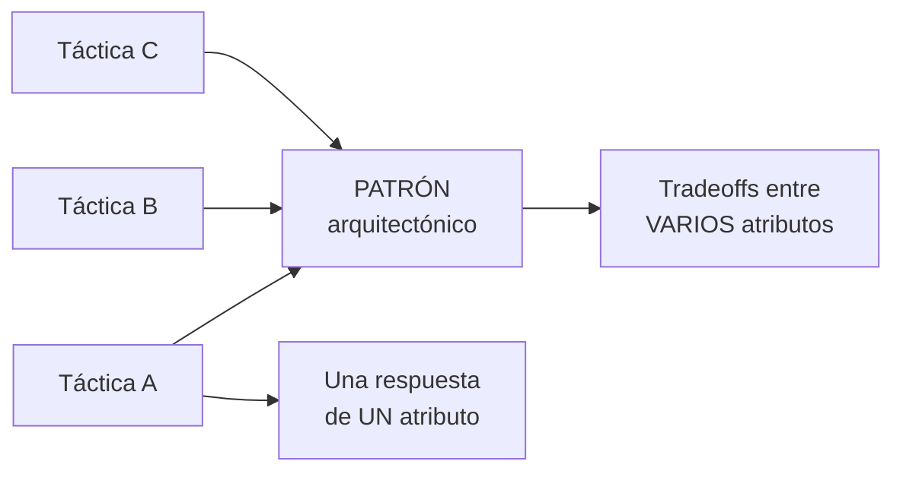
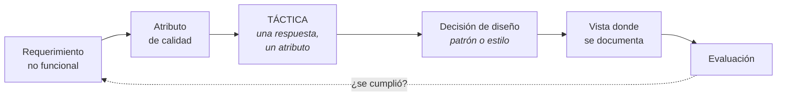

# Tácticas y patrones arquitectónicos

El eslabón entre un requisito de calidad y una decisión de diseño concreta.

> [!warning] Nota de COMPLEMENTO
> El programa no nombra "tácticas" explícitamente, pero el concepto es **necesario**: sin él, la
> cadena de trazabilidad de arquitectura —requerimiento → atributo de calidad → **táctica** →
> decisión → vista— tiene un eslabón vacío. Todo lo que sigue viene del **SAIP** (bibliografía
> oficial) vía la guía de estudio.

---

## 1. Las dos definiciones

> Una **táctica** es una decisión de diseño que **influye en el logro de la respuesta de un atributo
> de calidad** — afecta directamente la respuesta del sistema a un estímulo.

> Un **patrón arquitectónico** describe un **problema de diseño recurrente** que surge en contextos
> específicos y presenta una **solución arquitectónica bien probada**, especificando roles,
> responsabilidades, relaciones y colaboraciones de sus elementos.

Y la relación entre los dos, que es lo que hay que entender:

> Los patrones **"empaquetan" tácticas**, y por eso suelen implicar **tradeoffs entre varios
> atributos a la vez**; la táctica, en cambio, se enfoca en **una sola respuesta de un solo
> atributo**.

La diferencia de granularidad es la clave: la táctica es una **primitiva de diseño**; el patrón es una
**composición probada** de primitivas.

## 2. Táctica, patrón y estilo

Tres términos que se cruzan. Puestos en escala:

| Concepto | Granularidad | Qué es |
|---|---|---|
| **Táctica** | la más fina | una decisión que mueve **una** respuesta de **un** atributo |
| **Patrón arquitectónico** | media | una solución probada a un problema recurrente; empaqueta tácticas |
| **Estilo arquitectónico** | la más gruesa | una **forma de organización** del sistema completo |

En la práctica, "patrón arquitectónico" y "estilo" se usan casi como sinónimos: el SAIP habla de
*patrones* (capas, publish-subscribe, cliente-servidor) donde Reynoso habla de *estilos*. La guía lo
dice: *"cuando los elementos se componen de maneras que resuelven problemas recurrentes y probados en
muchos dominios, esas composiciones documentadas y diseminadas se llaman patrones arquitectónicos"*.

Ver [[Estilos arquitectónicos]] — y ojo con no confundirlos con los **patrones de diseño** de GoF,
que son centenares y operan a nivel de clases.

## 3. Por qué enfocarse en las tácticas y no solo en los patrones

El SAIP da tres razones, y son prácticas:

1. **A veces ningún patrón resuelve el problema completo.** Se necesita *el broker de alta
   disponibilidad y alta seguridad*, no el del libro. Las tácticas dan un medio sistemático de
   **aumentar** un patrón para llenar los huecos.
2. **Si no existe patrón**, las tácticas permiten construir un fragmento de diseño desde *primeros
   principios*.
3. **Hacen el diseño y el análisis más sistemáticos.**

## 4. Las súper-tácticas

Las tácticas son primitivas, así que **reaparecen por todas partes**. El SAIP marca unas pocas como
tan fundamentales que merecen mención aparte:

| Súper-táctica | Qué hace | Dónde aparece |
|---|---|---|
| **Encapsular** | interfaz explícita y todo acceso pasa por ella | es la base de todas; casi nunca se usa sola |
| **Restringir dependencias** | limitar con quién puede hablar cada elemento | el estilo en **capas** la encarna |
| **Usar un intermediario** | eliminar la necesidad de conocer la identidad del otro | pub-sub, repositorio compartido, *discovery*, broker, proxy, tier |
| **Abstraer servicios comunes** | dos elementos similares tras una abstracción general | plug-ins de un navegador; sensores de distintos fabricantes tras una interfaz común |
| ***Scheduling*** | decidir el orden de uso de un recurso | un *load balancer* es un intermediario que hace scheduling |
| **Monitoreo** | observar el estado | aparece en energía, performance, disponibilidad y safety |

Las cuatro primeras son **tácticas de modificabilidad** y están presentes en casi todos los patrones.
Eso explica algo que se ve en [[Estilos arquitectónicos]]: por qué tantos estilos distintos favorecen
la modificabilidad — comparten las mismas tácticas por debajo.

## 5. Una táctica se refina, y depende del contexto

Dos propiedades que hay que tener presentes al usarlas:

**Se refina al aplicarse.** La táctica es un nombre genérico que se concreta:

| Táctica | Refinamientos posibles |
|---|---|
| *Schedule resources* | *shortest-job-first*, *round-robin* |
| *Usar un intermediario* | capa, broker, proxy, tier |

**Su aplicación depende del contexto.** El ejemplo del libro:

> *"Manage sampling rate"* vale en ciertos sistemas de tiempo real, y **jamás** en una base de datos o
> en *trading*, donde perder un evento es grave.

> [!important] La consecuencia para una tarea
> No se "aplica una táctica" y listo: hay que **decir el refinamiento elegido y justificarlo con el
> contexto**. En FarmaHosp, *"manage sampling rate"* sería aceptable para los sensores de temperatura
> (500.000 lecturas diarias, muestrear más grueso es viable) e **inaceptable** para las
> dispensaciones, donde perder un evento rompe la trazabilidad que exige la Contraloría.

## 6. Dónde encaja en la cadena

Las tácticas son el paso 3 del ciclo del architecting: *"ADD: elegir e instanciar conceptos
(tácticas, patrones, referencias)"*. Ver [[El ciclo del architecting]].

Y en la cadena de trazabilidad de arquitectura, la táctica es el eslabón que convierte un atributo en
algo construible:

Y en la matriz de [[Matriz de trazabilidad de requisitos]], la táctica es la **columna del medio**: la
que obliga a justificar cada decisión con un requerimiento. Una táctica sin requerimiento a la
izquierda es arquitectura por gusto; un requerimiento sin táctica a la derecha es una promesa
incumplida.

## 7. Deterioro y deuda arquitectónica

El SAIP agrega una advertencia que cierra el tema, y le pone nombre:

> **La "muerte por mil cortes".** Las arquitecturas suelen emerger y evolucionar por muchas pequeñas
> decisiones y fuerzas de negocio: un sistema tolerablemente modificable **se deteriora con el
> tiempo** por la acción bienintencionada de quienes lo modifican.

Ninguna decisión individual es el problema; la acumulación sí. De ahí que el paso 6 del ciclo del
architecting sea *"realizar y sostener: conformidad, incrementos, **deuda arquitectónica**,
refactoring"* — sostener la arquitectura es parte del trabajo, no un extra.

---

## Notas relacionadas

- [[Atributos de calidad]] — el atributo que la táctica mueve
- [[Estilos arquitectónicos]] — los patrones/estilos que empaquetan tácticas
- [[El ciclo del architecting]] — las tácticas son el paso 3, diseñar
- [[Matriz de trazabilidad de requisitos]] — la táctica como columna del medio
- [[Guía - Drivers de calidad y restricción]] — de dónde vienen los atributos a satisfacer
- [[Proceso de diseño arquitectónico]] — el paso 3 de la clase: "analizar alternativas de estilos o patrones"

## Preguntas de repaso

1. Dá la definición de **táctica**. ¿Sobre qué actúa exactamente?
2. Dá la definición de **patrón arquitectónico**. ¿Qué especifica?
3. ¿Cuál es la relación entre táctica y patrón, y por qué el patrón implica más tradeoffs?
4. Ordená por granularidad: táctica, estilo, patrón arquitectónico.
5. ¿Cuáles son las tres razones del SAIP para enfocarse en tácticas y no solo en patrones?
6. Nombrá cuatro súper-tácticas. ¿A qué atributo pertenecen las principales y qué explica eso?
7. Dá un ejemplo de una táctica que se refina, con dos refinamientos posibles.
8. ¿Por qué *"manage sampling rate"* no sirve en una base de datos de trading?
9. ¿Qué es la "muerte por mil cortes" y con qué paso del ciclo del architecting se combate?
