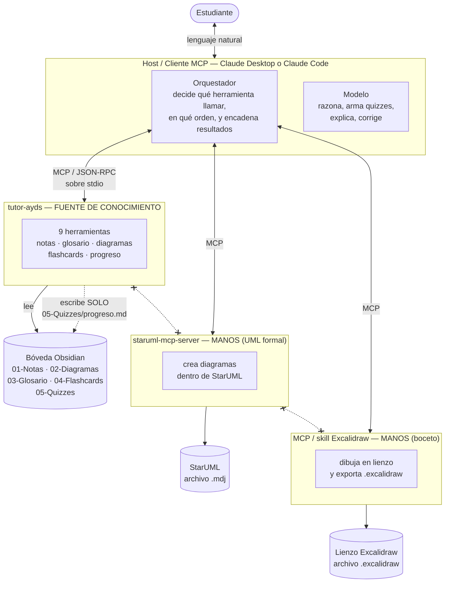
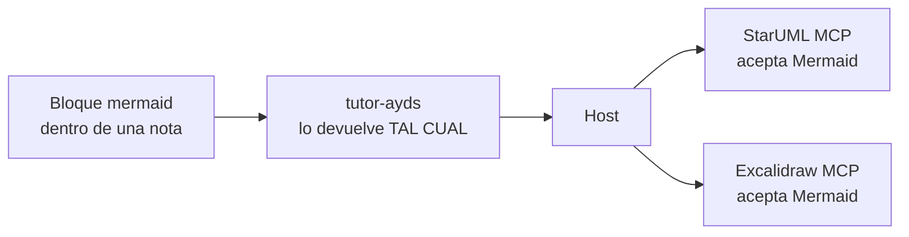
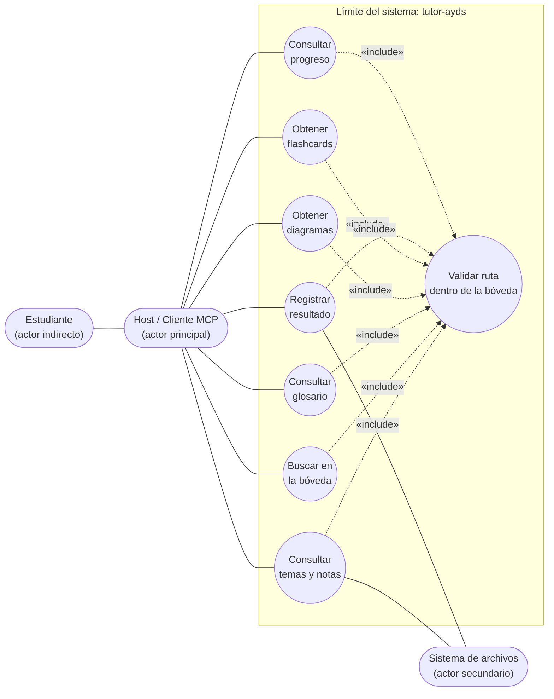
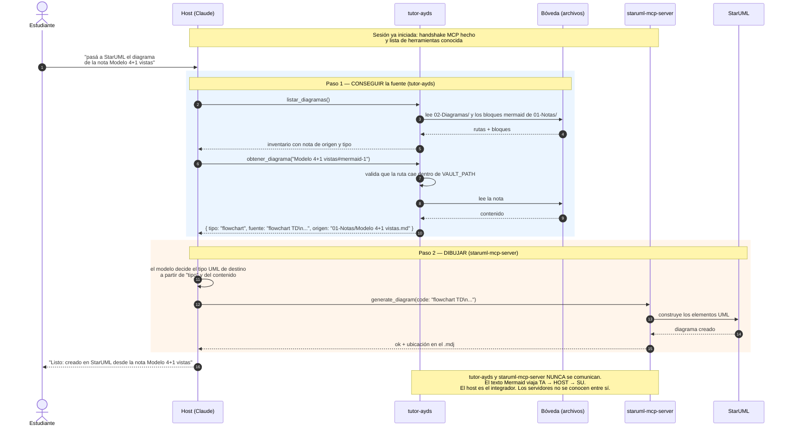
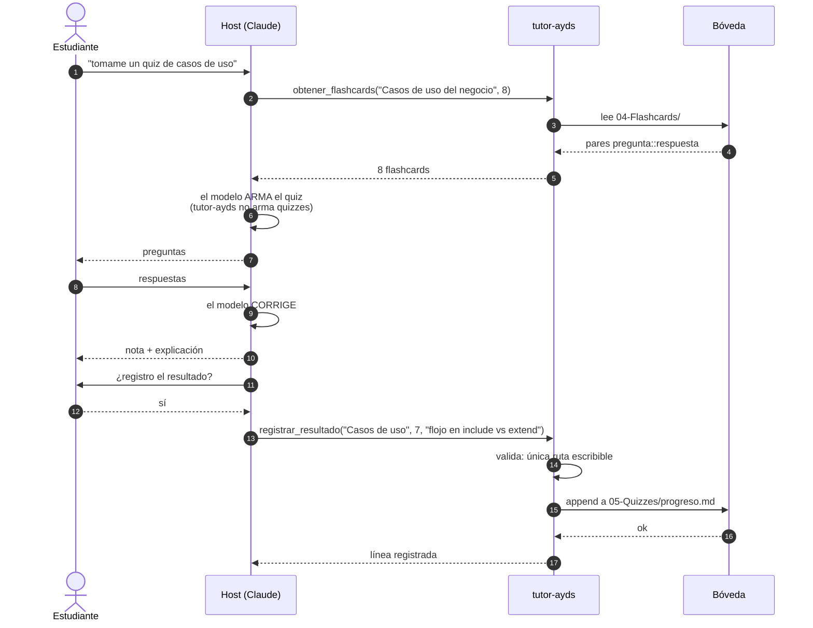

# Diseño — Servidor MCP `tutor-ayds`

Documento de análisis y diseño del proyecto práctico. **Fase 1: no hay código todavía.**

Idea en una línea: **`tutor-ayds` expone esta bóveda de Obsidian como herramientas MCP.**
Sirve conocimiento y registra progreso; no razona, no dibuja, no convierte. La inteligencia la
pone el modelo cliente y el dibujo lo ponen otros dos servidores MCP que ya existen.

---

## 1. Actores, requerimientos funcionales y no funcionales

### 1.1 Actores

| # | Actor | Tipo | Rol en el sistema |
|---|---|---|---|
| A1 | **Estudiante** | Humano, primario | Pide cosas en lenguaje natural: "hazme un quiz de casos de uso", "pasá este diagrama a StarUML". Nunca invoca herramientas a mano. |
| A2 | **Host / Cliente MCP** (Claude Desktop, Claude Code) | Sistema, primario | El **orquestador**. Decide qué herramienta llamar, en qué orden, y encadena resultados entre servidores. Es el único que habla con todos. |
| A3 | **Bóveda Obsidian** (sistema de archivos) | Sistema, secundario | El almacén de datos. `tutor-ayds` la lee; solo escribe en `05-Quizzes/progreso.md`. |
| A4 | **staruml-mcp-server** | Sistema externo | Dibuja diagramas UML formales dentro de StarUML. Recibe Mermaid del host. |
| A5 | **MCP / skill de Excalidraw** | Sistema externo | Dibuja en un lienzo Excalidraw y exporta `.excalidraw`. También acepta Mermaid. |

Nota de análisis, y es el punto que ordena todo el diseño: **A4 y A5 no son actores de
`tutor-ayds`.** No lo llaman ni lo conocen. Son actores del *host*. `tutor-ayds` tiene
exactamente un cliente: el host.

### 1.2 Requerimientos funcionales

Cada RF es una herramienta MCP. La columna *escribe* es la que importa para la seguridad.

| ID | Herramienta | Qué hace | Lee de | Escribe |
|---|---|---|---|---|
| RF-01 | `listar_temas()` | Lista las notas de `01-Notas/` con su `tema` del frontmatter | `01-Notas/*.md` | — |
| RF-02 | `leer_nota(nombre)` | Devuelve el contenido completo de una nota | `01-Notas/*.md` | — |
| RF-03 | `buscar(consulta)` | Búsqueda de texto en notas y glosario; devuelve fragmentos con su ruta | `01-Notas/`, `03-Glosario.md` | — |
| RF-04 | `glosario(termino?)` | Definición de un término, o el glosario completo | `03-Glosario.md` | — |
| RF-05 | `listar_diagramas()` | Los `.excalidraw` y `.svg` de `02-Diagramas/` **más** los bloques `mermaid` dentro de las notas, con nota de origen y tipo | `02-Diagramas/`, `01-Notas/` | — |
| RF-06 | `obtener_diagrama(nombre)` | La **fuente** del diagrama (bloque Mermaid tal cual, o JSON del `.excalidraw`) con su tipo | `02-Diagramas/`, `01-Notas/` | — |
| RF-07 | `obtener_flashcards(tema, cantidad?)` | Flashcards `pregunta::respuesta` de un tema | `04-Flashcards/*.md` | — |
| RF-08 | `registrar_resultado(tema, puntaje, comentarios?)` | Agrega una línea con fecha al registro de progreso | — | `05-Quizzes/progreso.md` |
| RF-09 | `progreso()` | Resumen del progreso: temas evaluados, puntajes, pendientes | `05-Quizzes/progreso.md`, `01-Notas/` | — |
| RF-10 | `referencia(herramienta?)` | El manual condensado de StarUML y Excalidraw, y el puente de la teoría al diagrama | `07-Referencias/` | — |

> [!info] RF-10 se agregó el 2026-08-19
> No estaba en el diseño original. Salió de una necesidad real: el cliente puede generar un
> diagrama perfectamente correcto según la teoría y que igual no entre a StarUML, porque StarUML
> importa solo 7 tipos de Mermaid. RF-10 le da al cliente el dato **antes** de generar.
>
> Encaja sin romper nada: sigue siendo servir conocimiento de la bóveda, sigue siendo solo
> lectura, y sigue sin dibujar nada. Ver **DA-12**.

Ocho de nueve son de lectura. **RF-08 es la única escritura de todo el servidor**, y toca un
único archivo.

Dos requerimientos derivados que salieron del análisis y que conviene dejar escritos:

- **RF-05/06 necesitan un esquema de identidad.** Un `.svg` se identifica por nombre de archivo,
  pero un bloque Mermaid **vive dentro de una nota** y no tiene nombre propio. Ver la decisión
  **DA-06**.
- **RF-09 necesita saber qué es "pendiente".** Un tema pendiente es un `tema` presente en el
  frontmatter de `01-Notas/` que **no** aparece en `progreso.md`. Es decir, RF-09 cruza dos
  fuentes; no es un simple `cat` del archivo.

### 1.3 Requerimientos no funcionales

| ID | Requerimiento | Cómo se cumple |
|---|---|---|
| RNF-01 | **Confinamiento de rutas.** Toda ruta resuelta debe quedar dentro de `VAULT_PATH` | Resolver a ruta absoluta real (`realpath`, que sigue symlinks) y verificar que el prefijo sea `VAULT_PATH`. Rechaza `../` y symlinks que apunten afuera |
| RNF-02 | **Solo lectura salvo progreso.** Ninguna herramienta modifica la bóveda excepto RF-08 | Una única función de escritura en todo el código, con la ruta `05-Quizzes/progreso.md` fijada en constante, no recibida por parámetro |
| RNF-03 | **El servidor nunca se cae.** Un error de una herramienta no puede matar el proceso | Cada handler con `try/catch`; los errores se devuelven como resultado de error de la herramienta, no como excepción. Handlers globales de `uncaughtException` y `unhandledRejection` |
| RNF-04 | **`stdout` es sagrado.** El transporte stdio usa `stdout` para JSON-RPC | Todo log va a `stderr` (`console.error`). Un solo `console.log` mal puesto corrompe el protocolo y el cliente desconecta |
| RNF-05 | **Configurable sin recompilar** | Ruta de la bóveda por variable de entorno `VAULT_PATH`; se valida al arrancar |
| RNF-06 | **Descripciones para un modelo, no para un humano** | Cada herramienta describe en español *cuándo* usarla y qué devuelve, para que el host elija bien sin adivinar |
| RNF-07 | **Portabilidad macOS arm64 (Mac M5)** | Node ≥ 20 nativo arm64; sin dependencias binarias. Ver **DA-05** por el tema de acentos en nombres de archivo |
| RNF-08 | **Latencia baja sin índice** | La bóveda son decenas de archivos de pocos KB: se lee del disco en cada llamada. Sin base de datos ni caché. Si creciera a miles de notas habría que indexar, pero optimizar ahora sería adelantarse |
| RNF-09 | **Desacoplamiento total de StarUML y Excalidraw** | `tutor-ayds` no los importa, no los invoca y no sabe que existen. Se puede usar sin ellos |
| RNF-10 | **Formato de salida estable** | Las respuestas incluyen siempre la ruta de origen, para que el host pueda citar la fuente y el estudiante verificar |

---

## 2. Diagrama de contexto / componentes del ecosistema

El host está al centro porque **es el único que habla con todos**. Los tres servidores MCP son
hojas: cada uno conoce solo su propio dominio.



Las líneas tachadas entre servidores son lo importante del diagrama: **los servidores MCP no se
comunican entre sí**. No es una limitación que estemos aceptando por comodidad, es cómo está
definido el protocolo: la topología es una **estrella** con el host al centro, no una malla.

### 2.1 Responsabilidad de cada componente

| Componente | Responsabilidad | Lo que explícitamente **no** hace |
|---|---|---|
| **Estudiante** | Pedir en lenguaje natural | No invoca herramientas |
| **Host (orquestador)** | Elegir herramientas, encadenar, pedir permiso al usuario | No guarda estado del dominio |
| **Modelo (en el host)** | Razonar: armar quizzes, explicar, corregir, decidir el tipo de diagrama | No lee archivos por su cuenta |
| **tutor-ayds** | Servir el contenido de la bóveda y registrar progreso | **No** dibuja, **no** convierte formatos, **no** razona, **no** llama a otros MCP |
| **staruml-mcp-server** | Materializar UML formal en StarUML | No conoce la bóveda |
| **Excalidraw MCP** | Bocetar y exportar `.excalidraw` | No conoce la bóveda |

### 2.2 Por qué Mermaid es la moneda de cambio

`tutor-ayds` no convierte nada, y sin embargo el flujo cruzado funciona. La razón es que el
formato que **ya vive en las notas** es el que los otros dos entienden:



Esto es una decisión de diseño con consecuencia real: **si `tutor-ayds` devolviera el diagrama
"procesado" o traducido, se volvería un traductor** y acoplaría el servidor al formato de destino.
Devolver la fuente cruda lo mantiene como una sola cosa: una fuente de conocimiento.

---

## 3. Diagrama de casos de uso de `tutor-ayds`

Un solo actor real —el **Host**—, porque el estudiante nunca toca el servidor directamente. Lo
dibujo igual como actor indirecto porque es quien origina la intención.



Fijate que **"Validar ruta dentro de la bóveda" es un `<<include>>` de los siete casos de uso**:
siempre ocurre, y el flujo completo de cada caso de uso está en el caso base más el incluido. Es
exactamente el criterio de la [[Relación de inclusión include]] — se reusa en todos y simplifica
la comprensión de cada uno. Si lo hubiera puesto como `<<extend>>` estaría diciendo que la
validación es opcional, y eso sería un agujero de seguridad escrito en UML.

### 3.1 Casos de uso, expandidos

| CU | Herramientas (RF) | Actor | Escribe |
|---|---|---|---|
| CU1 Consultar temas y notas | `listar_temas`, `leer_nota` | Host | No |
| CU2 Buscar en la bóveda | `buscar` | Host | No |
| CU3 Consultar glosario | `glosario` | Host | No |
| CU4 Obtener diagramas | `listar_diagramas`, `obtener_diagrama` | Host | No |
| CU5 Obtener flashcards | `obtener_flashcards` | Host | No |
| CU6 Registrar resultado | `registrar_resultado` | Host | **Sí** |
| CU7 Consultar progreso | `progreso` | Host | No |
| VAL Validar ruta | interno, no expuesto | — | No |

`VAL` **no se expone como herramienta**. Es comportamiento incluido, no una operación que el
host pueda pedir. Un caso de uso de apoyo que no interactúa con ningún actor externo — el caso
que la teoría admite como excepción en [[Caso de uso del negocio]].

---

## 4. Diagrama de secuencia — el flujo cruzado

Escenario: *"pasá a StarUML el diagrama de casos de uso de la nota **Modelo 4+1 vistas**"*.

Es el diagrama más interesante del proyecto porque muestra el punto que en un examen de sistemas
distribuidos vale doble: **el host es el único integrador; los servidores nunca se hablan.**



### 4.1 Qué hay que leer en este diagrama

**El dato cruza el host, no la red entre servidores.** El Mermaid sale de `tutor-ayds`, entra al
contexto del host, y de ahí sale hacia StarUML. Son **dos llamadas MCP independientes** que solo
el host sabe que están relacionadas.

**Hay una decisión del modelo en el medio (paso 10).** `tutor-ayds` dice "esto es un `flowchart`";
traducirlo a "esto debería ser un diagrama de casos de uso UML" es **razonamiento**, y por eso vive
en el host. Si `tutor-ayds` hiciera ese mapeo, estaría razonando, y eso rompe RNF-09.

**Ninguno de los dos servidores mantiene estado del otro.** Si StarUML falla, `tutor-ayds` no se
enteró nunca. Bajo acoplamiento, y también: **no hay transacción**. Si el paso 12 falla después de
un paso 8 exitoso, no hay nada que revertir porque `tutor-ayds` no escribió nada. Que la lectura y
la escritura estén separadas hace que el flujo cruzado sea seguro por construcción.

### 4.2 El flujo que sí escribe, para contrastar



Notá dónde está la inteligencia: **armar y corregir el quiz son pasos internos del host** (6 y 9).
`tutor-ayds` entregó datos y guardó un número. Nada más.

---

## 5. Decisiones de arquitectura

Verificado hoy contra npm y `modelcontextprotocol.io`.

> [!check] Decisiones cerradas el 2026-08-19
> Dos puntos tenían alternativa real y quedaron resueltos:
> - **DA-02 → SDK v2** (`@modelcontextprotocol/server@2.0.0`). Se asume el costo de que los
>   tutoriales de terceros usen la API v1.
> - **DA-06 → `Nota#mermaid-N`**. Se asume que los ordinales se corren si se inserta un
>   diagrama al principio de una nota; `listar_diagramas` siempre devuelve el ID vigente, así
>   que el ID nunca se escribe a mano.

| ID | Decisión | Justificación | Alternativa descartada |
|---|---|---|---|
| **DA-01** | **TypeScript** sobre Node ≥ 20 | Tipado en los límites (entradas del modelo son texto libre); es el SDK de referencia | Python: también soportado, pero TS tiene el tooling más maduro para MCP |
| **DA-02** | **SDK v2: `@modelcontextprotocol/server@2.0.0`** | Es el release estable actual. Ojo: el SDK se **partió en dos paquetes**; el viejo monolito `@modelcontextprotocol/sdk` quedó en `1.30.0` | `@modelcontextprotocol/sdk@1.30.0`: sigue publicado, pero la doc oficial ya enseña v2 |
| **DA-03** | **Transporte `stdio`** | Servidor local, un solo usuario, arranca y muere con el cliente. Cero puertos, cero auth, cero superficie de red | HTTP/SSE: necesario solo para servidores remotos o multiusuario |
| **DA-04** | **Solo lectura salvo `registrar_resultado`** | Reduce el daño posible a un archivo. La bóveda es la fuente de verdad y se edita en Obsidian, no por MCP | Escritura general de notas: tentador, pero un modelo con permiso de escribir sobre mis apuntes puede arruinarlos sin que me dé cuenta |
| **DA-05** | **Normalizar Unicode (NFC) al comparar nombres** | macOS/APFS guarda los nombres en **NFD**: `Descripción` llega como `o` + combinante. Si el modelo manda NFC, la comparación falla y "la nota no existe" siendo que existe | Ignorarlo: rompería justo en las notas con acentos, que acá son mayoría |
| **DA-06** | **Identidad de diagramas: `archivo` o `Nota#mermaid-N`** | Un `.svg` tiene nombre; un bloque Mermaid no. Se direcciona por nota + ordinal del bloque | Hashes: estables pero ilegibles para el modelo y para mí |
| **DA-07** | **Validación de rutas con `realpath` + prefijo** | Resolver el symlink **antes** de comparar. Validar el string sin resolver deja pasar un symlink que apunta afuera | Solo chequear `..`: insuficiente, no ve symlinks |
| **DA-08** | **Sin caché ni índice** | Decenas de archivos de pocos KB; leer del disco es más rápido que invalidar caché mal | Índice en memoria: complejidad sin beneficio a esta escala (RNF-08) |
| **DA-09** | **Errores como resultado de la herramienta, no como excepción** | El host puede mostrárselos al modelo, que reintenta con otro argumento. Una excepción mata el proceso y corta la sesión (RNF-03) | Lanzar excepciones: el servidor se cae y hay que reiniciar el cliente |
| **DA-10** | **Logs a `stderr`** | En stdio, `stdout` transporta JSON-RPC. Un `console.log` corrompe la trama (RNF-04) | `console.log`: rompe el protocolo de forma silenciosa y confusa |
| **DA-11** | **Proyecto fuera de la bóveda (`../ayds-mcp/`)** | `node_modules` en una bóveda de Obsidian son decenas de miles de archivos: indexa basura y ensucia el grafo | Dentro de la bóveda con `.obsidianignore`: frágil, se olvida |
| **DA-12** | **Las referencias de herramientas van en `07-Referencias/`, no en `01-Notas/`** | Dos razones: (a) no son material de la materia y ensuciarían `listar_temas`; (b) `progreso()` calcula los pendientes cruzando con los `tema` de `01-Notas/`, así que "StarUML" quedaría como tema pendiente de examen para siempre | Ponerlas en `01-Notas/` con un `tema` especial: más simple pero contamina dos herramientas |

### 5.1 Stack verificado

| Pieza | Versión | Nota |
|---|---|---|
| Revisión del protocolo MCP | **2026-07-28** | Es la vigente en la especificación |
| `@modelcontextprotocol/server` | **2.0.0** | Requiere Node **≥ 20** |
| `@modelcontextprotocol/core` | 2.0.0 | Entra como dependencia de `server` |
| `zod` | **^4.2.0** | Peer dependency; los `inputSchema` se declaran con Zod |
| Node.js | ≥ 20 (LTS) | arm64 nativo en el Mac M5 |

Forma de la API en v2, para que no haya sorpresas en la Fase 2:

```
new McpServer({ name, version })
server.registerTool(nombre, { description, inputSchema: z.object({...}) }, handler)
new StdioServerTransport()  →  await server.connect(transport)
handler devuelve { content: [{ type: "text", text: "..." }] }
```

Los imports son `@modelcontextprotocol/server` y `@modelcontextprotocol/server/stdio`.

### 5.2 Notas para el Mac M5

| Tema | Detalle |
|---|---|
| Arquitectura | arm64. Sin dependencias nativas, así que no hay nada que compilar ni Rosetta |
| Node | Instalar arm64 nativo (Homebrew o nvm). Verificar con `node -p process.arch` → debe decir `arm64` |
| **PATH en Claude Desktop** | La app **no hereda** el PATH de la terminal. En el JSON de configuración hay que poner la **ruta absoluta** de `node`, no `"node"`. Es la causa número uno de "mi servidor no aparece" |
| Config de Claude Desktop | `~/Library/Application Support/Claude/claude_desktop_config.json` |
| APFS | Insensible a mayúsculas pero preservándolas: `nota.md` y `Nota.md` son el mismo archivo. La búsqueda de notas debe ser insensible a mayúsculas para ser coherente |
| Unicode | Ver **DA-05**: NFD en el sistema de archivos. Es *el* detalle que muerde en esta bóveda |
| Permisos | Si la bóveda estuviera en `~/Documents` o iCloud Drive, macOS pide permiso de acceso la primera vez. Conviene una ruta simple y local |

### 5.3 Riesgos abiertos

| Riesgo | Impacto | Mitigación |
|---|---|---|
| `05-Quizzes/progreso.md` **todavía no existe** | RF-08 falla en la primera llamada | `registrar_resultado` lo **crea con encabezado** si falta. Queda como requerimiento de la Fase 2 |
| ~~La forma exacta de la herramienta de StarUML no está verificada~~ | — | **CERRADO el 2026-08-19.** Verificado contra el código de `staruml/staruml-mcp-server`: la herramienta es `generate_diagram(code: string)` y acepta Mermaid crudo. El flujo cruzado funciona tal como está diseñado. Ver [[StarUML]] |
| **StarUML solo importa 7 tipos de Mermaid** y casos de uso NO está entre ellos | Un `flowchart` que modela casos de uso entra como **Flowchart**, no como Use Case Diagram UML | No es un problema de `tutor-ayds`: la fuente que entrega es correcta. Es una limitación del destino, documentada en [[StarUML]] y en [[De la teoría al diagrama]]. El cliente tiene que saberlo **antes** de generar, y para eso está RF-10 |
| El modelo inventa nombres de nota | Errores frecuentes de "no existe" | RF-01/RF-05 devuelven los nombres exactos; el mensaje de error sugiere los más parecidos |
| La bóveda crece mucho | RNF-08 deja de valerse | Recién entonces se agrega índice. No antes |

---

## 6. Trazabilidad

| Actor | Casos de uso | RF | RNF crítico |
|---|---|---|---|
| Host | CU1–CU5, CU7 | RF-01…07, RF-09 | RNF-01, RNF-02 |
| Host | CU6 | RF-08 | RNF-02 (única escritura) |
| Sistema de archivos | VAL | — | RNF-01, RNF-07 (DA-05) |
| StarUML / Excalidraw MCP | *ninguno* | — | RNF-09 (desacoplamiento) |

La última fila es el resumen del diseño: **dos de los cinco actores del ecosistema no tienen
ningún caso de uso en mi sistema.** Eso es lo correcto acá, y es lo que hay que poder defender.

---

## Notas relacionadas

- [[Caso de uso]] — los CU de la sección 3 son casos de uso del *sistema*, no del negocio
- [[Relación de inclusión include]] — por qué `VAL` es `<<include>>` y no `<<extend>>`
- [[Caso de uso del negocio]] — la excepción del CU de apoyo sin actores, que aplica a `VAL`
- [[Modelo 4+1 vistas]] — este documento es, en esos términos: §2 vista de despliegue/desarrollo, §3 vista +1 de escenarios, §4 vista de procesos
- [[Estructuras y vistas arquitectónicas]] — acá se diseñan estructuras y se documentan vistas
- [[Equilibrio de restricciones del proyecto]] — DA-08 y DA-04 son decisiones de *no* hacer cosas

## Preguntas de repaso

1. ¿Por qué `tutor-ayds` no puede llamar directamente al MCP de StarUML? ¿Es una limitación de mi diseño o del protocolo?
2. En el diagrama de secuencia, ¿en qué paso exacto ocurre el razonamiento, y por qué no puede estar dentro de `tutor-ayds`?
3. ¿Por qué `VAL` (validar ruta) es un `<<include>>` y qué agujero de seguridad implicaría modelarlo como `<<extend>>`?
4. ¿Qué problema concreto resuelve DA-05 (normalización Unicode) y por qué aparece justo en un Mac?
5. Si el paso de StarUML falla después de que `tutor-ayds` respondió, ¿hay que revertir algo? ¿Por qué?
6. ¿Qué gano y qué pierdo con DA-04 (solo lectura salvo progreso)?
