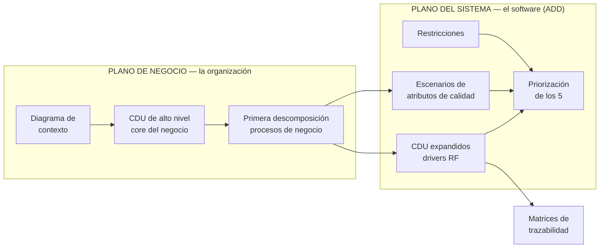

# Guía de estilo de diagramas

Reglas de **disposición** y **notación** para que ningún diagrama salga con elementos encimados,
líneas cruzadas o semántica UML equivocada. Es de aplicación obligatoria: ver el checklist del §7. La metodología del curso —ADD y
modelado de negocio— está en el §8.

> [!important] Qué problema resuelve
> Los diagramas generados salían desordenados. La causa no es falta de reglas UML: es que **el
> layout no se estaba controlando en ninguna parte**. UML 2.x especifica la *notación* —qué forma
> tiene cada elemento— pero **no especifica la disposición**. La disposición es convención, y si no
> se fija explícitamente, la decide el auto-layout de la herramienta o el orden accidental en que se
> escribieron los nodos.

---

## 1. Lo primero: qué puede hacer cada herramienta

Antes de las reglas, la restricción real. Verificado contra [[StarUML]] y [[Excalidraw]].

| Capacidad | StarUML | Excalidraw |
|---|---|---|
| Semántica UML correcta (actores, elipses, estereotipos) | **sí, nativa** | no: son formas dibujadas |
| Importar Mermaid | 7 tipos | 5 tipos, el resto entra como **imagen no editable** |
| Casos de uso por Mermaid | **NO** — un `flowchart` entra como Flowchart | entra como flowchart editable, sin semántica UML |
| **Fijar coordenadas por API** | **NO** — el MCP tiene 4 herramientas y ninguna posiciona | **sí**: el `.excalidraw` es JSON con `x`/`y` por elemento |
| Auto-layout | sí, dentro de la app (acción manual) | no lo necesita si se fijan coordenadas |
| Exportar sin marca de agua | **a verificar** (§6) | **sí**, es gratis |

> [!warning] El MCP de StarUML no puede acomodar un diagrama
> Sus cuatro herramientas son `generate_diagram`, `get_all_diagrams_info`,
> `get_current_diagram_info` y `get_diagram_image_by_id`. **Ninguna mueve elementos ni dispara
> auto-layout.** Cualquier plan que dependa de "posicionar vía la API de StarUML" es imposible con
> la superficie actual. El layout se controla donde sí se puede — §5.

### La división de trabajo que sale de esa tabla

```
Mermaid en la nota  →  StarUML     →  modelar y VALIDAR la semántica UML
        ↓
   .excalidraw con coordenadas  →  la LÁMINA final que se entrega
```

**StarUML** es para modelar y verificar que la semántica está bien. **Excalidraw** es el exportador
de la imagen final, porque es el único de los dos donde el layout se puede fijar
programáticamente y donde la exportación no tiene marca de agua.

---

## 2. Reglas transversales de layout

Aplican a **todo** diagrama, de cualquier tipo. Las medidas están en píxeles del lienzo y son las
que se usan al escribir un `.excalidraw` o al acomodar a mano en StarUML.

### 2.1 La retícula

| Parámetro | Valor |
|---|---|
| Retícula base | **20 px** — toda coordenada es múltiplo de 20 |
| Margen del lienzo | **40 px** en los cuatro lados |
| Separación mínima entre dos elementos | **40 px** horizontal · **30 px** vertical |
| Separación entre columnas (bandas) | **120 px** |
| Paso vertical entre elementos de una misma columna | **120 px** de centro a centro |

Alinear a la retícula es lo que hace que un diagrama se lea como deliberado. Dos elementos a 7 px de
diferencia se leen como error, no como diseño.

### 2.2 Tamaños estándar por elemento

| Elemento | Ancho × alto |
|---|---|
| Actor (con su nombre) | 100 × 120 |
| Caso de uso (elipse) | 180 × 80 |
| Clase (3 compartimentos) | 200 × 120 |
| Nodo de actividad / acción | 160 × 60 |
| Decisión (rombo) | 80 × 80 |
| Estado | 140 × 60 |
| Entidad ER | 200 × 100 |
| Componente | 200 × 90 |
| Nodo de despliegue | 220 × 140 |
| Paquete | 200 × 110 |

Si un nombre no cabe, se **agranda el elemento**, nunca se encoge la letra por debajo de 12 px ni se
deja el texto desbordado.

### 2.3 Dirección de lectura

| Tipo de diagrama | Dirección |
|---|---|
| Casos de uso, contexto, CUN, componentes, ER | **izquierda → derecha** |
| Clases (jerarquías), actividad, estados, secuencia | **arriba → abajo** |

Una sola dirección por diagrama. Mezclar direcciones es la causa más frecuente de cruces.

### 2.4 Líneas

- **Ortogonales** siempre que se pueda (segmentos horizontales y verticales); diagonales solo cuando
  la ortogonal obligaría a un rodeo más largo.
- **Cero cruces evitables.** Un cruce se elimina reordenando elementos, no doblando la línea.
- Ninguna línea pasa **por encima de un elemento**: se rodea.
- Toda etiqueta de línea va **paralela a la línea**, a 10 px de ella, y **con fondo del color del
  lienzo** para que la línea no le pase por dentro.
- Distancia mínima entre dos líneas paralelas: **20 px**.

### 2.5 Auto-layout

Se aplica el auto-layout de la herramienta **cuando exista para ese tipo** y **antes** de ajustar a
mano: `Format → Auto Layout` en StarUML. Después se corrige a mano lo que el auto-layout haya roto
—casi siempre las jerarquías y el orden de las líneas de vida—, porque el auto-layout optimiza cruces
pero **no conoce las convenciones de cada tipo** de este documento.

Si el tipo no tiene auto-layout, se posiciona con coordenadas explícitas según §5.

---

## 3. Reglas por tipo de diagrama

### 3.1 Casos de uso (del sistema)

| Regla | Detalle |
|---|---|
| **Actores a la izquierda** | Columna en `x = 40`. Los actores secundarios (sistemas externos, reguladores) pueden ir en una columna a la **derecha** del sistema |
| **Límite del sistema** | Recuadro rotulado con el **nombre del sistema**, que **contiene** las elipses. Empieza en `x = 260` |
| **Orden por flujo** | Los casos de uso se ordenan **de arriba abajo según el orden temporal** en que ocurren, no alfabético |
| **Asociación actor–caso** | Línea **sin punta de flecha**. La comunicación es bidireccional por definición |
| **`«include»`** | Flecha **punteada** desde el caso **base** hacia el caso **incluido**. El incluido se dibuja **debajo** del base |
| **`«extend»`** | Flecha **punteada** desde el caso **extensión** hacia el caso **base** — al revés que include. La extensión va **debajo** o al costado |
| **Generalización de actores** | Triángulo hueco del actor **hijo** hacia el **padre**; el **padre arriba** |
| **Ningún caso sin actor** | Salvo que sea un caso incluido por otro, o un hijo cuyo padre describe la comunicación |
| **Nombre del caso** | Verbo en infinitivo + objeto: *«Despachar medicamentos»*, nunca *«Despacho»* |

> [!warning] La dirección de include y extend es lo que más se equivoca
> `include`: **base → incluido** (el base *necesita* al incluido). `extend`: **extensión → base**
> (la extensión *se agrega* al base, que existe sin ella). Ver
> [[Relación de inclusión include]] y [[Relación de extensión extend]].

**Plantilla de coordenadas** (dos actores, tres casos):

```
Actor 1        x=40   y=80
Actor 2        x=40   y=320
Sistema (caja) x=260  y=40   w=440  h=440
  Caso A       x=320  y=100  (dentro de la caja)
  Caso B       x=320  y=220
  Caso C       x=320  y=340
```

### 3.2 CUN — casos de uso del negocio (core y primera descomposición)

Igual que 3.1, más los **convenios de clase** de [[Convenios del diagrama de CUN]]:

- Los **actores del negocio** están **fuera** del negocio; los **trabajadores** no se dibujan como
  actores (van en las realizaciones).
- La línea **sin punta** significa comunicación en los dos sentidos; **con punta** indica **quién
  inicia**: del actor al CUN si lo inicia el actor, del CUN al actor si lo inicia el negocio.
- El **core** es un solo CUN grande con todos los actores alrededor. La **primera descomposición**
  es **un solo diagrama** con los N procesos como CUN y **el mismo juego de actores** del core.
- Cada CUN corresponde a **un proceso de negocio**, no a una función.

### 3.3 Diagrama de contexto (notación de clase)

**No es UML.** Notación propia de la cátedra — ver [[Diagrama de contexto]]:

| Regla | Detalle |
|---|---|
| **Un solo óvalo**, al centro | Es **el producto**, y su nombre empieza por «Sistema…» |
| Entidades y agentes | **Rectángulos** alrededor, repartidos en las cuatro bandas (izquierda, derecha, arriba, abajo) |
| *Streamlines* | Una flecha por flujo, **siempre con nombre** y el nombre en **sustantivo** |
| Bidireccional | **Dos flechas separadas**, cada una con su nombre — nunca doble punta |
| Nada adentro del óvalo | Si se dibujan módulos adentro, ya no es un diagrama de contexto |

Disposición: óvalo centrado; entidades de negocio a izquierda y derecha; **dispositivos y sistemas
externos arriba y abajo**, que es lo que evita que las flechas de los sistemas cruccen las de las
personas.

### 3.4 Clases

| Regla | Detalle |
|---|---|
| **Herencia con la superclase ARRIBA** | Triángulo hueco apuntando a la superclase. Nunca al revés ni en horizontal |
| **Jerarquías alineadas verticalmente** | Las hermanas comparten `y`, y se centran respecto de la superclase |
| **Clases relacionadas cercanas** | La distancia entre dos clases es inversa a su acoplamiento: lo que se asocia, junto |
| **Multiplicidad en AMBOS extremos** | `1`, `0..1`, `1..*`, `*` — un extremo sin multiplicidad es un error, no un valor por omisión |
| **Nombre de rol** | En el extremo donde aporte claridad, en minúscula |
| **Navegabilidad** | Flecha abierta solo si la navegación es unidireccional; si es bidireccional, sin flechas |
| **Composición / agregación** | Rombo **relleno** (composición) o **hueco** (agregación) **del lado del todo** |
| **Tres compartimentos** | Nombre · atributos · operaciones. Compartimentos vacíos se muestran vacíos, no se eliminan |
| **Mínimo cruce** | Se resuelve agrupando por subsistema antes de acomodar |

### 3.5 Secuencia

| Regla | Detalle |
|---|---|
| **Iniciador a la izquierda** | El actor u objeto que dispara la interacción va en `x = 40` |
| **Líneas de vida por orden de aparición** | La segunda línea de vida es la que recibe el primer mensaje, y así |
| **Tiempo estrictamente hacia abajo** | Ningún mensaje sube. Una respuesta más tardía va **más abajo**, siempre |
| **Mensajes sin solaparse** | Paso vertical mínimo entre mensajes: **40 px** |
| **Activaciones visibles** | La barra de *focus of control* se dibuja sobre la línea de vida mientras el objeto está activo |
| **Retornos** | Flecha **punteada** de vuelta, y solo cuando aporte información |
| **Nombre del mensaje** | `operación(parámetros)`, sobre la flecha, alineado a la izquierda |
| **Separación entre líneas de vida** | **160 px**, más si los nombres de mensaje son largos |

### 3.6 Actividad

| Regla | Detalle |
|---|---|
| **Un único nodo inicial**, arriba | Círculo relleno. Uno solo por diagrama |
| **Flujo vertical descendente** | Sin excepciones; las ramas se abren en horizontal y vuelven a bajar |
| **Decisiones como rombos** | Con sus **guardas entre corchetes**: `[stock disponible]`, `[else]` |
| **Toda salida de un rombo tiene guarda** | Un rombo con una rama sin etiquetar es un error |
| **Nodo final abajo** | Círculo relleno con anillo. Puede haber más de uno |
| **Calles (swimlanes)** si hay varios responsables | Una calle por responsable, rotulada, y **cada acción dentro de la calle de quien la ejecuta** |
| **Fork / join** | Barra gruesa; todo `fork` tiene su `join` correspondiente |
| **Nombre de acción** | Verbo en infinitivo |

### 3.7 Estados

| Regla | Detalle |
|---|---|
| **Estado inicial marcado** | Círculo relleno con una transición al primer estado real |
| **Transiciones etiquetadas** | `evento[guarda]/acción` — las tres partes son opcionales, pero el orden no |
| **Sin estados huérfanos** | Todo estado tiene al menos una transición de entrada y una de salida, salvo el final |
| **Estado final** | Presente si el objeto tiene fin de vida |
| **Disposición** | El ciclo principal en vertical descendente; los estados de excepción a la derecha |
| **Nombre de estado** | Adjetivo o participio: *«Bloqueado»*, *«En dispensación»* — nunca un verbo de acción |

### 3.8 Entidad-relación

| Regla | Detalle |
|---|---|
| **Cardinalidad en AMBOS extremos** | `1:1`, `1:N`, `N:M`, o notación de pata de gallo. Ningún extremo sin cardinalidad |
| **Llave primaria marcada** | `PK` o subrayada; las foráneas como `FK` |
| **Entidades legibles** | Nombre en **singular** y mayúscula inicial: `Paciente`, no `pacientes` |
| **Disposición** | Las entidades más referenciadas al centro; las de catálogo en el borde |
| **Relaciones nombradas** | Con un verbo que se lea en una dirección: *«Paciente **recibe** Dosis»* |

### 3.9 Componentes

- Componentes como rectángulos con el estereotipo `«component»` o el icono.
- **Dependencias de arriba abajo**: quien depende, arriba.
- Interfaces provistas/requeridas con **paleta y receptáculo** enfrentados, no como texto.
- Agrupar por capa, con las capas como bandas horizontales.

### 3.10 Despliegue

- Nodos como cajas 3D, con su estereotipo (`«device»`, `«execution environment»`).
- **Los artefactos van dentro del nodo** que los ejecuta, nunca al lado.
- Conexiones rotuladas con el **protocolo** (`HTTPS`, `SOAP`, `JDBC`).
- Disposición geográfica o por capa física: cliente arriba, red al medio, servidores abajo.

### 3.11 Paquetes

- Dependencias con flecha punteada, **de quien depende hacia el que es usado**.
- **Sin ciclos**: si aparece un ciclo, es un hallazgo de arquitectura, no un problema de dibujo.
- Capas como filas; nunca una flecha que sube dos capas.

### 3.12 DFD

- Un solo proceso en el nivel 0 (diagrama de contexto del DFD).
- Numeración jerárquica: `1`, `1.1`, `1.2`.
- **Todo flujo con nombre de dato**; los almacenes con doble línea.
- No es UML y no se mezcla con UML en el mismo diagrama.

---

## 4. Notación: los errores que invalidan el diagrama

Estos no son de estilo, son de **semántica**. Un diagrama con cualquiera de estos está mal, aunque
se vea ordenado.

| Error | Tipo | Por qué invalida |
|---|---|---|
| Flecha de `include` al revés | Casos de uso | Dice lo contrario de lo que pasa |
| Herencia con la superclase abajo | Clases | Invierte la jerarquía |
| Multiplicidad en un solo extremo | Clases | La asociación queda sin definir |
| Un mensaje que sube | Secuencia | Rompe el eje del tiempo |
| Rama de decisión sin guarda | Actividad | El flujo queda indeterminado |
| Dos nodos iniciales | Actividad | No hay punto de arranque |
| Cardinalidad ausente | ER | La relación queda sin definir |
| Trabajador dibujado como actor del negocio | CUN | Contradice la frontera declarada |
| Flecha sin nombre | Contexto, DFD | El flujo no dice nada |
| Módulos dentro del óvalo | Contexto | Ya no es un diagrama de contexto |

---

## 5. Cómo se controla el layout, en la práctica

Tres palancas, en orden de preferencia.

### Palanca 1 — El orden del Mermaid (para los tipos importables)

Cuando el diagrama entra por Mermaid, el layout lo decide el motor **a partir del orden de
declaración y de la dirección**. O sea que sí se controla, indirectamente:

- **Declarar los nodos en el orden en que se quieren ver**, antes de las aristas.
- Fijar la dirección según §2.3: `flowchart LR` o `flowchart TD`, `classDiagram` con
  `direction TB`.
- **Declarar las aristas agrupadas por nodo origen**, de arriba abajo: reduce cruces sin tocar nada
  más.
- En clases, declarar **primero la superclase** y después las hijas, para que la jerarquía baje.
- Evitar `subgraph` si el destino es StarUML: **no sobrevive la importación**.

### Palanca 2 — El auto-layout de StarUML, después corregido a mano

`Format → Auto Layout`, y después arreglar lo que rompió: jerarquías desalineadas, orden de líneas
de vida, y actores que se fueron al centro. Es una acción **manual** dentro de la app: no hay API.

### Palanca 3 — Coordenadas explícitas en `.excalidraw` (la única programable)

El `.excalidraw` es JSON con `x`, `y`, `width` y `height` por elemento. Es la vía para:

- Los tipos que **no** se importan a StarUML: casos de uso, componentes, despliegue, actividad,
  paquetes, DFD y el diagrama de contexto de la cátedra.
- Cualquier diagrama que tenga que salir **con el layout exacto** de este documento.

Esqueleto mínimo del archivo:

```json
{
  "type": "excalidraw",
  "version": 2,
  "source": "https://excalidraw.com",
  "elements": [],
  "appState": { "viewBackgroundColor": "#ffffff", "gridSize": 20 },
  "files": {}
}
```

Cada elemento lleva al menos `id`, `type`, `x`, `y`, `width`, `height`, `angle`, `strokeColor`,
`backgroundColor`, `fillStyle`, `strokeWidth`, `strokeStyle`, `roughness`, `opacity`, `groupIds`,
`seed`, `version`, `versionNonce`, `isDeleted`, `boundElements`, `updated`, `link`, `locked`. Los
textos agregan `text`, `fontSize`, `fontFamily`, `textAlign`, `verticalAlign`, `containerId` y
`originalText`; las flechas agregan `points`, `startBinding`, `endBinding`, `startArrowhead` y
`endArrowhead`.

**Convención de estilo para que todos los diagramas se vean de la misma familia:**

| Propiedad | Valor |
|---|---|
| `strokeColor` | `#1e1e1e` |
| `backgroundColor` | `transparent` (elementos), `#f5f5f5` (límite del sistema) |
| `roughness` | `0` — trazo limpio, no a mano alzada |
| `strokeWidth` | `1` (elementos), `2` (límite del sistema) |
| `fontFamily` | `2` (Helvetica) — legible en impresión |
| `fontSize` | `16` (nombres), `12` (etiquetas de línea) |
| `gridSize` | `20`, igual que la retícula de §2.1 |

---

## 5 bis. El generador: `generar-excalidraw.py`

Vive en `06-Proyecto-MCP/generar-excalidraw.py` y es la implementación de la palanca 3. De **una
sola** definición de coordenadas emite **dos** archivos en `02-Diagramas/`:

| Salida | Para qué |
|---|---|
| `<nombre>.excalidraw` | Editable: se abre en Excalidraw y se retoca a mano si hace falta |
| `<nombre>.svg` | Vectorial, sin marca de agua: se embebe en las notas y se convierte a PDF/PNG para entregar |

```bash
cd 06-Proyecto-MCP
python generar-excalidraw.py cdu-hospital
```

**Las primitivas ya respetan las reglas de este documento**, así que un diagrama nuevo se escribe
solo con coordenadas:

| Función | Qué dibuja |
|---|---|
| `actor(x, y, nombre)` | Monigote UML de 100 × 120 con su nombre debajo |
| `elipse(x, y, w, h, etiqueta)` | Caso de uso con el nombre centrado |
| `caja(x, y, w, h, etiqueta, fondo, grosor)` | Límite del sistema, paquete o calle |
| `linea(x1, y1, x2, y2, punta, punteada, etiqueta)` | Asociación (`punta=None`), generalización (`punta="triangle_outline"`), `include`/`extend` (`punteada=True`) |

Para agregar un diagrama: escribir una función que devuelva la lista de elementos y registrarla en
el diccionario `DIAGRAMAS`.

> [!note] Verificado el 2026-08-21
> El primer diagrama generado —`cdu-hospital`, el caso resuelto en clase— se abrió en Excalidraw
> real y se revisó contra el checklist del §7: cero encimados, cero cruces, generalizaciones con
> triángulo hueco hacia el padre y el padre arriba. Hizo falta **una iteración**: los actores
> hermanos estaban en la misma fila y la asociación del lejano pasaba raspando el nombre del
> cercano. Se resolvió poniendo a los actores **en escalera**, una fila por hijo.

---

## 6. Exportación: SVG primero, y el asunto de la marca de agua

### La decisión

**Exportar a SVG, no a PNG.** El SVG es vectorial: se ve nítido a cualquier zoom, sirve para pegar
en las notas de Obsidian, y para las entregas se convierte a PDF o PNG limpio con cualquier visor.

### El árbol de decisión de la marca de agua

StarUML **sin licencia** marca las exportaciones. Antes de armar cualquier lámina hay que resolver
esto **una sola vez** y anotar el resultado acá:

```
Exportar un diagrama de prueba desde StarUML a SVG
        │
        ├── ¿SIN marca de agua? → StarUML exporta la lámina final. Fin.
        │
        └── ¿CON marca de agua? → StarUML queda solo para modelar y validar.
                                  La lámina final sale de Excalidraw.
```

**Resultado de la verificación:** `PENDIENTE` — hay que correr la prueba una vez en StarUML y
escribirlo acá, con fecha. Hasta entonces se asume el peor caso.

> [!tip] Para los diagramas generados, la marca de agua es un problema resuelto
> `generar-excalidraw.py` (§5 bis) emite el **SVG directamente**, sin pasar por StarUML ni por
> Excalidraw. No hay licencia involucrada y no hay nada que marcar. La verificación de arriba solo
> importa para los diagramas que se dibujen **a mano dentro de StarUML**.

### SVG → PNG / PDF, cuando la entrega lo pide

| Camino | Cómo |
|---|---|
| **Navegador** | Abrir el `.svg` en Chrome → imprimir → *Guardar como PDF*. Vectorial, sin pérdida |
| **Excalidraw** | Exportar directo a PNG con `scale: 2` y fondo blanco |
| **Obsidian** | El `.svg` se embebe con `![[archivo.svg]]` y se ve nítido; no hace falta convertir |

Para PNG, **siempre a 2× de escala y con fondo blanco explícito**: un PNG transparente sobre un
documento oscuro deja el trazo negro invisible.

### Dónde se guardan

Los diagramas exportados van a `02-Diagramas/`, con el nombre del diagrama y su tipo:
`farmahosp-contexto.svg`, `farmahosp-cun-core.svg`.

---

## 7. Checklist de verificación — obligatorio antes de dar un diagrama por terminado

Se ejecuta **siempre**, en este orden, y **se repite el ciclo hasta que pase completo**.

### Paso 1 — Encimados

- [ ] ¿Algún elemento se superpone con otro? → **separarlos** hasta cumplir la separación mínima de
      §2.1 (40 px horizontal, 30 px vertical).
- [ ] ¿Algún texto se sale de su elemento o queda cortado? → agrandar el elemento.
- [ ] ¿Alguna línea pasa por encima de un elemento? → rodearla.

### Paso 2 — Cruces

- [ ] ¿Hay líneas cruzadas **evitables**? → **reacomodar los elementos**, no doblar la línea.
- [ ] ¿Dos líneas paralelas a menos de 20 px? → separarlas.
- [ ] ¿Alguna etiqueta de línea encima de otra línea? → moverla con su fondo opaco.

### Paso 3 — Reglas del tipo

- [ ] ¿Cumple **todas** las reglas de su tipo en §3?
- [ ] ¿No comete ninguno de los errores de semántica de §4?
- [ ] ¿Respeta la dirección de lectura de §2.3 sin mezclar?

### Paso 4 — Ver el diagrama con los ojos

- [ ] **Tomar una captura** del diagrama renderizado y **mirarla**.
- [ ] Compararla contra §2, §3 y §4 — no contra el código fuente, contra **la imagen**.
- [ ] Si algo falla: corregir y **volver al Paso 1**.

> [!important] El paso 4 no es opcional y no se sustituye por leer el código
> Un diagrama puede tener el Mermaid o el JSON perfecto y verse mal: el motor de layout mete
> cruces, los textos se desbordan, las etiquetas se pisan. **Nada se declara terminado sin haber
> visto la imagen.** Para diagramas web (Excalidraw, SVG en el navegador), la captura se toma con
> el MCP de Chrome DevTools; para StarUML, con `get_diagram_image_by_id`.

### Paso 5 — Cierre

- [ ] El archivo exportado está en `02-Diagramas/` con nombre descriptivo.
- [ ] La nota que lo usa lo referencia.

---

## 8. Metodología ADD y modelado de negocio

Las reglas de los §2 a §7 son de dibujo. Esta sección es de **método**: qué artefacto se produce en
qué plano, con qué notación y con qué contenido. Sale de **ADD 3.0** (Cervantes & Kazman,
*Designing Software Architectures*) para el plano del sistema, y del **modelado de negocio con casos
de uso** (Jacobson / RUP) para el plano del negocio.

> [!important] La distinción que ordena todo: los dos planos
> **Plano de negocio** — modela **la organización**, exista o no software. Sus elementos llevan
> estereotipos de negocio: `«actor de negocio»`, `«caso de uso de negocio»`, `«trabajador del
> negocio»`, `«entidad del negocio»`.
>
> **Plano del sistema** — modela **el software** que se va a construir. Actores y casos de uso sin
> estereotipo, o con los del sistema.
>
> **Mezclar los estereotipos de los dos planos en un mismo diagrama es el error que invalida el
> artefacto**, y es el más frecuente. Antes de dibujar: decidir en qué plano estás. Ver
> [[Actor del negocio]].



---

### BLOQUE 1 — Caso de negocio (plano de NEGOCIO)

#### 1.1 Diagrama de contexto

**Qué representa.** El negocio como **caja negra**: una sola unidad central, sin interior, y a su
alrededor las entidades externas que intercambian algo con él. Responde *qué entra y qué sale*,
nunca *cómo funciona adentro*.

| Aspecto | Regla |
|---|---|
| **Notación** | Una sola figura central con el nombre del negocio o del producto; entidades externas como **rectángulos**; flujos como **flechas nombradas**. En la notación de la cátedra el centro es un **óvalo** — ver [[Diagrama de contexto]] |
| **Disposición** | Centro geométrico para la caja negra. Entidades de negocio (personas, organizaciones) a **izquierda y derecha**; dispositivos y sistemas externos **arriba y abajo**. Eso evita que las flechas de los sistemas crucen las de las personas |
| **Contenido** | Solo entidades que **intercambian información o bienes**. Un interesado que no intercambia nada no va acá, aunque sea stakeholder |
| **Nombres de flujo** | **Sustantivos** — el documento, el dato o el bien que cruza la frontera. Nunca un verbo |
| **Bidireccional** | **Dos flechas separadas**, una por sentido, cada una con su nombre |

**Errores que lo invalidan**

- Dibujar **el interior** de la caja negra (módulos, capas, procesos). Deja de ser un contexto.
- Más de una caja central: la frontera queda sin definir.
- Flechas **sin nombre**: el diagrama no dice nada.
- Poner al negocio y al software como si fueran lo mismo sin declarar cuál es.
- Incluir interesados que no intercambian nada.

> [!tip] Mini-checklist del diagrama de contexto
> - [ ] Una sola caja negra, y su nombre dice si es el negocio o el producto
> - [ ] Cero elementos dibujados adentro
> - [ ] Todas las entidades externas en rectángulos
> - [ ] Todas las flechas con nombre, y en sustantivo
> - [ ] Los flujos de ida y vuelta como dos flechas
> - [ ] Los sistemas externos y dispositivos presentes, no solo las personas
> - [ ] Cada entidad aparece también en la lista de stakeholders

#### 1.2 CDU de alto nivel — el core del negocio

**Qué representa.** Los **servicios esenciales que el cliente recibe del negocio**. No es un
inventario de lo que hace la organización: es la respuesta a *¿para qué existe este negocio?*.

| Aspecto | Regla |
|---|---|
| **Estereotipos** | `«actor de negocio»` y `«caso de uso de negocio»`, **obligatorios**. En UML se marcan con el texto entre comillas angulares y, opcionalmente, con el **icono de negocio**: el monigote con una **barra diagonal** y la elipse con una **diagonal** |
| **Cuántos casos** | **Solo los primarios.** Como referencia práctica: de uno a cinco. Si aparecen quince, se está modelando funciones, no servicios |
| **Disposición** | **Actores principales arriba** (o a la izquierda, en lectura horizontal); actores secundarios —reguladores, proveedores, otros negocios— del lado opuesto. Los casos **ordenados por importancia, de arriba abajo** |
| **Frontera** | El recuadro del negocio contiene los casos de uso. Los actores quedan **fuera**: por definición, un actor de negocio está fuera del negocio |
| **Trabajadores** | **No se dibujan acá.** Quien ejecuta el proceso desde adentro es `«trabajador del negocio»` y vive en las **realizaciones**, no en el diagrama de casos de uso |
| **Nombre** | Verbo en infinitivo + objeto, escrito **desde el objetivo del actor**: *«Atender consulta médica»*, no *«Gestión de consultas»* |

**Errores que lo invalidan**

- Usar **estereotipos del sistema** en un diagrama de negocio. Es el error de plano.
- Dibujar al **médico o al enfermero como actores** cuando trabajan dentro del negocio modelado.
- Poner casos de uso **secundarios o de soporte** en el core.
- Nombres sustantivados (*«Gestión de…»*, *«Administración de…»*): esconden el objetivo del actor.
- Un caso de uso **sin ningún actor** en el core.

> [!tip] Mini-checklist del CDU de alto nivel
> - [ ] Todos los elementos llevan estereotipo **de negocio**, ninguno del sistema
> - [ ] Entre uno y cinco casos de uso, todos servicios esenciales
> - [ ] Cada caso responde a *«¿qué recibe el cliente?»*, no a *«¿qué hace la organización?»*
> - [ ] Actores principales arriba; secundarios del lado opuesto
> - [ ] Casos ordenados por importancia de arriba abajo
> - [ ] Ningún trabajador del negocio dibujado como actor
> - [ ] Todos los nombres en verbo + objeto
> - [ ] Consistente con la frontera declarada en el documento

#### 1.3 Primera descomposición — los procesos de negocio

**Qué representa.** Cada CDU de alto nivel abierto en los **procesos de negocio que lo realizan**.
Es un solo diagrama, con el mismo juego de actores del core.

| Aspecto | Regla |
|---|---|
| **Estereotipos** | Siguen siendo **de negocio** |
| **Profundidad** | **Máximo 2 o 3 niveles.** Más abajo ya no es modelado de negocio: es diseño |
| **Nombres** | **Verbo + objeto, desde el objetivo del actor**, en los dos niveles |
| **Actores** | **El mismo juego que el core.** Si aparece un actor nuevo, el core estaba incompleto |
| **`include` / `extend`** | **Con moderación y solo con criterio explícito.** Si más de la mitad de los casos tienen relaciones, el modelo está sobre-estructurado |

> [!warning] La regla dura: no descomponer en add / edit / delete
> Descomponer *«Atender consulta médica»* en *«Crear consulta»*, *«Editar consulta»*, *«Eliminar
> consulta»* es **descomposición funcional**, y es un **error**, no una simplificación.
>
> El motivo: un caso de uso existe porque **un actor obtiene un resultado de valor**. Nadie va a un
> centro de salud a *«editar un registro»*. Las operaciones CRUD son **pasos internos** de un caso
> de uso, y su lugar es la descripción textual, no el diagrama.
>
> **La prueba para saber si un caso de uso es legítimo:** ¿el actor se iría satisfecho si solo
> ocurriera esto? Si la respuesta es no, no es un caso de uso.

**Cuándo `include` y cuándo `extend`** — el criterio, no la sintaxis:

| Relación | Se usa cuando | Dirección de la flecha |
|---|---|---|
| **`include`** | Un comportamiento se **repite en dos o más** casos de uso (reutilización), o un caso muy grande se **parte para poder leerlo** (particionamiento). El base **no funciona sin** el incluido | del **base** al **incluido** |
| **`extend`** | Un comportamiento es **opcional o excepcional** y el base **funciona perfectamente sin él** | de la **extensión** al **base** |

Si no podés decir en qué caja de esas dos cae la relación, no la dibujes.

> [!tip] Mini-checklist de la primera descomposición
> - [ ] Estereotipos de negocio en todo el diagrama
> - [ ] No más de 2 o 3 niveles de profundidad
> - [ ] **Ningún** caso de uso llamado crear / editar / eliminar / consultar
> - [ ] Cada nombre pasa la prueba *«el actor se iría satisfecho»*
> - [ ] El mismo juego de actores que el core, sin actores nuevos
> - [ ] Cada `include` y cada `extend` tiene su criterio escrito
> - [ ] Cada CDU de alto nivel quedó cubierto por al menos un proceso

---

### BLOQUE 2 — Drivers arquitectónicos (plano del SISTEMA, método ADD)

ADD 3.0 llama **driver arquitectónico** a todo insumo que **condiciona la estructura**. Son cuatro
familias: el **propósito de diseño**, la **funcionalidad primaria**, los **escenarios de atributos de
calidad**, las **restricciones** y las **preocupaciones arquitectónicas**. Este bloque cubre las
tres que pide la rúbrica.

#### 2.1 CDU expandidos — completitud de los drivers RF

**Qué representa.** Los casos de uso de alto nivel **detallados ahora como casos de uso del
SISTEMA**. Cambia el plano: el software es el sujeto.

| Aspecto | Regla |
|---|---|
| **Estereotipos** | **Del sistema.** Actor y caso de uso sin estereotipo de negocio. Si quedó un `«caso de uso de negocio»` acá, el artefacto está mal |
| **Objetivo** | **Completitud**: que ningún requisito funcional quede sin caso de uso. Es lo que se evalúa en este entregable |
| **Frontera** | El recuadro es **el sistema**, no el negocio. Y ahora el médico y el enfermero **sí son actores**, porque están fuera del software |
| **`include` / `extend`** | Acá sí aparecen de verdad —validaciones compartidas, flujos alternos—, con el mismo criterio de §1.3 |
| **Descripción textual** | Cada caso de uso relevante lleva su descripción: actor, precondición, flujo principal, flujos alternos, poscondición. El diagrama no reemplaza al texto |

**Errores que lo invalidan**: estereotipos de negocio en el plano del sistema; casos de uso que son
funciones (`add`/`edit`); el recuadro rotulado con el nombre del negocio en vez del sistema; y
requisitos funcionales del enunciado que no aparecen en ningún caso de uso.

#### 2.2 Drivers de atributos de calidad — escenarios de 6 partes

> [!warning] Un atributo de calidad NO es un caso de uso
> No se dibujan como elipses. Ni *«Ser rápido»* ni *«Ser seguro»* son casos de uso. Y un atributo
> suelto —*«el sistema debe ser rápido»*— **no es un driver**: no se puede diseñar contra él ni
> verificar. Se vuelve driver cuando se escribe como **escenario**.

**La plantilla de las 6 partes** (ADD 3.0 / SAIP):

| # | Parte | Qué responde | Ejemplo |
|---|---|---|---|
| 1 | **Fuente del estímulo** | ¿Quién o qué lo origina? | un enfermero, un sensor, un atacante externo |
| 2 | **Estímulo** | ¿Qué llega al sistema? | una solicitud, una falla, un pico de carga |
| 3 | **Artefacto** | ¿Sobre qué parte recae? | el módulo de citas, la base de datos, todo el sistema |
| 4 | **Entorno** | ¿En qué condiciones? | operación normal, hora pico, modo degradado, sin conectividad |
| 5 | **Respuesta** | ¿Qué hace el sistema? | atiende, registra, rechaza y audita, opera en local |
| 6 | **Medida de respuesta** | ¿Con qué número se verifica? | < 500 ms, 99.5 % mensual, 100 % de los intentos |

**La parte 6 es la que convierte un deseo en driver.** Sin número no hay forma de saber si la
arquitectura lo cumple. Ver [[Atributos de calidad]].

**Formato de entrega**: una ficha por escenario, con id `AC-nn` para poder trazarlo después.

**Un ejemplo por atributo** — caso: sistema de citas de un centro de salud público.

| Id | Atributo | Escenario completo, en las 6 partes |
|---|---|---|
| `AC-01` | **Desempeño** | **Fuente:** un paciente desde el kiosco de recepción. **Estímulo:** consulta la disponibilidad de citas del mes. **Artefacto:** el módulo de agenda. **Entorno:** operación normal, con 40 consultas simultáneas en hora pico de la mañana. **Respuesta:** el sistema devuelve los cupos disponibles. **Medida:** en menos de **2 segundos** en el percentil 95 |
| `AC-02` | **Disponibilidad** | **Fuente:** el enlace de internet del centro de salud. **Estímulo:** se cae la conexión con el servidor central. **Artefacto:** el puesto de recepción. **Entorno:** jornada de atención. **Respuesta:** el sistema sigue registrando citas en local y las sincroniza al reconectar, sin duplicar ni perder ninguna. **Medida:** opera offline **al menos 8 horas** y reconcilia el **100 %** de los registros |
| `AC-03` | **Seguridad** | **Fuente:** un usuario autenticado sin permiso sobre el expediente. **Estímulo:** intenta abrir el diagnóstico de un paciente que no le corresponde. **Artefacto:** el módulo de expedientes. **Entorno:** operación normal. **Respuesta:** el sistema niega el acceso y registra el intento con usuario, fecha y recurso. **Medida:** **100 %** de los intentos bloqueados y registrados, sin excepción para el administrador |
| `AC-04` | **Usabilidad** | **Fuente:** una auxiliar de enfermería recién contratada. **Estímulo:** debe registrar su primera cita sin haber recibido capacitación formal. **Artefacto:** la pantalla de registro de citas. **Entorno:** primer día de trabajo, con paciente presente. **Respuesta:** completa el registro sin ayuda externa. **Medida:** en **menos de 3 minutos** y con **cero errores** que obliguen a rehacer el registro |
| `AC-05` | **Mantenibilidad** | **Fuente:** el MSPAS. **Estímulo:** cambia el formato del reporte mensual de morbilidad. **Artefacto:** el módulo de reportes. **Entorno:** desarrollo, con el equipo de dos personas del centro. **Respuesta:** se modifica el reporte sin tocar los módulos de agenda ni de expedientes. **Medida:** **un solo módulo** afectado y **menos de 8 horas** de trabajo |

> [!tip] Mini-checklist de los escenarios de calidad
> - [ ] Ninguno está dibujado como caso de uso
> - [ ] Cada uno tiene **las 6 partes**, ninguna implícita
> - [ ] La **medida de respuesta es un número**, no un adjetivo
> - [ ] El **artefacto** es una parte concreta del sistema, no «el sistema» siempre
> - [ ] El **entorno** dice si es operación normal o degradada — es lo que más se olvida
> - [ ] Cada escenario tiene id `AC-nn` y un stakeholder identificable detrás
> - [ ] Están cubiertos los atributos que el enunciado exige, y ninguno inventado

#### 2.3 Drivers de restricción

**Qué representa.** Decisiones **ya tomadas** que el arquitecto recibe y **no negocia**. La
diferencia con un atributo de calidad es tajante:

| | Atributo de calidad | Restricción |
|---|---|---|
| ¿Se negocia? | sí, se puede relajar la medida | **no** |
| ¿Se prioriza? | sí | **no: todas se cumplen** |
| ¿Cómo se verifica? | con la medida de respuesta | se cumple o no se cumple |

**Dos orígenes**, y conviene separarlos en la tabla:

- **Técnicas**: lenguaje, plataforma, base de datos, dispositivos, sistemas con los que hay que
  integrarse.
- **De negocio**: presupuesto, plazos, normativa, capacidades del equipo, políticas internas.

**Formato de entrega** — tabla con id, tipo, descripción y **origen**. El origen es obligatorio:
una restricción sin origen es una decisión que alguien tomó sin dueño.

| Id | Tipo | Restricción | Origen |
|---|---|---|---|
| `RE-01` | técnica | La base de datos debe soportar transacciones ACID | Política de integridad del expediente |
| `RE-02` | negocio | Sin licencias de pago anuales; se prefiere software libre | Presupuesto del centro de salud |
| `RE-03` | negocio | El reporte de morbilidad se entrega en el formato del MSPAS | Norma del Ministerio de Salud |
| `RE-04` | técnica | Debe funcionar en las tablets de gama baja ya compradas | Inventario existente |

**Errores que lo invalidan**: mezclar restricciones con atributos de calidad; asignarles prioridad;
enunciar una restricción sin origen; y escribir como restricción algo que en realidad es negociable
—eso es un atributo de calidad mal clasificado.

> [!tip] Mini-checklist de las restricciones
> - [ ] Ninguna tiene prioridad asignada: todas son obligatorias
> - [ ] Cada una tiene **origen** identificado
> - [ ] Están separadas en técnicas y de negocio
> - [ ] Ninguna es en realidad un atributo de calidad negociable
> - [ ] Están **todas** las que el enunciado impone, con su id `RE-nn`

#### 2.4 Priorización: los 5 drivers más críticos

**El criterio de ADD 3.0: dos ejes, no uno.**

| Eje | Quién lo asigna | Qué mide |
|---|---|---|
| **Importancia para el negocio** | los **stakeholders** | cuánto valor pierde el cliente si el driver no se cumple |
| **Dificultad o riesgo técnico** | el **arquitecto** | cuánto esfuerzo, incertidumbre o riesgo implica lograrlo |

Cada driver recibe un par **(importancia, dificultad)** en escala **alto / medio / bajo**. El orden
de atención sale del par, no de una nota única:

|  | **Dificultad alta** | **Dificultad media** | **Dificultad baja** |
|---|---|---|---|
| **Importancia alta** | **(A, A) — primero** | (A, M) | (A, B) |
| **Importancia media** | (M, A) | (M, M) | (M, B) |
| **Importancia baja** | (B, A) | (B, M) | (B, B) — último |

**Por qué dos ejes y no uno.** Un driver **importante y fácil** no necesita atención arquitectónica
temprana: se resuelve cuando toque. Un driver **difícil pero irrelevante** no merece el esfuerzo. Lo
que decide la estructura es la **intersección**: alto valor y alta dificultad. Ese es el que hay que
atacar en la primera iteración, porque es donde una decisión equivocada cuesta más caro deshacerla.

**Plantilla de entrega**:

| Id | Driver | Tipo | Importancia | Dificultad | Par | Justificación en el contexto |
|---|---|---|---|---|---|---|
| `AC-02` | Operación offline ≥ 8 h con reconciliación | calidad | A | A | **(A, A)** | … |
| … | … | … | … | … | … | … |

Se seleccionan los **5** con el par más alto y se **justifica cada uno**. La justificación es lo que
se evalúa: el par por sí solo no explica nada.

##### El contexto guatemalteco: preguntas para justificar TU priorización

No hay respuestas cerradas acá. Son las preguntas que suben o bajan la criticidad de un driver en el
país, y que conviene contestar **con datos del enunciado** para sostener la priorización.

**Conectividad**

- ¿Dónde va a operar el sistema, y qué pasa cuando el enlace se cae? ¿Cuántas horas seguidas puede
  quedar sin conexión antes de que la operación se detenga?
- ¿Hay áreas con conectividad intermitente o ancho de banda variable? ¿La sincronización puede
  esperar, o hay decisiones clínicas o legales que dependen de datos frescos?
- Si se opera offline, ¿qué pasa con los identificadores y los duplicados al reconectar?

**Dispositivos**

- ¿Con qué equipos se va a trabajar realmente: los que el usuario ya tiene o los que se comprarían?
  ¿Qué gama son, cuánta memoria, qué versión de sistema operativo?
- ¿El diseño asume un navegador moderno o una pantalla grande que el usuario no tiene?
- ¿Cuánto pesa lo que se le manda al dispositivo, y quién paga esos datos?

**Marco legal y regulatorio local**

- ¿Qué normativa aplica —salud, datos personales, acceso a la información pública, tributaria— y qué
  plazos y formatos impone? ¿Son negociables? Si no, son **restricción**, no atributo de calidad.
- ¿Hay reportes obligatorios a un ente del Estado con formato fijo y ventana horaria?
- ¿Qué exige un auditor público sobre trazabilidad e inmutabilidad de los registros?

**Presupuesto e infraestructura**

- ¿El presupuesto es fijo? ¿Se puede escalar infraestructura, o el techo de hardware es inamovible?
- ¿Hay dinero para licencias recurrentes, o el software libre es obligatorio?
- ¿Quién mantiene el sistema después de la entrega, cuántas personas son y qué saben? Un equipo
  reducido convierte la **mantenibilidad** en driver de primer orden, no en un deseo.
- ¿Cuánto puede durar una capacitación sin detener la operación?

> [!tip] Mini-checklist de la priorización
> - [ ] Cada driver tiene su par **(importancia, dificultad)**, no una nota única
> - [ ] La importancia la sostiene un **stakeholder identificado**
> - [ ] La dificultad está argumentada técnicamente, no intuida
> - [ ] Son **exactamente 5** los seleccionados
> - [ ] Cada uno tiene justificación **con datos del enunciado**, no genérica
> - [ ] Las **restricciones no fueron priorizadas** — son obligatorias todas
> - [ ] Al menos un factor del contexto local aparece citado con su efecto concreto

---

### BLOQUE 3 — Matrices de trazabilidad

**No son diagramas UML: son tablas.** Y StarUML no las produce bien —su matriz de relaciones no
permite definir libremente filas y columnas ni exportarlas legibles—, así que **se escriben como
tablas markdown** en [[07-Trazabilidad]] y se citan desde el entregable.

La regla común a las tres: **una matriz solo sirve si se lee en los dos sentidos.** Por fila y por
columna. Los **huecos** son el hallazgo; las celdas marcadas son solo el inventario.

Las tres están desarrolladas, con plantillas y ejemplos, en [[07-Trazabilidad]]. Acá el resumen:

| Matriz | Filas | Columnas | Celda marcada | Hueco en fila | Hueco en columna |
|---|---|---|---|---|---|
| **Stakeholders vs. CDU** | `STK-nn` | `CDU-nn` | ese stakeholder participa o tiene interés en ese caso de uso | stakeholder sin ningún caso: ¿lo identifiqué de más, o me falta un caso? | caso de uso sin ningún stakeholder: **sospechoso**, ¿para quién es? |
| **Drivers RF vs. Drivers RF** | `RF-nn` que **depende** | `RF-nn` del que **se depende** | la fila depende de la columna | RF que no depende de nada: es autónomo, candidato a construir primero | RF del que nadie depende: es hoja, candidato a diferir |
| **CDU vs. Drivers RF** | `CDU-nn` | `RF-nn` | ese caso de uso **cubre** ese requisito | caso de uso que no cubre ningún RF: **¿sobra?** | RF que ningún caso cubre: **falta funcionalidad** |

> [!warning] La matriz RF vs. RF no es simétrica, y su diagonal no se marca
> Según `NT1. Trazabilidad de Requerimientos.pdf` —material de la cátedra— es una **matriz de
> dependencias**, y se lee *«la fila depende de la columna»*. Que `RF-03` dependa de `RF-01` **no
> implica** lo inverso: por eso la matriz es **asimétrica**, y ahí está su utilidad — sirve para
> **analizar el impacto de un cambio**: si cambia `RF-01`, se lee su **columna** y aparecen todos
> los que hay que revisar.
>
> Si en cambio se decide modelar **conflictos** en vez de dependencias, esa sí es simétrica, porque
> un conflicto es mutuo. Son dos matrices distintas y conviene no mezclarlas en la misma tabla.
>
> **En las dos lecturas la diagonal queda excluida** (se sombrea o se marca `—`): un requisito no
> depende de sí mismo ni entra en conflicto consigo mismo.

> [!tip] Mini-checklist de las matrices
> - [ ] Los ids son los **mismos** que en los entregables anteriores, sin renumerar
> - [ ] Cada matriz declara qué significa una celda marcada
> - [ ] Se leyó **por fila y por columna**, y los huecos están comentados
> - [ ] La de RF vs. RF tiene la **diagonal excluida** y declara si modela dependencia o conflicto
> - [ ] Ningún caso de uso quedó sin stakeholder
> - [ ] Ningún RF quedó sin caso de uso que lo cubra
> - [ ] Los huecos que **no** son error están justificados por escrito

---

## Notas relacionadas

- [[StarUML]] — las 4 herramientas del MCP, los 7 tipos importables y sus límites
- [[Excalidraw]] — los 5 tipos nativos y el formato `.excalidraw`
- [[De la teoría al diagrama]] — cómo se escribe cada diagrama del curso en Mermaid
- [[Diagrama de contexto]] — la notación de la cátedra
- [[Convenios del diagrama de CUN]] — los convenios de dibujo del negocio
- [[Relación de inclusión include]] · [[Relación de extensión extend]] — la dirección de las flechas
- [[diseño]] — el diseño del servidor MCP de la bóveda
- [[07-Trazabilidad]] — las tres matrices, con plantillas y cómo se leen
- [[Atributos de calidad]] — los escenarios de 6 partes, con la teoría
- [[Drivers arquitectónicos]] — las familias de drivers de ADD 3.0
- [[Guía - Drivers de calidad y restricción]] — el entregable del criterio 3

## Preguntas de repaso

1. ¿Por qué UML no resuelve el problema de la disposición?
2. ¿Cuáles son las cuatro herramientas del MCP de StarUML y por qué ninguna sirve para acomodar?
3. ¿En qué dirección va la flecha de `include`? ¿Y la de `extend`?
4. ¿Cuáles son las tres palancas para controlar el layout, y cuál es la única programable?
5. ¿Qué se hace si el auto-layout desalinea una jerarquía de herencia?
6. ¿Por qué se exporta a SVG y no a PNG?
7. ¿Qué se verifica en el paso 4 del checklist, y por qué no se puede saltear?
8. ¿Cuál es la diferencia entre el plano de negocio y el plano del sistema, y cómo se nota en el diagrama?
9. ¿Por qué descomponer un caso de uso en crear/editar/eliminar es un error?
10. ¿Cuáles son las 6 partes de un escenario de atributo de calidad, y cuál lo convierte en driver?
11. ¿Por qué las restricciones no se priorizan?
12. ¿Cuáles son los dos ejes de priorización de ADD y por qué no alcanza con uno?
13. ¿Por qué la matriz de RF vs. RF es asimétrica y su diagonal no se marca?
