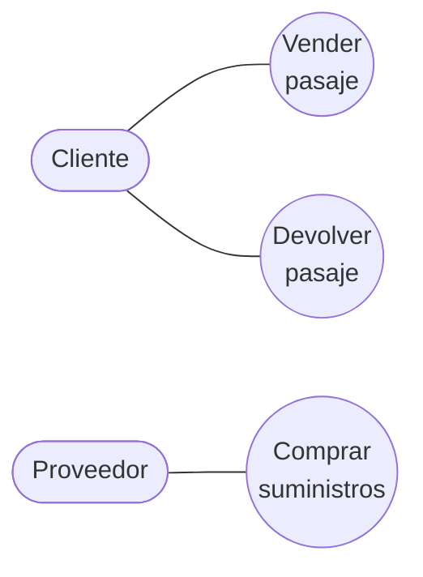
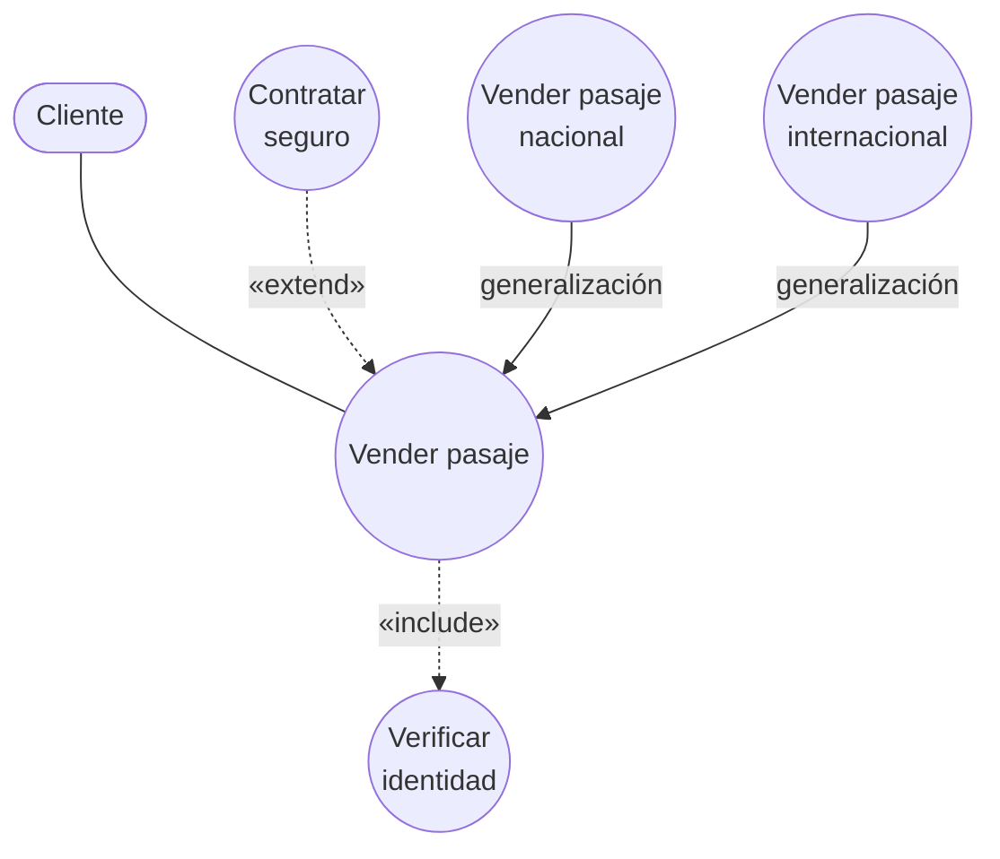
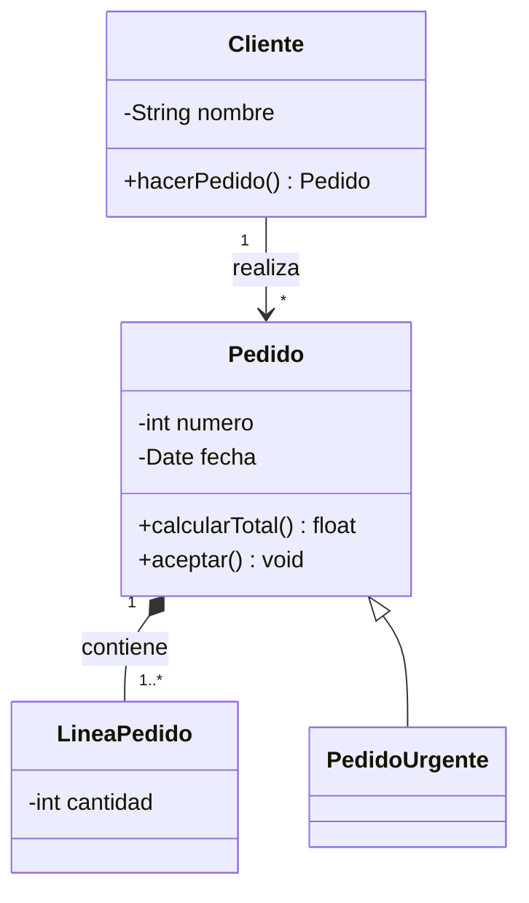
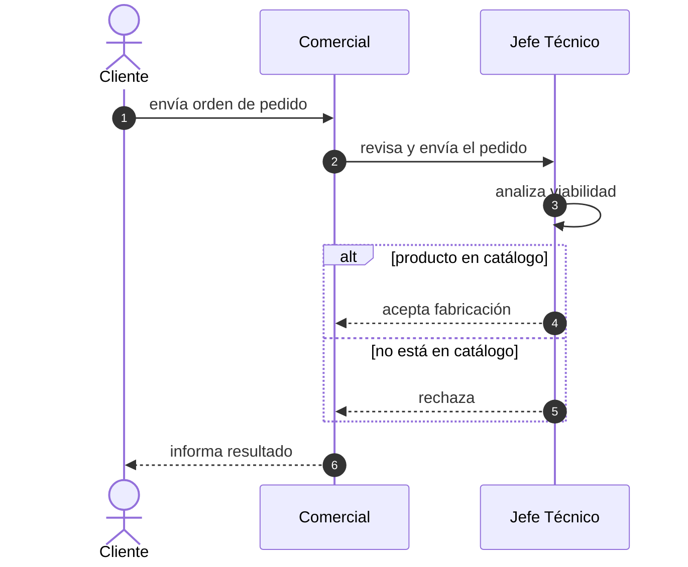
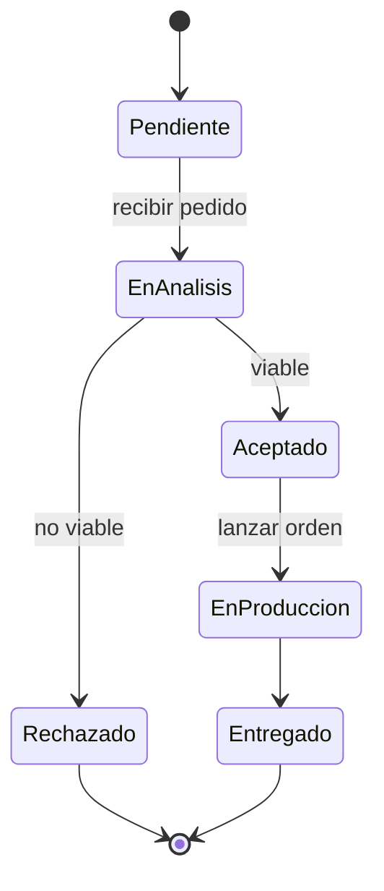
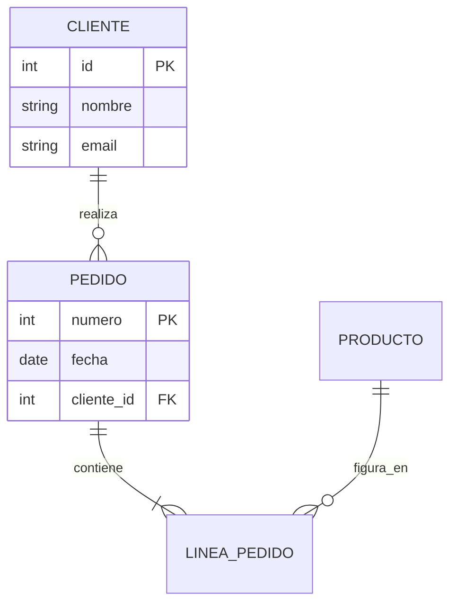
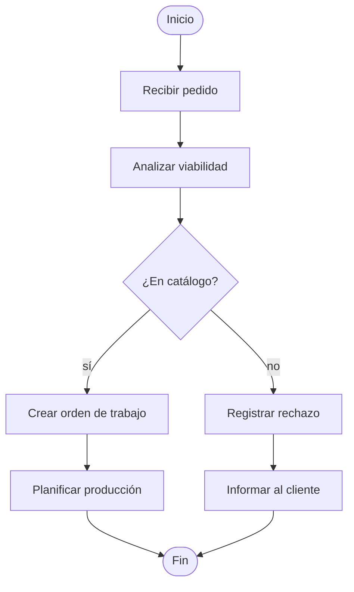
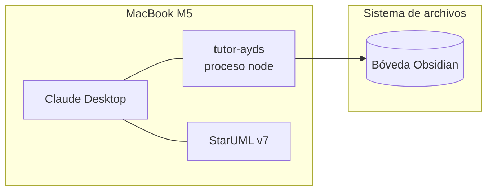
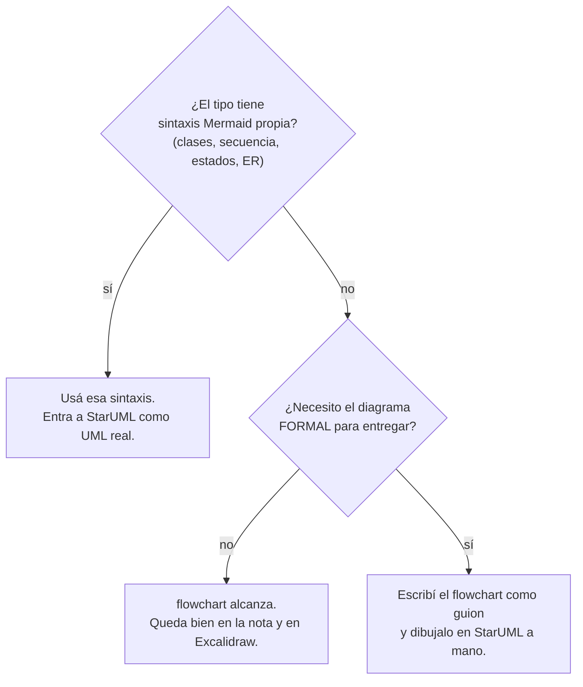

# De la teoría al diagrama

El puente entre las dos mitades de la bóveda:

- **La teoría** (en `01-Notas/`) dice **cómo se modela**: qué es actor y qué no, cuándo va
  `<<include>>` y cuándo `<<extend>>`, qué diagrama pide cada vista.
- **Las referencias** ([[StarUML]], [[Excalidraw]]) dicen **qué acepta cada herramienta**.

Esta nota junta las dos: para cada diagrama de la materia, la regla teórica que hay que respetar,
el patrón Mermaid que lo escribe, y a qué herramienta mandarlo.

> [!important] El orden correcto para armar un diagrama
> 1. **Leer la teoría** de la nota del concepto. Las reglas de modelado no son negociables: un
>    diagrama bonito con un actor mal puesto está mal.
> 2. **Escribir el Mermaid** con el patrón de acá abajo.
> 3. **Revisar el destino** en [[StarUML]] o [[Excalidraw]] antes de mandarlo, porque no todos
>    los tipos viajan igual.

---

## Casos de uso del negocio

**Teoría que manda:** [[Caso de uso del negocio]], [[Actor del negocio]],
[[Modelo de casos de uso del negocio]].

Reglas que hay que respetar y que son las que se corrigen en un examen:

| Regla | De dónde sale |
|---|---|
| El actor es un **rol**, no una persona | [[Actor del negocio]] |
| Cada actor modela algo **fuera** del negocio | [[Actor del negocio]] |
| Los trabajadores del negocio **no son actores** | [[Realizaciones de casos de uso del negocio]] |
| Cada actor se involucra con **al menos un** CUN | [[Actor del negocio]] |
| Un CUN **de apoyo** puede no tener ningún actor | [[Caso de uso del negocio]] |
| Un CUN = **un proceso de negocio** | [[Proceso de negocio]] |

**Patrón Mermaid** (actor como estadio, CUN como círculo, asociación sin punta):

**Destino:** ⚠️ es un `flowchart`. Entra a StarUML **como Flowchart, no como Use Case Diagram**.
Para un diagrama de casos de uso formal hay que dibujarlo en StarUML a mano — el Mermaid sirve
como guion de qué actores y qué casos de uso poner. En Excalidraw entra como formas editables.

---

## Las tres relaciones de CUN expandidos

**Teoría que manda:** [[Relación de inclusión include]], [[Relación de extensión extend]],
[[Generalización y especialización en casos de uso]].

La decisión no es de estilo, es semántica. La prueba rápida:

| Pregunta | Respuesta | Relación |
|---|---|---|
| ¿Ocurre **siempre**? | Sí | `<<include>>` |
| ¿Ocurre **a veces** o bajo condición? | Sí | `<<extend>>` |
| ¿Son **tipos** del mismo proceso, con comportamiento similar y diferencias sustanciales? | Sí | generalización |

Y la prueba de la tapada: tapá el CU secundario y leé el base. Si queda **incompleto** era
`include`; si **se entiende igual** era `extend`.

**Patrón Mermaid.** Ojo con las direcciones, que es lo que más se equivoca:

Fijate en las flechas:

- `include`: **del base al incluido** (el base sabe que lo llama).
- `extend`: **de la extensión al base** (el base no sabe que lo extienden).
- generalización: **del hijo al padre**, y el actor se asocia al **padre**.

**Destino:** mismo caso que arriba — `flowchart`, así que StarUML lo toma como Flowchart. Los
estereotipos `«include»` quedan como texto de la flecha, no como estereotipos UML.

---

## Diagrama de clases

**Teoría que manda:** [[Modelo 4+1 vistas]] — es la **vista lógica**: requisitos funcionales, el
dominio de la aplicación, las clases y objetos del *core*.

**Patrón Mermaid** — acá sí conviene usar `classDiagram` de verdad, no un flowchart:

Notación de relaciones en Mermaid: `<|--` herencia, `*--` composición, `o--` agregación,
`-->` asociación dirigida, `..>` dependencia.

**Destino:** ✅ el mejor caso. Entra a StarUML como **Class Diagram UML de verdad**, con atributos
y métodos. También entra nativo a Excalidraw. Se pierden namespaces, estilos, links y formato
Markdown.

---

## Diagrama de secuencia

**Teoría que manda:** [[Realizaciones de casos de uso del negocio]] — es uno de los cuatro
artefactos con que se documenta una realización, el que muestra la **interacción en el tiempo**
entre los trabajadores.

**Patrón Mermaid:**

Dos cosas que se agradecen: `autonumber` numera los pasos solo, y `alt/else` es la forma correcta
de escribir el **curso alterno** de la [[Descripción textual de casos de uso]].

**Destino:** ✅ entra a StarUML como Sequence Diagram UML. Se pierden Group/Box, colores y las
flechas bidireccionales; la activación se muestra en todo el diagrama.

---

## Diagrama de estados

**Patrón Mermaid:**

`[*]` es el estado inicial y también el final, según de qué lado de la flecha esté.

**Destino:** ✅ entra a StarUML como Statechart Diagram. Se pierden los **estados compuestos** y
la concurrencia, así que si el modelo los necesita hay que armarlos a mano después.

---

## Modelo entidad-relación

**Patrón Mermaid:**

Cardinalidades: `||` exactamente uno, `o{` cero o muchos, `|{` uno o muchos.

**Destino:** ✅ entra a StarUML como Entity-Relationship Diagram, con las claves PK/FK.

---

## Los que NO se pueden importar

Para estos cuatro, Mermaid sirve para **pensar y dejar constancia en la nota**, pero el diagrama
formal se dibuja en StarUML. Es una limitación de la importación, no de StarUML: los cuatro
existen como diagramas nativos.

| Diagrama | Vista del [[Modelo 4+1 vistas]] | Aproximación en Mermaid |
|---|---|---|
| **Actividad** | Vista de procesos | `flowchart` con rombos de decisión |
| **Componentes** | Vista de desarrollo | `flowchart` con nodos y dependencias |
| **Despliegue** | Vista física | `flowchart` con `subgraph` por nodo físico |
| **Casos de uso** | Vista +1 (escenarios) | `flowchart` como el patrón de arriba |

Aproximación para **actividad** (el rombo `{...}` es la decisión):

Aproximación para **despliegue** (⚠️ los `subgraph` **se pierden** al importar a StarUML — ver
[[StarUML]]):

---

## Regla práctica para elegir cómo escribir un diagrama

El error a evitar: escribir un `flowchart` de casos de uso, importarlo a StarUML, y creer que ya
tenés un diagrama de casos de uso UML. Tenés un flowchart con forma de casos de uso.

---

## Notas relacionadas

- [[StarUML]] — los 7 tipos importables y las limitaciones por tipo
- [[Excalidraw]] — los 5 tipos nativos y el fallback a imagen
- [[Modelo 4+1 vistas]] — qué diagrama pide cada vista
- [[Caso de uso del negocio]], [[Actor del negocio]] — las reglas de modelado
- [[Relación de inclusión include]], [[Relación de extensión extend]], [[Generalización y especialización en casos de uso]]

## Preguntas de repaso

1. ¿Cuál es el orden correcto de los tres pasos para armar un diagrama?
2. Escribís un `flowchart` de casos de uso y lo importás a StarUML. ¿Qué obtenés exactamente?
3. ¿Hacia dónde apunta la flecha en `include` y hacia dónde en `extend`? ¿Por qué en esa dirección?
4. ¿Qué cuatro diagramas de la materia no se pueden importar por Mermaid?
5. ¿Cómo se escribe un curso alterno en un `sequenceDiagram`?
