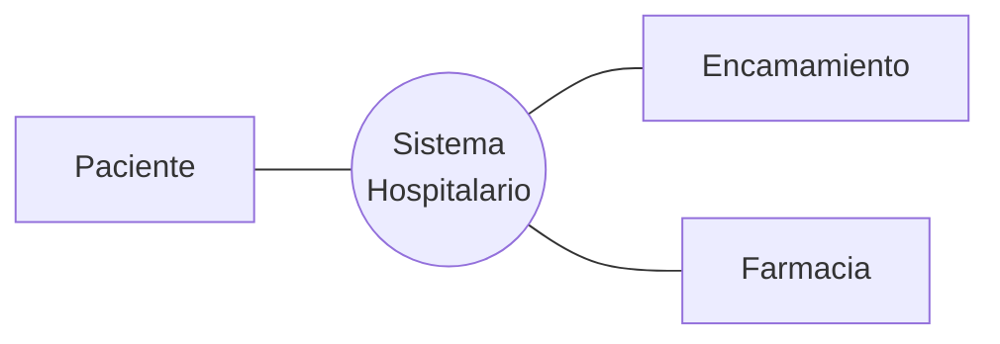

# Ejemplos resueltos de casos de negocio

Los **cuatro casos** que resolvió ella en clase, puestos en paralelo. Es la referencia para comparar
contra lo que estés armando.

> [!important] Por qué esta nota existe
> Ella resolvió el mismo encadenamiento **cuatro veces**, en cuatro dominios distintos. Eso convierte
> el patrón en verificable: si tu entrega no se parece a estos cuatro, probablemente esté mal.
>
> Y uno de los cuatro es un **hospital** — el dominio del Caso 1.

---

## 1. El patrón, en una tabla

| | **Tienda Electrónica** | **Fábrica de Materiales** | **Restaurante** | **Hospital** |
|---|---|---|---|---|
| **Core** (1 CUN) | *Sistema de Ventas on line Tienda X* | *Gestión de la Producción de Productos de Construcción* | *Automatización de Procesos del Restaurante X* | *Sistema Hospitalario* |
| **Actores del core** | Contabilidad, Ventas, Cliente, Almacén, Transporte, Banco *(6)* | Administrador/Gestor, Proveedores, Clientes *(3)* | Cliente, Gerente, Proveedor *(3)* | Paciente, Encamamiento, Farmacia *(3)* |
| **Primera descomposición** | Procesamiento de Pedidos · Gestión de Inventario · Pagos · Envío · Soporte al Cliente *(5)* | Gestión de Suministros · Gestión de Materia Prima · Gestión de Productos en Proceso · Gestión de Producto Terminado · Gestión de Ventas/Alquiler *(5)* | Servicio de comida · Comprar suministros · Marketing *(3, y son las **tres categorías**)* | — *(no la mostró)* |
| **Actores de la descomposición** | los **mismos 6** | Administrador, Proveedor, Banco, Contabilidad, Transporte, Ventas *(6)* | Cliente, Proveedor, Cliente potencial, Gerente de RRPP *(4)* | — |
| **Expandido** | *Procesamiento de Pedido* → 7 CU · y dos versiones más (con actores, y con IDs `CU_02…CU_10`) | los 5 procesos, cada uno `«include»` *Añadir / consultar / modificar / eliminar* | *Servicio de Comida* → 9 CU con `«extiende»` **condicionado** | — |

> [!important] Las tres reglas que se repiten en los cuatro casos
> **1. El core es UNA sola elipse** y nombra el **negocio o sistema completo**. Nunca dos, nunca cinco.
>
> **2. La descomposición tiene entre 3 y 5 procesos.** No dos, no quince. Esa es la escala que ella usa.
>
> **3. Los actores del core reaparecen en la descomposición.** En la Fábrica pasa de 3 a 6 porque al
> abrir los procesos aparecen contrapartes que antes estaban implícitas (Banco, Contabilidad,
> Transporte, Ventas). Eso es **legítimo y esperable** — lo que no puede pasar es que **desaparezca**
> un actor del core.

## 2. Tienda Electrónica — el más completo

### Core

![[adjuntos/capturas-clase/cun-ejemplo-core-tienda-electronica.png]]

### Primera descomposición

![[adjuntos/capturas-clase/cun-ejemplo-primera-descomposicion-tienda-electronica.png]]

### Expandido, versión con relaciones

![[adjuntos/capturas-clase/cu-expandido-procesamiento-de-pedido.png]]

### Expandido, versión completa con actores y carriles

![[adjuntos/capturas-clase/cu-expandido-procesamiento-de-pedido-completo.png]]

La misma expansión, pero **con los actores puestos**: *Cliente*, *Cliente registrado*, *Ventas* y
*Transportista*, y más casos (*Registrarse*, *Ver pedidos*, *Ver pedido con saldo*, *Marcar para
cobrar*, *Confirmar pedido*, *Rechazar pedido*, *Distribuir*, *Entregar pedido*).

> [!important] La diferencia entre las dos versiones del mismo expandido
> La primera muestra **solo las relaciones** entre casos de uso — sirve para razonar sobre
> `«include»` y `«extend»`. La segunda agrega **los actores** — sirve para verificar la regla de que
> todo CU tenga al menos uno.
>
> Conviene dibujar **las dos**: primero las relaciones, después los actores encima. Intentar las dos
> cosas a la vez en un diagrama grande es lo que lo vuelve ilegible.

### Expandido, versión con identificadores

![[adjuntos/capturas-clase/cu-expandido-tienda-electronica-con-ids.png]]

Esta segunda versión es la que enseña la **convención de IDs** que usa ella:

| ID | Nombre | Actor |
|---|---|---|
| `CU_02` | Comprobar pedido | Vendedor |
| `CU_03` | Comprobar existencias | Almacén |
| `CU_04` | Reponer existencias | — |
| `CU_05` | Cancelar pedidos | — |
| `CU_06` | Elaborar factura | Contable |
| `CU_07` | Cobrar factura | Contable |
| `CU_08` | Notificar fallo cobro | — |
| `CU_09` | Notificar envío pedido | Almacén |
| `CU_10` | Validar entrega pedido | Almacén |

> [!warning] Hay dos convenciones de ID en el material de clase
> | Fuente | Formato | Ejemplo |
> |---|---|---|
> | Esta diapositiva | `CU_0n Nombre` — **guion bajo**, dos dígitos | `CU_03 Comprobar existencias` |
> | La NT1 de trazabilidad | `CU-0nn` y `RFG-0nn` — **guion medio**, tres dígitos, con paquete | `Administración::CU-011: Administrar perfiles` |
>
> **Las dos son material de clase.** Elegí una, **declarala** al principio del documento y no la
> mezcles. Si vas a entregar las matrices de trazabilidad, conviene la de la **NT1**: es la que
> aparece en la plantilla obligatoria. Ver [[Guía - Matrices de trazabilidad]].
>
> Y notá que en el diagrama con IDs **hay CU sin actor** (`CU_04`, `CU_05`, `CU_08`): son los que
> quedan conectados por `«extend»` o `«include»` a otro, no por asociación a un actor. Es la excepción
> de [[Convenios del diagrama de CUN]] §2.

## 3. Fábrica de Materiales para Construcción

### Core

![[adjuntos/capturas-clase/cun-ejemplo-core-fabrica-materiales.png]]

### Primera descomposición

![[adjuntos/capturas-clase/cun-primera-descomposicion-fabrica-materiales.png]]

Las asociaciones, leídas una por una de la imagen:

| CUN | Actores con los que se asocia |
|---|---|
| Gestión de Suministros | **Administrador** · Proveedor |
| Gestión de Materia Prima | Proveedor |
| Gestión de Productos en Proceso | **Administrador** · Banco · Contabilidad |
| Gestión de Producto Terminado | Transporte |
| Gestión de Ventas/Alquiler | **Administrador** · Ventas |

> [!warning] Estas asociaciones se verificaron con zoom; la imagen es la fuente de la verdad
> **No re-dibujes sus diagramas en Mermaid.** Es exactamente el tipo de tarea donde se cuela un error
> de una arista, y ya pasó: la primera versión de esta tabla, hecha como diagrama Mermaid a partir de
> la hoja de contactos, tenía **asociaciones inventadas**.
>
> Mermaid sirve para el **patrón conceptual**. Para *su* diagrama concreto: la imagen, y una tabla
> leída una por una.
>
> Y fijate el detalle que aparece al contarlas: **el Administrador no se asocia a los cinco**, solo a
> **tres**. Los otros dos procesos se relacionan únicamente con su contraparte externa. Es legal: la
> regla es *"al menos un actor"*, no *"el actor principal en todos"*
> (→ [[Convenios del diagrama de CUN]] §2).

> [!tip] El patrón de nombres es transparente
> Los cinco procesos son **"Gestión de X"**, y las X son las **etapas del ciclo de vida del material**:
> suministros → materia prima → producto en proceso → producto terminado → venta.
>
> **Eso es aplicable directo a FarmaHosp.** El enunciado te da las **6 etapas** del ciclo de vida del
> medicamento: adquisición, almacenamiento, prescripción, dispensación, administración, seguimiento y
> farmacovigilancia. Si nombrás tus procesos siguiendo el ciclo, la descomposición sale sola y la
> cobertura del enunciado queda demostrada.

### Expandido

![[adjuntos/capturas-clase/cu-expandido-fabrica-materiales.png]]

Acá el patrón es **CRUD**: cada uno de los cinco procesos `«include»` *Añadir*, *consultar*,
*modificar* y *eliminar*; y hay un *resumen* que `«include»` *consultar general*.

> [!warning] Ojo con copiar el patrón CRUD a ciegas
> Sirve para un caso de gestión administrativa, pero **FarmaHosp no es un CRUD**. Sus procesos son de
> **flujo** (recibir lote → controlar temperatura → validar prescripción → asignar lote → escanear →
> reportar), no de mantenimiento de tablas.
>
> Si expandís FarmaHosp como *Añadir/consultar/modificar/eliminar* vas a perder todo lo que el
> enunciado pide: la validación contra protocolos, la cadena de frío, el doble registro
> farmacéutico-enfermero. El patrón que te sirve es el de **Procesamiento de Pedido**, no el CRUD.

## 3 bis. Restaurante — el cuarto encadenamiento

Es el caso que usa la nota técnica, y ella también lo resolvió en diapositivas.

### Core

![[adjuntos/capturas-clase/cun-ejemplo-core-restaurante.png]]

El CUN único es **"Automatización de Procesos del Restaurante X"**, con **Cliente**, **Gerente** y
**Proveedor**.

### Primera descomposición

![[adjuntos/capturas-clase/cun-ejemplo-descomposicion-restaurante.png]]

Se abre en **Servicio de comida** (núcleo, Cliente), **Comprar suministros** (soporte, Proveedor) y
**Marketing** (gerencial, Cliente potencial y Gerente de Relaciones Públicas).

> [!important] Este es el único de los cuatro donde se ven las TRES categorías
> Núcleo, soporte y gerenciales, cada una con su actor propio. Es el mejor molde para demostrar que
> aplicaste la **clasificación de procesos** y no solo listaste lo obvio — ver
> [[Identificación de procesos del negocio]].
>
> En Tienda Electrónica y Fábrica los cinco procesos son casi todos de **núcleo**; acá están las tres.
> Para FarmaHosp conviene este molde: el ciclo del medicamento es núcleo, pero *auditar*, *reportar al
> MSPAS* y *el tablero financiero del director* son soporte y gerenciales.

### Expandido

![[adjuntos/capturas-clase/cu-expandido-servicio-de-comida.png]]

*Servicio de Comida* se expande en **nueve** casos de uso, con **cuatro** actores
(**Camarero**, **Chef**, **Cliente**, **Cajero**). Los cuatro pares base/extensión:

| Caso base | Lo extiende | Guarda, textual |
|---|---|---|
| Pedir Comida | Pedir Vino | `« extender »` *(sin guarda escrita)* |
| Servir la Comida | Servir el Vino | `«extender» {si se pidió vino}` |
| Coma la Comida | Beber Vino | `«extender» {si se consumió vino}` |
| Pagar la Comida | Pagar el Vino | `«extender» {si se consumió vino}` |

Más **Cocinar la Comida**, que no extiende a nadie: se asocia al **Chef**.

> [!important] Cuatro cosas exactas de este ejemplo
> **1. El estereotipo que usa es `«extender»`**, no `«extiende»` ni `«extend»`. En el material de clase
> aparecen las tres formas según el deck — elegí una y usá la misma en toda la entrega.
>
> **2. Las guardas van entre llaves y son textuales**: `{si se pidió vino}`, `{si se consumió vino}`.
> Eso es lo que pide [[Relación de extensión extend]]: una extensión sin condición declarada no se
> puede evaluar.
>
> **3. Las cuatro flechas de `«extender»` apuntan al caso BASE.** Cuatro instancias en un solo
> diagrama, todas en la misma dirección — es la mejor confirmación de la regla.
>
> **4. Acá las asociaciones SÍ llevan nombre**: *Recibir el pedido*, *Hacer el pedido*, *Pagar*,
> *Aceptar el pago*, *Pedido Confirmado*. Eso **no** contradice los convenios: esos aplican al
> diagrama de **CUN** (core y descomposición), donde las asociaciones van sin etiqueta. En un
> **expandido** dibujado con herramienta, etiquetarlas ayuda a leerlo. Ver
> [[Convenios del diagrama de CUN]] §3.
>
> Y un detalle honesto: el diagrama tiene un texto en inglés sin traducir (*"Facilitate Payment"*).
> Es de ella, no un error de transcripción.

## 4. Hospital — el que más se parece a tu caso

![[adjuntos/capturas-clase/cun-ejemplo-core-hospital.png]]

> [!important] Lo que este ejemplo resuelve para FarmaHosp
> **La Farmacia es un ACTOR, no un proceso.** Y *Encamamiento* también. Frente al *Sistema
> Hospitalario*, las áreas del hospital son **actores del negocio**.
>
> Eso te da una salida limpia a la decisión que tenías pendiente: si el core es *"Sistema de gestión de
> MAC"*, entonces **Farmacia**, **Enfermería**, **Consulta Externa** y **Hospitalización** son
> actores — igual que en su ejemplo. Los individuos (médico, farmacéutico, enfermero) aparecen como
> **trabajadores** en las realizaciones, no como actores del core.
>
> Y notá que el **Paciente** sí es actor: es quien recibe el resultado de valor.

### Generalización entre actores

```mermaid
flowchart TD
    ACE["Administrador<br/>Consulta Externa"] -->|"hereda"| CL["Cliente"]
    AH["Administrador<br/>Hospitalización"] -->|"hereda"| CL
    CL --- DM(("Despachar medicamentos<br/>en farmacia"))
    ACE --- AC(("Asignar citas"))
    AH --- ACA(("Asignar camas"))
```

![[adjuntos/capturas-clase/generalizacion-entre-actores-hospital.png]]

**El patrón:** el actor **padre** se queda con el CUN **compartido**; cada **hijo** se queda con el
suyo. *Cliente* despacha medicamentos (los dos lo hacen); solo Consulta Externa asigna citas y solo
Hospitalización asigna camas.

> [!tip] Aplicable directo a FarmaHosp
> Si en tu caso el *Médico tratante* y el *Médico de urgencias* comparten *Prescribir MAC* pero solo
> el de urgencias tiene *Acceder a diagnóstico sensible con justificación*, esa es exactamente esta
> figura. Ahorra flechas y demuestra que entendiste la generalización.

---

## 5. Checklist: compará tu entrega contra los tres

- [ ] ¿Tu **core** tiene **una sola** elipse, con el nombre del sistema/negocio completo?
- [ ] ¿Tu **primera descomposición** es **un solo diagrama** con 3 a 5 procesos?
- [ ] ¿Están representadas las **tres categorías** (núcleo, soporte, gerenciales), como en el Restaurante?
- [ ] ¿**Todos** los actores del core reaparecen en la descomposición?
- [ ] ¿Los nombres de tus procesos siguen las **etapas del ciclo de vida** del enunciado?
- [ ] ¿Las **áreas** del hospital están como actores, y las **personas** como trabajadores?
- [ ] ¿Elegiste **una** convención de ID y la declaraste?
- [ ] ¿Tu expandido usa el patrón de **flujo** (como Procesamiento de Pedido) y **no** el CRUD?
- [ ] ¿Usaste la **generalización entre actores** donde dos roles comparten un CUN?

---

## Notas relacionadas

- [[Guía - Caso de negocio]] — el "cómo se hace" de los tres diagramas
- [[Convenios del diagrama de CUN]] — cómo se dibujan las flechas y la notación
- [[Diagrama de contexto]] — el diagrama que va antes del core
- [[Guía - Diagrama de casos de uso del negocio]] — identificar procesos y actores
- [[Descripción textual de casos de uso]] — la ficha de cada CUN
- [[Guía - Matrices de trazabilidad]] — la convención de IDs de la plantilla obligatoria
- [[Actor del negocio]] — actor vs. trabajador
- [[Generalización y especialización en casos de uso]] — la relación del ejemplo del hospital
- [[Plan - Caso 1 FarmaHosp]] — el criterio 1, 25 puntos

## Preguntas de repaso

1. ¿Cuántas elipses tiene un diagrama **core**, en los cuatro ejemplos?
2. ¿Cuál de los cuatro casos muestra las **tres categorías** de proceso, y por qué es el mejor molde para FarmaHosp?
2. ¿Cuántos procesos tiene la primera descomposición en los dos casos donde la mostró?
3. En la Fábrica, los actores pasan de 3 a 6 entre el core y la descomposición. ¿Es un error? ¿Por qué?
4. ¿Qué patrón de nombres usa para los cinco procesos de la Fábrica, y de dónde sale?
5. ¿Por qué el patrón CRUD del expandido de la Fábrica **no** sirve para FarmaHosp?
6. En el ejemplo del Hospital, ¿*Farmacia* es actor o proceso? ¿Qué implica eso para tu caso?
7. En la generalización entre actores, ¿qué CUN se queda el padre y qué CUN los hijos?
8. ¿Cuáles son las dos convenciones de ID del material de clase, y cuál conviene si vas a entregar matrices?
9. ¿Por qué en el diagrama con IDs hay casos de uso sin actor?
