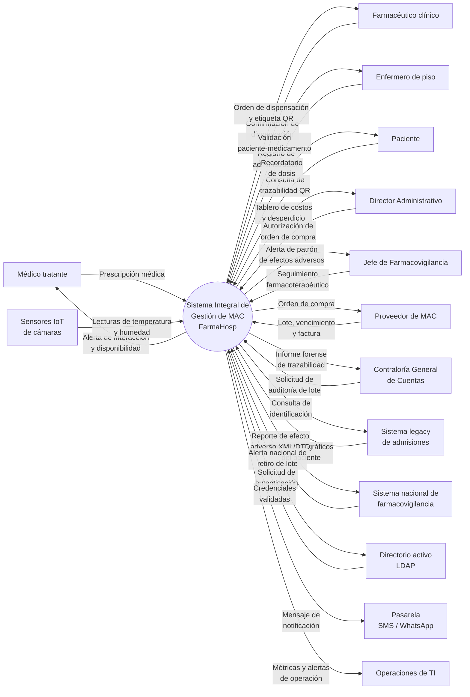
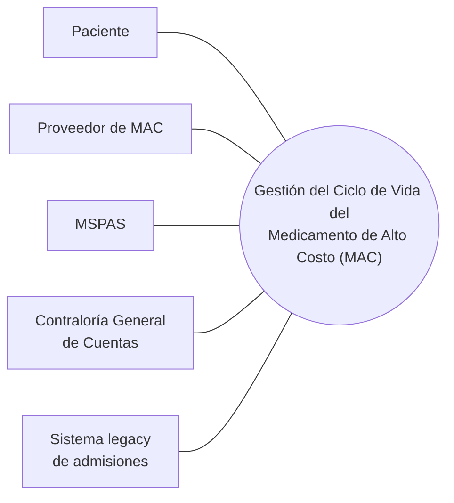
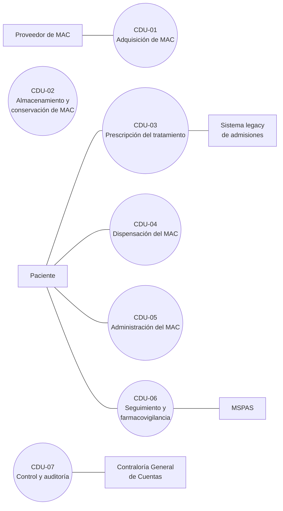
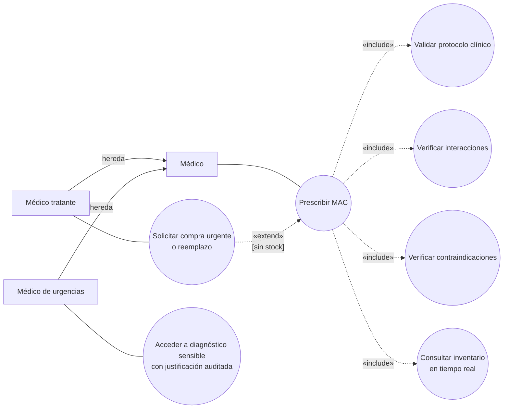
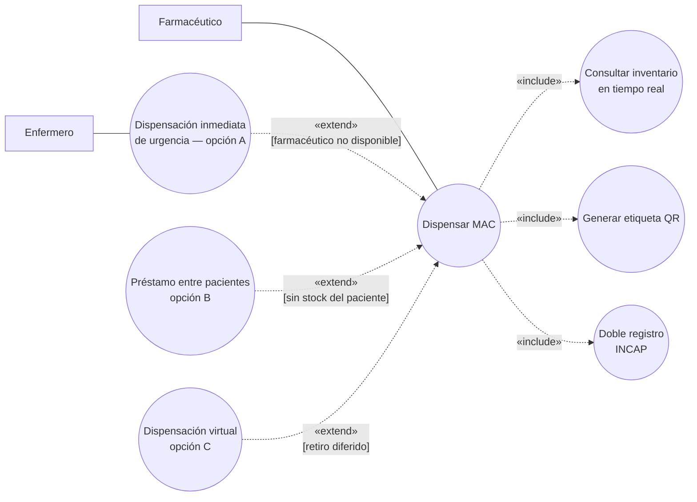
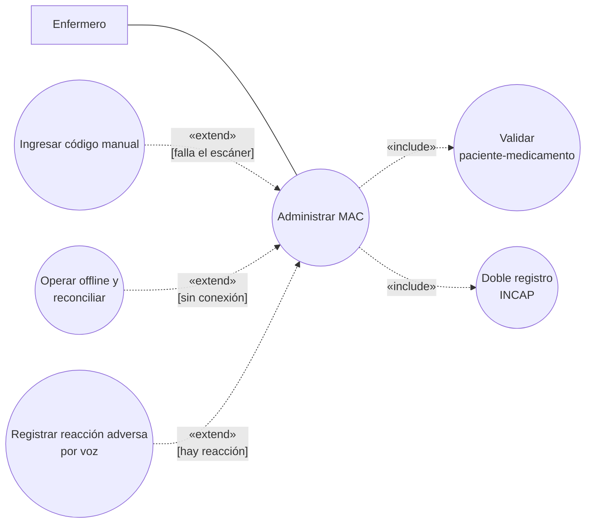

# Caso 1 — FarmaHosp · Entrega

Enunciado: [[Caso 1 - FarmaHosp]] · Plan: [[Plan - Caso 1 FarmaHosp]]

---

## 0. Frontera del negocio (declaración de alcance)

> [!important] Esta declaración condiciona todo el resto del documento
> **Entidad de interés (el negocio):** la **gestión del ciclo de vida del medicamento de alto
> costo (MAC)** del Hospital Universitario "Dr. Juan José Ortega".
>
> **Razón de ser:** garantizar que el MAC correcto llegue al paciente correcto, en condiciones
> de conservación válidas, con trazabilidad completa y auditable desde la compra hasta la
> farmacovigilancia.
>
> **Qué queda adentro:** las 6 etapas del ciclo de vida — adquisición, almacenamiento,
> prescripción, dispensación, administración, seguimiento y farmacovigilancia.
>
> **Qué queda afuera:** el resto de la operación hospitalaria (consulta externa, hospitalización,
> cirugía, laboratorio), que solo se relaciona con este negocio por sus interfaces.
>
> **Consecuencia sobre los actores:** el personal clínico y administrativo que **ejecuta** esas
> 6 etapas —médico tratante, farmacéutico clínico, enfermero de piso, almacenista, jefe de
> farmacovigilancia y director administrativo— son **trabajadores del negocio**, no actores,
> porque están dentro de la frontera. Son **actores del negocio** únicamente las entidades que
> interactúan con él desde afuera: paciente, proveedor de MAC, MSPAS, Contraloría General de
> Cuentas, proveedor de MAC y sistema legacy de admisiones.
>
> *Criterio aplicado:* «cada actor modela algo fuera del negocio» — Jacobson, modelado de negocio.
> Ver [[Actor del negocio]].

---

## 1. Identificación de stakeholders  ·  criterio 2 — 25 pts

### 1.1 Cómo se identificaron

Se partió de los **8 stakeholders nombrados en el enunciado** y se completó con tres barridos: los
cinco roles genéricos de clase, las categorías de metas de negocio de **PALM**, y los internos que no
son usuarios (Garland & Anthony). De ahí salieron **5 stakeholders que el enunciado usa en sus
escenarios pero no lista en su tabla**.

| Agregado | Barrido que lo encontró | Requisito propio que ningún otro trae |
|---|---|---|
| **Junta Directiva del hospital** | cliente / crecimiento y continuidad | Aprobó y financia el proyecto: plazo de 12 meses y evidencia de que las pérdidas se detuvieron |
| **Contraloría General de Cuentas** | responsabilidad hacia el estado (auditor) | Informe forense de un lote y **registros inmutables**. El MSPAS pide reportar; la Contraloría pide **probar** |
| **Consultora externa (desarrolladores)** | organización de desarrollo | Venía fusionada con el equipo interno en la tabla del enunciado, y el propio enunciado los enfrenta después: Python/PostgreSQL vs. Java/Oracle. **Dos intereses opuestos no pueden ser un mismo stakeholder** |
| **Proveedor de MAC** | etapa 1 del ciclo de vida | La trazabilidad **arranca en él**: lote, vencimiento y factura entran al sistema desde su entrega |
| **Operaciones de TI / data center** | operaciones y gestión del sistema | Techo fijo de 32 vCPU / 128 GB / SAN 10 TB **sin autoescalado**, y 500,000 registros de sensores diarios. Nadie más responde por eso |

> [!note] Criterio usado para incluir a alguien
> Un stakeholder entra a la lista solo si se le puede nombrar **un concern propio** que ningún otro
> de la lista aporte. Roles como INCAP, RRHH o el personal de admisiones tienen exigencias reales,
> pero no aportan un concern distinto de uno ya listado (cumplimiento normativo, capacitación,
> confidencialidad): se tratan como **drivers de restricción** en el criterio 3, no como
> stakeholders separados.

### 1.2 Tabla de stakeholders

Tipo de interés: **usa · paga · mantiene · opera · regula · construye** — cada tipo anticipa la clase
de driver que ese stakeholder va a aportar en el criterio 3.

| ID | Stakeholder | Tipo | Posición | Lo que dice que quiere | Necesidad oculta | Concern dominante |
|---|---|---|---|---|---|---|
| `STK-01` | Médico tratante (oncólogo) | usa | dentro — trabajador | "Quiero prescribir rápidamente, en menos de 5 minutos, sin andar buscando papel." | Que el sistema le **sugiera** el MAC según protocolo, le **alerte** interacciones y contraindicaciones, **valide contra inventario en tiempo real** y —si no hay stock— le permita pedir compra urgente o reemplazo terapéutico desde la misma pantalla. Y que **recuerde su patrón de prescripción**. | Usabilidad y eficiencia, sobre integridad de datos clínicos |
| `STK-02` | Farmacéutico/a clínico/a | usa | dentro — trabajador | "Quiero un sistema que no se caiga, porque si no puedo dispensar, los pacientes no reciben su quimioterapia." | Operación **< 2 s** y que **funcione aunque falle la red** (la farmacia está en el sótano, con Wi-Fi inestable). Y un **inventario predictivo** que anticipe faltantes con 7 días de vista, según las prescripciones programadas. | Disponibilidad (operación degradada) y performance |
| `STK-03` | Enfermero/a de piso | usa | dentro — trabajador | "Quiero que el escáner funcione rápido y no se trabe." | Validación paciente-medicamento **< 1 s**; poder **administrar offline** si cae la conexión, con trazabilidad que se resuelve al reconectar **sin duplicar registros**; y registrar reacciones adversas por **voz a texto** (escribir en la tablet con el paciente en shock es inviable). | Performance y disponibilidad, con usabilidad bajo presión |
| `STK-04` | Director Administrativo | paga · usa | dentro — trabajador | "Quiero ahorrar dinero y evitar pérdidas por caducidad." | **Tablero financiero**: costo por paciente, por servicio y % de desperdicio. Y **auditar quién autorizó cada compra y quién dio de baja un vencido**, de forma transparente para la Contraloría. | Auditabilidad y observabilidad del negocio |
| `STK-05` | Jefe de Farmacovigilancia | regula (interno) · usa | dentro — trabajador | "Quiero cumplir con la ley y reportar efectos adversos." | **Detección automática de patrones** de efectos adversos (ej. 5 pacientes del mismo lote con náuseas → alerta temprana) y que los reportes al sistema nacional se **generen automáticamente**, sin transcripción manual de su equipo. | Cumplimiento normativo e integrabilidad |
| `STK-06` | Paciente | usa (indirecto) | **fuera — actor** | "Quiero que me den mi medicamento rápido y no me equivoquen." | **Trazabilidad verificable por él mismo** (escanear el QR y confirmar medicamento y dosis), **notificación de la próxima dosis** por SMS/WhatsApp en tratamiento ambulatorio, y **confidencialidad total** de su diagnóstico (VIH, cáncer) frente a personal no autorizado. | Confidencialidad, y trazabilidad de cara al paciente |
| `STK-07` | Ministerio de Salud (MSPAS) | regula | **fuera — actor** | "Queremos estandarizar la trazabilidad a nivel nacional." | Exportación en **HL7 FHIR** para interoperar con otros hospitales y **APIs seguras** para que el sistema nacional consulte efectos adversos en tiempo real. Reporte obligatorio **≤ 24 h** en XML con la DTD del MSPAS. | Interoperabilidad y cumplimiento |
| `STK-08` | Equipo interno de TI del hospital (3 personas: Java 8, Spring Boot, Oracle PL/SQL, Angular) | mantiene | dentro — trabajador | "Queremos usar tecnologías modernas y entregar rápido." | Que el stack sea **mantenible por 3 personas con su experiencia real** después de que la consultora se vaya; **evolución incremental** (dispensación y almacén → prescripción → farmacovigilancia); y **documentación viva**, porque la rotación de personal es alta. | **Mantenibilidad y modificabilidad** |
| `STK-09` | Consultora externa — 5 desarrolladores (Python/Django, React, MongoDB, Kafka) | construye | fuera — solo interés | "Queremos usar tecnologías modernas y entregar rápido." | Un stack **negociado** que su equipo pueda construir y el interno pueda heredar, y **módulos con límites claros** para entregar por incrementos dentro de los 12 meses de contrato sin bloquearse contra el equipo interno. | Constructibilidad y velocidad de entrega |
| `STK-10` | Junta Directiva del hospital | paga | fuera — solo interés | "Aprobamos la transformación digital: queremos resultados." | **Hitos visibles dentro de los 12 meses** y evidencia medible de que las pérdidas (Q. 2.5 M por caducidades) y los errores de medicación se detuvieron, sin exponer al hospital a sanciones legales. | Costo, plazo y continuidad institucional |
| `STK-11` | Contraloría General de Cuentas | regula (audita) | **fuera — actor** | "Exigimos trazabilidad completa desde la compra hasta la administración." | **Informe forense de un lote en < 10 minutos** —compra, proveedor, factura, temperaturas de almacenamiento, pacientes, enfermero, médico, bajas y ajustes— sobre registros **inmutables que nadie pueda alterar, ni el administrador del sistema**. | **Auditabilidad e inmutabilidad** |
| `STK-12` | Proveedor de MAC | provee | **fuera — actor** | "Queremos recibir órdenes de compra y que se nos reciba el producto." | Que el número de lote, el vencimiento y la factura entren al sistema **exactos y sin transcripción manual** (los 3 errores por etiqueta mal transcrita nacen acá), y una vía para **notificar retiros de lote**. | Integridad del dato de origen |
| `STK-13` | Operaciones de TI / data center (VMware, SAN, red) | opera | dentro — trabajador | "Que el servidor no se caiga." | Que la solución **quepa en 32 vCPU / 128 GB / SAN 10 TB sin autoescalado**, absorba el **pico de 10x los lunes 8:30 AM**, sobreviva a **500,000 registros de sensores/día** y priorice el tráfico de dispensación sobre el resto de los 50 Mbps compartidos. | **Escalabilidad con recursos fijos** y observabilidad |

> [!note] Por qué STK-08 y STK-13 son stakeholders distintos
> Son las mismas personas —el hospital tiene 3 en TI—, pero el criterio de identidad de un
> stakeholder es **el concern, no la persona**: como *mantenimiento* piden un stack que puedan
> heredar (Java/Oracle); como *operaciones* piden que la solución quepa en una capacidad fija. Son
> dos requisitos independientes y uno puede cumplirse sin el otro.

### 1.3 Conflictos entre stakeholders

Cada tensión es un **tradeoff que la arquitectura tendrá que resolver**, no una falla del análisis.

| Stakeholder A | pide | Stakeholder B | pide | Tensión | Cómo se resuelve |
|---|---|---|---|---|---|
| `STK-08` Equipo interno de TI | Java + Oracle: es lo que sabe mantener | `STK-09` Consultora externa | Python + PostgreSQL + MongoDB: es lo que sabe construir | **Constructibilidad vs. mantenibilidad**, agravada porque el hospital exige que el interno lo mantenga solo tras 12 meses | Decide **quién se queda**: manda la mantenibilidad del equipo interno. La consultora aporta velocidad dentro de ese stack |
| `STK-06` Paciente | Confidencialidad máxima: nadie no autorizado ve su diagnóstico | `STK-04` Director Administrativo | Auditar todo lo que ocurre en el sistema | **Confidencialidad vs. auditabilidad** | El enunciado ya la resuelve: se audita **el acceso y la transacción**, no el diagnóstico. Ni el director lo ve sin orden judicial |
| `STK-03` Enfermero | Poder administrar **offline** cuando cae la red | `STK-11` Contraloría | Registro inmutable, sin duplicados ni huecos | **Disponibilidad vs. consistencia e integridad** | Escritura local con **resolución idempotente** al reconectar (acuerdo de calidad #2) |
| `STK-01` Médico | Prescribir en < 5 min con validación en tiempo real | `STK-13` Operaciones de TI | Presupuesto de infraestructura fijo, sin autoescalado | **Performance vs. costo de infraestructura** | Mitigación arquitectónica (caché, réplicas de lectura, colas) en vez de más hardware (acuerdo de calidad #5) |
| `STK-05` Jefe de Farmacovigilancia | Reportar el efecto adverso **≤ 24 h** por ley | `STK-07` MSPAS (sistema nacional) | Solo recibe de 8:00 a 16:00, batch diario, XML con DTD | **Cumplimiento vs. disponibilidad del sistema externo** | Desacople asincrónico: se persiste y se reintenta en ventana hábil. El plazo legal lo cumple el registro local, no la entrega |
| `STK-10` Junta Directiva | Resultados visibles dentro de 12 meses | `STK-08` Equipo interno de TI | Documentación viva y un stack que pueda heredar | **Plazo vs. calidad interna** | Entrega incremental por módulos: dispensación y almacén primero |

---

## 2. Caso de negocio  ·  criterio 1 — 25 pts

### 2.1 Diagrama de contexto

**El Producto (único óvalo):** *Sistema Integral de Gestión de Medicamentos de Alto Costo — FarmaHosp*

> [!important] Este diagrama es del **sistema**, no del negocio
> Frente al **negocio** (§0), el médico, el farmacéutico y el enfermero son *trabajadores*. Frente al
> **software** son *entidades externas*: le entregan y reciben información, pero no viven dentro del
> producto. Es el mismo criterio del ejemplo de clase, donde el *Bibliotecario* figura como entidad
> externa aunque trabaje en la biblioteca. Ver [[Diagrama de contexto]].

#### Entidades y agentes (rectángulos) con sus *streamlines*

| # | Entidad o agente | Origen | Entra al sistema | Sale del sistema |
|---|---|---|---|---|
| 1 | **Médico tratante** | `STK-01` | Prescripción médica · Solicitud de compra urgente o reemplazo terapéutico · Ajuste de dosis | Alerta de interacción y contraindicación · Disponibilidad de inventario en tiempo real · Notificación de efecto adverso de su paciente |
| 2 | **Farmacéutico clínico** | `STK-02` | Confirmación de dispensación con lote asignado · Dictamen sobre lote afectado | Cola de órdenes de dispensación · Etiqueta con código de barras/QR · Proyección de faltantes a 7 días · Alerta de ruptura de cadena de frío |
| 3 | **Enfermero de piso** | `STK-03` | Registro de administración (pulsera, código de lote, credencial biométrica) · Reporte de reacción adversa | Validación paciente-medicamento · Alerta de discrepancia paciente/lote |
| 4 | **Director Administrativo** | `STK-04` | Autorización de orden de compra | Tablero de costo por paciente y % de desperdicio · Reporte de pérdida estimada |
| 5 | **Jefe de Farmacovigilancia** | `STK-05` | Seguimiento farmacoterapéutico · Dictamen de causalidad | Alerta temprana de patrón de efectos adversos por lote |
| 6 | **Paciente** | `STK-06` | Consulta de trazabilidad por QR | Confirmación de medicamento y dosis · Recordatorio de próxima dosis |
| 7 | **Proveedor de MAC** | `STK-12` | Datos de lote, fecha de vencimiento y factura | Orden de compra |
| 8 | **Contraloría General de Cuentas** | `STK-11` | Solicitud de auditoría de lote | Informe forense de trazabilidad |
| 9 | **Operaciones de TI / data center** | `STK-13` | Parámetros de operación | Métricas de capacidad y alertas de operación |
| 10 | **Sistema legacy de admisiones** (COBOL/SOAP, 7:00-17:00) | sistema externo | Datos demográficos del paciente | Consulta de identificación de paciente |
| 11 | **Sistema nacional de farmacovigilancia** (MSPAS, XML/DTD, 8:00-16:00) | sistema externo | Alerta nacional de retiro de lote · Consulta de efectos adversos vía API | Reporte de efecto adverso en formato XML/DTD |
| 12 | **Directorio activo / LDAP** | sistema externo | Credenciales validadas | Solicitud de autenticación |
| 13 | **Sensores IoT de cámaras** (2-8 °C, -20 °C, ambiente) | agente | Lecturas de temperatura y humedad cada 5 minutos | — |
| 14 | **Pasarela de SMS / WhatsApp** | sistema externo | Acuse de entrega del mensaje | Mensaje de notificación (alerta de guardia, recordatorio de dosis, OTP de respaldo) |

> [!note] Quién quedó fuera del contexto y por qué
> `STK-09` **Consultora externa** y `STK-10` **Junta Directiva** son stakeholders con requisitos
> fuertes, pero **no intercambian información con el sistema en operación**. Confirma la regla: todo
> actor es stakeholder, pero no todo stakeholder es actor.

#### Diagrama

*(El mermaid es para trabajar. La versión a entregar se dibuja con la notación de clase: óvalo para
el producto, rectángulos para las entidades, una flecha por sentido, todas con nombre.)*

#### Checklist de este diagrama

- [x] Un solo óvalo, y nombra un **sistema**, no el hospital
- [x] Todas las entidades en rectángulos
- [x] Todas las flechas con nombre
- [x] Nombres de flujo en **sustantivo**, no en verbo
- [x] Flujos bidireccionales como **dos flechas** separadas
- [x] Ninguna entidad es parte del producto
- [x] Los tres sistemas externos presentes (admisiones, farmacovigilancia nacional, LDAP)
- [x] Los **sensores IoT** presentes como agente

#### Resumen del diagrama

**14 entidades · 25 streamlines.** Distribucion por canasta: 4 usuarios directos, 4 del negocio
(decide / insumo / audita), 6 dispositivos y sistemas externos.

| Canasta | Entidades |
|---|---|
| **Usa** | Medico tratante, Farmaceutico clinico, Enfermero de piso, Paciente |
| **Decide y controla** | Director Administrativo, Jefe de Farmacovigilancia |
| **Insumo** | Proveedor de MAC |
| **Audita** | Contraloria General de Cuentas |
| **Agente** | Sensores IoT de camaras (cada 5 min) |
| **Sistemas externos** | Legacy de admisiones (COBOL/SOAP, 7-17 h), Directorio activo LDAP, Sistema nacional de farmacovigilancia (XML/DTD, 8-16 h), Pasarela SMS/WhatsApp |
| **Opera** | Operaciones de TI / data center |

> [!tip] Version dibujada
> El diagrama esta dibujado en tres capas, con la justificacion de cada entidad y cada flujo, en el
> artifact **Contexto de FarmaHosp**: https://claude.ai/code/artifact/613ddb25-bac3-4c33-b498-45cc73550eb4

### 2.2 Diagrama de CDU de alto nivel (core del negocio)

**La única elipse:** *Gestión del Ciclo de Vida del Medicamento de Alto Costo (MAC)* — el negocio
completo, con el nombre de la frontera declarada en §0. El core **no lista procesos**: es el negocio
visto como una sola cosa; abrirlo en procesos es trabajo de la primera descomposición (§2.3).

*Molde aplicado:* los cuatro casos resueltos en clase (Tienda Electrónica, Fábrica, Restaurante,
Hospital) usan **una sola elipse con el nombre del todo** y los actores en círculo, con líneas **sin
punta** y los estereotipos de negocio (barras diagonales). Ver
[[Ejemplos resueltos de casos de negocio]] y [[Convenios del diagrama de CUN]].

#### Quién es actor y quién no — la decisión, defendida

Los actores salen de la frontera de §0 y de la tabla de stakeholders (§1.2, filas *fuera — actor*):

| Actor del core | Por qué está fuera del campo de acción |
|---|---|
| **Paciente** | Recibe el resultado de valor del negocio; no ejecuta ninguna etapa |
| **Proveedor de MAC** | Entrega los lotes desde afuera; con él arranca la trazabilidad |
| **MSPAS** | Regulador externo; recibe los reportes de farmacovigilancia (su sistema nacional es su canal) |
| **Contraloría General de Cuentas** | Auditor externo; exige el informe forense |
| **Sistema legacy de admisiones** | Sistema externo al ciclo del MAC; provee la identidad del paciente |

**Quién NO se dibuja, y por qué** (esto vale tantos puntos como el dibujo):

| Excluido | Razón |
|---|---|
| Médico, farmacéutico, enfermero, director, jefe de farmacovigilancia | **Trabajadores del negocio**: ejecutan las 6 etapas desde adentro de la frontera (§0). Van en las realizaciones, no como actores |
| Sensores IoT | Equipamiento **del proceso de almacenamiento**: herramienta interna del negocio, no un tercero que interactúe con él |
| LDAP y pasarela SMS/WhatsApp | Infraestructura **del software**, no del negocio: aparecen en el contexto (plano del sistema), no acá |
| Junta Directiva y consultora externa | Stakeholders que no interactúan con el negocio en operación |

> [!note] El contraste con el diagrama de contexto (§2.1) es deliberado
> En el contexto el enfermero y los sensores **sí** aparecen, porque el límite ahí es el *software*.
> Acá el límite es el *negocio*, y quienes lo ejecutan por dentro desaparecen del dibujo. Son dos
> planos distintos con dos fronteras distintas — [[estilo-diagramas]] §8.

#### Diagrama

*(Versión con notación de clase — monigotes y elipse con las barras diagonales del estereotipo de
negocio, líneas sin punta: `02-Diagramas/cdu-core-farmahosp.svg`, editable en
`cdu-core-farmahosp.excalidraw`, verificación en `cdu-core-farmahosp-verificacion.png`.)*

#### Checklist del core

- [x] **Una** sola elipse, y nombra el negocio completo
- [x] Estereotipos de negocio en todos los elementos (diagonales + «actor de negocio» / «caso de uso de negocio»)
- [x] CUN al centro, actores en círculo
- [x] Líneas **sin punta** (comunicación en los dos sentidos, como los 4 cores de la cátedra)
- [x] Ningún trabajador dibujado como actor
- [x] Ningún actor suelto sin línea
- [x] Consistente con la frontera de §0 y con la tabla de stakeholders de §1.2

### 2.3 Primera descomposición — los procesos del negocio

La única elipse del core (§2.2) se abre en **los procesos que la realizan**: **un solo diagrama**,
los CUN en columna al centro y **el mismo juego de actores del core** a los lados — el molde de la
Tienda Electrónica y la Fábrica de Materiales. Ver [[Ejemplos resueltos de casos de negocio]].

#### Los procesos, con su clasificación (criterio de la nota técnica)

Los seis primeros son **las 6 etapas del ciclo de vida que el enunciado fija textualmente** — por eso
son seis y no los 3-5 del patrón observado en clase: el número lo dicta el enunciado, no el patrón.
El séptimo cubre la categoría **gerencial** de la NT, que las etapas no traen y el enunciado exige a
gritos (el tablero del Director, la auditoría de la Contraloría).

| ID | Proceso de negocio | Categoría | ¿Por qué esa categoría? |
|---|---|---|---|
| `CDU-01` | Adquisición de MAC | **soporte** | No beneficia al paciente directamente: abastece al núcleo |
| `CDU-02` | Almacenamiento y conservación de MAC | **soporte** | Sostiene al núcleo (cadena de frío, inventario); el paciente no lo ve |
| `CDU-03` | Prescripción del tratamiento | **núcleo** | Servicio que el cliente (paciente) recibe del negocio |
| `CDU-04` | Dispensación del MAC | **núcleo** | Ídem: el lote se asigna nominalmente al paciente |
| `CDU-05` | Administración del MAC al paciente | **núcleo** | El acto de valor central del ciclo |
| `CDU-06` | Seguimiento y farmacovigilancia | **núcleo** | El paciente recibe el monitoreo posterior; cierra el ciclo |
| `CDU-07` | Control y auditoría de la gestión de MAC | **gerencial** | Manejo del negocio en su conjunto: transparencia ante la Contraloría y tablero del Director |

*Nombres según la regla de la NT:* **sustantivo derivado de verbo + complemento** (*Adquisición de
MAC* → *adquirir MAC* ✓), la misma forma que *Procesamiento de Pedidos* y *Gestión de Inventario* en
los ejemplos de clase.

#### Las asociaciones, una por una

| Proceso | Actor(es) | Razón |
|---|---|---|
| `CDU-01` Adquisición | Proveedor de MAC | De él entran lotes, vencimientos y facturas |
| `CDU-02` Almacenamiento | **ninguno** | Es la **excepción de CU de apoyo** de los convenios de clase: *«es posible que un caso de uso de apoyo no interactúe con ningún actor»*. Ningún externo participa en conservar la cadena de frío; los sensores son equipamiento del proceso, no actores |
| `CDU-03` Prescripción | Paciente · Sistema legacy de admisiones | El paciente es examinado y recibe la prescripción; el legacy provee su identidad y datos demográficos |
| `CDU-04` Dispensación | Paciente | El lote se asigna a su nombre y él puede verificarlo por QR |
| `CDU-05` Administración | Paciente | Recibe el medicamento — el acto de valor |
| `CDU-06` Seguimiento | Paciente · MSPAS | El paciente reporta reacciones; al MSPAS va el reporte obligatorio de farmacovigilancia |
| `CDU-07` Control y auditoría | Contraloría General de Cuentas | Exige el informe forense y la trazabilidad completa |

**Verificación de consistencia con el core** (la regla: pueden aparecer actores nuevos, no puede
desaparecer ninguno): Paciente ✓ (4 procesos — el actor principal toca varios, como en el molde),
Proveedor ✓, MSPAS ✓, Contraloría ✓, Legacy de admisiones ✓. **Los cinco del core están; no se
agregó ninguno nuevo.**

**Sin `include` ni `extend`**: la cátedra no los usa en la primera descomposición — aparecen recién
en los CDU expandidos (§3.1), y solo con criterio explícito.

#### Diagrama

*(Versión con notación de clase — columna de procesos, actores a los lados, diagonales de negocio,
líneas sin punta y las tres categorías rotuladas: `02-Diagramas/cdu-descomposicion-farmahosp.svg`,
editable en `.excalidraw`, verificación en `cdu-descomposicion-farmahosp-verificacion.png`.)*

#### Checklist de la primera descomposición

- [x] **Un solo diagrama**, no uno por proceso
- [x] Estereotipos de negocio en todos los elementos
- [x] Nombres en sustantivo-de-verbo + complemento (la prueba: todos se convierten en verbo)
- [x] **Ningún** proceso llamado crear / editar / eliminar / consultar
- [x] Las **6 etapas del enunciado** cubiertas, una por proceso
- [x] Las **tres categorías** de la NT presentes y justificadas
- [x] El mismo juego de actores del core: ninguno desapareció
- [x] Cada actor con al menos un proceso (regla sin excepción)
- [x] El único CU sin actor (`CDU-02`) está amparado en la excepción de apoyo, declarada
- [x] Sin `include`/`extend`: se reservan para los expandidos
- [x] IDs `CDU-nn` asignados — son los que van a las matrices del criterio 4

---

## 3. Drivers arquitectónicos  ·  criterio 3 — 30 pts

### 3.1 Drivers RF (CDU expandidos)

**Acá cambia el plano: del negocio al SISTEMA.** Los estereotipos de negocio desaparecen, el
recuadro ahora es el software, y el personal clínico —que en los diagramas del negocio era
trabajador— **reaparece como actor**, porque frente al software está afuera. Cada proceso de la
primera descomposición (§2.3) se expande en los casos de uso del sistema que lo realizan, y **cada
caso de uso expandido es un driver RF**. Lo que este entregable demuestra es **completitud**: que
ningún requisito funcional del enunciado quede sin caso de uso.

> [!note] Convención de identificadores, declarada
> El material de clase trae dos convenciones (`CU_0n` de la diapositiva; `CU-0nn`/`RFG-0nn` de la
> NT1). Este documento usa **una sola en todo el trabajo**: prefijo + guion medio + dos dígitos
> (`STK-nn`, `CDU-nn`, `RF-nn`, `AC-nn`, `RE-nn`), porque son los ids que anclan las matrices del
> criterio 4 y no se renumeran nunca.

#### La tabla de drivers RF — completitud contra el enunciado

| ID | Driver RF (caso de uso del sistema) | Origen en el enunciado |
|---|---|---|
| **`CDU-01` Adquisición** | | |
| `RF-01` | Gestionar órdenes de compra | etapa 1 |
| `RF-02` | Registrar recepción de lotes (lote, vencimiento, factura) | etapa 1; los 3 errores de transcripción |
| `RF-03` | Registrar control de calidad de recepción (temperatura, humedad) | etapa 1 |
| `RF-04` | Tramitar compra urgente o reemplazo terapéutico | necesidad oculta del médico |
| **`CDU-02` Almacenamiento** | | |
| `RF-05` | Monitorear temperatura y humedad de cámaras (sensores cada 5 min) | etapa 2 |
| `RF-06` | Registrar incidente de cadena de frío y bloquear lotes afectados | escenario 1 |
| `RF-07` | Alertar al farmacéutico de guardia (SMS y correo) | escenario 1 |
| `RF-08` | Sobrescribir la regla de descarte con justificación y firma del farmacéutico jefe, auditada | pregunta emergente del escenario 1 |
| `RF-09` | Proyectar faltantes a 7 días según prescripciones programadas | necesidad oculta del farmacéutico |
| **`CDU-03` Prescripción** | | |
| `RF-10` | Prescribir MAC (dosis, vía, frecuencia) | etapa 3 |
| `RF-11` | Validar contra protocolos clínicos «include» | etapa 3 |
| `RF-12` | Verificar interacciones medicamentosas «include» | etapa 3 |
| `RF-13` | Verificar contraindicaciones y alergias «include» | etapa 3 |
| `RF-14` | Consultar inventario en tiempo real «include» | necesidad oculta del médico |
| `RF-15` | Sugerir MAC según protocolo y patrón de prescripción del médico | necesidad oculta del médico |
| `RF-16` | Acceder a diagnóstico sensible con justificación auditada (médico de urgencias) | acuerdo de calidad 4 |
| **`CDU-04` Dispensación** | | |
| `RF-17` | Dispensar MAC (verificar orden, disponibilidad y asignar lote) | etapa 4 |
| `RF-18` | Generar etiqueta con código de barras/QR | etapa 4 |
| `RF-19` | Dispensación inmediata de urgencia con registro de quién y por qué (opción A) | escenario 2 |
| `RF-20` | Préstamo entre pacientes con notificación de reposición (opción B) | escenario 2 |
| `RF-21` | Dispensación virtual con validación física en 12 h (opción C) | escenario 2 |
| `RF-22` | Doble registro farmacéutico-enfermero con alerta si discrepancia > 5 min | regulación INCAP |
| **`CDU-05` Administración** | | |
| `RF-23` | Administrar MAC (escaneo de pulsera, medicamento y credencial biométrica) | etapa 5 |
| `RF-24` | Validar paciente-medicamento con alerta de discrepancia | escenario 3 |
| `RF-25` | Ingresar código manualmente como respaldo del escáner | entorno técnico (5 % de fallo) |
| `RF-26` | Operar offline y reconciliar al reconectar sin duplicar | acuerdo de calidad 2 |
| `RF-27` | Registrar reacción adversa inmediata con voz a texto | necesidad oculta del enfermero |
| **`CDU-06` Seguimiento y farmacovigilancia** | | |
| `RF-28` | Registrar seguimiento farmacoterapéutico y ajuste de dosis | etapa 6 |
| `RF-29` | Generar y reenviar el reporte al sistema nacional (XML/DTD, ≤ 24 h, ventana 8-16 h) | etapa 6 + escenario 6 |
| `RF-30` | Detectar patrones de efectos adversos por lote y generar alerta temprana | necesidad oculta del jefe de farmacovigilancia |
| `RF-31` | Notificar la próxima dosis al paciente (SMS/WhatsApp) | necesidad oculta del paciente |
| `RF-32` | Verificar trazabilidad del medicamento por QR (paciente) | necesidad oculta del paciente |
| **`CDU-07` Control y auditoría** | | |
| `RF-33` | Generar informe forense de lote en < 10 min sobre registros inmutables | escenario 4 |
| `RF-34` | Presentar tablero de costo por paciente, por servicio y % de desperdicio | necesidad oculta del director |
| `RF-35` | Auditar autorizaciones de compra y bajas de inventario | necesidad oculta del director |
| `RF-36` | Responder solicitudes de información pública con datos anonimizados | Ley de Acceso a la Información |
| `RF-37` | Exportar datos en HL7 FHIR y exponer API para el sistema nacional | necesidad del MSPAS |

**37 drivers RF**, cada uno trazable a su proceso (`CDU-nn`) y a su origen en el enunciado. Esa
doble columna **es** la prueba de completitud que pide el criterio.

#### Expandido de `CDU-03` Prescripción — el diagrama profundo

El más rico del caso: junta las **dos justificaciones de `include`**, un `extend` condicionado y la
**generalización de actores** del molde del Hospital de la cátedra.

Las decisiones de relación, una por una:

| Relación | Tipo | Justificación (el criterio, no la sintaxis) |
|---|---|---|
| Prescribir → Validar protocolo / interacciones / contraindicaciones | `include` por **particionamiento** | El enunciado exige las tres validaciones **siempre**: el base no funciona sin ellas. Partirlas hace legible el CU y son casos de apoyo sin actor (excepción de los convenios) |
| Prescribir → Consultar inventario | `include` por **reutilización** | También lo necesita Dispensar (`RF-17`): comportamiento compartido entre dos CU |
| Solicitar compra urgente → Prescribir | `extend` con condición `[sin stock]` | Prescribir **funciona perfectamente sin él**; solo se dispara en la excepción |
| Médico tratante / de urgencias → Médico | **generalización** | El CU compartido (Prescribir) queda en el **padre**; cada hijo se queda con el suyo — el patrón exacto del Hospital de la cátedra |
| Médico de urgencias — Acceder a diagnóstico | asociación propia del hijo | Solo urgencias tiene ese derecho (ABAC, acuerdo de calidad 4) |

*(Lámina en notación de sistema: `02-Diagramas/cdu-expandido-prescripcion.svg`, editable en
`.excalidraw`, verificación en `cdu-expandido-prescripcion-verificacion.png`.)*

#### Expandidos de `CDU-04` y `CDU-05` — las relaciones

Nota de reutilización entre procesos: *Consultar inventario* lo incluyen **Prescribir y Dispensar**;
*Doble registro INCAP* lo incluyen **Dispensar y Administrar** (la regulación exige que ambos
extremos coincidan). Esa es la inclusión por reutilización operando **entre** expandidos, no solo
adentro de uno.

Los expandidos de `CDU-01`, `CDU-02`, `CDU-06` y `CDU-07` siguen el mismo procedimiento; sus drivers
están completos en la tabla y las relaciones son directas (sin `include`/`extend` que amerite
diagrama propio, salvo `RF-08` que extiende a `RF-06` con condición `[decisión de sobrescribir]`).

#### Checklist de los CDU expandidos

- [x] Plano del **sistema**: sin estereotipos de negocio; el recuadro es el software
- [x] El personal clínico reaparece como **actor** (y está dicho por qué)
- [x] Cada `include` y cada `extend` tiene su **criterio escrito** (reutilización / particionamiento / condición)
- [x] Dirección correcta: `include` base→incluido; `extend` extensión→base con su condición
- [x] Los CU sin actor son incluidos de apoyo (excepción de los convenios)
- [x] Generalización con el padre arriba y el CU compartido en el padre
- [x] **37 drivers RF con ID**, cada uno trazable a su `CDU-nn` y a su origen en el enunciado
- [x] Los 6 escenarios críticos del enunciado aparecen en algún RF

---

### 3.2 Drivers de atributos de calidad

**Un atributo de calidad NO es un caso de uso, y un nombre de atributo NO es un driver.** Como dice
el SAIP: *los nombres, por sí solos, son casi inútiles; la especificación real son los escenarios.*
Los 8 «acuerdos de calidad esperados» del enunciado —que él mismo ordena *«clasificar bajo el nombre
que corresponda y tratar como drivers arquitectónicos»*— van acá como **escenarios de seis partes**:
fuente, estímulo, artefacto, entorno, respuesta y **medida de respuesta**. La medida es la parte que
convierte el deseo en driver: sin número no se puede diseñar ni verificar.

> [!important] Taxonomía usada, declarada
> Se clasifica con **los seis atributos del programa** (ISO 9126): funcionalidad, fiabilidad,
> usabilidad, eficiencia, mantenibilidad, portabilidad. En esa taxonomía la **seguridad** y la
> **interoperabilidad** son subcaracterísticas de **funcionalidad** — en su sucesora ISO 25010
> serían características de primer nivel. Los acuerdos 3, 4, 6 y 8 caen ahí, y se dice
> explícitamente en cada ficha. Cuando un escenario toca dos atributos, se declara **cuál domina**:
> un driver con dos categorías sin decidir no orienta ninguna decisión.

#### Resumen

| ID | Acuerdo | Atributo dominante | Otros | Stakeholder detrás |
|---|---|---|---|---|
| `AC-01` | Validación paciente-medicamento < 500 ms / < 2 s | **eficiencia** | fiabilidad | `STK-03` enfermero |
| `AC-02` | Operación offline ≥ 4 h con reconciliación | **fiabilidad** | funcionalidad | `STK-02` / `STK-03` |
| `AC-03` | Registros inmutables y trazables sin degradar | **funcionalidad** (seguridad: no repudio) | eficiencia | `STK-11` Contraloría |
| `AC-04` | Autorización contextual ABAC con excepción auditada | **funcionalidad** (seguridad: confidencialidad) | eficiencia | `STK-06` paciente |
| `AC-05` | Pico de 10x con presupuesto fijo | **eficiencia** | fiabilidad | `STK-13` operaciones |
| `AC-06` | Integración legacy SOAP + nacional XML/DTD | **funcionalidad** (interoperabilidad) | fiabilidad, eficiencia | `STK-07` MSPAS |
| `AC-07` | Mantenible por el equipo interno tras la consultora | **mantenibilidad** | — | `STK-08` equipo interno |
| `AC-08` | Temperaturas inalterables y verificables criptográficamente | **funcionalidad** (seguridad: integridad) | — | `STK-11` Contraloría |

#### Las fichas — los 8 escenarios en seis partes

**`AC-01` — Eficiencia** (comportamiento temporal) · secundario: fiabilidad · *acuerdo 1 + escenario crítico 3*

| Parte | Contenido |
|---|---|
| Fuente | El enfermero de piso, desde la Toughpad junto a la cama |
| Estímulo | Escanea la pulsera del paciente y el código del medicamento para validar |
| Artefacto | El módulo de administración (validación paciente-medicamento) |
| Entorno | Operación normal de red; y **condición degradada** (Wi-Fi inestable del piso) |
| Respuesta | Confirma la correspondencia o dispara la alerta roja de discrepancia |
| **Medida** | **< 500 ms** (p95) en red normal y **< 2 s** en degradada, con 15,000 pacientes y 800 SKUs en base — la alerta de 4 s del escenario 3 es el contraejemplo |

**`AC-02` — Fiabilidad** (tolerancia a fallos y recuperabilidad) · secundario: funcionalidad (exactitud) · *acuerdo 2 + escenario crítico 5*

| Parte | Contenido |
|---|---|
| Fuente | La caída del servidor central (o del enlace) |
| Estímulo | Los puestos de farmacia y las tablets pierden conectividad |
| Artefacto | Los módulos de dispensación y administración |
| Entorno | Hora pico — lunes 8:30, el peor momento posible |
| Respuesta | Siguen operando con registro local; al reconectar, la trazabilidad se reconcilia automáticamente |
| **Medida** | Operación offline **≥ 4 horas**; **100 %** de los registros reconciliados, **0 duplicados** |

**`AC-03` — Funcionalidad → seguridad: no repudio** (en ISO 25010 sería de primer nivel) · secundario: eficiencia · *acuerdo 3 + escenario crítico 4*

| Parte | Contenido |
|---|---|
| Fuente | Cualquier usuario — **incluido el administrador del sistema** |
| Estímulo | Intenta modificar o eliminar un registro histórico (inventario, prescripción, dispensación, administración) |
| Artefacto | El almacén de registros del sistema |
| Entorno | Operación normal |
| Respuesta | La modificación se rechaza; todo cambio entra como **evento nuevo** trazado a su usuario |
| **Medida** | **0** modificaciones históricas posibles; **100 %** de eventos con usuario; el rendimiento de operación no se degrada por el historial (escrituras dentro de `AC-01`) |

**`AC-04` — Funcionalidad → seguridad: confidencialidad** (ISO 25010: primer nivel) · secundario: eficiencia · *acuerdo 4 + política de datos del hospital*

| Parte | Contenido |
|---|---|
| Fuente | Un médico de urgencias que **no** es el tratante (y, en el caso negativo, personal de admisión) |
| Estímulo | Solicita el diagnóstico sensible (VIH, cáncer) de un paciente |
| Artefacto | El módulo de expedientes y su motor de autorización (ABAC) |
| Entorno | Emergencia, fuera del horario del tratante |
| Respuesta | A urgencias: concede **con justificación obligatoria** y registro en el log. A admisión: **niega siempre** — ni el director accede sin orden judicial |
| **Medida** | **100 %** de accesos de excepción con justificación registrada; **0** accesos de personal no autorizado; decisión de autorización sin volverse cuello de botella (**< 200 ms**) |

**`AC-05` — Eficiencia** (utilización de recursos bajo sobrecarga) · secundario: fiabilidad · *acuerdo 5 + escenario crítico 5*

| Parte | Contenido |
|---|---|
| Fuente | Los usuarios concurrentes de todo el hospital |
| Estímulo | Un pico de **10× el tráfico normal** |
| Artefacto | El sistema completo, sobre el data center fijo (32 vCPU / 128 GB / SAN 10 TB, **sin autoescalado**) |
| Entorno | Lunes 8:30 — sobrecarga |
| Respuesta | Sigue atendiendo priorizando el tráfico crítico (dispensaciones); degrada lo no crítico |
| **Medida** | **0 colapsos**; las dispensaciones se mantienen dentro de la medida de `AC-01`; **sin hardware adicional** (mitigación arquitectónica: caché, colas, réplicas de lectura) |

**`AC-06` — Funcionalidad → interoperabilidad** (ISO 25010: primer nivel) · secundarios: fiabilidad, eficiencia · *acuerdo 6 + escenario crítico 6*

| Parte | Contenido |
|---|---|
| Fuente | El sistema legacy de admisiones (COBOL/SOAP, 3-5 s, 7:00-17:00) y el sistema nacional de farmacovigilancia (XML/DTD, 8:00-16:00) |
| Estímulo | El sistema necesita identidad del paciente; debe entregar un reporte de efecto adverso |
| Artefacto | Los adaptadores de integración |
| Entorno | El incidente ocurre **fuera de la ventana** del sistema externo (la anafilaxia de las 19:30) |
| Respuesta | Los datos de admisiones se **replican/cachean** para no bloquear la operación; los reportes se **encolan y reintentan** en ventana hábil — el plazo legal lo cumple el registro local |
| **Medida** | La respuesta al farmacéutico **no espera al legacy** (dentro de `AC-01`); **100 %** de reportes entregados **≤ 24 h** |

**`AC-07` — Mantenibilidad** (cambiabilidad y analizabilidad) · *acuerdo 7 + restricciones del equipo*

| Parte | Contenido |
|---|---|
| Fuente | El equipo interno de TI: 3 personas, Java 8 / Spring Boot / Oracle PL/SQL / Angular |
| Estímulo | Un cambio normativo del MSPAS o una corrección, **después de que la consultora se fue** |
| Artefacto | El código del sistema y su documentación viva |
| Entorno | Mantenimiento post-entrega, sin apoyo externo, con rotación de personal alta |
| Respuesta | El equipo implementa el cambio solo con su experiencia real y la documentación |
| **Medida** | El cambio afecta **un solo módulo** (cambiar farmacovigilancia sin tocar inventario); resuelto **sin intervención externa**; evolución incremental por módulos posible |

**`AC-08` — Funcionalidad → seguridad: integridad** (ISO 25010: primer nivel) · *acuerdo 8 + escenario crítico 1*

| Parte | Contenido |
|---|---|
| Fuente | Un auditor de la Contraloría (o el farmacéutico jefe que evalúa un lote) |
| Estímulo | Verifica que las lecturas de temperatura que justificaron descartar un lote **no fueron manipuladas** |
| Artefacto | El registro de lecturas de los sensores IoT |
| Entorno | Auditoría posterior al descarte (el informe forense del escenario 4) |
| Respuesta | El sistema **demuestra criptográficamente** la integridad de la serie (hash encadenado o firma de sensores — la técnica se decide en diseño; el driver fija la propiedad) |
| **Medida** | **100 %** de las lecturas verificables; **cualquier** alteración posterior es detectable |

#### Checklist de los drivers de calidad

- [x] Ninguno dibujado como caso de uso
- [x] Los **8 acuerdos** del enunciado convertidos, cada uno con **las 6 partes** completas
- [x] Toda **medida es un número**, no un adjetivo
- [x] El **entorno** declara normal / degradado / sobrecarga — la parte que más se olvida
- [x] Taxonomía **declarada**: los 6 atributos del programa; seguridad e interoperabilidad bajo funcionalidad (ISO 9126), con la nota de ISO 25010
- [x] Cada escenario con **atributo dominante decidido** y stakeholder identificable detrás
- [x] IDs `AC-01`…`AC-08` — van a las matrices sin renumerarse

---

### 3.3 Drivers de restricción

Una restricción es **una decisión de diseño que ya está tomada** y que el arquitecto no negocia. Se
reconoce porque se escribe con *"debe"* o *"no se puede"*, y porque **no tiene medida**: se cumple o
no se cumple. Por eso **no se priorizan**: todas son obligatorias — la diferencia tajante con los
atributos de calidad de §3.2.

La columna **"qué decisión bloquea"** es la que convierte la cita en driver: una restricción sirve
para **descartar alternativas**, y eso se hace visible.

#### Las 8 explícitas del enunciado (textuales, sin parafrasear)

| ID | Restricción (textual) | Tipo | Qué decisión bloquea |
|---|---|---|---|
| `RE-01` | *"No se puede usar una base de datos que no soporte transacciones ACID para el módulo de inventario"* | técnica | Descarta NoSQL sin ACID para inventario — el MongoDB de la consultora incluido |
| `RE-02` | *"No se puede depender de la nube pública para el almacenamiento de datos sensibles… solo… análisis estadístico agregado (datos anonimizados)"* | técnica | Descarta bases y SaaS en la nube para lo clínico; todo en el data center local |
| `RE-03` | *"No se puede usar una tecnología que requiera licencias de pago anuales… (ej. Oracle Enterprise, SQL Server Enterprise). Se prefiere software open-source"* | negocio | Descarta las bases comerciales — **incluida la Oracle que el equipo interno prefiere** |
| `RE-04` | *"No se puede obligar a los enfermeros a usar dispositivos personales (BYOD)… el hospital provee los Toughpads"* | negocio | El cliente de enfermería se diseña para las Toughpad, no para «cualquier teléfono» |
| `RE-05` | *"No se puede diseñar un sistema monolítico, porque el módulo de farmacovigilancia tiene ciclos de entrega diferentes…"* | técnica | Obliga módulos desplegables por separado; descarta el despliegue único |
| `RE-06` | *"No se pueden almacenar contraseñas ni credenciales en texto plano en ninguna capa"* | técnica | Descarta configuraciones y logs con secretos; obliga hashing y gestión de secretos |
| `RE-07` | *"No se puede implementar una solución que requiera entrenamiento de más de 2 horas para los enfermeros"* | negocio | Acota la complejidad de la interfaz de enfermería; descarta flujos que exijan curso |
| `RE-08` | *"No se puede generar un único punto de falla en la autenticación; si… (LDAP) cae, el hospital debe seguir operando con… respaldo (ej. OTP por SMS)"* | técnica | Descarta autenticar solo contra LDAP; obliga el mecanismo de respaldo |

#### Las implícitas — regulatorias, del entorno y organizativas

Repartidas por el enunciado fuera de la sección de restricciones; se barren por origen:

| ID | Restricción | Origen | Qué decisión bloquea / dónde se realiza |
|---|---|---|---|
| `RE-09` | Reporte de efectos adversos **≤ 24 h** en **XML con la DTD del MSPAS** | regulatoria — Norma Técnica de Farmacovigilancia | El formato y el plazo no se negocian; se realiza en `RF-29` y `AC-06` |
| `RE-10` | **Doble registro** farmacéutico-enfermero para oncológicos y opioides; alerta si discrepancia **> 5 min** | regulatoria — INCAP | Obliga la coincidencia en tiempo real; se realiza en `RF-22` |
| `RE-11` | Responder solicitudes ciudadanas de datos estadísticos (no personales) en **10 días hábiles** | regulatoria — Ley de Acceso a la Información Pública | Obliga la vía de datos anonimizados; se realiza en `RF-36` |
| `RE-12` | Diagnósticos sensibles visibles **solo** para tratante, farmacéutico y enfermero asignado; el director **solo con orden judicial** | regulatoria — Política de Datos del Hospital | Fija el modelo de autorización; se realiza en `AC-04` y `RF-16` |
| `RE-13` | Data center fijo: **32 vCPU / 128 GB / SAN 10 TB, sin autoescalado** | técnica del entorno | Descarta resolver el pico con hardware; obliga la mitigación arquitectónica de `AC-05` |
| `RE-14` | Tablets **Panasonic Toughpad, Android 9, 3 GB RAM** ya compradas | técnica del entorno | El cliente móvil debe correr ahí: descarta frameworks pesados y versiones de Android nuevas |
| `RE-15` | Escáneres Bluetooth con **5 % de fallo**: la entrada manual del código es obligatoria | técnica del entorno | Obliga el respaldo manual de `RF-25`; descarta flujos solo-escáner |
| `RE-16` | **Wi-Fi inestable** en el sótano de farmacia; internet de 50 Mbps compartido con priorización de tráfico crítico | técnica del entorno | Descarta diseños que asuman red confiable; empuja `AC-01` degradado y `AC-02` |
| `RE-17` | El sistema debe poder ser **mantenido exclusivamente por el equipo interno** (3 personas, Java 8 / Oracle PL/SQL / Angular) tras los 12 meses | organizativa | Acota el stack a lo que el interno pueda heredar; es el origen de `AC-07` |
| `RE-18` | **Entrega en 12 meses**, con evolución **incremental**: dispensación y almacén → prescripción → farmacovigilancia | organizativa | Fija el orden de construcción y refuerza `RE-05` (módulos separados) |

> [!important] La tensión que estas restricciones resuelven juntas
> `RE-03` (sin licencias: descarta Oracle Enterprise) **choca** con la preferencia del equipo interno
> (Oracle), y `RE-17` exige que ese mismo equipo mantenga el sistema. Leídas juntas, acotan el stack
> por las dos puntas: **el lenguaje que el interno domina + una base open source con ACID** (`RE-01`).
> El conflicto de stacks de la tabla de §1.3 no se resuelve por gusto: lo resuelven las restricciones.

> [!note] Los stakeholders recortados en §1.1, saldados acá
> INCAP reaparece como `RE-10`; el personal de admisiones como la cara negativa de `RE-12`; la
> capacitación limitada (RRHH) es `RE-07`. Ninguno se perdió: pagan sus puntos en este criterio, como
> se declaró al recortarlos.

#### Checklist de las restricciones

- [x] Las **8 explícitas** del enunciado, **textuales** (parafrasear es donde se pierde el requisito)
- [x] Barridos los **cuatro orígenes**: explícitas, regulatorias, técnicas del entorno, organizativas
- [x] **Ninguna tiene prioridad**: todas se cumplen
- [x] **Ninguna tiene medida**: se cumplen o no (lo que tiene medida es un atributo de calidad)
- [x] Cada una con su columna **"qué decisión bloquea"**
- [x] Las que se realizan en un RF o AC llevan la **referencia cruzada**
- [x] IDs `RE-01`…`RE-18` — a las matrices sin renumerar

---

### 3.4 Los 5 drivers más críticos (contexto guatemalteco)

**El método (ADD): dos ejes, no una nota única.** La **importancia para el negocio** la asignan los
stakeholders; la **dificultad o riesgo técnico**, el arquitecto. Cada driver recibe un par
(importancia, dificultad) en alto/medio/bajo, y lo que se ataca primero es la intersección **(A, A)**:
alto valor y alta dificultad, donde una decisión equivocada cuesta más deshacerla.

**Qué se prioriza y qué no:** compiten los drivers de **atributos de calidad** (`AC-nn`) — las
**restricciones no se priorizan** (todas se cumplen, §3.3) y la funcionalidad tiene su completitud
en §3.1.

> [!warning] «Según el contexto guatemalteco» — interpretación declarada
> La rúbrica lo exige y **no lo define** en ningún material de clase (es la ambigüedad #4 del
> [[Plan - Caso 1 FarmaHosp|plan]]: **pregunta pendiente para la catedrática**). Mientras tanto se
> declara la interpretación: los **ejes del contexto nacional que el propio enunciado pone sobre la
> mesa** — marco regulatorio local (MSPAS, Contraloría, Ley de Acceso, INCAP), presupuesto público
> fijo sin autoescalado ni licencias renovables, infraestructura real (50 Mbps compartidos, Wi-Fi
> inestable), capital humano (3 personas de TI, alta rotación) y criticidad social (referencia
> nacional, 1,200 pacientes diarios).

#### La matriz de los dos ejes — los 8 candidatos

| ID | Driver | Importancia (quién la sostiene) | Dificultad (por qué) | Par |
|---|---|---|---|---|
| `AC-01` | Validación < 500 ms / < 2 s | **A** — `STK-03`: evita el error fatal del escenario 3 | **A** — el número con red degradada y equipo mixto; el enunciado mismo lo pregunta | **(A, A)** |
| `AC-02` | Offline ≥ 4 h con reconciliación | **A** — `STK-02`/`STK-03`: sin esto la quimioterapia se detiene | **A** — reconciliar sin duplicar es un problema de consistencia distribuida | **(A, A)** |
| `AC-03` | Inmutabilidad y trazabilidad total | **A** — `STK-11`: el proyecto nace de auditorías fallidas | **M** — event sourcing / bitácora inmutable es patrón conocido; el reto es no degradar | **(A, M)** |
| `AC-04` | Confidencialidad ABAC con excepción | **A** — `STK-06`: ley + estigma de VIH/cáncer | **M** — ABAC es patrón establecido; la excepción auditada lo complica poco | **(A, M)** |
| `AC-05` | Pico de 10x con presupuesto fijo | **A** — `STK-13`: el lunes 8:30 ya colapsó una vez | **A** — sin autoescalado ni hardware nuevo: solo arquitectura (caché, colas, réplicas) | **(A, A)** |
| `AC-06` | Interoperabilidad legacy + nacional | **A** — `STK-07`: plazo legal de 24 h | **M** — cola local con reintento en ventana es patrón estándar | **(A, M)** |
| `AC-07` | Mantenibilidad por el equipo interno | **A** — `STK-08`: sin esto el sistema muere a los 12 meses | **M** — la decisión dura es temprana (stack, módulos); después es disciplina | **(A, M)** |
| `AC-08` | Integridad criptográfica de sensores | **M** — `STK-11`: importante, pero parcialmente subsumido por `AC-03` | **M** — hash encadenado es técnica conocida | **(M, M)** |

Tres quedan en **(A, A)** y cuatro en **(A, M)**: para los dos lugares restantes se desempata **con
el contexto guatemalteco**, que es exactamente lo que la rúbrica pide.

#### Los 5 seleccionados

| # | ID | Driver | Justificación en el contexto guatemalteco |
|---|---|---|---|
| 1 | `AC-02` | Operación offline ≥ 4 h con reconciliación | **Conectividad**: el enunciado da Wi-Fi inestable en el sótano y 50 Mbps compartidos — en el contexto local la intermitencia no es un caso raro, es **el estado normal de la red**. Diseñar asumiendo conexión confiable haría el sistema inútil justo donde opera la farmacia |
| 2 | `AC-01` | Validación paciente-medicamento < 500 ms / < 2 s | **Dispositivos y red reales**: el número hay que lograrlo en Toughpads Android 9 de 3 GB (gama baja, ya compradas — `RE-14`) y sobre la red degradada. En otro contexto se resuelve con mejor hardware; acá el hardware es un dato, no una variable |
| 3 | `AC-05` | Pico de 10x con presupuesto fijo | **Presupuesto público**: no hay autoescalado, no hay nube para lo sensible (`RE-02`, `RE-13`) y el presupuesto de un hospital nacional no crece con la demanda. El pico se absorbe **con arquitectura o no se absorbe** — el autoescalado, razonable en otro contexto, acá es inviable |
| 4 | `AC-07` | Mantenibilidad por el equipo interno | **Capital humano**: 3 personas de TI, rotación alta por contratos de 12 meses, y sin dinero para consultoras permanentes ni licencias (`RE-03`, `RE-17`). En este contexto, un sistema que solo su constructor puede mantener es un sistema **muerto a mediano plazo** — y condiciona la decisión más temprana de todas: el stack |
| 5 | `AC-03` | Inmutabilidad y trazabilidad total | **Marco regulatorio local**: la Contraloría General de Cuentas audita sin previo aviso y el proyecto **nace** de auditorías fallidas (Q 2.5 M perdidos, registros en papel). En la gestión pública guatemalteca la trazabilidad ante la Contraloría no es un plus: es la supervivencia institucional del proyecto |

**Por qué quedaron fuera los otros (A, M)** — el desempate, dicho: `AC-04` (ABAC) y `AC-06`
(interoperabilidad) son de importancia alta pero su dificultad es media **porque se resuelven con
patrones establecidos** (autorización por atributos; cola local con reintento) que condicionan menos
la estructura temprana que el stack (`AC-07`) o la inmutabilidad transversal (`AC-03`). Y `AC-08`
queda parcialmente cubierto por la decisión que se tome para `AC-03`. **Quedar fuera del top 5 no
los vuelve opcionales**: siguen siendo drivers y entran a las matrices.

#### Checklist de la priorización

- [x] **Exactamente 5**, como pide la rúbrica
- [x] Cada uno con su par **(importancia, dificultad)** — no una nota única
- [x] La importancia sostenida por un **stakeholder identificado**; la dificultad argumentada
- [x] **Las restricciones no compitieron** — todas se cumplen
- [x] La interpretación de «contexto guatemalteco» **declarada** y marcada como pregunta pendiente
- [x] Cada justificación cita **datos del enunciado**, no generalidades
- [x] El desempate entre pares iguales está **explicado**, y los no seleccionados no desaparecen

---

## 4. Matrices de trazabilidad  ·  criterio 4 — 20 pts

### 4.1 Stakeholders vs. CDU

### 4.2 Drivers RF vs. Drivers RF

### 4.3 CDU vs. Drivers RF
