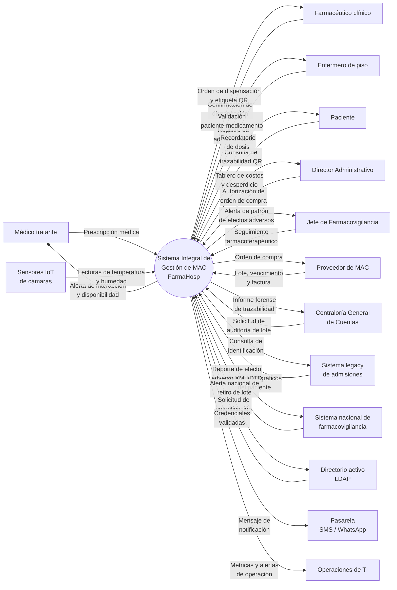
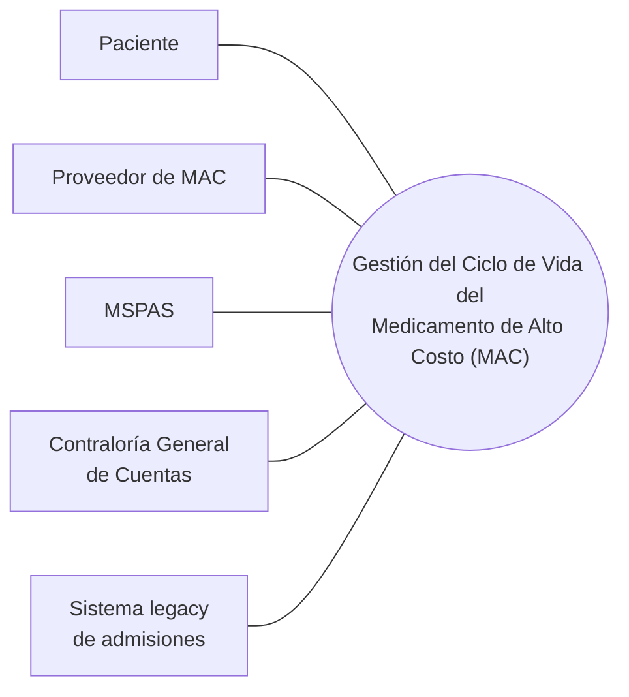
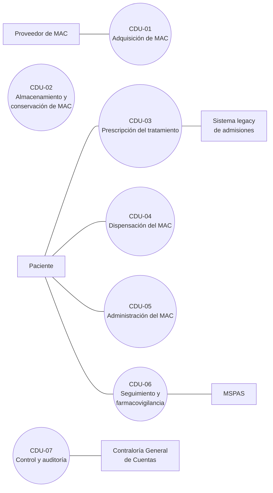

# Caso 1 — FarmaHosp · Entrega

Enunciado: [[Caso 1 - FarmaHosp]] · Plan: [[Plan - Caso 1 FarmaHosp]]

---

## 0. Frontera del negocio (declaración de alcance)

> [!important] Esta declaración condiciona todo el resto del documento
> **Entidad de interés (el negocio):** la **gestión del ciclo de vida del medicamento de alto
> costo (MAC)** del Hospital Universitario "Dr. Juan José Ortega".
>
> **Razón de ser:** garantizar que el MAC correcto llegue al paciente correcto, en condiciones
> de conservación válidas, con trazabilidad completa y auditable desde la compra hasta la
> farmacovigilancia.
>
> **Qué queda adentro:** las 6 etapas del ciclo de vida — adquisición, almacenamiento,
> prescripción, dispensación, administración, seguimiento y farmacovigilancia.
>
> **Qué queda afuera:** el resto de la operación hospitalaria (consulta externa, hospitalización,
> cirugía, laboratorio), que solo se relaciona con este negocio por sus interfaces.
>
> **Consecuencia sobre los actores:** el personal clínico y administrativo que **ejecuta** esas
> 6 etapas —médico tratante, farmacéutico clínico, enfermero de piso, almacenista, jefe de
> farmacovigilancia y director administrativo— son **trabajadores del negocio**, no actores,
> porque están dentro de la frontera. Son **actores del negocio** únicamente las entidades que
> interactúan con él desde afuera: paciente, proveedor de MAC, MSPAS, Contraloría General de
> Cuentas, proveedor de MAC y sistema legacy de admisiones.
>
> *Criterio aplicado:* «cada actor modela algo fuera del negocio» — Jacobson, modelado de negocio.
> Ver [[Actor del negocio]].

---

## 1. Identificación de stakeholders  ·  criterio 2 — 25 pts

### 1.1 Cómo se identificaron

Se partió de los **8 stakeholders nombrados en el enunciado** y se completó con tres barridos: los
cinco roles genéricos de clase, las categorías de metas de negocio de **PALM**, y los internos que no
son usuarios (Garland & Anthony). De ahí salieron **5 stakeholders que el enunciado usa en sus
escenarios pero no lista en su tabla**.

| Agregado | Barrido que lo encontró | Requisito propio que ningún otro trae |
|---|---|---|
| **Junta Directiva del hospital** | cliente / crecimiento y continuidad | Aprobó y financia el proyecto: plazo de 12 meses y evidencia de que las pérdidas se detuvieron |
| **Contraloría General de Cuentas** | responsabilidad hacia el estado (auditor) | Informe forense de un lote y **registros inmutables**. El MSPAS pide reportar; la Contraloría pide **probar** |
| **Consultora externa (desarrolladores)** | organización de desarrollo | Venía fusionada con el equipo interno en la tabla del enunciado, y el propio enunciado los enfrenta después: Python/PostgreSQL vs. Java/Oracle. **Dos intereses opuestos no pueden ser un mismo stakeholder** |
| **Proveedor de MAC** | etapa 1 del ciclo de vida | La trazabilidad **arranca en él**: lote, vencimiento y factura entran al sistema desde su entrega |
| **Operaciones de TI / data center** | operaciones y gestión del sistema | Techo fijo de 32 vCPU / 128 GB / SAN 10 TB **sin autoescalado**, y 500,000 registros de sensores diarios. Nadie más responde por eso |

> [!note] Criterio usado para incluir a alguien
> Un stakeholder entra a la lista solo si se le puede nombrar **un concern propio** que ningún otro
> de la lista aporte. Roles como INCAP, RRHH o el personal de admisiones tienen exigencias reales,
> pero no aportan un concern distinto de uno ya listado (cumplimiento normativo, capacitación,
> confidencialidad): se tratan como **drivers de restricción** en el criterio 3, no como
> stakeholders separados.

### 1.2 Tabla de stakeholders

Tipo de interés: **usa · paga · mantiene · opera · regula · construye** — cada tipo anticipa la clase
de driver que ese stakeholder va a aportar en el criterio 3.

| ID | Stakeholder | Tipo | Posición | Lo que dice que quiere | Necesidad oculta | Concern dominante |
|---|---|---|---|---|---|---|
| `STK-01` | Médico tratante (oncólogo) | usa | dentro — trabajador | "Quiero prescribir rápidamente, en menos de 5 minutos, sin andar buscando papel." | Que el sistema le **sugiera** el MAC según protocolo, le **alerte** interacciones y contraindicaciones, **valide contra inventario en tiempo real** y —si no hay stock— le permita pedir compra urgente o reemplazo terapéutico desde la misma pantalla. Y que **recuerde su patrón de prescripción**. | Usabilidad y eficiencia, sobre integridad de datos clínicos |
| `STK-02` | Farmacéutico/a clínico/a | usa | dentro — trabajador | "Quiero un sistema que no se caiga, porque si no puedo dispensar, los pacientes no reciben su quimioterapia." | Operación **< 2 s** y que **funcione aunque falle la red** (la farmacia está en el sótano, con Wi-Fi inestable). Y un **inventario predictivo** que anticipe faltantes con 7 días de vista, según las prescripciones programadas. | Disponibilidad (operación degradada) y performance |
| `STK-03` | Enfermero/a de piso | usa | dentro — trabajador | "Quiero que el escáner funcione rápido y no se trabe." | Validación paciente-medicamento **< 1 s**; poder **administrar offline** si cae la conexión, con trazabilidad que se resuelve al reconectar **sin duplicar registros**; y registrar reacciones adversas por **voz a texto** (escribir en la tablet con el paciente en shock es inviable). | Performance y disponibilidad, con usabilidad bajo presión |
| `STK-04` | Director Administrativo | paga · usa | dentro — trabajador | "Quiero ahorrar dinero y evitar pérdidas por caducidad." | **Tablero financiero**: costo por paciente, por servicio y % de desperdicio. Y **auditar quién autorizó cada compra y quién dio de baja un vencido**, de forma transparente para la Contraloría. | Auditabilidad y observabilidad del negocio |
| `STK-05` | Jefe de Farmacovigilancia | regula (interno) · usa | dentro — trabajador | "Quiero cumplir con la ley y reportar efectos adversos." | **Detección automática de patrones** de efectos adversos (ej. 5 pacientes del mismo lote con náuseas → alerta temprana) y que los reportes al sistema nacional se **generen automáticamente**, sin transcripción manual de su equipo. | Cumplimiento normativo e integrabilidad |
| `STK-06` | Paciente | usa (indirecto) | **fuera — actor** | "Quiero que me den mi medicamento rápido y no me equivoquen." | **Trazabilidad verificable por él mismo** (escanear el QR y confirmar medicamento y dosis), **notificación de la próxima dosis** por SMS/WhatsApp en tratamiento ambulatorio, y **confidencialidad total** de su diagnóstico (VIH, cáncer) frente a personal no autorizado. | Confidencialidad, y trazabilidad de cara al paciente |
| `STK-07` | Ministerio de Salud (MSPAS) | regula | **fuera — actor** | "Queremos estandarizar la trazabilidad a nivel nacional." | Exportación en **HL7 FHIR** para interoperar con otros hospitales y **APIs seguras** para que el sistema nacional consulte efectos adversos en tiempo real. Reporte obligatorio **≤ 24 h** en XML con la DTD del MSPAS. | Interoperabilidad y cumplimiento |
| `STK-08` | Equipo interno de TI del hospital (3 personas: Java 8, Spring Boot, Oracle PL/SQL, Angular) | mantiene | dentro — trabajador | "Queremos usar tecnologías modernas y entregar rápido." | Que el stack sea **mantenible por 3 personas con su experiencia real** después de que la consultora se vaya; **evolución incremental** (dispensación y almacén → prescripción → farmacovigilancia); y **documentación viva**, porque la rotación de personal es alta. | **Mantenibilidad y modificabilidad** |
| `STK-09` | Consultora externa — 5 desarrolladores (Python/Django, React, MongoDB, Kafka) | construye | fuera — solo interés | "Queremos usar tecnologías modernas y entregar rápido." | Un stack **negociado** que su equipo pueda construir y el interno pueda heredar, y **módulos con límites claros** para entregar por incrementos dentro de los 12 meses de contrato sin bloquearse contra el equipo interno. | Constructibilidad y velocidad de entrega |
| `STK-10` | Junta Directiva del hospital | paga | fuera — solo interés | "Aprobamos la transformación digital: queremos resultados." | **Hitos visibles dentro de los 12 meses** y evidencia medible de que las pérdidas (Q. 2.5 M por caducidades) y los errores de medicación se detuvieron, sin exponer al hospital a sanciones legales. | Costo, plazo y continuidad institucional |
| `STK-11` | Contraloría General de Cuentas | regula (audita) | **fuera — actor** | "Exigimos trazabilidad completa desde la compra hasta la administración." | **Informe forense de un lote en < 10 minutos** —compra, proveedor, factura, temperaturas de almacenamiento, pacientes, enfermero, médico, bajas y ajustes— sobre registros **inmutables que nadie pueda alterar, ni el administrador del sistema**. | **Auditabilidad e inmutabilidad** |
| `STK-12` | Proveedor de MAC | provee | **fuera — actor** | "Queremos recibir órdenes de compra y que se nos reciba el producto." | Que el número de lote, el vencimiento y la factura entren al sistema **exactos y sin transcripción manual** (los 3 errores por etiqueta mal transcrita nacen acá), y una vía para **notificar retiros de lote**. | Integridad del dato de origen |
| `STK-13` | Operaciones de TI / data center (VMware, SAN, red) | opera | dentro — trabajador | "Que el servidor no se caiga." | Que la solución **quepa en 32 vCPU / 128 GB / SAN 10 TB sin autoescalado**, absorba el **pico de 10x los lunes 8:30 AM**, sobreviva a **500,000 registros de sensores/día** y priorice el tráfico de dispensación sobre el resto de los 50 Mbps compartidos. | **Escalabilidad con recursos fijos** y observabilidad |

> [!note] Por qué STK-08 y STK-13 son stakeholders distintos
> Son las mismas personas —el hospital tiene 3 en TI—, pero el criterio de identidad de un
> stakeholder es **el concern, no la persona**: como *mantenimiento* piden un stack que puedan
> heredar (Java/Oracle); como *operaciones* piden que la solución quepa en una capacidad fija. Son
> dos requisitos independientes y uno puede cumplirse sin el otro.

### 1.3 Conflictos entre stakeholders

Cada tensión es un **tradeoff que la arquitectura tendrá que resolver**, no una falla del análisis.

| Stakeholder A | pide | Stakeholder B | pide | Tensión | Cómo se resuelve |
|---|---|---|---|---|---|
| `STK-08` Equipo interno de TI | Java + Oracle: es lo que sabe mantener | `STK-09` Consultora externa | Python + PostgreSQL + MongoDB: es lo que sabe construir | **Constructibilidad vs. mantenibilidad**, agravada porque el hospital exige que el interno lo mantenga solo tras 12 meses | Decide **quién se queda**: manda la mantenibilidad del equipo interno. La consultora aporta velocidad dentro de ese stack |
| `STK-06` Paciente | Confidencialidad máxima: nadie no autorizado ve su diagnóstico | `STK-04` Director Administrativo | Auditar todo lo que ocurre en el sistema | **Confidencialidad vs. auditabilidad** | El enunciado ya la resuelve: se audita **el acceso y la transacción**, no el diagnóstico. Ni el director lo ve sin orden judicial |
| `STK-03` Enfermero | Poder administrar **offline** cuando cae la red | `STK-11` Contraloría | Registro inmutable, sin duplicados ni huecos | **Disponibilidad vs. consistencia e integridad** | Escritura local con **resolución idempotente** al reconectar (acuerdo de calidad #2) |
| `STK-01` Médico | Prescribir en < 5 min con validación en tiempo real | `STK-13` Operaciones de TI | Presupuesto de infraestructura fijo, sin autoescalado | **Performance vs. costo de infraestructura** | Mitigación arquitectónica (caché, réplicas de lectura, colas) en vez de más hardware (acuerdo de calidad #5) |
| `STK-05` Jefe de Farmacovigilancia | Reportar el efecto adverso **≤ 24 h** por ley | `STK-07` MSPAS (sistema nacional) | Solo recibe de 8:00 a 16:00, batch diario, XML con DTD | **Cumplimiento vs. disponibilidad del sistema externo** | Desacople asincrónico: se persiste y se reintenta en ventana hábil. El plazo legal lo cumple el registro local, no la entrega |
| `STK-10` Junta Directiva | Resultados visibles dentro de 12 meses | `STK-08` Equipo interno de TI | Documentación viva y un stack que pueda heredar | **Plazo vs. calidad interna** | Entrega incremental por módulos: dispensación y almacén primero |

---

## 2. Caso de negocio  ·  criterio 1 — 25 pts

### 2.1 Diagrama de contexto

**El Producto (único óvalo):** *Sistema Integral de Gestión de Medicamentos de Alto Costo — FarmaHosp*

> [!important] Este diagrama es del **sistema**, no del negocio
> Frente al **negocio** (§0), el médico, el farmacéutico y el enfermero son *trabajadores*. Frente al
> **software** son *entidades externas*: le entregan y reciben información, pero no viven dentro del
> producto. Es el mismo criterio del ejemplo de clase, donde el *Bibliotecario* figura como entidad
> externa aunque trabaje en la biblioteca. Ver [[Diagrama de contexto]].

#### Entidades y agentes (rectángulos) con sus *streamlines*

| # | Entidad o agente | Origen | Entra al sistema | Sale del sistema |
|---|---|---|---|---|
| 1 | **Médico tratante** | `STK-01` | Prescripción médica · Solicitud de compra urgente o reemplazo terapéutico · Ajuste de dosis | Alerta de interacción y contraindicación · Disponibilidad de inventario en tiempo real · Notificación de efecto adverso de su paciente |
| 2 | **Farmacéutico clínico** | `STK-02` | Confirmación de dispensación con lote asignado · Dictamen sobre lote afectado | Cola de órdenes de dispensación · Etiqueta con código de barras/QR · Proyección de faltantes a 7 días · Alerta de ruptura de cadena de frío |
| 3 | **Enfermero de piso** | `STK-03` | Registro de administración (pulsera, código de lote, credencial biométrica) · Reporte de reacción adversa | Validación paciente-medicamento · Alerta de discrepancia paciente/lote |
| 4 | **Director Administrativo** | `STK-04` | Autorización de orden de compra | Tablero de costo por paciente y % de desperdicio · Reporte de pérdida estimada |
| 5 | **Jefe de Farmacovigilancia** | `STK-05` | Seguimiento farmacoterapéutico · Dictamen de causalidad | Alerta temprana de patrón de efectos adversos por lote |
| 6 | **Paciente** | `STK-06` | Consulta de trazabilidad por QR | Confirmación de medicamento y dosis · Recordatorio de próxima dosis |
| 7 | **Proveedor de MAC** | `STK-12` | Datos de lote, fecha de vencimiento y factura | Orden de compra |
| 8 | **Contraloría General de Cuentas** | `STK-11` | Solicitud de auditoría de lote | Informe forense de trazabilidad |
| 9 | **Operaciones de TI / data center** | `STK-13` | Parámetros de operación | Métricas de capacidad y alertas de operación |
| 10 | **Sistema legacy de admisiones** (COBOL/SOAP, 7:00-17:00) | sistema externo | Datos demográficos del paciente | Consulta de identificación de paciente |
| 11 | **Sistema nacional de farmacovigilancia** (MSPAS, XML/DTD, 8:00-16:00) | sistema externo | Alerta nacional de retiro de lote · Consulta de efectos adversos vía API | Reporte de efecto adverso en formato XML/DTD |
| 12 | **Directorio activo / LDAP** | sistema externo | Credenciales validadas | Solicitud de autenticación |
| 13 | **Sensores IoT de cámaras** (2-8 °C, -20 °C, ambiente) | agente | Lecturas de temperatura y humedad cada 5 minutos | — |
| 14 | **Pasarela de SMS / WhatsApp** | sistema externo | Acuse de entrega del mensaje | Mensaje de notificación (alerta de guardia, recordatorio de dosis, OTP de respaldo) |

> [!note] Quién quedó fuera del contexto y por qué
> `STK-09` **Consultora externa** y `STK-10` **Junta Directiva** son stakeholders con requisitos
> fuertes, pero **no intercambian información con el sistema en operación**. Confirma la regla: todo
> actor es stakeholder, pero no todo stakeholder es actor.

#### Diagrama

*(El mermaid es para trabajar. La versión a entregar se dibuja con la notación de clase: óvalo para
el producto, rectángulos para las entidades, una flecha por sentido, todas con nombre.)*

#### Checklist de este diagrama

- [x] Un solo óvalo, y nombra un **sistema**, no el hospital
- [x] Todas las entidades en rectángulos
- [x] Todas las flechas con nombre
- [x] Nombres de flujo en **sustantivo**, no en verbo
- [x] Flujos bidireccionales como **dos flechas** separadas
- [x] Ninguna entidad es parte del producto
- [x] Los tres sistemas externos presentes (admisiones, farmacovigilancia nacional, LDAP)
- [x] Los **sensores IoT** presentes como agente

#### Resumen del diagrama

**14 entidades · 25 streamlines.** Distribucion por canasta: 4 usuarios directos, 4 del negocio
(decide / insumo / audita), 6 dispositivos y sistemas externos.

| Canasta | Entidades |
|---|---|
| **Usa** | Medico tratante, Farmaceutico clinico, Enfermero de piso, Paciente |
| **Decide y controla** | Director Administrativo, Jefe de Farmacovigilancia |
| **Insumo** | Proveedor de MAC |
| **Audita** | Contraloria General de Cuentas |
| **Agente** | Sensores IoT de camaras (cada 5 min) |
| **Sistemas externos** | Legacy de admisiones (COBOL/SOAP, 7-17 h), Directorio activo LDAP, Sistema nacional de farmacovigilancia (XML/DTD, 8-16 h), Pasarela SMS/WhatsApp |
| **Opera** | Operaciones de TI / data center |

> [!tip] Version dibujada
> El diagrama esta dibujado en tres capas, con la justificacion de cada entidad y cada flujo, en el
> artifact **Contexto de FarmaHosp**: https://claude.ai/code/artifact/613ddb25-bac3-4c33-b498-45cc73550eb4

### 2.2 Diagrama de CDU de alto nivel (core del negocio)

**La única elipse:** *Gestión del Ciclo de Vida del Medicamento de Alto Costo (MAC)* — el negocio
completo, con el nombre de la frontera declarada en §0. El core **no lista procesos**: es el negocio
visto como una sola cosa; abrirlo en procesos es trabajo de la primera descomposición (§2.3).

*Molde aplicado:* los cuatro casos resueltos en clase (Tienda Electrónica, Fábrica, Restaurante,
Hospital) usan **una sola elipse con el nombre del todo** y los actores en círculo, con líneas **sin
punta** y los estereotipos de negocio (barras diagonales). Ver
[[Ejemplos resueltos de casos de negocio]] y [[Convenios del diagrama de CUN]].

#### Quién es actor y quién no — la decisión, defendida

Los actores salen de la frontera de §0 y de la tabla de stakeholders (§1.2, filas *fuera — actor*):

| Actor del core | Por qué está fuera del campo de acción |
|---|---|
| **Paciente** | Recibe el resultado de valor del negocio; no ejecuta ninguna etapa |
| **Proveedor de MAC** | Entrega los lotes desde afuera; con él arranca la trazabilidad |
| **MSPAS** | Regulador externo; recibe los reportes de farmacovigilancia (su sistema nacional es su canal) |
| **Contraloría General de Cuentas** | Auditor externo; exige el informe forense |
| **Sistema legacy de admisiones** | Sistema externo al ciclo del MAC; provee la identidad del paciente |

**Quién NO se dibuja, y por qué** (esto vale tantos puntos como el dibujo):

| Excluido | Razón |
|---|---|
| Médico, farmacéutico, enfermero, director, jefe de farmacovigilancia | **Trabajadores del negocio**: ejecutan las 6 etapas desde adentro de la frontera (§0). Van en las realizaciones, no como actores |
| Sensores IoT | Equipamiento **del proceso de almacenamiento**: herramienta interna del negocio, no un tercero que interactúe con él |
| LDAP y pasarela SMS/WhatsApp | Infraestructura **del software**, no del negocio: aparecen en el contexto (plano del sistema), no acá |
| Junta Directiva y consultora externa | Stakeholders que no interactúan con el negocio en operación |

> [!note] El contraste con el diagrama de contexto (§2.1) es deliberado
> En el contexto el enfermero y los sensores **sí** aparecen, porque el límite ahí es el *software*.
> Acá el límite es el *negocio*, y quienes lo ejecutan por dentro desaparecen del dibujo. Son dos
> planos distintos con dos fronteras distintas — [[estilo-diagramas]] §8.

#### Diagrama

*(Versión con notación de clase — monigotes y elipse con las barras diagonales del estereotipo de
negocio, líneas sin punta: `02-Diagramas/cdu-core-farmahosp.svg`, editable en
`cdu-core-farmahosp.excalidraw`, verificación en `cdu-core-farmahosp-verificacion.png`.)*

#### Checklist del core

- [x] **Una** sola elipse, y nombra el negocio completo
- [x] Estereotipos de negocio en todos los elementos (diagonales + «actor de negocio» / «caso de uso de negocio»)
- [x] CUN al centro, actores en círculo
- [x] Líneas **sin punta** (comunicación en los dos sentidos, como los 4 cores de la cátedra)
- [x] Ningún trabajador dibujado como actor
- [x] Ningún actor suelto sin línea
- [x] Consistente con la frontera de §0 y con la tabla de stakeholders de §1.2

### 2.3 Primera descomposición — los procesos del negocio

La única elipse del core (§2.2) se abre en **los procesos que la realizan**: **un solo diagrama**,
los CUN en columna al centro y **el mismo juego de actores del core** a los lados — el molde de la
Tienda Electrónica y la Fábrica de Materiales. Ver [[Ejemplos resueltos de casos de negocio]].

#### Los procesos, con su clasificación (criterio de la nota técnica)

Los seis primeros son **las 6 etapas del ciclo de vida que el enunciado fija textualmente** — por eso
son seis y no los 3-5 del patrón observado en clase: el número lo dicta el enunciado, no el patrón.
El séptimo cubre la categoría **gerencial** de la NT, que las etapas no traen y el enunciado exige a
gritos (el tablero del Director, la auditoría de la Contraloría).

| ID | Proceso de negocio | Categoría | ¿Por qué esa categoría? |
|---|---|---|---|
| `CDU-01` | Adquisición de MAC | **soporte** | No beneficia al paciente directamente: abastece al núcleo |
| `CDU-02` | Almacenamiento y conservación de MAC | **soporte** | Sostiene al núcleo (cadena de frío, inventario); el paciente no lo ve |
| `CDU-03` | Prescripción del tratamiento | **núcleo** | Servicio que el cliente (paciente) recibe del negocio |
| `CDU-04` | Dispensación del MAC | **núcleo** | Ídem: el lote se asigna nominalmente al paciente |
| `CDU-05` | Administración del MAC al paciente | **núcleo** | El acto de valor central del ciclo |
| `CDU-06` | Seguimiento y farmacovigilancia | **núcleo** | El paciente recibe el monitoreo posterior; cierra el ciclo |
| `CDU-07` | Control y auditoría de la gestión de MAC | **gerencial** | Manejo del negocio en su conjunto: transparencia ante la Contraloría y tablero del Director |

*Nombres según la regla de la NT:* **sustantivo derivado de verbo + complemento** (*Adquisición de
MAC* → *adquirir MAC* ✓), la misma forma que *Procesamiento de Pedidos* y *Gestión de Inventario* en
los ejemplos de clase.

#### Las asociaciones, una por una

| Proceso | Actor(es) | Razón |
|---|---|---|
| `CDU-01` Adquisición | Proveedor de MAC | De él entran lotes, vencimientos y facturas |
| `CDU-02` Almacenamiento | **ninguno** | Es la **excepción de CU de apoyo** de los convenios de clase: *«es posible que un caso de uso de apoyo no interactúe con ningún actor»*. Ningún externo participa en conservar la cadena de frío; los sensores son equipamiento del proceso, no actores |
| `CDU-03` Prescripción | Paciente · Sistema legacy de admisiones | El paciente es examinado y recibe la prescripción; el legacy provee su identidad y datos demográficos |
| `CDU-04` Dispensación | Paciente | El lote se asigna a su nombre y él puede verificarlo por QR |
| `CDU-05` Administración | Paciente | Recibe el medicamento — el acto de valor |
| `CDU-06` Seguimiento | Paciente · MSPAS | El paciente reporta reacciones; al MSPAS va el reporte obligatorio de farmacovigilancia |
| `CDU-07` Control y auditoría | Contraloría General de Cuentas | Exige el informe forense y la trazabilidad completa |

**Verificación de consistencia con el core** (la regla: pueden aparecer actores nuevos, no puede
desaparecer ninguno): Paciente ✓ (4 procesos — el actor principal toca varios, como en el molde),
Proveedor ✓, MSPAS ✓, Contraloría ✓, Legacy de admisiones ✓. **Los cinco del core están; no se
agregó ninguno nuevo.**

**Sin `include` ni `extend`**: la cátedra no los usa en la primera descomposición — aparecen recién
en los CDU expandidos (§3.1), y solo con criterio explícito.

#### Diagrama

*(Versión con notación de clase — columna de procesos, actores a los lados, diagonales de negocio,
líneas sin punta y las tres categorías rotuladas: `02-Diagramas/cdu-descomposicion-farmahosp.svg`,
editable en `.excalidraw`, verificación en `cdu-descomposicion-farmahosp-verificacion.png`.)*

#### Checklist de la primera descomposición

- [x] **Un solo diagrama**, no uno por proceso
- [x] Estereotipos de negocio en todos los elementos
- [x] Nombres en sustantivo-de-verbo + complemento (la prueba: todos se convierten en verbo)
- [x] **Ningún** proceso llamado crear / editar / eliminar / consultar
- [x] Las **6 etapas del enunciado** cubiertas, una por proceso
- [x] Las **tres categorías** de la NT presentes y justificadas
- [x] El mismo juego de actores del core: ninguno desapareció
- [x] Cada actor con al menos un proceso (regla sin excepción)
- [x] El único CU sin actor (`CDU-02`) está amparado en la excepción de apoyo, declarada
- [x] Sin `include`/`extend`: se reservan para los expandidos
- [x] IDs `CDU-nn` asignados — son los que van a las matrices del criterio 4

---

## 3. Drivers arquitectónicos  ·  criterio 3 — 30 pts

### 3.1 Drivers RF (CDU expandidos)

### 3.2 Drivers de atributos de calidad

### 3.3 Drivers de restricción

### 3.4 Los 5 drivers más críticos (contexto guatemalteco)

---

## 4. Matrices de trazabilidad  ·  criterio 4 — 20 pts

### 4.1 Stakeholders vs. CDU

### 4.2 Drivers RF vs. Drivers RF

### 4.3 CDU vs. Drivers RF
