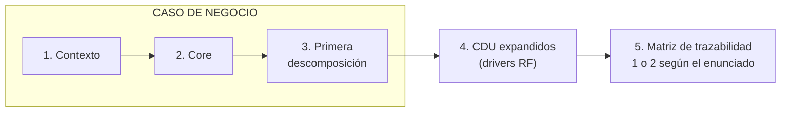
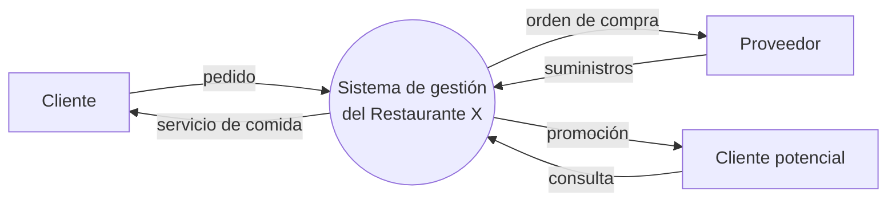
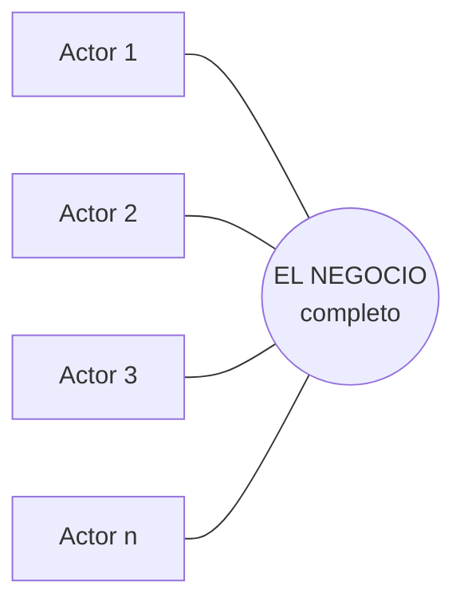
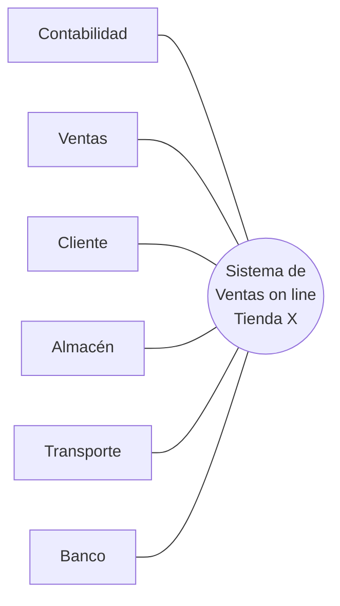
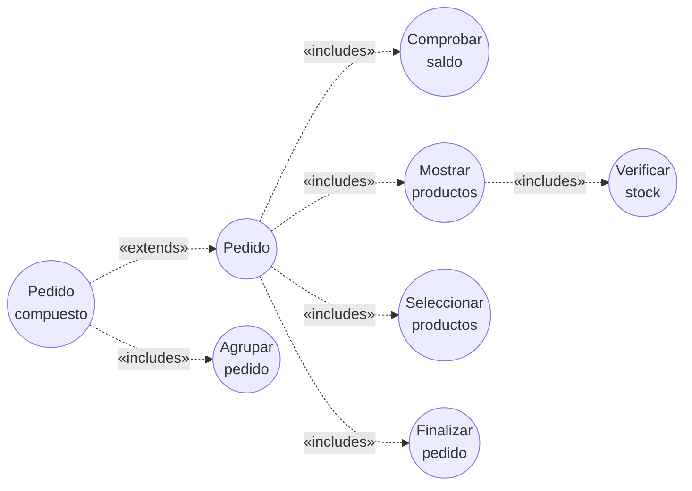
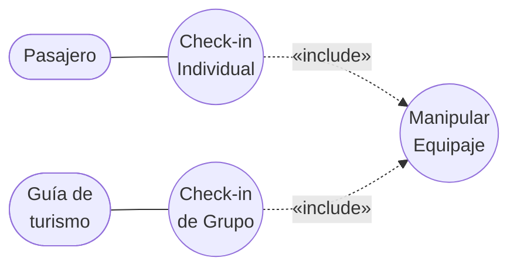
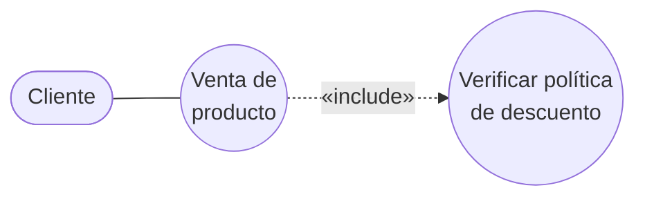

# Guía — Caso de negocio

La secuencia completa de un entregable de modelado del negocio, tal como se pide en el curso.

> [!important] La estructura canónica
> Un **caso de negocio** son **tres diagramas**, y van en este orden:
>
> | # | Diagrama | Qué muestra |
> |---|---|---|
> | 1 | **Contexto** | El **producto** en una elipse y todo lo que interactúa con él desde afuera |
> | 2 | **Core** | **Una sola elipse**: el negocio completo, sin abrir |
> | 3 | **Primera descomposición** | Los CDU que modelan los procesos de negocio |
>
> Y después del caso de negocio:
>
> | # | Entregable |
> |---|---|
> | 4 | **Casos de uso expandidos** (los drivers RF) |
> | 5 | **Matriz de trazabilidad** — **1 o 2**, según lo que indique el enunciado |
>
> En el [[Plan - Caso 1 FarmaHosp|Caso 1]] el enunciado pide **tres** matrices, que es más de lo
> habitual. **Siempre gana la indicación del enunciado.**

Por qué ese orden y no otro: cada diagrama **acota** al siguiente. El contexto fija la frontera y
los agentes externos; el core nombra el negocio completo como una sola cosa; la descomposición
**abre esa elipse** en procesos; los expandidos abren los procesos en requisitos; la matriz cruza lo
que ya tiene nombre. Saltearse uno deja el siguiente sin fundamento.

---

## Diagrama 1 — Contexto

**Qué responde:** *¿dónde termina el producto y qué hay afuera?*

**La notación es la de clase** — está en [[Diagrama de contexto]], que es la nota núcleo de este
entregable. Tres símbolos y nada más:

| Símbolo | Qué representa |
|---|---|
| **Elipse / óvalo** | **El Producto** — el sistema que se construye. **Uno solo**, al centro |
| **Rectángulo** | **Entidades o agentes** — lo externo con lo que el producto interactúa |
| **Flecha** | ***Streamlines*** — los flujos, **siempre con nombre**, en sustantivo |

Nada de procesos internos todavía: es la vista más externa que existe. Y los flujos bidireccionales
van como **dos flechas separadas**, cada una con su nombre.

> [!important] Es el contexto DEL SISTEMA — ya no es una duda
> Esto estuvo abierto un tiempo como "ambigüedad #2" y **está resuelto con fuente de clase**: la
> diapositiva *"Diagramas de Contexto"* pone el **producto** en el óvalo, y sus dos ejemplos resueltos
> nombran sistemas (*"Sistema de préstamos y devoluciones de la biblioteca"*, *"Planificación de
> producción y gestión de materiales"*). El [[Plan - Caso 1 FarmaHosp|Plan]] la marca **RESUELTA**.
>
> Y ojo con el ejemplo del bibliotecario: **trabaja en la biblioteca y aun así es entidad externa**,
> porque el producto es el *software*, no la biblioteca. Ver [[Actor del negocio]] §La frontera es el
> campo de acción.

### La definición formal (Garland & Anthony, cap. 6) — complemento

El libro *Large-Scale Software Architecture* define un **Context Viewpoint** y es la definición más
precisa que tenemos:

> El Context Viewpoint contiene **solo el sistema, las entidades externas con las que interactúa, y
> las interfaces** entre el sistema y esas entidades externas. El objetivo debe ser crear **una sola
> vista** desde este viewpoint, que capture todas las entidades externas y sus interfaces. […] Esta
> única Context View es a menudo **la primera vista del sistema** que el equipo de arquitectura crea.
> Las entidades externas junto con los roles que desempeñan se denominan **actores**.

Y el cuadro del libro trae reglas concretas:

| Aspecto | Qué dice el libro |
|---|---|
| **Propósito** | Modelar el conjunto de actores con los que el sistema interactúa y las interfaces entre el sistema y esas entidades |
| **Cuándo aplica** | A lo largo de todo el ciclo de vida; se prepara sobre todo en las **primeras etapas** de análisis y diseño, y se actualiza cuando cambian las interfaces externas |
| **Layout** | **El sistema va SIEMPRE en el medio**, y los actores externos **alrededor** |
| **Si hay demasiados actores** | Se **agrupan en actores de más alto nivel**. Usar varias Context Views es el **último recurso** |
| **Consistencia** | Tiene que ser coherente con las otras vistas estáticas que muestran interfaces externas (subsistemas, componentes, procesos, despliegue) |

> [!tip] La regla de agrupar actores sirve directo para el Caso 1
> FarmaHosp tiene 8 stakeholders más sistemas externos (legacy COBOL/SOAP, sistema nacional de
> farmacovigilancia, LDAP, sensores IoT). Si los pones todos sueltos, el diagrama no se lee. La
> técnica del libro es **agruparlos en actores de más alto nivel** — y eso es una decisión de diseño
> que conviene justificar en el documento, no un atajo.

> [!note] Cómo encaja el libro con la notación de clase
> Garland define el contexto **del sistema**, igual que ella. Y su regla de layout —*"el sistema va
> siempre en el medio, los actores alrededor"*— es exactamente lo que hacen los dos ejemplos de
> clase. El libro **no contradice** a la diapositiva: le agrega el vocabulario formal (*viewpoint*,
> *interfaces*) y la técnica de agrupar actores.
>
> Donde difieren es solo en la **forma del símbolo**: el libro dibuja cajas, ella dibuja el producto
> como **elipse** y las entidades como rectángulos. **Manda la notación de clase.**

Lo que va y lo que no:

| Va | No va |
|---|---|
| El producto, como **una sola elipse** | Los procesos internos |
| Las entidades o agentes externos, en rectángulos | Los trabajadores del negocio |
| Los sistemas de información **externos** | Los CDU |
| Los *streamlines*, **con nombre** | Detalle de qué pasa adentro |

La decisión que se toma acá y que condiciona todo: **dónde se pone la frontera**. Y la frontera tiene
nombre en el material de clase — es el **campo de acción** que estás modelando, no la empresa. De esa
definición depende quién es entidad externa y quién trabajador: ver [[Actor del negocio]].

Forma, con el ejemplo del **restaurante** de la nota técnica, ya con la notación de clase:

> [!tip] Tu turno
> Escribí en una línea **qué es el producto** en tu caso (el nombre que va dentro de la elipse), y
> hacé la lista de todo lo que queda afuera y lo toca. Esa lista son tus entidades y, de paso, tus
> candidatos a stakeholder.

---

> [!tip] Los cuatro casos resueltos por ella, en paralelo
> Antes de dibujar nada, mirá [[Ejemplos resueltos de casos de negocio]]: tiene los **cuatro**
> encadenamientos completos que resolvió en clase (Tienda Electrónica, Fábrica de Materiales,
> Restaurante y **Hospital**) puestos lado a lado, con la checklist para comparar tu entrega.
>
> El del **hospital** te resuelve la decisión de actor vs. trabajador: en su ejemplo *Farmacia* y
> *Encamamiento* son **actores** del *Sistema Hospitalario*.

## Diagrama 2 — Core

**Qué responde:** *¿cuál es el negocio, visto como una sola cosa?*

**Una sola elipse**, que nombra el **negocio o sistema completo**, con **todos los actores
alrededor**. Eso es el core.

No es un subconjunto de procesos: es el negocio entero **sin abrir todavía**. La descomposición
(diagrama 3) es la que lo abre en procesos.

> [!important] Está verificado en los CUATRO casos que ella resolvió
> | Caso | Qué dice la única elipse |
> |---|---|
> | Tienda Electrónica | *Sistema de Ventas on line Tienda X* |
> | Fábrica de Materiales | *Gestión de la Producción de Productos de Construcción* |
> | Restaurante | *Automatización de Procesos del Restaurante X* |
> | Hospital | *Sistema Hospitalario* |
>
> Cuatro de cuatro: **una elipse con el nombre del todo**. Ninguno usa el core para listar procesos.
> Ver [[Ejemplos resueltos de casos de negocio]].

> [!warning] El error de este diagrama es inflarlo
> **Si tu core tiene más de una elipse, ya es la descomposición.** No es cuestión de cuántos CDU
> "de alto nivel" elegís: el core tiene exactamente **uno**, y es el negocio completo.

> [!note] Entonces, ¿dónde entra la clasificación núcleo / soporte / gerencial?
> En el **diagrama 3**, no acá. Es un punto donde esta guía decía antes otra cosa y vale aclararlo,
> porque el criterio de la nota técnica —*"¿cuáles son los servicios básicos que un cliente recibe?"*—
> **suena** a definición de core.
>
> La evidencia de que va en el 3: en el ejemplo del **restaurante** de ella, *Servicio de comida*
> (núcleo), *Comprar suministros* (soporte) y *Marketing* (gerencial) son los **tres procesos de la
> primera descomposición** — el core de ese mismo caso es *"Automatización de Procesos del Restaurante
> X"*.
>
> Así que el criterio de la NT sirve, pero para **clasificar los procesos que salen en el diagrama 3**.
> Ver [[Identificación de procesos del negocio]].

> [!important] El ejemplo resuelto por ella: Tienda Electrónica
> Hay una diapositiva titulada **"Ejemplo Diagrama Core Tienda Electrónica"**, y es el molde exacto:
>
> ![[adjuntos/capturas-clase/cun-ejemplo-core-tienda-electronica.png]]

Lo que hay que copiar:

| Detalle | Cómo lo hace ella |
|---|---|
| Cuántos CUN | **UNO**. Una sola elipse |
| Qué nombra esa elipse | **el negocio completo**: *"Sistema de Ventas on line Tienda X"* |
| Cuántos actores | **seis**, todos alrededor — Contabilidad, Ventas, Cliente, Almacén, Transporte, Banco |
| Disposición | el CUN al **centro**, los actores en **círculo** |
| Flechas | **líneas sin punta** — relación en los dos sentidos (→ [[Convenios del diagrama de CUN]]) |
| Notación | actores y CUN con la **barra diagonal** del estereotipo de negocio |

Y fijate que los actores **no son solo el cliente**: hay áreas internas (Contabilidad, Ventas,
Almacén) y externas (Banco, Transporte). Todas son **actores del negocio** porque están fuera del
*proceso* que el CUN modela.

> [!tip] Tu turno
> Escribí **el nombre que va dentro de la única elipse** — algo como *"Sistema Integral de Gestión de
> Medicamentos de Alto Costo"*, que es el nombre que el propio enunciado le da — y poné alrededor los
> actores que ya identificaste en el contexto. Si te sale más de una elipse, estás en el diagrama 3.

---

## Diagrama 3 — Primera descomposición

**Qué responde:** *¿en qué procesos de negocio se abre eso?*

Ahora sí entran las **tres categorías** y las tres técnicas de identificación de
[[Identificación de procesos del negocio]]: clasificación, agrupamiento por funciones y objetivos
estratégicos.

Ejemplo completo del **restaurante**, tal como está en la figura 1 de la nota técnica:

Criterios de la nota técnica para cada categoría:

| Categoría | Cómo se encuentra |
|---|---|
| **Núcleo** | ¿Cuáles son los servicios básicos que un **cliente** recibe del negocio? |
| **Soporte** | Actividades que **no benefician al cliente directamente**: desarrollo y mantenimiento de personal, de tecnologías de información y de la oficina, seguridad, actividades legales |
| **Gerencial** | Procesos del manejo del negocio **en su conjunto**; normalmente se relacionan con el actor **propietario**. Informar a dueños e inversionistas, preparar metas del presupuesto a largo plazo |

Y una advertencia de la nota técnica que suele pasarse por alto:

> Clasificar un proceso en alguna de estas categorías **depende del campo de acción que se esté
> modelando**.

O sea: el mismo proceso puede ser soporte en un modelo y núcleo en otro, según dónde pusiste la
frontera en el diagrama 1. Por eso los tres diagramas tienen que ser **consistentes entre sí**.

> [!important] El ejemplo resuelto por ella — y resuelve una duda del plan
> La diapositiva **"Ejemplo Primera Descomposición del Core Tienda Electrónica"** contesta lo que
> estaba abierto: **es UN solo diagrama** con todos los procesos, no uno por proceso.
>
> ![[adjuntos/capturas-clase/cun-ejemplo-primera-descomposicion-tienda-electronica.png]]

Las asociaciones, verificadas con zoom sobre la captura:

| CUN | Actores con los que se asocia |
|---|---|
| Procesamiento de Pedidos | **Cliente** · Almacén |
| Gestión de Inventario | Almacén |
| Pagos | **Cliente** · Banco · Contabilidad |
| Envío | Transporte |
| Soporte al Cliente | **Cliente** · Ventas |

Es **la misma topología** que la Fábrica de Materiales: el actor principal toca **tres** de los cinco
procesos, y cada proceso tiene su contraparte externa. Ella reusó la plantilla — lo que refuerza que
ese es *el* molde. Ver [[Ejemplos resueltos de casos de negocio]].

> [!warning] Estas asociaciones se verificaron con zoom; la imagen es la fuente de la verdad
> **No re-dibujes sus diagramas en Mermaid.** Es exactamente el tipo de tarea donde se cuela un error
> de una arista, y ya pasó: la primera versión de esta tabla, hecha como diagrama Mermaid a partir de
> la hoja de contactos, tenía **asociaciones inventadas**.
>
> Mermaid sirve para el **patrón conceptual**. Para *su* diagrama concreto: la imagen, y una tabla
> leída una por una.

El patrón, comparado con el core:

| | Core | Primera descomposición |
|---|---|---|
| CUN | **1** — el negocio completo | **5** — los procesos |
| Actores | los **mismos seis** | los **mismos seis** |
| Disposición | CUN al centro, actores en círculo | CUN en **columna al centro**, actores a los **lados** |

**La descomposición abre la única elipse del core en N procesos, conservando el mismo juego de
actores.** Eso es lo que la vuelve verificable: si en la descomposición aparece un actor que no
estaba en el core, o desaparece uno que sí estaba, hay una inconsistencia.

Los cinco procesos de su ejemplo: **Procesamiento de Pedidos**, **Gestión de Inventario**,
**Pagos**, **Envío**, **Soporte al Cliente**.

> [!important] Regla de nombres (nota técnica)
> El nombre de un CDU debe expresar **qué sucede** cuando el caso de uso se ejecuta, y va en forma
> **activa**: en **gerundio** (*chequeo de equipaje*, *compra de suministros*) **o con un verbo**
> (*chequear equipaje*, *comprar suministros*).
>
> **Ojo con cómo hay que leer "gerundio" acá.** Los propios ejemplos de la nota técnica — *chequeo*,
> *compra* — no son gerundios gramaticales: son **sustantivos derivados de un verbo**. Y eso es
> exactamente lo que usa ella en la Tienda Electrónica: **Procesamiento** de Pedidos, **Gestión** de
> Inventario, **Envío**.
>
> | Forma | Ejemplos | ¿Sirve? |
> |---|---|---|
> | Sustantivo **derivado de verbo** + complemento | *chequeo de equipaje*, *procesamiento de pedidos*, *gestión de inventario* | **sí** |
> | **Verbo** + complemento | *chequear equipaje*, *comprar suministros* | **sí** |
> | Sustantivo **de cosa**, sin acción | *Préstamos*, *Inventario*, *Facturas* | **no** — no dicen qué sucede |
>
> La prueba: **¿se puede convertir en verbo sin cambiar el sentido?** *Gestión de inventario* →
> *gestionar el inventario* ✅. *Inventario* → no hay verbo ❌.

---

## Entregable 4 — Casos de uso expandidos

Los **drivers RF**. Acá se aplican las tres relaciones, y la nota técnica agrega precisión que el
deck no tiene: la inclusión tiene **dos justificaciones distintas**.

> [!important] La clase confirma esta distinción, con las mismas palabras en rojo
> Ya no es solo de la nota técnica: hay **dos diapositivas** tituladas *"Relación de inclusión
> «include»"*, una marcada **REUTILIZAR** y la otra **PARTICIONAR**, con exactamente estos mismos
> ejemplos (aduana y empresa de servicios). Y la de particionar agrega la anotación clave:
> ***"es un CU de apoyo que no se relaciona con actores"***.
>
> Ver [[Convenios del diagrama de CUN]] §5.

> [!important] El ejemplo resuelto por ella: CUN *Procesamiento de Pedido*
> Es la continuación directa de la Tienda Electrónica: toma **uno** de los cinco procesos de la
> primera descomposición y lo expande.
>
> ![[adjuntos/capturas-clase/cu-expandido-procesamiento-de-pedido.png]]

Cuatro cosas que se aprenden de este ejemplo, y las cuatro son criterios de corrección:

| Observación | Por qué importa |
|---|---|
| El CUN base se llama **"Pedido"**, no "Procesamiento de Pedido" | al expandir, el CUN se convierte en el CU base y **puede cambiar de nombre** |
| Hay **inclusión en cadena**: *Mostrar productos* incluye *Verificar stock* | un CU incluido puede a su vez incluir otro. **La inclusión anida** |
| *Pedido compuesto* `«extends»` *Pedido* — la flecha va **hacia** el base | es la dirección de `«extend»`, al revés de `«include»` |
| *Pedido compuesto* además `«includes»` *Agrupar pedido* | un CU **extensor también puede incluir**. Las relaciones se combinan |

Y notá la escala: **un** proceso de la descomposición produce **siete** casos de uso expandidos. En
FarmaHosp, con seis etapas del ciclo del medicamento, eso significa varias decenas. Por eso el
criterio 3 pide *"completitud"* y vale 30 puntos.

### Inclusión por reutilización

Cuando **varios CDU comparten** un comportamiento. El caso incluido es un **caso de uso abstracto**:
existe *solamente* para que otros lo reutilicen.

Ejemplo de la nota técnica (**aduana**, figura 4): *Check-in Individual* y *Check-in de Grupo*
comparten *Manipular Equipaje*.

### Inclusión por particionamiento

Cuando **un solo CDU** es tan grande que conviene partirlo para que se entienda. No hay reutilización:
hay simplificación.

Ejemplo de la nota técnica (**tienda**, figura 5): *Venta de producto* incluye *Verificar política de
descuento*.

Las dos son `«include»` y las dos son válidas — son exactamente los **dos criterios** de
[[Relación de inclusión include]]: *"se puede reusar en otros CUN"* **o** *"simplifica la comprensión
del caso de uso base"*. La nota técnica les pone nombre.

### Extensión

Ejemplo de la nota técnica (**aduana**, figura 6): *Manejo Especial de Equipaje* extiende a
*Check-in Individual* — solo pasa con algunos pasajeros.

Vocabulario de la nota técnica para esta relación: el CDU que representa la **modificación** se llama
**caso de uso de adición**, y el que se modifica es el **caso de uso base**.

El detalle completo de las tres relaciones, con el árbol de decisión y las direcciones de flecha,
está en [[Guía - Diagrama de casos de uso del negocio]].

---

## Entregable 5 — Matriz de trazabilidad

**1 o 2 matrices**, según lo que indique el enunciado. El Caso 1 pide tres.

Las combinaciones que se piden habitualmente y qué detecta cada una están en
[[Guía - Matrices de trazabilidad]]. La regla general: una matriz cruza cosas que **ya tienen
identificador**, así que va al final.

> [!info] Plantilla de la matriz — pendiente
> Hay una **plantilla oficial** de cómo se debe implementar la matriz, que va a reemplazar el formato
> de ejemplo de [[Guía - Matrices de trazabilidad]] cuando esté disponible. Va a quedar en
> `adjuntos/plantillas/`. Hasta entonces, el formato de esa guía es **provisional**.

---

## Checklist de consistencia entre los tres diagramas

Lo que más se descuenta en un caso de negocio no es un diagrama mal hecho: es que **los tres no
digan lo mismo**.

- [ ] La **frontera del negocio** del diagrama 1 es la misma que se asume en 2 y 3
- [ ] Todo actor del diagrama 1 aparece en 2 o en 3 asociado a algún CDU
- [ ] Ningún actor nuevo aparece en 3 sin estar en 1
- [ ] La **única elipse** del core se abre en los procesos del 3, **conservando el juego de
      actores** (pueden aparecer contrapartes nuevas; no puede desaparecer ninguna)
- [ ] Los CDU del 3 son **procesos de negocio** que pasan el test de [[Proceso de negocio]]
- [ ] Los nombres están en **gerundio o verbo** y dicen qué sucede
- [ ] La clasificación núcleo/soporte/gerencial es coherente con el campo de acción declarado
- [ ] Ningún trabajador del negocio está dibujado como actor — [[Actor del negocio]]
- [ ] Cada CDU expandido conserva el nombre que tiene en el diagrama 3
- [ ] Los IDs usados en la matriz son los mismos de los diagramas

---

## Notas relacionadas

- [[_Método para resolver una tarea]] — el método general
- [[Plan - Caso 1 FarmaHosp]] — el ejercicio del hospital y su rúbrica
- [[Guía - Diagrama de casos de uso del negocio]] — el paso a paso de los CDU
- [[Guía - Matrices de trazabilidad]] — el entregable 5
- [[Identificación de procesos del negocio]] · [[Proceso de negocio]] · [[Actor del negocio]]
- [[Relación de inclusión include]] · [[Relación de extensión extend]]

## Preguntas de repaso

1. ¿Cuáles son los tres diagramas de un caso de negocio y en qué orden van?
2. ¿Qué decisión se toma en el diagrama de contexto y por qué condiciona a los otros dos?
3. ¿Cuál es la pregunta que identifica los procesos **núcleo**?
4. ¿Cuál es la diferencia entre inclusión **por reutilización** y **por particionamiento**?
5. ¿Qué es un **caso de uso abstracto**?
6. ¿Cómo deben nombrarse los CDU según la nota técnica?
7. ¿Por qué la matriz de trazabilidad va al final y no al principio?
