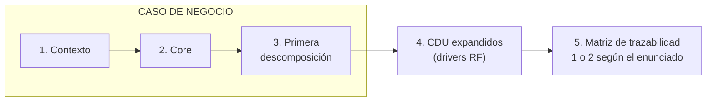
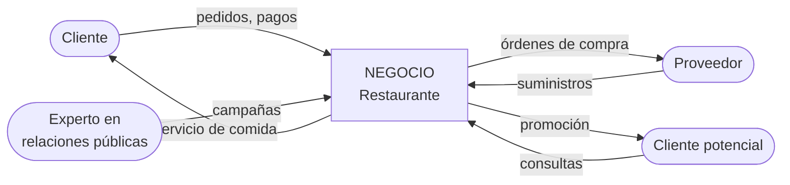
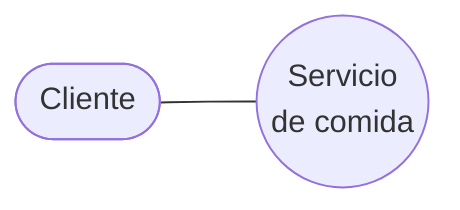
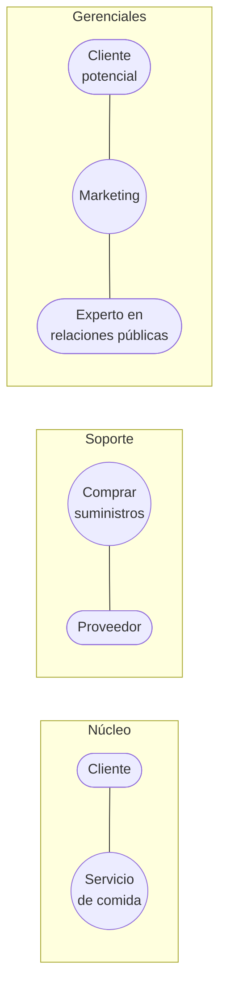
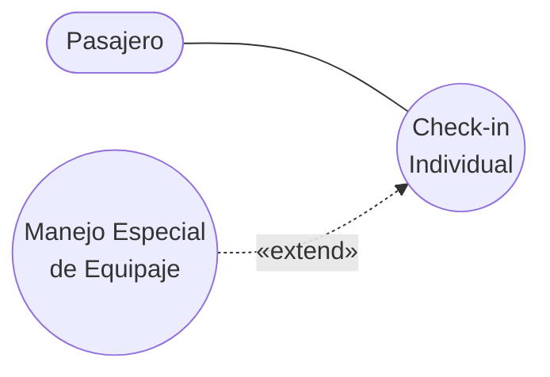

# Guía — Caso de negocio

La secuencia completa de un entregable de modelado del negocio, tal como se pide en el curso.

> [!important] La estructura canónica
> Un **caso de negocio** son **tres diagramas**, y van en este orden:
>
> | # | Diagrama | Qué muestra |
> |---|---|---|
> | 1 | **Contexto** | El negocio como una caja y todo lo que interactúa con él desde afuera |
> | 2 | **Core** | Los CDU de alto nivel: el corazón del negocio |
> | 3 | **Primera descomposición** | Los CDU que modelan los procesos de negocio |
>
> Y después del caso de negocio:
>
> | # | Entregable |
> |---|---|
> | 4 | **Casos de uso expandidos** (los drivers RF) |
> | 5 | **Matriz de trazabilidad** — **1 o 2**, según lo que indique el enunciado |
>
> En el [[Plan - Caso 1 FarmaHosp|Caso 1]] el enunciado pide **tres** matrices, que es más de lo
> habitual. **Siempre gana la indicación del enunciado.**

Por qué ese orden y no otro: cada diagrama **acota** al siguiente. El contexto fija la frontera del
negocio; el core dice qué hace el negocio dentro de esa frontera; la descomposición abre esos CDU en
procesos; los expandidos abren los procesos en requisitos; la matriz cruza lo que ya tiene nombre.
Saltearse uno deja el siguiente sin fundamento.

---

## Diagrama 1 — Contexto

**Qué responde:** *¿dónde termina el negocio y qué hay afuera?*

El negocio se dibuja como **una sola caja** y alrededor todo lo que interactúa con él. Nada de
procesos internos todavía: es la vista más externa que existe.

### La definición formal (Garland & Anthony, cap. 6)

El libro *Large-Scale Software Architecture* define un **Context Viewpoint** y es la definición más
precisa que tenemos:

> El Context Viewpoint contiene **solo el sistema, las entidades externas con las que interactúa, y
> las interfaces** entre el sistema y esas entidades externas. El objetivo debe ser crear **una sola
> vista** desde este viewpoint, que capture todas las entidades externas y sus interfaces. […] Esta
> única Context View es a menudo **la primera vista del sistema** que el equipo de arquitectura crea.
> Las entidades externas junto con los roles que desempeñan se denominan **actores**.

Y el cuadro del libro trae reglas concretas:

| Aspecto | Qué dice el libro |
|---|---|
| **Propósito** | Modelar el conjunto de actores con los que el sistema interactúa y las interfaces entre el sistema y esas entidades |
| **Cuándo aplica** | A lo largo de todo el ciclo de vida; se prepara sobre todo en las **primeras etapas** de análisis y diseño, y se actualiza cuando cambian las interfaces externas |
| **Layout** | **El sistema va SIEMPRE en el medio**, y los actores externos **alrededor** |
| **Si hay demasiados actores** | Se **agrupan en actores de más alto nivel**. Usar varias Context Views es el **último recurso** |
| **Consistencia** | Tiene que ser coherente con las otras vistas estáticas que muestran interfaces externas (subsistemas, componentes, procesos, despliegue) |

> [!tip] La regla de agrupar actores sirve directo para el Caso 1
> FarmaHosp tiene 8 stakeholders más sistemas externos (legacy COBOL/SOAP, sistema nacional de
> farmacovigilancia, LDAP, sensores IoT). Si los pones todos sueltos, el diagrama no se lee. La
> técnica del libro es **agruparlos en actores de más alto nivel** — y eso es una decisión de diseño
> que conviene justificar en el documento, no un atajo.

> [!warning] Negocio o sistema: sigue siendo ambigüedad #2
> El libro define el contexto **del sistema**. La rúbrica, en cambio, agrupa este diagrama bajo
> *"identificar el caso de negocio"*, lo que sugiere contexto **del negocio**.
>
> La buena noticia: **la estructura es idéntica** en los dos casos —una caja en el medio, actores
> alrededor, interfaces rotuladas—. Lo único que cambia es **qué hay dentro de la caja**: el negocio
> completo, o el software.
>
> Igual **preguntalo**, y mientras no haya respuesta declará en el documento cuál interpretaste y por
> qué. Con la estructura del libro, cambiar de una lectura a la otra es rotular distinto la caja.

Lo que va y lo que no:

| Va | No va |
|---|---|
| El negocio, como una caja única | Los procesos internos |
| Los actores del negocio | Los trabajadores del negocio |
| Los sistemas de información **externos** | Los CDU |
| Los flujos de entrada y salida | Detalle de qué pasa adentro |

La decisión que se toma acá y que condiciona todo: **dónde se pone la frontera**. Es lo mismo que
señala [[Actor del negocio]] — *"cada actor modela algo fuera del negocio"* — pero "el negocio" lo
definís vos, y de esa definición depende quién es actor y quién trabajador.

Forma, con el ejemplo del **restaurante** de la nota técnica:

> [!tip] Tu turno
> Escribí en una línea qué es "el negocio" en tu caso, y hacé la lista de todo lo que queda afuera y
> lo toca. Esa lista son tus actores candidatos.

---

## Diagrama 2 — Core

**Qué responde:** *¿cuál es el corazón del negocio?*

Los CDU de **alto nivel**: pocos, gruesos, los que responden a la pregunta que la nota técnica pone
como criterio del proceso **núcleo**:

> ¿Cuáles son los **servicios básicos** que un cliente recibe del negocio?

Acá se usa la técnica de **clasificación** de [[Identificación de procesos del negocio]], y el core
es la categoría **núcleo**. Los de soporte y gerenciales todavía no: esos aparecen en la
descomposición.

Ejemplo (restaurante): el core es **Servicio de comida**. Uno solo. Comprar suministros es soporte y
Marketing es gerencial — no son core.

> [!warning] El error de este diagrama es inflarlo
> Si tu diagrama "core" tiene ocho CDU, no es core: ya es la descomposición. El core son los
> servicios básicos que el cliente recibe. En el ejemplo de la nota técnica es **uno**.

> [!tip] Tu turno
> Respondé la pregunta del núcleo con tu caso. Si te salen más de tres o cuatro, revisá si algunos
> son de soporte.

---

## Diagrama 3 — Primera descomposición

**Qué responde:** *¿en qué procesos de negocio se abre eso?*

Ahora sí entran las **tres categorías** y las tres técnicas de identificación de
[[Identificación de procesos del negocio]]: clasificación, agrupamiento por funciones y objetivos
estratégicos.

Ejemplo completo del **restaurante**, tal como está en la figura 1 de la nota técnica:

Criterios de la nota técnica para cada categoría:

| Categoría | Cómo se encuentra |
|---|---|
| **Núcleo** | ¿Cuáles son los servicios básicos que un **cliente** recibe del negocio? |
| **Soporte** | Actividades que **no benefician al cliente directamente**: desarrollo y mantenimiento de personal, de tecnologías de información y de la oficina, seguridad, actividades legales |
| **Gerencial** | Procesos del manejo del negocio **en su conjunto**; normalmente se relacionan con el actor **propietario**. Informar a dueños e inversionistas, preparar metas del presupuesto a largo plazo |

Y una advertencia de la nota técnica que suele pasarse por alto:

> Clasificar un proceso en alguna de estas categorías **depende del campo de acción que se esté
> modelando**.

O sea: el mismo proceso puede ser soporte en un modelo y núcleo en otro, según dónde pusiste la
frontera en el diagrama 1. Por eso los tres diagramas tienen que ser **consistentes entre sí**.

> [!important] Regla de nombres (nota técnica)
> El nombre de un CDU debe expresar **qué sucede** cuando el caso de uso se ejecuta, y va en forma
> **activa**: en **gerundio** (*chequeo de equipaje*, *compra de suministros*) **o con un verbo**
> (*chequear equipaje*, *comprar suministros*).
>
> "Préstamos" o "Gestión de inventario" no cumplen: no dicen qué sucede.

---

## Entregable 4 — Casos de uso expandidos

Los **drivers RF**. Acá se aplican las tres relaciones, y la nota técnica agrega precisión que el
deck no tiene: la inclusión tiene **dos justificaciones distintas**.

### Inclusión por reutilización

Cuando **varios CDU comparten** un comportamiento. El caso incluido es un **caso de uso abstracto**:
existe *solamente* para que otros lo reutilicen.

Ejemplo de la nota técnica (**aduana**, figura 4): *Check-in Individual* y *Check-in de Grupo*
comparten *Manipular Equipaje*.

### Inclusión por particionamiento

Cuando **un solo CDU** es tan grande que conviene partirlo para que se entienda. No hay reutilización:
hay simplificación.

Ejemplo de la nota técnica (**tienda**, figura 5): *Venta de producto* incluye *Verificar política de
descuento*.

Las dos son `«include»` y las dos son válidas — son exactamente los **dos criterios** de
[[Relación de inclusión include]]: *"se puede reusar en otros CUN"* **o** *"simplifica la comprensión
del caso de uso base"*. La nota técnica les pone nombre.

### Extensión

Ejemplo de la nota técnica (**aduana**, figura 6): *Manejo Especial de Equipaje* extiende a
*Check-in Individual* — solo pasa con algunos pasajeros.

Vocabulario de la nota técnica para esta relación: el CDU que representa la **modificación** se llama
**caso de uso de adición**, y el que se modifica es el **caso de uso base**.

El detalle completo de las tres relaciones, con el árbol de decisión y las direcciones de flecha,
está en [[Guía - Diagrama de casos de uso del negocio]].

---

## Entregable 5 — Matriz de trazabilidad

**1 o 2 matrices**, según lo que indique el enunciado. El Caso 1 pide tres.

Las combinaciones que se piden habitualmente y qué detecta cada una están en
[[Guía - Matrices de trazabilidad]]. La regla general: una matriz cruza cosas que **ya tienen
identificador**, así que va al final.

> [!info] Plantilla de la matriz — pendiente
> Hay una **plantilla oficial** de cómo se debe implementar la matriz, que va a reemplazar el formato
> de ejemplo de [[Guía - Matrices de trazabilidad]] cuando esté disponible. Va a quedar en
> `adjuntos/plantillas/`. Hasta entonces, el formato de esa guía es **provisional**.

---

## Checklist de consistencia entre los tres diagramas

Lo que más se descuenta en un caso de negocio no es un diagrama mal hecho: es que **los tres no
digan lo mismo**.

- [ ] La **frontera del negocio** del diagrama 1 es la misma que se asume en 2 y 3
- [ ] Todo actor del diagrama 1 aparece en 2 o en 3 asociado a algún CDU
- [ ] Ningún actor nuevo aparece en 3 sin estar en 1
- [ ] El core del diagrama 2 está contenido en la descomposición del 3
- [ ] Los CDU del 3 son **procesos de negocio** que pasan el test de [[Proceso de negocio]]
- [ ] Los nombres están en **gerundio o verbo** y dicen qué sucede
- [ ] La clasificación núcleo/soporte/gerencial es coherente con el campo de acción declarado
- [ ] Ningún trabajador del negocio está dibujado como actor — [[Actor del negocio]]
- [ ] Cada CDU expandido conserva el nombre que tiene en el diagrama 3
- [ ] Los IDs usados en la matriz son los mismos de los diagramas

---

## Notas relacionadas

- [[_Método para resolver una tarea]] — el método general
- [[Plan - Caso 1 FarmaHosp]] — el ejercicio del hospital y su rúbrica
- [[Guía - Diagrama de casos de uso del negocio]] — el paso a paso de los CDU
- [[Guía - Matrices de trazabilidad]] — el entregable 5
- [[Identificación de procesos del negocio]] · [[Proceso de negocio]] · [[Actor del negocio]]
- [[Relación de inclusión include]] · [[Relación de extensión extend]]

## Preguntas de repaso

1. ¿Cuáles son los tres diagramas de un caso de negocio y en qué orden van?
2. ¿Qué decisión se toma en el diagrama de contexto y por qué condiciona a los otros dos?
3. ¿Cuál es la pregunta que identifica los procesos **núcleo**?
4. ¿Cuál es la diferencia entre inclusión **por reutilización** y **por particionamiento**?
5. ¿Qué es un **caso de uso abstracto**?
6. ¿Cómo deben nombrarse los CDU según la nota técnica?
7. ¿Por qué la matriz de trazabilidad va al final y no al principio?
