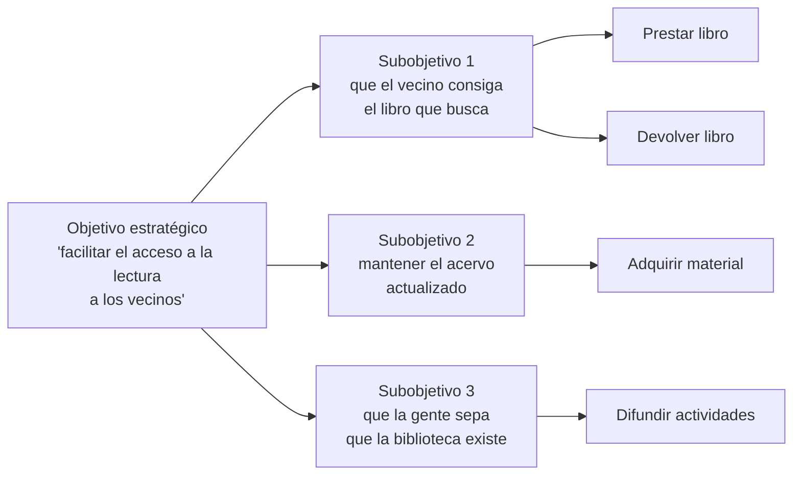
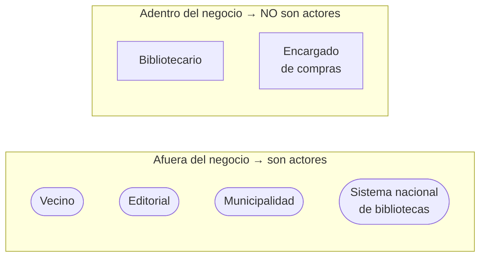
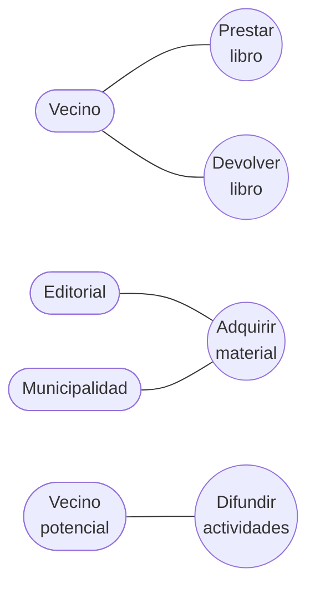
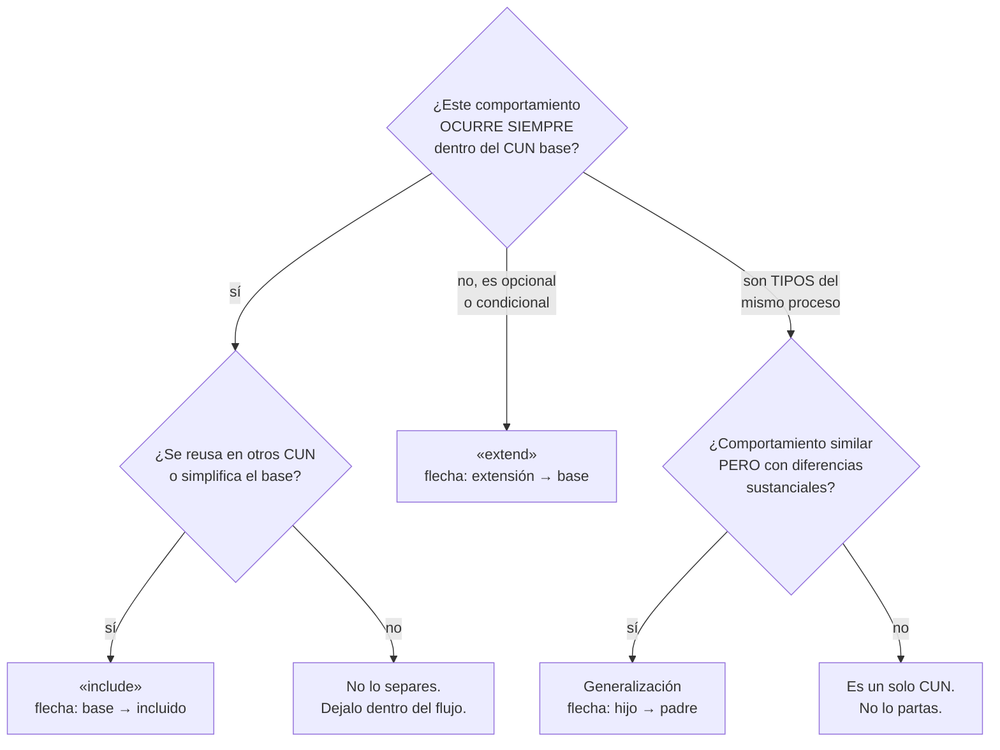
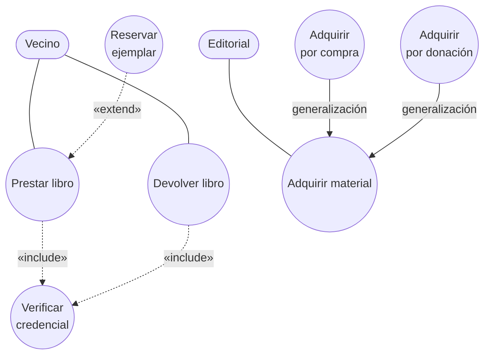
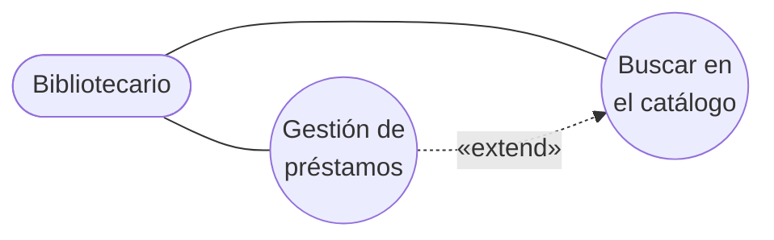

# Guía — Diagrama de casos de uso del negocio

Cómo se construye, paso a paso, con un ejemplo visual que crece en cada etapa.

> [!important] El ejemplo es de otro dominio, a propósito
> El caso que uso es una **biblioteca municipal**. No es el de ninguna tarea: está para que veas
> **la forma** del razonamiento y del diagrama, no para copiar el contenido.
>
> En cada paso hay un bloque **"tu turno"**. Ahí te detenés y lo hacés con tu enunciado antes de
> seguir leyendo. Si leés los seis pasos de corrido y después copiás la forma, no sirve.

Toda la teoría que se aplica acá sale de las presentaciones. Las reglas están citadas con la nota
de donde vienen.

---

## Paso 0 — El punto de inicio

**No se empieza dibujando.** Se empieza con dos preguntas sobre el enunciado:

1. ¿Cuál es el **negocio** que se modela? (no el sistema informático — el negocio)
2. ¿Cuál es su **objetivo**? Con las palabras del enunciado.

En el ejemplo: el negocio es una **biblioteca municipal**, y el objetivo que declara es
*"facilitar el acceso a la lectura a los vecinos del municipio"*.

Si no podés responder esas dos preguntas con el enunciado en la mano, **no sigas**: eso es una
ambigüedad para preguntar, no para asumir.

> [!tip] Tu turno
> Escribí las dos respuestas en una línea cada una. Si el enunciado no lo dice, anotá la pregunta.

---

## Paso 1 — Del objetivo a los procesos de negocio

Se usa la técnica de **objetivos** de [[Identificación de procesos del negocio]]: objetivo
estratégico → subobjetivos → procesos de negocio.

Cada proceso tiene que pasar el test de la definición de [[Proceso de negocio]]: grupo de tareas
**lógicamente relacionadas**, en una **secuencia y manera** determinadas, que emplean **recursos de
la organización** para dar resultados **en apoyo a sus objetivos**.

"Buscar en el catálogo" **no pasa** el test: es una tarea, no un grupo de tareas con resultado
propio. Va a terminar siendo un paso dentro de *Prestar libro*.

> [!tip] Tu turno
> Listá tus procesos y pasá cada uno por el test. Los que no pasan, guardalos aparte: casi seguro
> son pasos internos de otro proceso.

---

## Paso 2 — Clasificar, para no dejar huecos

Ahora se clasifican con la técnica de **clasificación**: núcleo, soporte y gerenciales. No es
decoración — es un **control de completitud**. Si los tres tipos no tienen nada, falta un proceso.

| Tipo | Qué es | En la biblioteca |
|---|---|---|
| **Núcleo** | El proceso que *es* el negocio | Prestar libro · Devolver libro |
| **Soporte** | Lo que sostiene al núcleo | Adquirir material |
| **Gerenciales** | Dirección y posicionamiento | Difundir actividades |

> [!warning] El hueco más típico
> Casi todos entregan solo los procesos **núcleo**. Si tu lista no tiene ningún proceso de soporte
> ni gerencial, volvé a leer el enunciado: o falta algo, o el enunciado lo acota explícitamente
> (y entonces conviene decirlo en el documento).

---

## Paso 3 — Identificar los actores

Un [[Actor del negocio|actor del negocio]] es un **rol**, no una persona. Y hay un test único que
decide:

> **¿Está FUERA del negocio?** Si está adentro, no es actor.

Candidatos que da la teoría: clientes o potenciales clientes, socios, proveedores, autoridades,
propietarios, **sistemas de información externos**, y otras partes de la organización si es grande.

Aplicado al ejemplo:

| Candidato | ¿Afuera? | ¿Es actor? |
|---|---|---|
| Vecino / lector | Sí | ✅ Actor |
| Editorial proveedora | Sí | ✅ Actor |
| Municipalidad (autoridad que financia) | Sí | ✅ Actor |
| Sistema nacional de bibliotecas | Sí, es un sistema externo | ✅ Actor |
| **Bibliotecario** | **No, trabaja adentro** | ❌ **NO es actor** |
| **Encargado de compras** | **No** | ❌ **NO es actor** |

El bibliotecario **sí aparece** en el modelo, pero en las
[[Realizaciones de casos de uso del negocio|realizaciones]] — el diagrama de actividad o la
descripción textual —, nunca como monigote en el diagrama de CUN.

> [!warning] Este es el error que más se descuenta
> Dibujar al trabajador como actor. Si en tu diagrama hay un "Vendedor", un "Cajero", un
> "Administrador" o un "Empleado" con cara de monigote, revisalo: casi siempre está adentro.

> [!tip] Tu turno
> Hacé la tabla de candidatos con la columna "¿afuera?". Los que dan "no" van a una lista de
> **trabajadores del negocio** que vas a necesitar en el paso 6.

---

## Paso 4 — El diagrama base

Ahora sí se dibuja. Solo tres cosas: actores, CUN y la **asociación** (línea simple, sin punta),
que significa que el actor **envía y/o recibe mensajes**.

Chequeos de este paso, de [[Caso de uso del negocio]] y [[Actor del negocio]]:

- **Cada actor tiene al menos un CUN.** Sin excepción. Un actor suelto es un error.
- **Un CUN puede no tener actor**, pero solo si es **de apoyo**. Es la única excepción que la teoría
  admite, y conviene justificarla en el documento.
- **Nombres de CUN: verbo + sustantivo.** "Préstamos" está mal; "Prestar libro" está bien.
- La asociación **no lleva flecha**: la comunicación es en los dos sentidos.

> [!tip] Tu turno
> Dibujá tu diagrama base. Todavía sin `include`, sin `extend` y sin generalización.

---

## Paso 5 — Expandir, solo si hace falta

Los **CUN expandidos** agregan tres relaciones. La regla de oro: **no las agregues para que el
diagrama se vea más completo.** Cada una tiene un criterio, y usarla sin cumplirlo es un error
conceptual visible.

El árbol de decisión:

Aplicado al ejemplo:

- *Prestar libro* y *Devolver libro* los dos necesitan **verificar la credencial del vecino**, y eso
  **siempre** pasa → `«include»`.
- Al prestar, el vecino **puede** pedir una **reserva** si el libro no está disponible. No siempre
  pasa → `«extend»`.
- *Adquirir material* tiene dos tipos con flujo similar pero diferencias sustanciales: **por compra**
  y **por donación** → generalización.

Tres detalles que se corrigen en el examen:

| Relación | Dirección de la flecha | Por qué |
|---|---|---|
| `«include»` | **base → incluido** | El base sabe que lo llama |
| `«extend»` | **extensión → base** | El base no sabe que lo extienden |
| generalización | **hijo → padre**, y el actor va al **padre** | Los hijos heredan la asociación |

La prueba rápida para distinguir `include` de `extend`: **tapá el CU secundario y leé el base.** Si
queda **incompleto** era `include`; si **se entiende igual** era `extend`.

> [!tip] Tu turno
> Por cada relación que quieras agregar, pasala por el árbol. Si no cumple el criterio, no la
> agregues — un diagrama base correcto vale más que uno expandido con relaciones mal puestas.

---

## Paso 6 — La descripción textual

Si el enunciado la pide (casi siempre pide al menos una), se usa la plantilla de
[[Descripción textual de casos de uso]]: nombre, actores, propósito, resumen, flujo de trabajo
(básico y **curso alterno**), otras secciones, prioridad y mejoras.

Acá es donde entran los **trabajadores** que sacaste en el paso 3. El flujo va en dos columnas y la
numeración es **continua entre las dos**:

| Acción del actor | Respuesta del proceso de negocio |
|---|---|
| **1.** El Vecino solicita un libro presentando su credencial. | |
| | **2.** El Bibliotecario verifica la credencial. |
| | **3.** El Bibliotecario busca el ejemplar en el acervo. → *Si hay ejemplar, pasar a 4. Si no hay, pasar a 6.* |
| | **4.** El Bibliotecario registra el préstamo con fecha de devolución. |
| **5.** El Vecino recibe el ejemplar. | |
| | **6.** El Bibliotecario informa que no hay ejemplar y ofrece reservarlo. |

Notá que el **único actor es el Vecino**; el Bibliotecario aparece como trabajador. Es exactamente
la estructura del ejemplo *Atender pedido* de la presentación.

Y el paso 3 con su bifurcación es el germen del **curso alterno**: si esa rama creciera, se sacaría
a un CUN aparte con `«extend»` — que es justamente el *Reservar ejemplar* del paso 5.

---

## Checklist de rigor

Para tildar antes de entregar. Cada item cita la regla y de dónde viene.

**Procesos**
- [ ] Cada CUN corresponde a **un** proceso de negocio — [[Proceso de negocio]]
- [ ] Cada proceso pasa el test de la definición (grupo de tareas, secuencia, recursos, objetivo)
- [ ] Hay procesos de los **tres tipos** (núcleo, soporte, gerenciales) o está justificado por qué no — [[Identificación de procesos del negocio]]

**Actores**
- [ ] Cada actor está **fuera** del negocio — [[Actor del negocio]]
- [ ] **Ningún trabajador** del negocio está dibujado como actor — [[Realizaciones de casos de uso del negocio]]
- [ ] Cada actor es un **rol**, no una persona ni un puesto
- [ ] Cada actor se involucra con **al menos un** CUN
- [ ] Los actores no humanos (sistemas externos) están considerados

**Casos de uso**
- [ ] Cada CUN produce un **resultado de valor observable** para un actor — [[Caso de uso del negocio]]
- [ ] Cada CUN es un flujo **completo** de punta a punta
- [ ] Los nombres son **verbo + sustantivo**
- [ ] Si algún CUN no tiene actor, es **de apoyo** y está justificado

**Relaciones**
- [ ] Cada `«include»` **siempre ocurre**, y se justifica por reutilización o por comprensión — [[Relación de inclusión include]]
- [ ] Cada `«extend»` es **opcional o condicional** — [[Relación de extensión extend]]
- [ ] Cada generalización tiene **comportamiento similar con diferencias sustanciales** — [[Generalización y especialización en casos de uso]]
- [ ] Las **direcciones** de las flechas son las correctas
- [ ] En las generalizaciones, el actor está asociado al **padre**
- [ ] Las asociaciones actor–CUN **no llevan flecha**

**Forma**
- [ ] La notación es la de la presentación: actor monigote, CUN elipse, asociación línea simple
- [ ] Hay **límite del sistema** si el enunciado lo pide
- [ ] El diagrama es legible al tamaño de entrega
- [ ] Está en la herramienta que pide el enunciado — ver [[StarUML]] antes de generar

---

## Cómo se ve mal

El anti-ejemplo, con los tres errores más frecuentes juntos:

Los tres errores:

1. **El Bibliotecario como actor.** Es un trabajador: está adentro del negocio.
2. **"Gestión de préstamos"** no es verbo + sustantivo, y agrupa varios procesos en uno.
3. **`«extend»` donde va `«include»`**, y con la flecha al revés: buscar en el catálogo ocurre
   siempre dentro del préstamo, y además no es un proceso de negocio por sí mismo.

---

## Notas relacionadas

- [[_Método para resolver una tarea]] — el método general del que sale esta guía
- [[Modelo de casos de uso del negocio]] · [[Actor del negocio]] · [[Caso de uso del negocio]]
- [[Identificación de procesos del negocio]] · [[Proceso de negocio]]
- [[Relación de inclusión include]] · [[Relación de extensión extend]] · [[Generalización y especialización en casos de uso]]
- [[Descripción textual de casos de uso]] · [[Realizaciones de casos de uso del negocio]]
- [[De la teoría al diagrama]] — el patrón Mermaid y por qué este diagrama se dibuja a mano en StarUML

## Preguntas de repaso

1. ¿Cuál es el punto de inicio de este entregable, y qué dos preguntas hay que poder responder?
2. ¿Cuál es el test único que decide si algo es actor del negocio?
3. ¿Dónde aparece el trabajador del negocio, si no es en el diagrama de CUN?
4. ¿Para qué sirve clasificar los procesos en núcleo, soporte y gerenciales?
5. Recitá las tres direcciones de flecha: `include`, `extend` y generalización.
6. ¿Cuál es la única excepción a "todo CUN tiene al menos un actor"?
