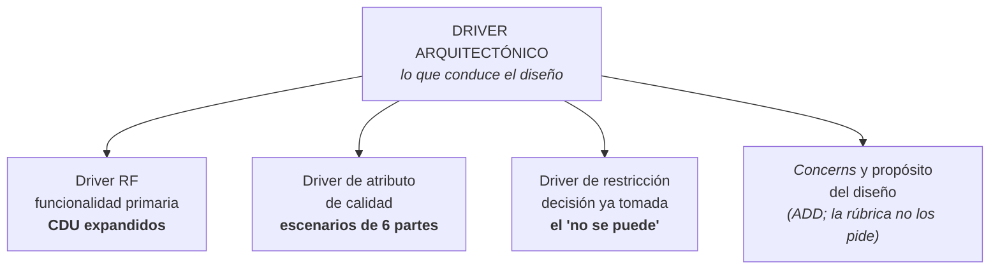
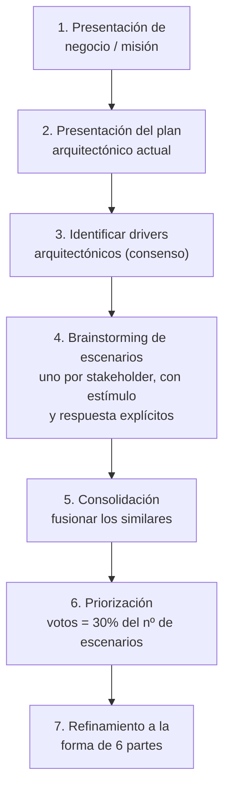

# Guía — Drivers de atributos de calidad y de restricción

Cómo se obtienen, se especifican, se clasifican y se priorizan. Es el **criterio 3** de la rúbrica.

> [!important] Vale 30 puntos: es el criterio más pesado
> La rúbrica del [[Plan - Caso 1 FarmaHosp|Caso 1]] pide, textual:
>
> - Completitud de los **drivers RF** (diagramas de CDU expandidos)
> - **Drivers Atributos de Calidad**
> - **Drivers de Restricción**
> - **Priorizar los 5 drivers más críticos** según el contexto guatemalteco
>
> Los drivers RF están en [[Guía - Diagrama de casos de uso del negocio]]. Esta guía cubre los otros
> tres.

La teoría de fondo está en [[Atributos de calidad]]. Acá va el "cómo se hace".

---

## Paso 0 — Qué es un driver, con precisión

Un **driver arquitectónico** es un requisito que **impacta en la estructura** del sistema. El
enunciado del Caso 1 lo dice: los escenarios de calidad *"deberán ser tratados como drivers
arquitectónicos"*.

La definición formal viene de **ADD 3.0** (*Attribute-Driven Design*), capítulo 20 de
*Software Architecture in Practice* — que es el **libro número 8 de la bibliografía oficial del
programa**. Cita textual:

> *"En el diseño arquitectónico convertimos decisiones sobre **architectural drivers** en
> estructuras. Los architectural drivers comprenden los requisitos arquitectónicamente significativos
> (ASRs), pero también incluyen **funcionalidad, restricciones, concerns arquitectónicos y propósito
> del diseño**."*

Y más adelante, la lista operativa — los insumos que deben estar listos **antes** de empezar una
ronda de diseño:

> *"Antes de empezar una ronda de diseño hay que asegurarse de que los architectural drivers (los
> insumos del proceso de diseño) estén disponibles y sean correctos. Estos incluyen:*
> - *el propósito de la ronda de diseño*
> - ***los requisitos funcionales primarios***
> - ***los escenarios primarios de atributos de calidad (QA)***
> - ***cualquier restricción***
> - *cualquier concern"*

> [!important] Esa lista **es** el criterio 3, viñeta por viñeta
> | Driver de ADD (SAIP cap. 20) | Viñeta de la rúbrica |
> |---|---|
> | *primary functional requirements* | Completitud de los drivers **RF** (CDU expandidos) |
> | *primary quality attribute (QA) scenarios* | Drivers **Atributos de Calidad** |
> | *any constraints* | Drivers de **Restricción** |
> | — *"getting their **priority** right is crucial"* | **Priorizar los 5** más críticos |
>
> Los 30 puntos del criterio 3 son **la lista de insumos de ADD**, reordenada. Y la palabra "driver"
> sale de la frase del libro: *"estos insumos realmente **conducen** (drive) el diseño, así que
> tenerlos bien y tener bien su prioridad es crucial"*. Sigue: *"el diseño de arquitectura es un
> proceso de **basura-entra-basura-sale**; los resultados de ADD no pueden ser buenos si los insumos
> están mal formados."*
>
> **Por qué importa:** el vocabulario de la rúbrica no sale de ninguna diapositiva — sale del libro
> que el programa lista. Citarlo en el documento no es adorno: es la defensa de la clasificación.

> [!warning] Hallazgo honesto sobre el deck
> El deck se llama **"CDU Negocio - Modelado de Drivers RF"**, pero revisé sus **27 diapositivas una
> por una**: la palabra *"driver"* **no aparece ni una vez**, y tampoco "restricción" ni "atributo de
> calidad". El deck cubre CDU del negocio de punta a punta y termina en la descripción textual del
> caso de uso expandido.
>
> O sea: **los drivers RF sí están en el deck** (son los CDU expandidos, aunque no se los llame así),
> pero **"Drivers Atributos de Calidad" y "Drivers de Restricción" no tienen diapositiva**. Su
> respaldo es el **libro oficial**, y es legítimo: está en la bibliografía del programa.

> [!tip] Un dato de ADD que ordena la entrega completa
> ADD dice que **antes de empezar** hay que establecer el alcance del sistema: *"qué queda
> dentro/fuera, con qué entidades externas interactúa — **diagrama de contexto**"*.
>
> O sea: el diagrama de contexto del criterio 1 **no es un trámite previo**, es la **precondición
> formal** de ADD para poder identificar drivers. Los dos criterios están encadenados, y decirlo en
> el documento demuestra que entendiste el método.

### ¿Un driver es un RF?

Es la confusión más fácil de tener, y la rúbrica misma la resuelve. **Un RF es *un tipo* de
driver, no el driver.** La rúbrica escribe tres veces la palabra y **las tres veces la califica**:

- drivers **RF**
- drivers **Atributos de Calidad**
- drivers **de Restricción**

Si "driver" significara "RF", entonces *"drivers RF"* sería redundante y *"drivers de restricción"*
sería una contradicción. El calificativo está ahí justamente porque **driver es el género y RF es
una de las especies**.

Y el libro dice lo mismo: los drivers **incluyen** *"los requisitos funcionales primarios"* junto con
los escenarios de QA, las restricciones y los concerns. O sea:

| Afirmación | ¿Correcta? |
|---|---|
| "Un RF es un driver" | **Sí** — si es de la funcionalidad **primaria** |
| "Todo driver es un RF" | **No** — los de calidad y restricción no son RF |
| "Todo RF es un driver" | **No** — solo la funcionalidad **primaria**; el libro dice *primary* |

> [!important] La trampa que sí importa para el criterio 3
> Si entendés "driver = RF", entregás **solo los CDU expandidos** y perdés las otras dos viñetas.
> Con 30 puntos en juego, esa lectura cuesta caro.
>
> Y al revés: **no metas todos los RF** en los drivers RF. El filtro es *primary functionality* — la
> funcionalidad que la arquitectura tiene que soportar estructuralmente. En FarmaHosp, *dispensar con
> asignación de lote* es primaria; *cambiar el logo del reporte* no.

### La regla que decide si algo es driver

**No todo requisito es un driver.** El filtro:

> ¿Si este requisito cambia, **tengo que cambiar la estructura**?

- *"El botón de confirmar debe ser azul"* → no es driver: se cambia una hoja de estilos.
- *"Debe operar offline 4 horas y resolver la trazabilidad al reconectar"* → **es driver**: cambia
  cómo se distribuyen datos y se resuelven conflictos.

---

## Paso 1 — Drivers de atributos de calidad

### 1.1 De dónde salen

Tres fuentes, en este orden de fiabilidad:

| Fuente | Qué da | En el Caso 1 |
|---|---|---|
| **El enunciado, textual** | Los escenarios ya escritos | Los **8 "acuerdos de calidad esperados"**, que el enunciado dice explícitamente que hay que clasificar y tratar como drivers |
| **Los stakeholders** | Sus **necesidades ocultas** | La columna *"lo que realmente necesitan"* de la tabla de 8 stakeholders |
| **Los escenarios narrados** | Requisitos emergentes | Los **6 escenarios críticos**, que traen requisitos como *"la validación debe ser < 500 ms"* |

> [!warning] La segunda fuente es la que separa un "muy bien" de un "excelente"
> Las necesidades ocultas **son** requisitos de calidad, aunque el enunciado no las llame así. El
> médico dice *"quiero prescribir en menos de 5 minutos"* (usabilidad) pero **necesita** validación
> contra inventario en tiempo real (eficiencia + fiabilidad) y alertas de interacciones
> (funcionalidad). Modelar solo lo que dicen deja la mitad afuera.

### 1.2 Cómo se especifica cada uno: las seis partes

Un nombre de atributo **no es un driver**. Como dice el SAIP: *los nombres, por sí solos, son casi
inútiles; la especificación real son los escenarios.* Cada driver de calidad se escribe con las
**seis partes** de [[Atributos de calidad]].

**Ejemplo trabajado** (biblioteca municipal, otro dominio a propósito):

Punto de partida — lo que dijo el stakeholder:

> *"Quiero que el sistema no se caiga cuando todos vienen a devolver libros."*

Eso no es un driver: no tiene medida, no tiene entorno, no se puede probar. Convertido:

| # | Parte | Contenido |
|---|---|---|
| 1 | **Fuente** | Los vecinos lectores |
| 2 | **Estímulo** | Llegan 200 devoluciones simultáneas |
| 3 | **Artefacto** | El módulo de préstamos |
| 4 | **Entorno** | Hora pico del último día de plazo (**sobrecarga**) |
| 5 | **Respuesta** | El sistema registra todas las devoluciones sin rechazar ninguna |
| 6 | **Medida** | El 95 % en < 3 s; ninguna por encima de 10 s; 0 devoluciones perdidas |

**Clasificación:** eficiencia (por el tiempo de respuesta) + fiabilidad (por el "ninguna perdida").
Y se declara **cuál es el dominante**, porque un driver clasificado en dos categorías sin decidir
cuál manda no orienta ninguna decisión.

> [!tip] Si no tenés el número, usá la técnica de hacerse el tonto
> Está en [[Atributos de calidad]]: preguntá 24 horas, 1 hora, 5 minutos, 10 segundos… hasta que el
> stakeholder reaccione. **Un rango ya sirve**, porque 24 horas y 100 ms implican arquitecturas
> completamente distintas.
>
> En una tarea no hay stakeholder a quien preguntarle: entonces **proponé un valor y justificalo con
> el enunciado**. Si el enunciado dice que el enfermero no puede retrasar el pase de visita, el
> orden de magnitud es segundos, no minutos. Decilo así.

### 1.3 La clasificación

El enunciado del Caso 1 pide que los escenarios estén *"clasificados bajo el nombre que corresponda"*.
Usá **los seis atributos del programa** (funcionalidad, fiabilidad, usabilidad, eficiencia,
mantenibilidad, portabilidad) — no la lista del SAIP, que es distinta.

Y anticipá el problema de pertenencia: el SAIP advierte que un mismo estímulo puede reclamarlo cuatro
comunidades (*"un ataque DoS ¿es disponibilidad, performance, seguridad o usabilidad?"*). La salida
no es discutir: es **decidir, decir cuál elegiste y por qué**.

> [!warning] La seguridad no está en la lista de seis — y no es un olvido
> En **ISO 9126** la seguridad es una **subcaracterística de funcionalidad**. Su sucesora **ISO 25010**
> la asciende a característica propia.
>
> El Caso 1 está lleno de requisitos de seguridad (confidencialidad de diagnósticos de VIH y cáncer,
> autorización contextual, nada de credenciales en texto plano). Con la taxonomía del programa van
> bajo **funcionalidad** — pero **decilo explícitamente en el documento**, con la nota de que en ISO
> 25010 serían de primer nivel. Eso demuestra dominio de la taxonomía; clasificarlas en silencio bajo
> un atributo raro, no.

### 1.4 El formato de entrega

Una tabla por driver, o una tabla con una fila por driver si son muchos:

| ID | Escenario (6 partes, resumido) | Atributo dominante | Otros atributos | Fuente |
|---|---|---|---|---|
| `AC-01` | *fuente → estímulo → artefacto → entorno → respuesta → **medida*** | eficiencia | fiabilidad | Acuerdo de calidad #1 del enunciado |

Los IDs con prefijo propio (`AC-nn` o `RNF-nn`) porque van a entrar en las matrices de
[[Guía - Matrices de trazabilidad]], y ahí **un ID no se renumera nunca**.

> [!tip] Tu turno
> Tomá los 8 acuerdos de calidad del enunciado y pasá **el primero** a las seis partes. Vas a
> descubrir que faltan datos —el entorno, casi siempre— y esa es la parte del ejercicio: decidir el
> entorno y justificarlo con el enunciado. Después seguí con los otros siete.

---

## Paso 2 — Drivers de restricción

### 2.1 Qué es una restricción

Una **decisión de diseño que ya está tomada** y que el arquitecto no puede negociar. No es un
requisito a satisfacer: es un límite dentro del cual hay que diseñar.

Se reconocen porque se escriben con **"debe"** o **"no se puede"**, y porque **no tienen medida**: no
hay grados de cumplimiento, se cumplen o no.

Ejemplo del libro *Large-Scale Software Architecture* (§4.3), para un sistema bancario:

> - Las interfaces legacy (interfaces gráficas y externas) **deben seguir siendo soportadas**.
> - Los tipos de ATM legacy **deben ser soportados**, además del nuevo tipo.
> - La interfaz telefónica convencional **debe ser soportada**, además del acceso desde un navegador
>   de celular.

### 2.2 De dónde salen

| Origen | Cómo aparece en el enunciado |
|---|---|
| **Explícitas** | Una sección propia. En el Caso 1: *"Lo que NO debe hacer el sistema (Restricciones explícitas e implícitas)"* — 8 restricciones |
| **Regulatorias** | Leyes y normas. En el Caso 1: Ley de Acceso a la Información Pública, Norma Técnica de Farmacovigilancia del MSPAS, política de datos del hospital, regulación INCAP |
| **Técnicas del entorno** | El hardware y la red que ya existen: data center con recursos fijos, Wi-Fi inestable en el sótano, tablets con 3 GB de RAM, escáneres con 5 % de fallo |
| **Organizativas** | El equipo. En el Caso 1: 3 desarrolladores internos con Java/Oracle, consultora con Python/React, y el sistema **debe poder ser mantenido solo por el equipo interno** tras 12 meses |

> [!important] Las organizativas son las que más se olvidan y las que más pesan
> El conflicto de stacks del Caso 1 —interno Java/Oracle vs. consultora Python/PostgreSQL, y el
> mantenimiento queda en manos del interno— **es una restricción**, y probablemente la que más limita
> las decisiones. No es un detalle de contexto: condiciona el lenguaje, la base de datos y hasta el
> estilo arquitectónico elegible.

### 2.3 El formato

| ID | Restricción (textual del enunciado) | Tipo | Qué decisión bloquea |
|---|---|---|---|
| `RES-01` | *"No se puede usar una base de datos que no soporte transacciones ACID para el módulo de inventario"* | técnica | descarta bases NoSQL sin ACID para inventario |

La columna **"qué decisión bloquea"** es la que la convierte en un driver útil en vez de una cita: una
restricción sirve para **descartar alternativas**, y eso hay que hacerlo visible.

> [!tip] Tu turno
> Copiá las 8 restricciones explícitas del enunciado **textuales** (sin parafrasear: parafrasear es
> donde se pierde el requisito) y completá la columna de qué descarta cada una. Después agregá las
> regulatorias, técnicas y organizativas, que están repartidas por el enunciado y no en la sección de
> restricciones.

---

## Paso 3 — Priorizar los 5 más críticos

La rúbrica pide *"priorizar los 5 drivers más críticos según el contexto guatemalteco"*. Hay un método
formal para esto y conviene usarlo en vez de elegir a ojo.

### 3.1 El método: Quality Attribute Workshop (QAW)

Es *"un método facilitado y centrado en stakeholders para generar, priorizar y refinar escenarios
antes de que la arquitectura esté completa"*. Sus siete pasos:

Dos detalles concretos y muy usables:

**La regla de votación del paso 6:** cada stakeholder recibe una cantidad de votos igual al **30 % del
número de escenarios**. Con 20 escenarios, 6 votos cada uno. Eso fuerza a elegir en vez de aprobar
todo.

**El paso 5, consolidar, va antes de priorizar.** Si dos escenarios dicen lo mismo con otras palabras,
se fusionan primero: si no, se reparten los votos entre sí y los dos pierden.

### 3.2 Adaptarlo a una tarea individual

No tenés stakeholders reales para que voten. Lo que sí podés hacer es **declarar los criterios** y
puntuar contra ellos, que es defendible y auditable:

| Criterio | Pregunta |
|---|---|
| **Impacto arquitectónico** | ¿Cuántas decisiones de estructura condiciona este driver? |
| **Riesgo si falla** | ¿Qué pasa si el sistema no lo cumple? |
| **Dificultad** | ¿Cuán difícil es lograrlo con las restricciones dadas? |
| **Valor para el stakeholder** | ¿Cuántos stakeholders lo reclaman, y qué tan crítico es para ellos? |

Y arriba de todo, el criterio que la rúbrica pide explícitamente:

### 3.3 Qué significa "el contexto guatemalteco"

La rúbrica lo exige y **no lo define** — es la **ambigüedad #4** del [[Plan - Caso 1 FarmaHosp|plan]],
y conviene preguntarla. Mientras no haya respuesta, lo defendible es **declarar cómo lo
interpretaste** y ser consistente. Ejes que el propio enunciado pone sobre la mesa:

| Eje del contexto | Qué está en el enunciado |
|---|---|
| **Marco regulatorio local** | MSPAS con reporte en ≤ 24 h y XML con DTD propia; Contraloría General de Cuentas; Ley de Acceso a la Información Pública; INCAP |
| **Restricción presupuestaria** | Data center propio con recursos fijos, **sin autoescalado**; nada de licencias anuales que el hospital no pueda renovar |
| **Infraestructura real** | Internet de 50 Mbps compartido; Wi-Fi inestable en el sótano de farmacia |
| **Capital humano** | 3 personas de TI con experiencia en Java y Oracle, alta rotación por contratos de consultoría de 12 meses |
| **Criticidad social** | Hospital de referencia **nacional**, 1200 pacientes diarios, medicamentos de alto costo |

> [!important] El razonamiento que la rúbrica premia
> No es solo *cuál* driver es más crítico, es **por qué lo es acá y no en general**. Un requisito de
> autoescalado sería razonable en otro contexto y **es inviable en este**, porque el presupuesto de
> infraestructura es fijo y no hay nube pública permitida para datos sensibles. Ese tipo de
> argumento es el que demuestra que leíste el contexto y no aplicaste una receta.

### 3.4 El formato de entrega

| # | ID | Driver | Tipo | Justificación en el contexto guatemalteco |
|---|---|---|---|---|
| 1 | `AC-03` | … | atributo de calidad | … |

Cinco filas, **exactamente cinco** — la rúbrica dice cinco. Y cada una con su justificación: sin la
columna de la derecha, la priorización es una lista de opiniones.

---

## Checklist de rigor

**Atributos de calidad**
- [ ] Cada driver está escrito con las **seis partes**, no solo con el nombre del atributo
- [ ] Cada uno tiene **medida** — la parte 6. Sin medida no es testeable y no es driver
- [ ] Cada uno está **clasificado** con los seis atributos del programa
- [ ] Los que caen en más de una categoría declaran cuál es la **dominante**
- [ ] Los de **seguridad** dicen explícitamente bajo qué característica se clasificaron y por qué
- [ ] Están los **8 acuerdos de calidad** del enunciado, ninguno de menos
- [ ] Están las **necesidades ocultas** de los stakeholders, no solo lo que dicen querer
- [ ] Los requisitos emergentes de los 6 escenarios críticos están capturados

**Restricciones**
- [ ] Están las **8 restricciones explícitas**, citadas **textuales**
- [ ] Están las **regulatorias** (MSPAS, Contraloría, INCAP, ley de acceso a la información)
- [ ] Están las **técnicas del entorno** (data center, red, tablets, escáneres)
- [ ] Está la **organizativa** del conflicto de stacks y el mantenimiento por el equipo interno
- [ ] Cada una dice **qué decisión bloquea**, no solo qué prohíbe

**Priorización**
- [ ] Son **exactamente 5**
- [ ] Los criterios de priorización están **declarados** antes de aplicarlos
- [ ] Cada uno se justifica **en el contexto guatemalteco**, con algo del enunciado
- [ ] Se declara cómo se interpretó "contexto guatemalteco" (ambigüedad #4)

**Consistencia con los otros entregables**
- [ ] Los IDs son los mismos que se usan en las matrices de trazabilidad
- [ ] Todo driver de calidad se puede rastrear a un stakeholder o a un escenario del enunciado
- [ ] Ninguna restricción contradice un driver de calidad sin que el conflicto esté señalado

---

## Cómo se ve mal

| Error | Por qué está mal |
|---|---|
| *"El sistema debe ser rápido"* | Sin las seis partes y sin medida: no es driver, es un deseo |
| *"Atributo: Performance"* y nada más | Un nombre no es una especificación. Faltan las seis partes |
| Clasificar todo como *"funcionalidad"* | Es la salida fácil; se nota. Hay que decidir y justificar |
| Copiar los 8 acuerdos del enunciado sin transformarlos | El enunciado los da **narrados**; el entregable son escenarios de 6 partes |
| Priorizar sin declarar criterios | La lista queda como opinión, no como análisis |
| Priorizar 6, o 4, o "los principales" | La rúbrica dice **5** |
| Restricciones parafraseadas | Se pierde el requisito. Van textuales |
| Ignorar la restricción organizativa | Es la que más limita las decisiones en este caso |

---

## Notas relacionadas

- [[Atributos de calidad]] — la teoría: definición, seis partes, categorías, tradeoffs, ISO
- [[Plan - Caso 1 FarmaHosp]] — la rúbrica, la materia prima y las ambigüedades
- [[Guía - Diagrama de casos de uso del negocio]] — los drivers RF
- [[Guía - Matrices de trazabilidad]] — donde estos IDs se cruzan
- [[Estilos arquitectónicos]] — qué atributo favorece y sacrifica cada estilo
- [[Matriz de trazabilidad de requisitos]] — la cadena RNF → atributo → táctica → vista
- [[_Método para resolver una tarea]] — el método general

## Preguntas de repaso

1. ¿Qué es un driver arquitectónico y cuál es el filtro para decidir si un requisito lo es?
2. Según ADD, ¿de qué cinco cosas están hechos los drivers? ¿Cómo se mapean a los tres de la rúbrica?
3. ¿Por qué el diagrama de contexto es la **precondición** de ADD?
4. ¿Cuál es la diferencia entre un **atributo de calidad** y una **restricción**?
5. ¿Cómo se reconoce una restricción en el texto de un enunciado?
6. ¿Cuáles son las tres fuentes de drivers de calidad, y cuál separa un "muy bien" de un "excelente"?
7. ¿Cuántos votos recibe cada stakeholder en la priorización del QAW?
8. ¿Por qué consolidar va **antes** de priorizar?
9. ¿Dónde se clasifica la seguridad con la taxonomía del programa, y qué hay que aclarar?
10. ¿Qué hace que una justificación sea "del contexto guatemalteco" y no una receta general?
