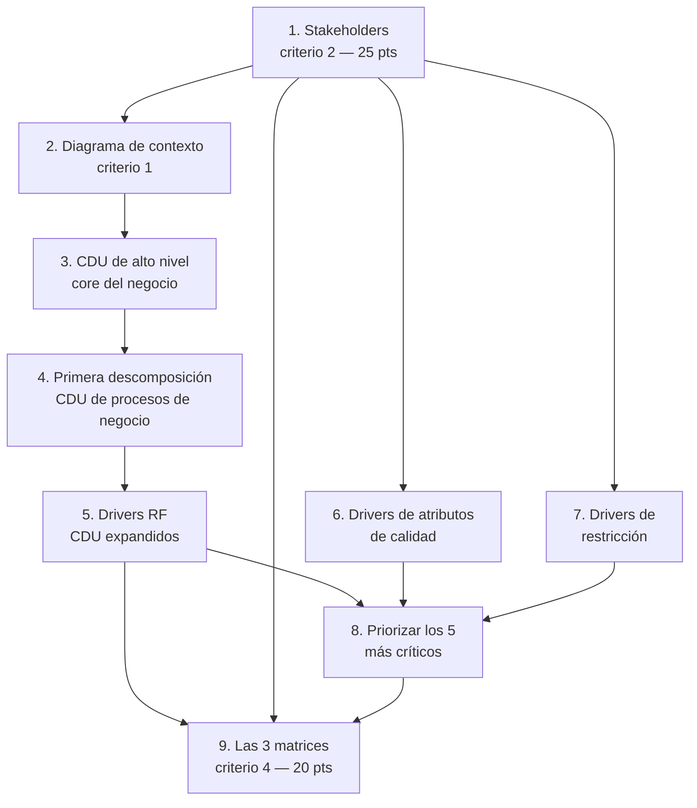

# Plan — Caso 1: FarmaHosp

Aplicación del **paso 1** de [[_Método para resolver una tarea]]: el enunciado desarmado en
entregables, con su criterio de aceptación y su puntaje. Este es el archivo que se va tildando.

Enunciado completo: [[Caso 1 - FarmaHosp]] (texto) y `Caso 1 - FarmaHosp.pdf` (original, manda).

---

## El caso, en tres líneas

**FarmaHosp**: sistema integral de gestión de **medicamentos de alto costo (MAC)** para el Hospital
Universitario "Dr. Juan José Ortega", centro de referencia nacional de tercer nivel en Guatemala.

Cubre el **ciclo de vida completo del medicamento en 6 etapas**: adquisición, almacenamiento,
prescripción, dispensación, administración, y seguimiento/farmacovigilancia.

El dolor que lo justifica: Q. 2.5 millones perdidos por caducidades, 3 pacientes con medicamento
incorrecto por transcripción manual de lotes, retrasos de hasta 48 h por falta de visibilidad de
stock, y auditorías fallidas de la Contraloría por tener todo en papel y hojas de cálculo.

---

## Entregables y puntaje (rúbrica textual)

**Total: 100 puntos.** El nivel más alto de cada criterio es el que figura como referencia.

| # | Criterio | Sub-entregables | Puntos | Estado |
|---|---|---|---|---|
| 1 | **Habilidad para identificar el caso de negocio** | · Diagrama de **Contexto** · Diagrama de **CDU de alto nivel** (core del negocio) · **Primera Descomposición**: diagrama de CDU que modele los procesos de negocio | **25** | ☐ |
| 2 | **Identificación de Stakeholders** | — | **25** | ☐ |
| 3 | **Obtención y modelado de las necesidades a nivel de arquitectura de software** | · Completitud de los **drivers RF** (diagramas de **CDU expandidos**) · **Drivers de Atributos de Calidad** · **Drivers de Restricción** · **Priorizar los 5 drivers más críticos** según el contexto guatemalteco | **30** | ☐ |
| 4 | **Matrices de trazabilidad de requerimientos** | · Stakeholders **vs.** CDU · Drivers RF **vs.** Drivers RF · CDU **vs.** Drivers RF | **20** | ☐ |

> [!important] Dos lecturas de la rúbrica que cambian cómo se trabaja
> **1. La trazabilidad vale 20 puntos y son TRES matrices, no una.** No es un anexo: es un criterio
> propio, y una de las tres cruza drivers RF contra drivers RF (dependencias entre requisitos), que
> es la menos obvia. Ver [[Guía - Matrices de trazabilidad]].
>
> **2. El criterio 3 vale 30 puntos y es el más pesado.** El vocabulario que usa la rúbrica es
> **"drivers"** — no "requisitos". Eso explica el nombre de la presentación del curso:
> *"CDU Negocio - **Modelado de Drivers RF**"*. Los drivers son de tres tipos: funcionales,
> atributos de calidad y restricciones.

---

## Vocabulario del enunciado

El enunciado usa términos precisos. Conviene usarlos igual en la entrega, no sinónimos:

| Término del enunciado | Qué significa acá |
|---|---|
| **MAC** | Medicamento de alto costo (> Q. 50,000/mes por paciente) |
| **Driver arquitectónico** | Requisito que **impacta en la estructura** del sistema. El enunciado dice que los escenarios de calidad *"deberán ser tratados como drivers arquitectónicos"* |
| **Driver RF** | Driver de requisito **funcional** — se modela con CDU expandidos |
| **Driver de atributo de calidad** | Los 8 "acuerdos de calidad esperados", que hay que **clasificar bajo el nombre que corresponda** |
| **Driver de restricción** | Los "Lo que NO debe hacer el sistema": decisiones ya tomadas que no se negocian |
| **Necesidad oculta** | Lo que el stakeholder **realmente necesita**, distinto de lo que dice que quiere |

---

## Materia prima que el enunciado ya trae

El enunciado es generoso: mucho del trabajo es **organizar** lo que ya está, no inventarlo.

**8 stakeholders con "lo que dicen" vs "lo que realmente necesitan"**: médico tratante (oncología),
farmacéutico/a clínico/a, enfermero/a de piso, Director Administrativo, Jefe de Farmacovigilancia,
Paciente, Ministerio de Salud (regulador), Equipo de Desarrollo (interno + consultora).

> [!tip] La tabla de stakeholders es un regalo para el criterio 2
> La columna **"necesidad oculta"** es exactamente lo que separa un "muy bien" de un "excelente":
> el stakeholder dice *"quiero prescribir en menos de 5 minutos"* y lo que necesita es validación
> contra inventario en tiempo real, alertas de interacciones y memoria de su patrón de prescripción.
> Modelar solo lo que dicen deja la mitad afuera.

**6 escenarios críticos** narrados, cada uno con preguntas abiertas deliberadas:

1. La cadena de frío se rompe (3:00 AM, corte de energía, 2°C → 10°C por 15 min)
2. Urgencia oncológica (sábado 6:00 PM, farmacéutico ocupado, tres opciones A/B/C)
3. Error de medicación (alerta roja de paciente equivocado, tardó 4 s — requisito emergente: < 500 ms)
4. Auditoría de la Contraloría sin previo aviso (informe forense de un lote, < 10 min, inmutable)
5. Caída del servidor central en hora pico (lunes 8:30 AM, réplica tarda 3 min)
6. Farmacovigilancia con efecto adverso grave (anafilaxia 19:30, el sistema nacional solo recibe 8-16 h)

**8 acuerdos de calidad** que el enunciado dice explícitamente que hay que **clasificar y tratar como
drivers arquitectónicos**:

| # | Resumen | Atributo que suena |
|---|---|---|
| 1 | Validación paciente-medicamento < 500 ms normal, < 2 s degradado | Performance / eficiencia |
| 2 | Operar offline ≥ 4 h y resolver trazabilidad al reconectar sin duplicar | Disponibilidad |
| 3 | Todo cambio inmutable y trazable hasta el usuario, sin degradar rendimiento | Integridad / auditabilidad |
| 4 | Acceso contextual a diagnósticos sensibles, con excepción de emergencia auditada (ABAC) | Seguridad / confidencialidad |
| 5 | Pico de 10x los lunes 8:30 AM con presupuesto fijo, sin autoescalado | Escalabilidad |
| 6 | Integrar legacy COBOL/SOAP (3-5 s, solo 7-17 h) y sistema nacional XML/DTD | Integrabilidad |
| 7 | El equipo interno (Java/Oracle) debe poder mantenerlo tras irse la consultora | Mantenibilidad |
| 8 | Datos de temperatura inalterables y verificables criptográficamente | Integridad |

*(La columna de la derecha es una **hipótesis mía**, no del enunciado. Clasificarlos "bajo el nombre
que corresponda" es parte de lo que se evalúa: hay que decidirlo y justificarlo con la teoría, no
copiar esta tabla.)*

**8 restricciones explícitas** ("Lo que NO debe hacer el sistema"): base de datos con ACID
obligatorio para inventario; nada de nube pública para datos sensibles (solo estadística
anonimizada); sin licencias de pago anuales (se prefiere open source); sin BYOD; **no monolítico**;
sin credenciales en texto plano; capacitación de enfermeros ≤ 2 horas; sin punto único de falla en
autenticación.

**Contexto técnico**: data center propio (VMware, 32 vCPU, 128 GB RAM, SAN 10 TB), Wi-Fi inestable en
el sótano de farmacia, internet 50 Mbps compartido, tablets Panasonic Toughpad (Android 9, 3 GB
RAM), escáneres Bluetooth con 5% de fallo de lectura.

**Regulaciones**: Ley de Acceso a la Información Pública (10 días hábiles), Norma Técnica de
Farmacovigilancia del MSPAS (reporte ≤ 24 h en XML con DTD), Política de Datos Personales del
hospital (confidencialidad máxima para VIH/cáncer/psiquiátricas — ni el director puede verlos sin
orden judicial), Regulación de medicamentos controlados INCAP (doble registro farmacéutico-enfermero,
alerta si discrepancia > 5 min).

**Volumen (primer año)**: 15,000 pacientes activos, 45,000 prescripciones/mes, 60,000
dispensaciones/mes, 25,000 administraciones/mes, 500,000 registros de sensores/día, ~5 TB
estructurados + 2 TB logs + 100 GB imágenes.

---

## Orden de trabajo sugerido

Sale de las dependencias reales entre entregables: no se puede cruzar en una matriz lo que todavía
no existe.

**Por qué los stakeholders van primero**, aunque sean el criterio 2: la matriz *Stakeholders vs. CDU*
los necesita, y los drivers de atributos de calidad salen de sus **necesidades ocultas**. Empezar por
el diagrama es el error que advierte el método.

**Por qué las matrices van al final**: una matriz cruza cosas que ya tienen identificador. Si se
intentan antes, no hay qué cruzar.

---

## Ambigüedades para preguntar (no asumir)

El método dice: si algo es ambiguo, se **pregunta**, no se resuelve por cuenta propia. Las que veo:

| # | Duda | Por qué importa |
|---|---|---|
| 1 | El criterio 1 lista **tres** sub-entregables pero la tabla del PDF muestra **cuatro** líneas de 5 puntos. ¿Falta un sub-entregable? | Son 5 puntos y un entregable posiblemente no identificado |
| 2 | ¿"Diagrama de Contexto" se refiere al **diagrama de contexto del sistema** (sistema + entidades externas) o al **contexto de negocio**? | Cambia el nivel de abstracción y qué notación usar |
| 3 | ¿La "primera descomposición" se entrega como **un** diagrama de CDU o **uno por proceso**? | Cambia el alcance del entregable |
| 4 | ¿Qué significa exactamente **"según el contexto guatemalteco"** al priorizar los 5 drivers? ¿Se espera citar las regulaciones locales, el presupuesto, la disponibilidad de personal? | Es un criterio de evaluación explícito y no está definido |
| 5 | ¿Formato y modalidad de entrega (herramienta de diagramas, PDF, individual o grupo)? | El programa dice que hay proyecto en grupo y que **no se aceptan entregas fuera de fecha** |
| 6 | La matriz **"Drivers RF vs. Drivers RF"**: ¿qué relación se cruza — dependencia, conflicto, precedencia? | Sin saberlo, la matriz puede estar bien armada y mal interpretada |

---

## Checklist de rigor específica de este caso

Además de la checklist del entregable correspondiente:

**Cobertura del enunciado (trazabilidad inversa, paso 5 del método)**
- [ ] ¿Están los **8 stakeholders** del enunciado, ninguno de más ni de menos?
- [ ] ¿Cada stakeholder tiene tratada su **necesidad oculta**, no solo lo que dice querer?
- [ ] ¿Están las **6 etapas** del ciclo de vida del medicamento reflejadas en los procesos de negocio?
- [ ] ¿Están los **8 acuerdos de calidad** clasificados y convertidos en drivers?
- [ ] ¿Están las **8 restricciones** como drivers de restricción?
- [ ] ¿Los **6 escenarios críticos** aparecen en algún entregable (como CDU, como driver o como curso alterno)?
- [ ] ¿Se priorizaron **exactamente 5** drivers, con justificación en el contexto guatemalteco?

**Rigor teórico**
- [ ] Los actores del negocio están **fuera** del negocio — [[Actor del negocio]]. Cuidado: el médico, el farmacéutico y el enfermero **trabajan en el hospital**; si el negocio es el hospital, son **trabajadores**, no actores. Esta decisión hay que **tomarla y justificarla** según cómo se defina el límite del negocio
- [ ] Cada CDU corresponde a **un proceso de negocio** — [[Proceso de negocio]]
- [ ] Los CDU expandidos usan `«include»`, `«extend»` y generalización con su **criterio** correcto — [[Relación de inclusión include]], [[Relación de extensión extend]]
- [ ] Las tres matrices son **bidireccionales** y se leen por fila y por columna — [[Matriz de trazabilidad de requisitos]]

> [!warning] La decisión más delicada de este caso
> **¿El médico, el farmacéutico y el enfermero son actores del negocio o trabajadores?**
>
> Si el negocio modelado es **el hospital**, trabajan adentro → son **trabajadores del negocio** y
> van en las realizaciones, no como actores. Los actores serían el **Paciente**, el **Ministerio de
> Salud**, la **Contraloría**, los **proveedores** y los **sistemas externos**.
>
> Si el negocio modelado es **la gestión de MAC** (un proceso dentro del hospital), entonces el
> médico y el enfermero pueden ser actores porque están **fuera de ese proceso**.
>
> Las dos lecturas son defendibles; lo que **no** es defendible es no haber decidido. Definí el
> límite del negocio explícitamente en el documento y sé consistente. Es la regla de
> [[Actor del negocio]]: *"cada actor modela algo fuera del negocio"* — pero "el negocio" lo definís
> vos.

---

## Notas relacionadas

- [[_Método para resolver una tarea]] — el método del que sale este plan
- [[Guía - Diagrama de casos de uso del negocio]] — para los criterios 1 y 3
- [[Guía - Matrices de trazabilidad]] — para el criterio 4
- [[Matriz de trazabilidad de requisitos]] — la teoría
- [[Actor del negocio]] · [[Caso de uso del negocio]] · [[Identificación de procesos del negocio]]
- [[Programa oficial del curso]] — fechas y ponderación
