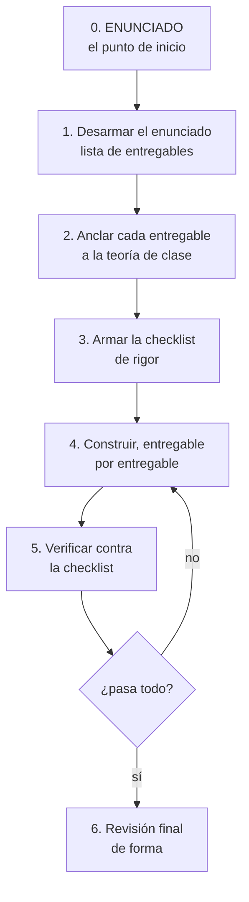

# Método para resolver una tarea

El procedimiento para atacar cualquier entregable de la materia. Está pensado para responder tres
preguntas que siempre aparecen: **¿por dónde empiezo?**, **¿lo estoy haciendo bien?** y **¿cumple
lo que pide el enunciado?**

> [!important] El contrato: te guío, no te lo resuelvo
> Esta guía y las que salen de ella **no producen el entregable terminado**. En cada paso te dicen
> qué tenés que decidir, te muestran un ejemplo de **otro dominio** para que veas la forma, y te
> devuelven el control.
>
> El diagrama, la tabla y el documento los hacés vos. Si te doy la respuesta armada, aprobás la
> tarea y perdés el parcial.

---

## El punto de inicio: siempre el enunciado, nunca el diagrama

El error más común es abrir la herramienta de diagramas y empezar a dibujar. **El punto de inicio
es el enunciado**, y el primer artefacto que se produce no es un diagrama: es una **lista de
entregables con su criterio de aceptación**.

---

## Paso 1 — Desarmar el enunciado

Leer el enunciado **con lápiz**, buscando cuatro cosas distintas. Se confunden y cada una se
verifica diferente:

| Qué buscar | Cómo se ve en un enunciado | Ejemplo |
|---|---|---|
| **Entregables** | Sustantivos: "presentar", "elaborar", "incluir" | "un diagrama de casos de uso del negocio" |
| **Restricciones** | Números y límites | "mínimo 3 actores", "no más de 10 páginas" |
| **Formato** | Cómo se entrega | "en StarUML", "en PDF", "por grupo" |
| **Criterios de calificación** | Ponderaciones, rúbrica | "vale 9 puntos", "se evalúa la justificación" |

El producto de este paso es una tabla, una fila por entregable:

| # | Entregable | Restricciones | Formato | Puntos | Estado |
|---|---|---|---|---|---|
| 1 | *(lo que pide el enunciado, textual)* | | | | pendiente |

Dos reglas al armarla:

- **Citá el enunciado textual**, no lo parafrasees. Parafrasear es donde se pierde el requisito.
- **Si algo es ambiguo, anotalo como pregunta**, no lo resuelvas por tu cuenta. Las ambigüedades
  del enunciado se preguntan al auxiliar; asumir es lo que hace perder puntos.

## Paso 2 — Anclar cada entregable a la teoría de clase

Esto es lo que hace que la tarea sea *de esta materia* y no una tarea genérica. Por cada entregable,
identificar **qué nota de la bóveda** define las reglas que hay que respetar.

| Si el enunciado pide… | La teoría que manda está en… |
|---|---|
| Diagrama de casos de uso del negocio | [[Modelo de casos de uso del negocio]], [[Actor del negocio]], [[Caso de uso del negocio]] |
| Identificar procesos del negocio | [[Identificación de procesos del negocio]], [[Proceso de negocio]] |
| Relaciones entre casos de uso | [[Relación de inclusión include]], [[Relación de extensión extend]], [[Generalización y especialización en casos de uso]] |
| Descripción textual / especificación de un CU | [[Descripción textual de casos de uso]] |
| Documentar la arquitectura por vistas | [[Modelo 4+1 vistas]], [[Estructuras y vistas arquitectónicas]] |
| Diagrama de despliegue | [[Diagrama de despliegue]] |
| Elegir o justificar un estilo | [[Estilos arquitectónicos]] |
| Justificar decisiones contra requerimientos | [[Matriz de trazabilidad de requisitos]] |
| Definir la arquitectura paso a paso | [[Proceso de diseño arquitectónico]] |

> [!warning] La jerarquía de fuentes, sin excepciones
> 1. **El enunciado** — manda sobre todo lo demás.
> 2. **Las presentaciones de clase** — son la teoría que se evalúa.
> 3. Los libros y el complemento — solo para entender, nunca para contradecir a 1 y 2.
>
> Varias notas de la bóveda están marcadas como **complemento** ([[Estilos arquitectónicos]] es
> complemento entero). Si usás algo de ahí en una tarea, tiene que ser **compatible** con lo de
> clase, y conviene decir de dónde lo sacaste.

## Paso 3 — Armar la checklist de rigor

Convertir las reglas de la teoría en **preguntas de sí/no** verificables. Esto es lo que después se
usa para revisar.

Ejemplo, para un diagrama de casos de uso del negocio:

- [ ] ¿Cada actor está **fuera** del negocio? *(regla de [[Actor del negocio]])*
- [ ] ¿Ningún trabajador del negocio está dibujado como actor? *(regla de [[Realizaciones de casos de uso del negocio]])*
- [ ] ¿Cada actor tiene **al menos un** CUN? *(regla de [[Actor del negocio]])*
- [ ] ¿Cada CUN produce un **resultado de valor observable**? *(definición de [[Caso de uso del negocio]])*
- [ ] ¿Cada CUN corresponde a **un** proceso de negocio? *(regla de [[Proceso de negocio]])*
- [ ] ¿Los nombres de los CUN son **verbo + sustantivo**?
- [ ] ¿Cada `«include»` **siempre ocurre**? *(criterio de [[Relación de inclusión include]])*
- [ ] ¿Cada `«extend»` es realmente **opcional**? *(criterio de [[Relación de extensión extend]])*

La checklist detallada de cada entregable está en su guía:
**[[Guía - Diagrama de casos de uso del negocio]]**.

## Paso 4 — Construir, de a un entregable

Nunca todo a la vez. Por cada entregable:

1. Mirar el **ejemplo visual** de la guía correspondiente — es de otro dominio, para que veas la
   forma sin copiar el contenido.
2. Hacer **tu versión** con los datos de tu enunciado.
3. Contra la checklist, **antes** de pasar al siguiente.

## Paso 5 — Verificar contra la checklist

Item por item, con el diagrama delante. Si un item falla, se corrige **antes** de seguir.

Y un chequeo que se olvida siempre: **la trazabilidad inversa**. Recorré el enunciado de nuevo y
preguntate por cada frase: *¿esto está reflejado en algún entregable?* Es la trazabilidad hacia
atrás de [[Matriz de trazabilidad de requisitos]], aplicada a una tarea: detecta lo que pidieron y
no hiciste, y también lo que hiciste y nadie pidió.

## Paso 6 — Revisión final de forma

Lo que se pierde por descuido, no por no saber:

- [ ] ¿Está **todo** lo que el enunciado pide, con el nombre que el enunciado usa?
- [ ] ¿El formato es el pedido (herramienta, extensión, cantidad de páginas)?
- [ ] ¿Los diagramas son **legibles** al tamaño en que se van a ver?
- [ ] ¿Hay portada / datos del grupo / carné si se piden?
- [ ] ¿Las decisiones están **justificadas**, no solo enunciadas?
- [ ] ¿Se entrega **en fecha**? (el programa dice: *"las entregas fuera de fecha no son aceptadas"*)

---

## Dónde van los enunciados

En `08-Tareas/enunciados/`. Podés poner el PDF tal cual te lo dan; si lo convertís a markdown se
puede buscar dentro y citar textual, que es lo que pide el paso 1.

Por cada tarea, un archivo `Plan - <nombre de la tarea>.md` en `08-Tareas/` con la tabla del paso 1
y la checklist del paso 3. Ese archivo es el que se va tildando.

---

## Notas relacionadas

- [[Guía - Diagrama de casos de uso del negocio]] — la guía paso a paso con ejemplo visual
- [[Programa oficial del curso]] — fechas de entrega y ponderación
- [[Matriz de trazabilidad de requisitos]] — el paso 5 es trazabilidad hacia atrás
- [[De la teoría al diagrama]] — qué sintaxis usar y a qué herramienta mandarla
- [[StarUML]] · [[Excalidraw]] — límites de cada herramienta

## Preguntas de repaso

1. ¿Cuál es el punto de inicio de una tarea y cuál es el primer artefacto que se produce?
2. ¿Cuáles son las cuatro cosas que hay que buscar al desarmar un enunciado?
3. ¿Qué se hace con una ambigüedad del enunciado, y qué NO se hace?
4. ¿Cuál es la jerarquía de fuentes cuando el complemento y la clase no coinciden?
5. ¿Qué detecta la trazabilidad inversa del paso 5?
