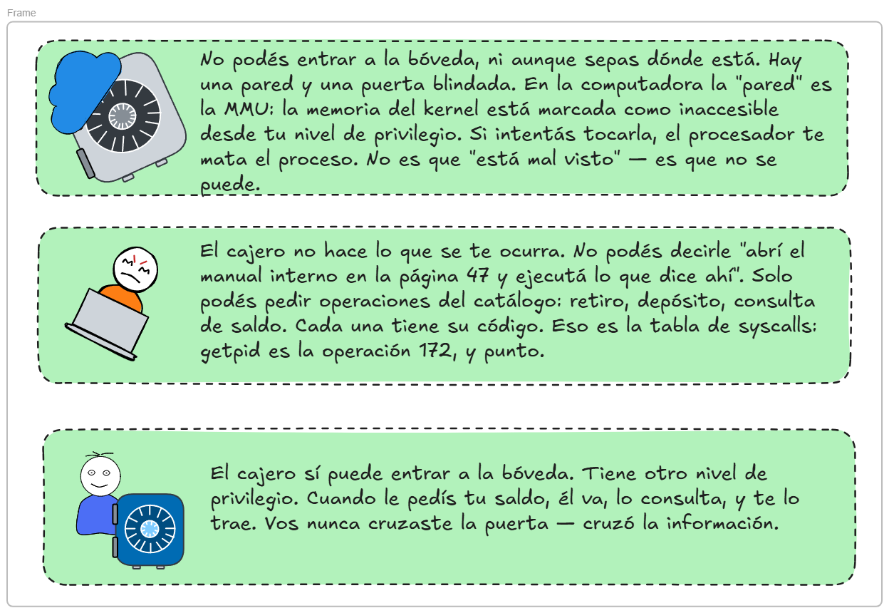
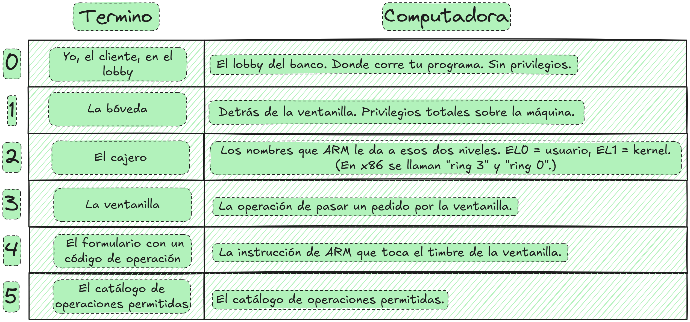
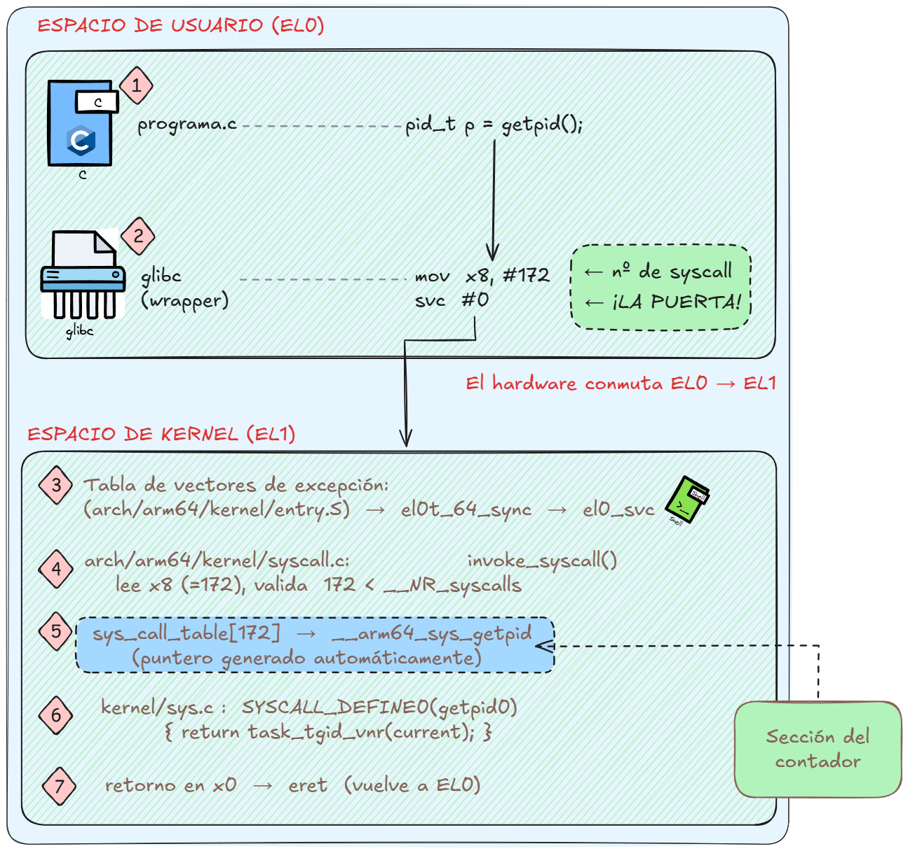
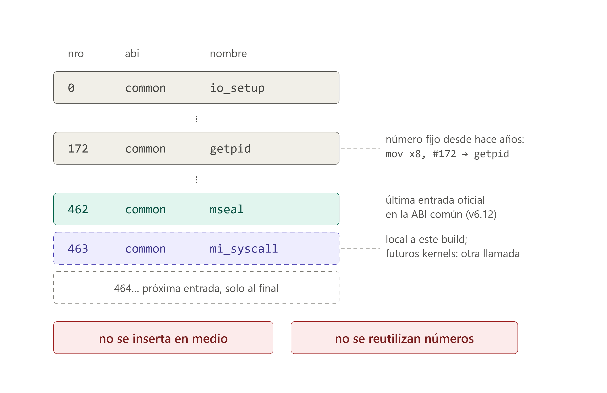
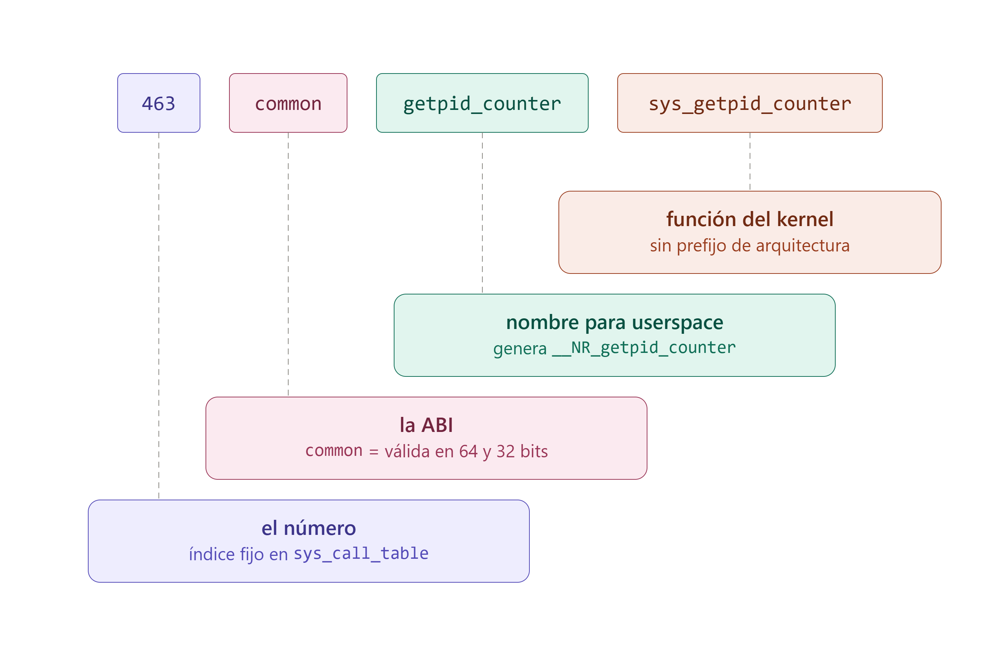

# Manual Técnico — Modificación de funciones del kernel

## Marco teórico

Esta sección describe el mecanismo de llamadas al sistema en Linux sobre la arquitectura AArch64 (ARM64), que es la base sobre la cual se implementa la syscall `getpid_counter` documentada en los apartados posteriores.


*Figura 1. Ubicación del kernel entre las aplicaciones de usuario y el hardware.*

## 1. Definición de llamada al sistema

Un programa escrito en C se ejecuta en **espacio de usuario**, que en ARM64 corresponde al nivel de excepción **EL0**. El kernel se ejecuta en **espacio de kernel**, nivel **EL1**. Ambos contextos poseen privilegios distintos y la separación entre ellos la impone el **hardware**, no el software.

### Niveles y tipos de excepción (Arquitectura AArch64)

| Nivel | Componente que se ejecuta en él |
|---|---|
| EL0 | Aplicaciones de usuario. |
| EL1 | Kernel del sistema operativo (nivel privilegiado). |
| EL2 | Hipervisor. |
| EL3 | Firmware de bajo nivel, incluido el Monitor Seguro. |


*Figura 2. Niveles de excepción EL0–EL3 en AArch64.*

Mientras la CPU opera en EL0, el hardware impide las siguientes operaciones:

- ejecución de instrucciones privilegiadas (modificación de tablas de páginas, deshabilitación de interrupciones);
- lectura o escritura de memoria marcada como perteneciente al kernel;
- acceso directo al hardware.

Bajo estas restricciones, un programa no puede leer por sí mismo su PID, dado que ese dato reside en una estructura interna del kernel. La única alternativa disponible es **solicitar al kernel que realice la lectura en su nombre**.

Esa solicitud constituye la llamada al sistema: **la única vía legítima de transición de EL0 a EL1**. La interfaz es deliberadamente restringida, ya que no permite saltar a una dirección arbitraria del kernel, sino únicamente indicar la ejecución de la operación número N. El kernel valida ese número contra su tabla de syscalls y ejecuta exclusivamente las rutinas registradas en ella.

> **Nota.** Una syscall no es una llamada a función convencional, sino una **excepción controlada**: se solicita al hardware que eleve el nivel de privilegio y transfiera el control a un punto de entrada fijo del kernel. Su comportamiento es análogo al de una interrupción, no al de una instrucción `call`.

### Analogía: la atención en una agencia bancaria

El mecanismo descrito admite una analogía con la atención al público en una agencia bancaria. El cliente permanece del lado del mostrador destinado al público y no accede a la bóveda ni a los sistemas internos; para obtener un dato de su cuenta debe solicitarlo a un cajero, quien lo consulta en su nombre. El mostrador cumple la misma función que la frontera EL0/EL1: delimita dos zonas con privilegios distintos y concentra en un único punto todas las solicitudes autorizadas.


*Figura 3. Analogía entre la atención en una agencia bancaria y el mecanismo de llamadas al sistema.*

La figura siguiente establece la correspondencia entre cada elemento de la analogía y su equivalente técnico:



*Figura 4. Equivalencia entre los elementos de la analogía y los componentes del mecanismo de syscalls.*

Aplicada al caso concreto de esta práctica, la correspondencia se expresa de la siguiente forma:



*Figura 5. Aplicación de la analogía al recorrido de la llamada `getpid()`.*

## 2. Recorrido de la llamada `getpid()`

### En código

```c
pid_t p = getpid();
```

`getpid()` **no es una función del kernel**: es una función de `glibc`, la biblioteca de C. Reside en `/lib/aarch64-linux-gnu/libc.so.6`, en espacio de usuario.

### `glibc` rellena el formulario

```asm
mov  x8, #172      ; número de la operación solicitada
svc  #0            ; supervisor call: se solicita atención al kernel
```

#### Contrato ABI (Application Binary Interface)

En términos de la analogía bancaria, el formulario tiene casillas fijas que no pueden intercambiarse de lugar: cada dato debe escribirse en la casilla que le corresponde para que el cajero lo interprete de forma correcta.


*Figura 6. Registros definidos por el contrato ABI: `x8` transporta el número de syscall y `x0`–`x5` los argumentos.*

`getpid` no recibe argumentos, por lo que únicamente se rellena `x8`.

> **Nota.** Esta correspondencia explica el `0` de `SYSCALL_DEFINE0`: indica cero argumentos, es decir, cero casillas de datos rellenas.

#### El hardware conmuta

`svc #0` no constituye un salto, sino una **excepción sincrónica**. Al ejecutarla, el procesador realiza las siguientes acciones por hardware, sin intervención de software alguno:

1. Guarda la dirección de retorno en `ELR_EL1`.
2. Guarda el estado de los flags en `SPSR_EL1`.
3. Eleva el nivel de ejecución a EL1, con privilegios totales.
4. Transfiere el control a una dirección fija que el kernel escribió en `VBAR_EL1` durante el arranque.

El destino de esa transferencia no puede alterarse desde espacio de usuario, dado que `svc` no recibe una dirección como argumento: no existe forma de indicarle un destino. El punto de entrada quedó fijado antes de que el programa iniciara su ejecución. El programa únicamente toca el timbre; el lugar donde ese timbre suena lo determinó el kernel al arrancar.

> **Nota.** En este punto se aprecia la diferencia entre una llamada a función y una syscall. Una llamada a función expresa la instrucción "transferir el control a esta dirección". Una syscall expresa "ocurrió un evento, atiéndase".

#### El kernel ordena la casa

El punto de entrada reside en `arch/arm64/kernel/entry.S`, escrito íntegramente en ensamblador.

La primera acción que ejecuta el kernel es guardar todos los registros en una estructura denominada `struct pt_regs`, ubicada en la pila del kernel.


*Figura 7. Preservación de los registros del usuario en `struct pt_regs` sobre la pila del kernel.*

El motivo de esta operación es que el kernel utilizará esos mismos registros físicos para su propio trabajo y, al finalizar, debe restituirlos en el estado exacto en que los recibió; de lo contrario el contexto del programa de usuario queda corrupto. En términos de la analogía, equivale a que el cajero resguarde las pertenencias del cliente en una bandeja numerada antes de atenderlo.

Lo anterior explica por qué `SYSCALL_DEFINE0` genera una función que recibe `const struct pt_regs *`: en esa estructura se encuentran guardados los argumentos del usuario. El punto de entrada recibe la bandeja completa y la macro extrae de ella los argumentos que requiere la función. Se declara `SYSCALL_DEFINE0(getpid)` sin parámetros y la macro construye el puente correspondiente.

#### El kernel valida y despacha

Con los registros ya resguardados, el kernel determina qué rutina debe ejecutar. La operación reside en `arch/arm64/kernel/syscall.c`, en la función `invoke_syscall()`, cuya lógica es, en esencia, la siguiente:

```c
if (scno < sc_nr) {                       /* el número está en rango */
        syscall_fn = syscall_table[scno]; /* se obtiene el puntero a función */
        ret = __invoke_syscall(regs, syscall_fn);
} else {
        ret = -ENOSYS;                    /* la operación no existe */
}
```

De este fragmento se desprenden tres consecuencias:

1. **Función de `__NR_syscalls`.** Representa el tamaño del catálogo de llamadas y es el valor que recibe `sc_nr`. La comparación `scno < sc_nr` impide que se solicite una operación inexistente, como la número 99999, y que el kernel lea un puntero fuera de los límites del arreglo, lo que constituiría una vulnerabilidad grave.
2. **Origen del error `ENOSYS`.** Si el número solicitado no está registrado en la tabla, la ejecución cae en la rama `else`. La función puede existir y estar compilada dentro del binario del kernel y, aun así, resultar inalcanzable: la tabla no declara la syscall, la hace alcanzable.
3. **`sys_call_table` es un arreglo de punteros a función.** Corresponde al mismo arreglo que en el fragmento aparece como `syscall_table`, que es el nombre del parámetro que lo recibe. La syscall de esta práctica será la entrada 463 de ese arreglo.

#### El cuerpo de la syscall

La entrada `sys_call_table[172]` apunta a `__arm64_sys_getpid`, función generada por la macro, que a su vez invoca el cuerpo real definido en `kernel/sys.c`:

```c
SYSCALL_DEFINE0(getpid)
{
        return task_tgid_vnr(current);
}
```

`task_tgid_vnr(current)` obtiene el identificador del grupo de hilos del proceso solicitante, expresado en el espacio de nombres de PID que le corresponde. Es el valor que finalmente recibe el programa de usuario.

Esta función es el punto de instrumentación de la práctica: dentro de este cuerpo se incrementa el contador de llamadas, según se detalla en los apartados posteriores.


*Figura 8. Piezas que intervienen en el cuerpo de `sys_getpid`: la macro `current`, la función `task_tgid_vnr()` y el sufijo `vnr`.*

> **Nota.** Lo anterior explica el comentario que acompaña a esta función en el código del kernel: *"despite the name, this returns the tgid not the pid"*. Si un programa contiene varios hilos, cada hilo posee su propio PID interno, pero todos comparten un mismo TGID. Lo que habitualmente se denomina "el PID del proceso" corresponde en realidad al TGID.

#### Retorno a espacio de usuario

El valor de retorno se coloca en `x0`, el kernel restaura todos los registros desde `struct pt_regs` y ejecuta la instrucción `eret` (*exception return*), que reduce el nivel de ejecución de EL1 a EL0 y retoma la ejecución en la instrucción siguiente a `svc`, cuya dirección quedó almacenada en `ELR_EL1`. El programa de usuario no percibe haber estado suspendido.

Ya en espacio de usuario, `glibc` verifica si el resultado devuelto es negativo, condición que indica error, para asignar el valor correspondiente a `errno`, y devuelve el control al programa que originó la llamada.

La Figura 9 muestra la secuencia completa que se ejecuta al invocar `getpid()` desde un programa en C.



*Figura 9. Trayecto de una llamada al sistema, de espacio de usuario a espacio de kernel.*

| Paso | Descripción |
|---|---|
| 1 | El programa invoca la función `getpid()` de la biblioteca estándar. |
| 2 | El **número de syscall** se coloca en un registro (`x8` en ARM64, `rax` en x86_64) y los argumentos en `x0`–`x5`. Esta correspondencia constituye una **ABI**, es decir, un contrato binario. A continuación se ejecuta `svc #0` (*supervisor call*), instrucción que dispara el cambio de nivel de privilegio; su equivalente en x86_64 es `syscall`. |
| 3 | El control llega al punto de entrada único del kernel. El kernel no acepta destinos de salto provenientes de espacio de usuario. |
| 4 | Se valida que el número recibido cumpla `nº < __NR_syscalls`. Esta comprobación impide solicitar índices fuera de rango y acceder a memoria arbitraria. |
| 5 | Se indexa `sys_call_table`, un **arreglo de punteros a función**. La syscall implementada en esta práctica se agrega como una entrada adicional de dicho arreglo. |
| 6 | Se ejecuta el cuerpo de la syscall, que es una función en C ordinaria pero que corre con privilegios completos. |

> **Nota.** La macro **`current`**, utilizada en el paso 6, devuelve el `struct task_struct *` del proceso que originó la llamada. En ARM64 se obtiene a partir del registro reservado `sp_el0`. Es el mecanismo que permite al kernel identificar al proceso solicitante y, por lo tanto, determinar qué PID debe devolver.

## 3. Restricciones para invocar funciones del kernel de forma directa

1. **La función no está en el espacio de direcciones del proceso.** Cada proceso posee su propia tabla de páginas. Las direcciones del kernel están mapeadas, pero marcadas como accesibles únicamente desde EL1. Un intento de salto hacia ellas provoca un fallo en la MMU y la entrega de la señal `SIGSEGV`.
2. **Su dirección no es conocida por el programa.** No forma parte de ninguna biblioteca enlazable y, con **KASLR** habilitado, el kernel se carga en una dirección distinta en cada arranque.
3. **Aun siendo posible, constituiría una vulnerabilidad.** Si el espacio de usuario pudiera saltar a cualquier dirección del kernel, podría hacerlo hacia el interior de una función y omitir sus validaciones previas. La tabla de syscalls existe precisamente para restringir el ingreso a puntos de entrada aprobados.

## 4. Comportamiento de la macro `SYSCALL_DEFINE0`

Al declarar la syscall de la siguiente forma:

```c
SYSCALL_DEFINE0(getpid_counter)
{
        return 42;
}
```

no se define una única función. El preprocesador genera varias construcciones, equivalentes en esencia a las siguientes:

```c
/* 1. Punto de entrada real, con la firma que espera la tabla de syscalls:
      recibe un puntero a pt_regs (los registros guardados del usuario). */
asmlinkage long __arm64_sys_getpid_counter(const struct pt_regs *regs);

/* 2. Cuerpo de la syscall, trasladado a una función inline independiente. */
static inline long __do_sys_getpid_counter(void);

/* 3. Puente: extrae los argumentos de pt_regs e invoca el cuerpo. */
asmlinkage long __arm64_sys_getpid_counter(const struct pt_regs *regs)
{
        return __do_sys_getpid_counter();
}

/* 4. Metadatos para tracing, ftrace, error injection, entre otros. */
```

Consideraciones derivadas de este comportamiento:

- **El dígito `0` en `SYSCALL_DEFINE0` indica la cantidad de argumentos.** La syscall implementada no recibe parámetros, por lo que corresponde `DEFINE0`. Una syscall con dos argumentos se declararía como `SYSCALL_DEFINE2(nombre, tipo1, arg1, tipo2, arg2)`.
- **El prefijo `__arm64_` lo agrega la arquitectura.** En x86_64 el prefijo equivalente es `__x64_`. Por esa razón en la tabla se declara `sys_getpid_counter` y es el sistema de compilación el que aplica el prefijo correspondiente: **el prefijo nunca se escribe manualmente**.
- **El especificador `asmlinkage`** indica al compilador que la función será invocada desde código ensamblador, por lo que no debe aplicar convenciones optimizadas de paso de parámetros.
- **El nombre declarado en la tabla y el indicado en `SYSCALL_DEFINE0` deben coincidir exactamente**: `SYSCALL_DEFINE0(getpid_counter)` ↔ `sys_getpid_counter`. Una discrepancia en este punto produce un error de enlazado al final de la compilación, caso que se detalla más adelante en este documento.

### Problema que resuelve el despachador

```c
syscall_fn = syscall_table[scno];   /* se extrae un puntero del arreglo */
ret = __invoke_syscall(regs, syscall_fn);
```

`syscall_table` es un arreglo y, en C, un arreglo admite un único tipo, por lo que todas sus entradas deben poseer exactamente la misma firma. Las syscalls, en cambio, no se parecen entre sí:

```c
getpid()                                   /* 0 argumentos */
write(int fd, const void *buf, size_t n)   /* 3 argumentos, de tipos distintos */
mmap(void *, size_t, int, int, int, off_t) /* 6 argumentos */
```

**¿Cómo se almacenan funciones de firmas distintas en un arreglo homogéneo?**

La solución adoptada por el kernel consiste en que ninguna de ellas reciba sus argumentos de forma directa: todas reciben el mismo parámetro, el puntero a `pt_regs`, es decir, la bandeja con los registros guardados del usuario.

```c
long (*)(const struct pt_regs *)     /* firma única de toda entrada de la tabla */
```

Cada función extrae de esa estructura los argumentos que requiere; las que no reciben ninguno simplemente ignoran el parámetro.

Escribir ese puente a mano para cada entrada de la tabla resultaría inviable, y es precisamente la tarea que automatiza la macro.

**La macro real**

Se encuentra definida en `arch/arm64/include/asm/syscall_wrapper.h` en los siguientes términos:

```c
#define SYSCALL_DEFINE0(sname)                                       \
SYSCALL_METADATA(_##sname, 0);                                       \
asmlinkage long __arm64_sys_##sname(const struct pt_regs *__unused); \
ALLOW_ERROR_INJECTION(__arm64_sys_##sname, ERRNO);                   \
asmlinkage long __arm64_sys_##sname(const struct pt_regs *__unused)
```

Conviene recordar que una macro es texto: el preprocesador la sustituye antes de que el compilador procese el archivo. El operador `##` concatena identificadores, de modo que `sname = getpid_counter` produce `__arm64_sys_getpid_counter`.

### Expansión aplicada a la syscall de esta práctica

El código de la syscall implementada es el siguiente:

```c
SYSCALL_DEFINE0(getpid_counter)
{
        int count = atomic_read(&getpid_call_count);
        pr_info("...", count);
        return count;
}
```

Tras la expansión de la macro, el compilador procesa el siguiente texto:

```c
SYSCALL_METADATA(_getpid_counter, 0); /* 1 */
asmlinkage long __arm64_sys_getpid_counter(const struct pt_regs *__unused); /* 2 */
ALLOW_ERROR_INJECTION(__arm64_sys_getpid_counter, ERRNO); /* 3 */
asmlinkage long __arm64_sys_getpid_counter(const struct pt_regs *__unused) /* 4 */
{
        int count = atomic_read(&getpid_call_count);
        pr_info("...", count);
        return count;
}
```

La interpretación de cada una de las construcciones generadas es la siguiente:


*Figura 10. Desglose de las cuatro construcciones que genera `SYSCALL_DEFINE0` al expandirse.*

El parámetro se denomina `__unused` por una razón concreta: la función recibe la bandeja de registros aunque en el código fuente no se haya declarado ningún parámetro, y simplemente la ignora, dado que esta syscall no recibe argumentos. Es precisamente ese mecanismo el que le permite encajar en un arreglo homogéneo.

> **Nota.** `SYSCALL_DEFINE0` corresponde al caso más simple. Para uno o más argumentos, la macro genera tres funciones encadenadas, ya que en esos casos sí existe trabajo efectivo de extracción de argumentos desde `pt_regs`.

## 5. Tabla de syscalls: el número como parte de la API

Los números de syscall son **permanentes e inmutables**. El número 172 corresponde a `getpid` en ARM64 y debe conservar ese significado de forma indefinida, ya que existen binarios compilados años atrás con la instrucción `mov x8, #172` fijada en su código. Modificar un número asignado rompería la compatibilidad de todo el espacio de usuario.

De esa propiedad se derivan dos reglas de asignación:

1. **Las entradas nuevas se agregan únicamente al final de la tabla.** No se insertan en posiciones intermedias ni se reutilizan números liberados.
2. **La syscall implementada en esta práctica es local al kernel compilado.** El número asignado (463) es válido solo en esta compilación; en versiones oficiales posteriores del kernel ese número corresponderá a otra llamada.

En la versión 6.12 la última entrada asignada en la ABI común es:



*Figura 11. Última entrada asignada en la tabla y posición donde se agrega la syscall nueva.*

Por lo tanto, a la syscall de esta práctica le corresponde el número **463**. Este valor debe verificarse directamente sobre la tabla del árbol de fuentes descargado antes de editarla, no asumirse a partir de esta documentación.

Cada entrada de la tabla se compone de cuatro columnas:



*Figura 12. Estructura de una entrada de `syscall.tbl` y significado de cada columna.*

| Columna | Contenido | Función |
|---|---|---|
| 1 | `463` | Número de syscall; es el valor que el programa de usuario coloca en `x8`. |
| 2 | `common` | ABI a la que pertenece la entrada. `common` la habilita para 64 y 32 bits. |
| 3 | `getpid_counter` | Nombre expuesto a espacio de usuario; a partir de él se genera la macro `__NR_getpid_counter`. |
| 4 | `sys_getpid_counter` | Función del kernel que atenderá la llamada, declarada sin prefijo de arquitectura. |

> **Nota.** El valor de `__NR_syscalls` se recalcula de forma automática. Durante la compilación, el script `scripts/syscallhdr.sh` procesa la tabla y genera `include/generated/asm/unistd_64.h` con las macros `#define __NR_*` y el total de llamadas registradas. **No se debe editar ningún contador de forma manual**; las referencias que indican lo contrario corresponden a versiones antiguas del kernel.

## 6. Archivos del árbol de fuentes que se intervienen

La implementación requiere modificar dos archivos de código y una tabla de definición. Las modificaciones se detallan en la siguiente tabla.

| # | Archivo | Modificación | Justificación |
|---|---|---|---|
| 1 | `kernel/sys.c` | Declaración de la variable contador | Debe conservar su valor entre llamadas, por lo que requiere duración de almacenamiento estática. |
| 2 | `kernel/sys.c` | Invocación de `atomic_inc()` dentro de `SYSCALL_DEFINE0(getpid)` | Es el punto de instrumentación solicitado por la práctica. |
| 3 | `kernel/sys.c` | Definición `SYSCALL_DEFINE0(getpid_counter)` | Contiene el cuerpo de la syscall nueva. |
| 4 | `include/linux/syscalls.h` | Prototipo `asmlinkage long sys_getpid_counter(void);` | Su ausencia genera la advertencia `-Wmissing-prototypes` durante la compilación. |
| 5 | `scripts/syscall.tbl` (arm64) | Entrada `463 common getpid_counter sys_getpid_counter` | Sin esta entrada la función existe en el binario pero resulta inalcanzable desde espacio de usuario. |

Las modificaciones 1, 2 y 3 se concentran en el mismo archivo de forma deliberada. Al ubicar el contador y la syscall que lo consulta en una misma unidad de compilación se evita el uso de `extern` y la creación de un encabezado adicional, lo que reduce la superficie de error durante el enlazado.

> **Nota sobre la ubicación de la tabla en ARM64.** El enunciado de la práctica hace referencia al archivo `syscall_64.tbl`. En ARM64 ese archivo existe como `arch/arm64/tools/syscall_64.tbl`, pero se trata de un **enlace simbólico** hacia `../../../scripts/syscall.tbl`. Editar cualquiera de las dos rutas modifica el mismo archivo real; sin embargo, `git status` reporta como modificado `scripts/syscall.tbl` y no el enlace simbólico. Esta condición debe verificarse en el árbol de fuentes antes de realizar la edición.

## 7. Consideraciones de concurrencia en el contador

La implementación directa del contador consiste en una variable entera incrementada con el operador de posincremento:

```c
static int getpid_call_count = 0;    /* implementación incorrecta */
...
getpid_call_count++;                 /* implementación incorrecta */
```

Esta versión compila y produce resultados aparentemente válidos, pero **pierde incrementos de forma silenciosa**.

La expresión `getpid_call_count++` no constituye una operación indivisible; el compilador la traduce a tres instrucciones independientes:

```asm
ldr  w0, [x1]      ; 1. lectura de memoria hacia un registro
add  w0, w0, #1    ; 2. incremento del valor en el registro
str  w0, [x1]      ; 3. escritura del resultado en memoria
```

En un sistema con varios núcleos, `getpid` es invocada de forma simultánea por múltiples procesos. La siguiente secuencia de ejecución es posible:

| Tiempo | CPU 0 | CPU 1 | Valor en memoria |
|---|---|---|---|
| t1 | lee → 100 | | 100 |
| t2 | | lee → 100 | 100 |
| t3 | suma → 101 | | 100 |
| t4 | | suma → 101 | 100 |
| t5 | escribe 101 | | **101** |
| t6 | | escribe 101 | **101** |

Se registraron dos llamadas y un solo incremento efectivo. Esta situación constituye una **condición de carrera** (*race condition*) y representa un defecto funcional real dentro del kernel.

La solución consiste en emplear el tipo `atomic_t` y sus operaciones asociadas:

```c
static atomic_t getpid_call_count = ATOMIC_INIT(0);
...
atomic_inc(&getpid_call_count);
```

`atomic_inc()` no se traduce como una función convencional, sino como una operación atómica soportada por el hardware. En ARMv8.1 y versiones posteriores se compila a la instrucción `LDADD`, que ejecuta la secuencia lectura-suma-escritura de forma indivisible. En ARMv8.0 se genera un ciclo `LDXR`/`STXR` (*load-exclusive* / *store-exclusive*) que reintenta la operación si otro núcleo modificó la dirección durante el intervalo. En ambos casos se garantiza que ningún incremento se pierda.

| Operación | Descripción |
|---|---|
| `ATOMIC_INIT(0)` | Inicializador estático del tipo `atomic_t`. |
| `atomic_inc(&v)` | Incrementa el valor de forma atómica; no retorna resultado. |
| `atomic_read(&v)` | Lee el valor almacenado y lo devuelve como `int`. |
| `atomic_inc_return(&v)` | Incrementa el valor y devuelve el resultado de la operación. |

> **Nota sobre el especificador `static`.** El requisito aplicable a la variable es que conserve su valor durante toda la ejecución del kernel, es decir, que posea **duración de almacenamiento estática**; no que tenga enlazado externo. El especificador `static` a nivel de archivo satisface esa condición y además evita contaminar el espacio de nombres global del kernel. En caso de requerirse enlazado externo, debe retirarse el especificador y declarar la variable como `extern` en un encabezado, manteniendo la consistencia entre ambas declaraciones.

## 8. `printk`, niveles de log y ring buffer

`printk()` es la función de registro del kernel y cumple el papel equivalente a `printf` en espacio de usuario. No es posible utilizar `printf` dentro del kernel debido a que dicha función reside en glibc, que pertenece al espacio de usuario, y el kernel no se enlaza contra bibliotecas de ese ámbito.

`printk()` escribe sus mensajes en un **ring buffer** circular ubicado en memoria del kernel. Su tamaño es fijo y se determina mediante el parámetro de configuración `CONFIG_LOG_BUF_SHIFT`, con valores típicos entre 128 KB y 1 MB. El comando `dmesg` lee el contenido de ese buffer. Cuando el buffer alcanza su capacidad máxima, **los mensajes más antiguos se sobrescriben**.

Los ocho niveles de severidad disponibles son los siguientes:

| Nivel | Macro | Nº | Uso |
|---|---|---|---|
| Emergency | `KERN_EMERG` | 0 | El sistema se encuentra en estado inoperante. |
| Alert | `KERN_ALERT` | 1 | Requiere acción inmediata. |
| Critical | `KERN_CRIT` | 2 | Fallo crítico de hardware o software. |
| Error | `KERN_ERR` | 3 | Condición de error. |
| Warning | `KERN_WARNING` | 4 | Advertencia. |
| Notice | `KERN_NOTICE` | 5 | Condición normal pero significativa. |
| **Info** | **`KERN_INFO`** | **6** | **Mensaje informativo; nivel utilizado en esta práctica.** |
| Debug | `KERN_DEBUG` | 7 | Depuración; puede estar filtrado. |

Existen dos formas equivalentes de emitir un mensaje con nivel informativo:

```c
printk(KERN_INFO "SO2-P1: contador = %d\n", count);   /* forma clásica */
pr_info("SO2-P1: contador = %d\n", count);            /* forma moderna */
```

`pr_info()` es una macro definida sobre `printk(KERN_INFO ...)`. Las versiones actuales del kernel favorecen el uso de la familia `pr_*`.

**Criterio de selección del nivel.** Se utiliza `KERN_INFO` y no `KERN_DEBUG` porque el nivel 7 puede quedar por debajo del umbral de impresión en consola y, si el kernel fue compilado con `CONFIG_DYNAMIC_DEBUG`, requiere habilitación explícita en tiempo de ejecución. `KERN_INFO` garantiza la presencia del mensaje en la salida de `dmesg`, que es el mecanismo de validación exigido por la práctica.

**No debe colocarse ninguna llamada a `printk` dentro de `sys_getpid()`.**

`getpid` es invocada de forma continua por el sistema: cada `fork`, cada intérprete de comandos, `systemd` y cualquier script en ejecución la utilizan, lo que resulta en cientos o miles de llamadas por segundo incluso en un sistema en reposo. Introducir un `printk` en esa ruta produce los siguientes efectos:

1. El ring buffer se satura en cuestión de segundos y **sobrescribe la evidencia registrada**.
2. `printk` serializa la escritura hacia la consola, lo que degrada el rendimiento general del sistema.
3. Si la consola es serial o de renderizado lento, el arranque puede volverse inutilizable y obliga a restaurar el snapshot de la máquina virtual.

El criterio de implementación es el siguiente: el contador se **incrementa** dentro de `sys_getpid()` sin emitir salida alguna, y la llamada a `printk` se realiza **exclusivamente** dentro de `getpid_counter()`, que se invoca de forma controlada desde el programa de prueba.

Una variable de tipo `atomic_t` no puede pasarse directamente como argumento a `printk`. Su valor debe leerse previamente mediante `atomic_read()`, que devuelve un `int`:

```c
int count = atomic_read(&getpid_call_count);
pr_info("... %d ...\n", count);               /* correcto */
pr_info("... %d ...\n", getpid_call_count);   /* incorrecto: no compila */
```
